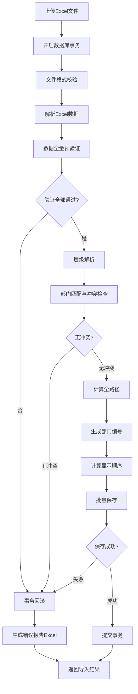
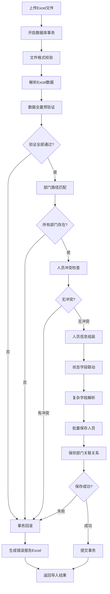
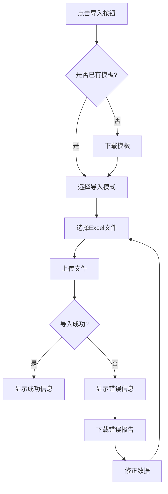
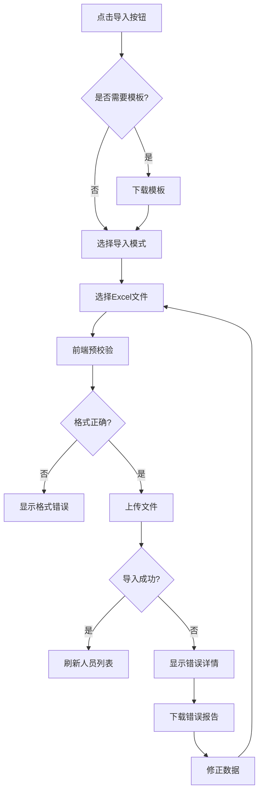

# 部门与人员导入功能详细实施设计

## 1. 任务背景

本设计文档基于《部门与人员导入功能设计分析》，将分析结果转化为详细的实施方案。分析文档已经完成了表结构分析、需求匹配度评估,并明确了调整方向。

该功能需要实现：
- 部门层级结构的Excel导入
- 人员信息的Excel导入
- 全路径字段的自动计算
- 人员状态与有效性的联动

## 2. 数据库层调整

### 2.1 字段确认

根据现有SQL更新脚本分析，以下字段已在数据库中添加完成：

**部门表(tp_dept_basicinfo)**
- `FULL_DEPT_CODE` VARCHAR(500)：部门全路径编码
- `FULL_DEPT_NAME` VARCHAR(500)：部门全路径名称
- `ASSISTANT_NOTE` VARCHAR(500)：协办人简单文本
- 已创建索引：`IDX_FULL_DEPT_CODE`、`IDX_FULL_DEPT_NAME`

**人员表(tp_person_basicinfo)**
- `EMP_STATUS` VARCHAR(20)：人员状态（在职/离职）
- 已完成数据回填：根据`ACTIVED`字段初始化状态值

### 2.2 数据一致性保障

数据回填策略如下：

| 表名 | 字段 | 回填规则 |
|-----|------|--------|
| tp_dept_basicinfo | FULL_DEPT_NAME | 初始值为DEPT_FULL_NAME |
| tp_dept_basicinfo | FULL_DEPT_CODE | 初始值为DEPT_NO或DEPT_ID |
| tp_person_basicinfo | EMP_STATUS | ACTIVED=1时为"在职"，否则为"离职" |

## 3. 实体层调整方案

### 3.1 部门实体更新

**旧实体类(TpDeptBasicinfo)调整**

已完成新增字段：
- fullDeptCode: String
- fullDeptName: String
- assistantNote: String

**新架构实体类(DepartmentPO)调整**

需要新增字段：
- fullDeptCode: String
- fullDeptName: String
- assistantNote: String

并提供便捷访问方法：
- getFullDeptCode() / setFullDeptCode()
- getFullDeptName() / setFullDeptName()
- getAssistantNote() / setAssistantNote()

### 3.2 人员实体更新

**旧实体类(TpPersonBasicinfo)调整**

已完成新增字段：
- empStatus: String

**新架构实体类(UserPO)调整**

需要新增字段：
- empStatus: String

并提供访问方法：
- getEmpStatus() / setEmpStatus()

## 4. 领域层设计

### 4.1 部门路径计算服务

**服务职责**：计算并维护部门的全路径信息

**核心能力**

| 能力项 | 说明 |
|-------|------|
| 计算部门全路径编码 | 从根部门到当前部门的编号拼接（用">"分隔） |
| 计算部门全路径名称 | 从根部门到当前部门的名称拼接（用">"分隔） |
| 级联更新子部门路径 | 当父部门信息变化时，自动更新所有子部门的全路径 |
| 路径解析 | 将导入的">"分隔路径解析为部门层级结构 |

**路径计算规则**

```
示例：
- 输入：企业A > 技术部 > 研发组
- FULL_DEPT_CODE：001 > 001001 > 001001001
- FULL_DEPT_NAME：企业A > 技术部 > 研发组
```

**触发时机**

| 操作 | 触发场景 |
|-----|--------|
| 部门创建 | 新建部门时自动计算其全路径 |
| 部门更新 | 修改部门名称或编号时重新计算全路径 |
| 部门移动 | 变更父部门时级联更新自身及子部门的全路径 |
| 批量导入 | 导入部门数据时自动计算全路径 |

### 4.2 部门编号自动生成服务

**服务职责**：根据配置自动生成部门编号

**生成策略**

| 配置参数 | 参数值 | 生成规则 |
|---------|-------|--------|
| dept.no.auto.enabled | true | 自动生成：父编号 + 同级序号（可配置位数） |
| dept.no.auto.enabled | false | 手动输入，需验证唯一性 |
| dept.no.digit.length | 4 | 建议高校场景使用4位编号（默认值） |
| dept.no.digit.length | 3 | 小型组织可使用3位编号 |

**高校场景编号规则示例（4位）**

```
学校：0001
├─ 机械工程学院：00010001
│  ├─ 机械设计系：000100010001
│  ├─ 机械制造系：000100010002
│  └─ 车辆工程系：000100010003
├─ 计算机学院：00010002
│  ├─ 计算机科学系：000100020001
│  ├─ 软件工程系：000100020002
│  ├─ 网络工程系：000100020003
│  └─ 人工智能系：000100020004
├─ 文学院：00010003
└─ 行政管理部门：00010004
    ├─ 教务处：000100040001
    ├─ 学生处：000100040002
    └─ 财务处：000100040003
```

**说明**：
- 4位编号可支持每层级最多9999个部门
- 适合高校、大型企业等复杂组织结构
- 支持多层级嵌套（学校-学院-系-教研室等）

**编号位数配置建议**

| 组织类型 | 建议位数 | 容量说明 |
|---------|---------|--------|
| 高校 | 4位 | 支持每层级9999个部门，适合学院-系-教研室多层结构 |
| 大型企业 | 4位 | 支持复杂组织架构，分公司-部门-科室等 |
| 中小企业 | 3位 | 支持每层级999个部门，一般足够使用 |
| 政府机关 | 4位 | 支持多层级行政组织结构 |

**唯一性校验**

生成编号后需验证：
- 同租户下编号不能重复
- 更新时排除自身进行唯一性检查
- 编号位数可通过配置参数dept.no.digit.length调整

### 4.3 部门显示顺序计算服务

**服务职责**：自动计算同层级部门的显示顺序

**计算规则**

| 场景 | 计算逻辑 |
|-----|--------|
| 新增部门 | 查询同父部门下最大order_index，结果+1 |
| 手动调整 | 接受用户指定的order_index值 |
| 导入部门 | 按导入顺序自动分配 |

**顺序调整策略**

- 默认按创建顺序递增（步长为1）
- 允许手动调整顺序值
- 支持批量重排（从1开始重新编号）

### 4.4 人员状态联动服务

**服务职责**：维护人员状态字段与有效性字段的一致性

**联动规则**

| empStatus | actived | 说明 |
|-----------|---------|------|
| 在职 | 1 | 正常在职人员 |
| 离职 | 0 | 已离职人员 |

**触发场景**

| 操作 | 联动行为 |
|-----|--------|
| 创建人员 | empStatus默认"在职"，actived默认1 |
| 更新empStatus为"离职" | 自动设置actived=0 |
| 更新empStatus为"在职" | 自动设置actived=1 |
| 更新actived=0 | 自动设置empStatus="离职" |
| 更新actived=1 | 自动设置empStatus="在职" |
| 导入人员 | 根据导入的状态值自动设置对应字段 |

## 5. 应用层设计

### 5.1 部门导入流程设计

**导入流程总览**



**事务管理策略**

| 策略项 | 实现方式 |
|-------|--------|
| 事务边界 | 从文件解析开始，到所有数据保存完成，为一个完整事务 |
| 隔离级别 | READ_COMMITTED，防止脏读 |
| 超时设置 | 设置合理的事务超时时间（建议5分钟） |
| 回滚条件 | 任何验证错误、冲突错误、保存失败都回滚 |
| 锁机制 | 使用乐观锁，避免长时间锁定表 |

**批量处理优化**

| 优化项 | 实现方式 |
|-------|--------|
| 批量插入 | 使用MyBatis批量插入，每次100条 |
| 批量更新 | 使用MyBatis批量更新，每次100条 |
| 分段提交 | 大数据量（>1000条）分段预处理，但最终一次性提交 |
| 内存控制 | 每批次处理后清理临时对象 |

**关键步骤详解**

| 步骤 | 处理逻辑 | 输出 |
|-----|---------|------|
| 文件格式校验 | 验证文件类型、模板格式、必填列 | 格式校验结果 |
| 解析Excel数据 | 读取行数据，转换为临时对象 | 临时数据列表 |
| 数据验证 | 必填项、格式、长度、业务规则验证 | 验证错误列表 |
| 层级解析 | 解析">"分隔的路径，构建层级关系 | 层级树结构 |
| 部门匹配与创建 | 根据路径匹配已有部门或创建新部门 | 部门ID映射表 |
| 计算全路径 | 计算FULL_DEPT_CODE和FULL_DEPT_NAME | 更新后的部门对象 |
| 生成部门编号 | 根据配置自动生成或使用导入值 | 部门编号 |
| 计算显示顺序 | 计算order_index值 | 顺序值 |
| 批量保存 | 事务性保存所有部门数据 | 保存结果 |

**层级解析算法**

解析策略：

1. 按层级从上到下逐级处理
2. 优先创建父部门，再创建子部门
3. 同层级部门按导入顺序处理
4. 记录部门路径与部门ID的映射关系

示例输入：
```
企业A > 技术部 > 研发组
企业A > 技术部 > 测试组
企业A > 市场部
```

解析结果：
```
层级1：企业A
层级2：技术部、市场部
层级3：研发组、测试组
```

**错误处理机制**

| 错误类型 | 处理方式 |
|---------|--------|
| 格式错误 | 标记行号和错误原因，继续处理其他行 |
| 验证错误 | 收集所有错误，生成错误报告Excel |
| 层级冲突 | 记录冲突信息，提示用户修正 |
| 系统异常 | 事务回滚，返回错误信息 |

### 5.2 人员导入流程设计

**导入流程总览**



**事务管理策略**

| 策略项 | 实现方式 |
|-------|--------|
| 事务边界 | 从文件解析开始，到人员和部门关联关系保存完成 |
| 隔离级别 | READ_COMMITTED，防止脏读 |
| 超时设置 | 设置合理的事务超时时间（建议5分钟） |
| 回滚条件 | 任何错误都导致整个导入回滚 |
| 关联表处理 | 人员表和tp_person_dept关联表同一事务 |

**批量处理优化**

| 优化项 | 实现方式 |
|-------|--------|
| 批量插入 | 使用MyBatis批量插入，每次100条 |
| 批量更新 | 使用MyBatis批量更新，每次100条 |
| 关联关系处理 | 先删除旧关联，再批量插入新关联 |
| 内存控制 | 分批处理后清理临时对象 |

**关键步骤详解**

| 步骤 | 处理逻辑 | 输出 |
|-----|---------|------|
| 文件格式校验 | 验证文件类型、模板格式、必填列 | 格式校验结果 |
| 解析Excel数据 | 读取行数据，转换为临时对象 | 临时数据列表 |
| 数据验证 | 必填项、格式、长度、唯一性验证 | 验证错误列表 |
| 部门路径匹配 | 根据">"分隔路径匹配部门ID | 部门ID映射表 |
| 人员信息组装 | 组装基本信息、扩展信息 | 人员对象列表 |
| 状态字段联动 | 根据empStatus设置actived | 更新后的人员对象 |
| 复杂字段解析 | 解析关联类型、多选类型字段 | 解析后的字段值 |
| 批量保存 | 事务性保存人员数据 | 保存结果 |
| 部门关联关系 | 保存人员与部门的关联关系 | 关联关系保存结果 |

**部门路径匹配算法**

匹配策略：

1. 根据FULL_DEPT_NAME精确匹配
2. 如匹配到多个，提示用户数据冲突
3. 如未匹配到，标记为错误
4. 支持根据FULL_DEPT_CODE匹配（备选方案）

匹配规则表：

| 输入路径 | 匹配字段 | 匹配方式 |
|---------|---------|--------|
| 企业A > 技术部 > 研发组 | FULL_DEPT_NAME | 精确匹配完整路径 |
| 001 > 001001 > 001001001 | FULL_DEPT_CODE | 精确匹配完整编码路径 |

**状态字段联动处理**

处理规则：

| 导入的empStatus | 自动设置的actived | 说明 |
|----------------|------------------|------|
| 在职 | 1 | 正常在职 |
| 离职 | 0 | 已离职 |
| 空值 | 默认"在职"，actived=1 | 兜底策略 |

**复杂字段解析**

支持的字段类型：

| 字段类型 | 格式示例 | 解析规则 |
|---------|---------|--------|
| 数字类型 | 123 | 直接转换为数值 |
| 下拉框类型 | 字典值 | 通过字典编码转换 |
| Check类型 | 是/否 | 转换为1/0 |
| 关联人员 | 张三,李四 | 解析为人员ID列表 |
| 关联部门 | 技术部,市场部 | 解析为部门ID列表 |

## 6. 基础设施层设计

### 6.1 Mapper XML更新

**部门Mapper更新内容**

需要在ResultMap和SQL语句中添加新字段映射：

新增字段映射：
- fullDeptCode
- fullDeptName
- assistantNote

涉及的SQL操作：
- INSERT语句：增加新字段插入
- UPDATE语句：增加新字段更新
- SELECT语句：增加新字段查询

**人员Mapper更新内容**

需要在ResultMap和SQL语句中添加新字段映射：

新增字段映射：
- empStatus

涉及的SQL操作：
- INSERT语句：增加empStatus字段插入
- UPDATE语句：增加empStatus字段更新
- SELECT语句：增加empStatus字段查询

### 6.2 导入工具类设计

**Excel解析工具**

职责：
- 读取Excel文件流
- 解析单元格数据
- 处理日期、数字等特殊格式
- 支持多Sheet页解析

**Excel生成工具**

职责：
- 生成错误报告Excel
- 在原数据基础上添加错误列
- 标记错误行（红色背景）
- 添加错误说明

**数据验证工具**

职责：
- 必填项验证
- 格式验证（邮箱、电话、身份证等）
- 长度验证
- 业务规则验证（唯一性、引用完整性等）

## 7. 接口层设计

### 7.1 部门导出接口

**接口定义**

| 属性 | 内容 |
|-----|------|
| 路径 | POST /api/v1/departments/export |
| 请求类型 | application/json |
| 请求参数 | 查询条件（可选） |
| 响应格式 | Excel文件流 |

**请求参数结构**

```
{
  "deptIds": ["dept001", "dept002"],  // 可选，导出指定部门
  "parentDeptId": "root001",           // 可选，导出某个部门及其子部门
  "includeChildren": true,             // 是否包含子部门
  "exportAll": false                   // 是否导出全部
}
```

**导出Excel格式**

| 列名 | 字段说明 | 是否必填 |
|-----|---------|--------|
| 部门层级路径 | 用">"分隔的完整路径 | 是 |
| 部门编号 | 部门编号 | 否 |
| 部门全称 | 部门全称 | 是 |
| 部门简称 | 部门简称 | 否 |
| 部门类型 | 部门类型字典值 | 是 |
| 负责人姓名 | 负责人姓名 | 否 |
| 负责人电话 | 负责人电话 | 否 |
| 协办人 | 协办人信息 | 否 |
| 显示顺序 | 顺序值 | 否 |
| 部门描述 | 描述信息 | 否 |

**导出逻辑**

1. 按照部门层级顺序导出（父部门在前）
2. 自动计算并填充"部门层级路径"列
3. 导出的Excel可直接用于导入（模板兼容）
4. 支持筛选条件导出和全量导出

### 7.2 部门导入接口

**接口定义**

| 属性 | 内容 |
|-----|------|
| 路径 | POST /api/v1/departments/import |
| 请求类型 | multipart/form-data |
| 请求参数 | file: 导入的Excel文件 |
| 响应格式 | JSON |

**响应结构**

```
成功场景（全部导入成功）：
{
  "success": true,
  "message": "导入成功",
  "data": {
    "totalCount": 100,
    "successCount": 100,
    "createdCount": 80,
    "updatedCount": 20,
    "skippedCount": 0
  }
}

失败场景（任何错误都会回滚，返回错误Excel下载链接）：
{
  "success": false,
  "message": "导入失败，所有数据已回滚，请修正错误后重新导入",
  "data": {
    "totalCount": 100,
    "errorCount": 5,
    "errorFileUrl": "/api/v1/files/download/xxx",
    "errors": [
      {
        "row": 10,
        "field": "部门全称",
        "message": "部门全称不能为空"
      },
      {
        "row": 25,
        "field": "部门编号",
        "message": "部门编号已存在：DEPT001"
      }
    ]
  }
}
```

**事务处理策略**

| 策略 | 说明 |
|-----|------|
| 全部成功才提交 | 所有数据验证通过且保存成功才提交事务 |
| 任何错误即回滚 | 遇到任何验证错误或保存失败立即回滚所有操作 |
| 数据存在性检查 | 导入前检查部门编号、部门名称是否已存在 |
| 冲突处理模式 | 支持"仅新增"、"仅更新"、"新增或更新"三种模式 |

**冲突处理模式**

| 模式 | 处理逻辑 |
|-----|--------|
| 仅新增 | 如果部门已存在则标记为错误，事务回滚 |
| 仅更新 | 如果部门不存在则标记为错误，事务回滚 |
| 新增或更新（默认） | 部门存在则更新，不存在则新增 |

**存在性判断规则**

按以下优先级判断部门是否存在：
1. 根据部门编号（dept_no）精确匹配
2. 根据完整路径（FULL_DEPT_NAME）精确匹配
3. 根据部门全称 + 父部门ID匹配
```

### 7.3 人员导出接口

**接口定义**

| 属性 | 内容 |
|-----|------|
| 路径 | POST /api/v1/persons/export |
| 请求类型 | application/json |
| 请求参数 | 查询条件（可选） |
| 响应格式 | Excel文件流 |

**请求参数结构**

```
{
  "personIds": ["person001", "person002"],  // 可选，导出指定人员
  "deptId": "dept001",                      // 可选，导出某个部门的人员
  "includeSubDept": true,                   // 是否包含子部门人员
  "empStatus": "在职",                      // 可选，按状态筛选
  "exportAll": false                        // 是否导出全部
}
```

**导出Excel格式**

| 列名 | 字段说明 | 是否必填 |
|-----|---------|--------|
| 人员姓名 | 人员姓名 | 是 |
| 人员编号 | 人员编号 | 否 |
| 所属部门 | 用">"分隔的完整部门路径 | 是 |
| 人员状态 | 在职/离职 | 是 |
| 性别 | 男/女 | 否 |
| 手机号码 | 手机号 | 否 |
| 电子邮箱 | 邮箱地址 | 否 |
| 证件类型 | 证件类型字典值 | 否 |
| 证件号码 | 证件号码 | 否 |
| 职位 | 职位信息 | 否 |
| 办公室 | 办公地点 | 否 |
| 备注 | 备注信息 | 否 |

**导出逻辑**

1. 按照部门、人员姓名顺序导出
2. 自动填充部门层级路径
3. 导出的Excel可直接用于导入
4. 支持多种筛选条件组合导出

### 7.4 人员导入接口

**接口定义**

| 属性 | 内容 |
|-----|------|
| 路径 | POST /api/v1/persons/import |
| 请求类型 | multipart/form-data |
| 请求参数 | file: 导入的Excel文件 |
| 响应格式 | JSON |

**响应结构**

```
成功场景（全部导入成功）：
{
  "success": true,
  "message": "导入成功",
  "data": {
    "totalCount": 200,
    "successCount": 200,
    "createdCount": 150,
    "updatedCount": 50,
    "skippedCount": 0
  }
}

失败场景（任何错误都会回滚）：
{
  "success": false,
  "message": "导入失败，所有数据已回滚，请修正错误后重新导入",
  "data": {
    "totalCount": 200,
    "errorCount": 8,
    "errorFileUrl": "/api/v1/files/download/xxx",
    "errors": [
      {
        "row": 15,
        "field": "人员姓名",
        "message": "人员姓名不能为空"
      },
      {
        "row": 32,
        "field": "所属部门",
        "message": "部门不存在：技术部 > 研发组 > 算法组"
      },
      {
        "row": 45,
        "field": "手机号码",
        "message": "手机号码已存在：13800138000"
      }
    ]
  }
}
```

**事务处理策略**

| 策略 | 说明 |
|-----|------|
| 全部成功才提交 | 所有人员数据验证通过且保存成功才提交事务 |
| 任何错误即回滚 | 遇到任何验证错误或保存失败立即回滚所有操作 |
| 部门存在性检查 | 导入前必须验证所属部门是否存在 |
| 唯一性检查 | 检查手机号、证件号等唯一字段是否冲突 |
| 冲突处理模式 | 支持"仅新增"、"仅更新"、"新增或更新"三种模式 |

**冲突处理模式**

| 模式 | 处理逻辑 |
|-----|--------|
| 仅新增 | 如果人员已存在则标记为错误，事务回滚 |
| 仅更新 | 如果人员不存在则标记为错误，事务回滚 |
| 新增或更新（默认） | 人员存在则更新，不存在则新增 |

**存在性判断规则**

按以下优先级判断人员是否存在：
1. 根据人员编号（person_no）精确匹配
2. 根据证件号码（idcard）精确匹配
3. 根据手机号码（phone）精确匹配
4. 根据姓名 + 所属部门匹配（可能不唯一，需谨慎）

# 8. 前端设计

### 8.1 部门导入导出功能

**页面位置**
- 部门管理页面（/departments）
- 顶部操作栏新增"导入"和"导出"按钮

**导入按钮功能**

| 功能项 | 说明 |
|-------|------|
| 下载模板 | 点击后下载标准导入模板Excel |
| 选择文件 | 支持选择.xlsx或.xls文件 |
| 导入模式选择 | 单选框：仅新增/仅更新/新增或更新（默认） |
| 上传进度 | 显示上传进度条 |
| 结果展示 | 成功后显示导入统计，失败后提供错误文件下载 |

**导出按钮功能**

| 功能项 | 说明 |
|-------|------|
| 导出范围选择 | 全部导出/导出选中/导出当前部门及子部门 |
| 包含子部门 | 复选框，是否包含子部门 |
| 导出确认 | 弹窗确认导出范围和数量 |
| 下载文件 | 生成Excel并自动下载 |

**交互流程**



**错误提示优化**

| 错误场景 | 提示方式 |
|---------|--------|
| 文件格式错误 | 红色提示框："请上传.xlsx或.xls格式文件" |
| 文件过大 | 红色提示框："文件大小不能超过10MB" |
| 导入失败 | 弹窗显示错误汇总，提供下载错误报告按钮 |
| 网络超时 | 红色提示框："上传超时，请检查网络后重试" |

### 8.2 人员导入导出功能

**页面位置**
- 人员管理页面（/persons）
- 顶部操作栏新增"导入"和"导出"按钮

**导入按钮功能**

| 功能项 | 说明 |
|-------|------|
| 下载模板 | 点击后下载标准导入模板Excel（含部门选择示例） |
| 选择文件 | 支持选择.xlsx或.xls文件 |
| 导入模式选择 | 单选框：仅新增/仅更新/新增或更新（默认） |
| 验证部门 | 自动验证Excel中的部门路径是否存在 |
| 上传进度 | 显示上传进度条 |
| 结果展示 | 成功后显示导入统计，失败后提供错误文件下载 |

**导出按钮功能**

| 功能项 | 说明 |
|-------|------|
| 导出范围选择 | 全部导出/导出选中/按部门导出/按状态导出 |
| 包含子部门 | 复选框，按部门导出时可选 |
| 状态筛选 | 下拉框：全部/在职/离职 |
| 导出确认 | 弹窗确认导出范围和数量 |
| 下载文件 | 生成Excel并自动下载 |

**交互流程**



### 8.3 前端组件设计

**导入对话框组件（ImportDialog）**

组件属性：
```
props: {
  visible: Boolean,           // 是否显示
  importType: String,         // 导入类型：department/person
  templateUrl: String,        // 模板下载地址
  importUrl: String,          // 导入接口地址
  onSuccess: Function,        // 成功回调
  onError: Function          // 失败回调
}
```

组件状态：
```
data: {
  importMode: 'upsert',      // 导入模式：insert/update/upsert
  selectedFile: null,         // 选中的文件
  uploading: false,           // 是否正在上传
  progress: 0,                // 上传进度
  result: null                // 导入结果
}
```

**导出对话框组件（ExportDialog）**

组件属性：
```
props: {
  visible: Boolean,           // 是否显示
  exportType: String,         // 导出类型：department/person
  exportUrl: String,          // 导出接口地址
  selectedIds: Array,         // 选中的ID列表
  currentNodeId: String,      // 当前节点ID
  onSuccess: Function,        // 成功回调
  onCancel: Function          // 取消回调
}
```

组件状态：
```
data: {
  exportRange: 'all',         // 导出范围：all/selected/current
  includeChildren: true,      // 是否包含子节点
  empStatus: '',              // 人员状态筛选（仅人员导出）
  exporting: false            // 是否正在导出
}
```

**错误报告展示组件（ErrorReportDialog）**

组件属性：
```
props: {
  visible: Boolean,           // 是否显示
  errors: Array,              // 错误列表
  totalCount: Number,         // 总数
  errorCount: Number,         // 错误数
  errorFileUrl: String,       // 错误文件下载地址
  onClose: Function           // 关闭回调
}
```

展示内容：
- 错误汇总统计
- 错误列表（最多显示前20条）
- 下载完整错误报告按钮
- 重新导入按钮

### 8.4 前端API封装

**部门API**

```
// 导入部门
exportDepartments(params): Promise
  - 入参：{ deptIds?, parentDeptId?, includeChildren?, exportAll? }
  - 返回：文件流

importDepartments(file, mode): Promise
  - 入参：文件对象，导入模式
  - 返回：{ success, message, data }

downloadDeptTemplate(): Promise
  - 返回：模板文件流
```

**人员API**

```
// 导出人员
exportPersons(params): Promise
  - 入参：{ personIds?, deptId?, includeSubDept?, empStatus?, exportAll? }
  - 返回：文件流

importPersons(file, mode): Promise
  - 入参：文件对象，导入模式
  - 返回：{ success, message, data }

downloadPersonTemplate(): Promise
  - 返回：模板文件流
```

### 8.5 前端校验规则

**文件校验**

| 校验项 | 规则 | 错误提示 |
|-------|------|--------|
| 文件格式 | .xlsx或.xls | 请上传Excel格式文件 |
| 文件大小 | ≤10MB | 文件大小不能超过10MB |
| 文件内容 | 非空 | 文件内容不能为空 |

**导入模式校验**

| 模式 | 前端提示 |
|-----|--------|
| 仅新增 | 如果数据已存在将会导入失败 |
| 仅更新 | 如果数据不存在将会导入失败 |
| 新增或更新 | 已存在的数据将被更新，不存在的数据将被新增 |

### 8.6 用户体验优化

**加载状态**

| 场景 | 展示方式 |
|-----|--------|
| 文件上传中 | 进度条 + 百分比 |
| 数据处理中 | 加载动画 + "正在处理数据，请稍候..." |
| 导出生成中 | 加载动画 + "正在生成文件，请稍候..." |

**成功提示**

| 场景 | 提示方式 |
|-----|--------|
| 导入成功 | 绿色通知框，显示导入统计（总数、新增、更新） |
| 导出成功 | 绿色通知框 + 自动下载文件 |

**引导说明**

| 位置 | 说明内容 |
|-----|--------|
| 导入按钮旁 | 帮助图标，点击显示导入步骤说明 |
| 模板下载 | 提示："请按模板格式填写数据，层级路径用 > 分隔" |
| 部门路径示例 | "例如：学校 > 计算机学院 > 软件工程系" |

## 9. 测试策略

### 8.1 单元测试

**测试范围**

| 测试对象 | 测试要点 |
|---------|--------|
| 路径计算服务 | 各种层级结构的路径计算正确性 |
| 编号生成服务 | 编号生成规则、唯一性校验 |
| 顺序计算服务 | 同层级顺序值计算 |
| 状态联动服务 | empStatus与actived的双向联动 |
| 层级解析算法 | 各种格式的层级路径解析 |
| 部门匹配算法 | 精确匹配、模糊匹配、冲突处理 |

### 8.2 集成测试

**测试场景**

| 场景 | 测试内容 |
|-----|--------|
| 部门导入-正常场景 | 导入合法数据，验证全流程 |
| 部门导入-层级嵌套 | 多层级部门导入，验证层级关系 |
| 部门导入-重复数据 | 验证重复检测机制 |
| 部门导入-错误处理 | 验证错误收集与报告生成 |
| 人员导入-正常场景 | 导入合法数据，验证全流程 |
| 人员导入-部门匹配 | 验证部门路径匹配逻辑 |
| 人员导入-状态联动 | 验证状态字段联动 |
| 人员导入-复杂字段 | 验证复杂字段解析 |

### 8.3 小样本联调

**联调步骤**

1. 准备小样本数据（10-20条）
2. 覆盖正常场景与异常场景
3. 验证导入结果的数据完整性
4. 验证错误报告的准确性
5. 验证数据库字段值的正确性

**验证清单**

| 验证项 | 检查内容 |
|-------|--------|
| 部门全路径编码 | FULL_DEPT_CODE是否正确计算 |
| 部门全路径名称 | FULL_DEPT_NAME是否正确计算 |
| 协办人信息 | ASSISTANT_NOTE是否正确存储 |
| 部门编号 | DEPT_NO是否按规则生成 |
| 显示顺序 | ORDER_INDEX是否正确计算 |
| 人员状态 | EMP_STATUS是否正确设置 |
| 有效性联动 | ACTIVED是否与EMP_STATUS联动 |
| 部门关联 | tp_person_dept表数据是否正确 |

## 9. 部署与运维

### 9.1 数据库迁移

**执行步骤**

1. 备份生产数据库
2. 执行mysql-schema-update.sql脚本
3. 验证字段是否添加成功
4. 验证索引是否创建成功
5. 验证数据回填是否正确
6. 进行数据一致性检查

**回滚方案**

如遇问题可执行回滚：
- 删除新增字段
- 删除新增索引
- 恢复备份数据

### 9.2 应用发布

**发布检查清单**

| 检查项 | 说明 |
|-------|------|
| 代码编译 | 确保无编译错误 |
| 单元测试 | 所有单元测试通过 |
| 集成测试 | 关键流程集成测试通过 |
| 配置文件 | 确认配置参数正确 |
| 依赖包 | 确认无新增依赖或已添加 |

**灰度发布策略**

1. 先在测试环境充分验证
2. 选择部分用户试用
3. 收集反馈并优化
4. 全量发布

### 9.3 监控与告警

**监控指标**

| 指标 | 监控内容 |
|-----|--------|
| 导入耗时 | 记录每次导入的执行时间 |
| 导入成功率 | 统计成功与失败的比例 |
| 错误类型分布 | 统计各类错误的发生频率 |
| 数据量统计 | 统计导入的数据总量 |

**异常告警**

| 告警场景 | 触发条件 |
|---------|--------|
| 导入超时 | 单次导入超过5分钟 |
| 失败率过高 | 失败率超过20% |
| 系统异常 | 出现未捕获的异常 |

## 10. 文档交付

### 10.1 用户使用文档

**内容清单**

- 导入模板说明
- 字段填写规范
- 层级路径填写示例
- 常见错误及解决方案
- 操作步骤截图

### 10.2 开发文档

**内容清单**

- 技术架构说明
- 核心算法文档
- 接口文档
- 数据库变更说明
- 配置参数说明

### 10.3 运维文档

**内容清单**

- 数据库迁移脚本
- 部署步骤说明
- 监控配置说明
- 故障排查指南
- 回滚操作指南

## 11. 风险控制

### 11.1 技术风险

| 风险项 | 风险等级 | 应对措施 |
|-------|---------|--------|
| 数据库迁移失败 | 高 | 充分测试，准备回滚方案 |
| 大数据量导入性能问题 | 中 | 分批处理，优化SQL |
| 层级解析错误 | 中 | 充分测试各种层级场景 |
| 数据一致性问题 | 高 | 使用事务，完善验证逻辑 |

### 11.2 业务风险

| 风险项 | 风险等级 | 应对措施 |
|-------|---------|--------|
| 历史数据冲突 | 中 | 数据清洗，制定处理规则 |
| 用户操作失误 | 中 | 提供详细使用文档和示例 |
| 导入规则理解偏差 | 低 | 明确规则说明，提供培训 |

### 11.3 运维风险

| 风险项 | 风险等级 | 应对措施 |
|-------|---------|--------|
| 部署失败 | 中 | 分阶段部署，准备回滚方案 |
| 监控不足 | 低 | 完善监控指标和告警机制 |
| 文档缺失 | 低 | 同步更新各类文档 |

## 12. 实施计划

### 12.1 开发阶段

| 阶段 | 任务 | 预计工作量 |
|-----|------|----------|
| 第1阶段 | 数据库迁移与验证 | 0.5天 |
| 第2阶段 | 实体层与基础设施层更新 | 1天 |
| 第3阶段 | 领域层服务开发 | 2天 |
| 第4阶段 | 应用层导入流程开发 | 2天 |
| 第5阶段 | 接口层开发 | 1天 |
| 第6阶段 | 单元测试与集成测试 | 1.5天 |
| 第7阶段 | 小样本联调 | 0.5天 |
| 第8阶段 | 文档编写 | 0.5天 |

**总计：约9天**

### 12.2 验收标准

| 验收项 | 标准 |
|-------|------|
| 功能完整性 | 所有需求功能均已实现 |
| 测试覆盖率 | 核心逻辑单元测试覆盖率≥80% |
| 性能要求 | 1000条数据导入时间≤30秒 |
| 错误处理 | 所有异常均有友好提示 |
| 文档完整性 | 用户文档、开发文档、运维文档齐全 |
