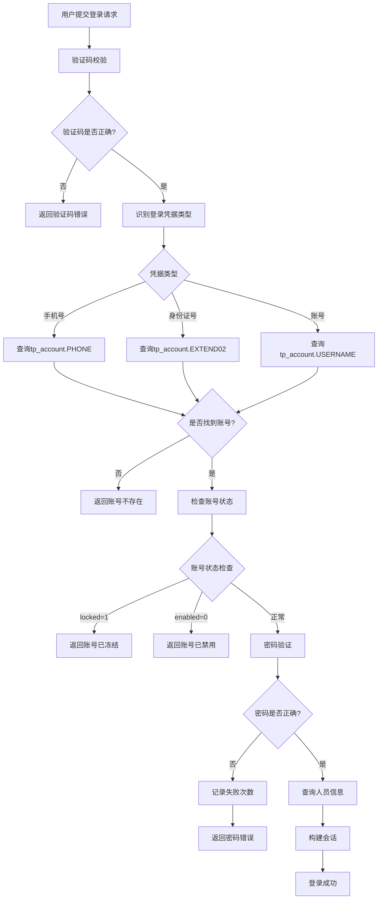
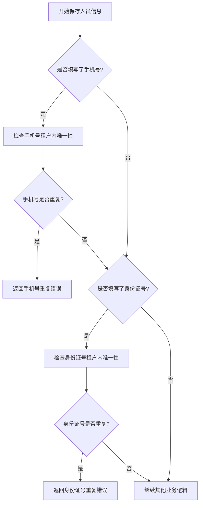
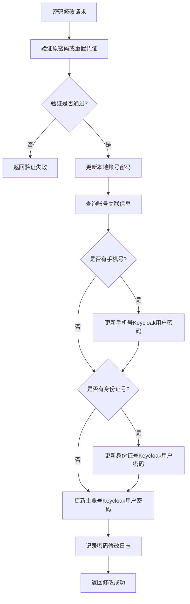

# 账号多因子登录扩展设计文档

## 一、需求概述

### 1.1 业务背景

当前系统仅支持通过账号（username）进行登录认证。为提升用户体验和系统灵活性，需要扩展登录方式，允许用户通过账号、手机号或身份证号三种凭据中的任意一种进行登录。

### 1.2 核心需求

- 支持账号、手机号、身份证号三种登录凭据
- 手机号和身份证号作为账号的辅助标识，最终登录使用的仍然是账号记录
- 人员信息的手机号和身份证号需要保持唯一性
- 密码策略保持不变，无论使用哪种凭据登录，验证的都是同一个密码
- SSO集成：当账号具有手机号或身份证号时，同步创建对应的Keycloak用户
- 密码修改时需要同步更新所有关联的Keycloak账号（主账号、手机号账号、身份证号账号）

### 1.3 设计约束

- 保持现有数据模型设计，优先使用账号表的扩展字段
- 登录验证逻辑需要保持向后兼容
- SSO同步机制需要支持一个本地账号对应多个Keycloak用户的场景
- 密码修改场景包括：重置密码后用户修改、用户主动修改等

## 二、现状分析

### 2.1 数据模型现状

#### 账号表（tp_account）

| 字段名 | 类型 | 说明 | 当前使用情况 |
|--------|------|------|------------|
| ACCOUNT_ID | varchar | 账号主键 | 使用中 |
| USERNAME | varchar | 用户名 | 登录凭据 |
| USERPWD | varchar | 密码 | 密码验证 |
| PHONE | varchar | 手机号 | 已存在但未用于登录 |
| PERSON_ID | varchar | 关联人员ID | 关联人员信息 |
| TENANT_ID | varchar | 租户ID | 多租户隔离 |
| LOCKED | int | 是否冻结 | 账号锁定状态 |
| ENABLED | int | 是否启用 | 账号启用状态 |
| ACTIVED | int | 是否有效 | 逻辑删除标识 |
| EXTEND01 | varchar | 扩展字段01 | 当前存储Keycloak ID |
| EXTEND02 | varchar | 扩展字段02 | 可用 |
| EXTEND03 | varchar | 扩展字段03 | 可用 |

#### 人员信息表（tp_person_basicinfo）

| 字段名 | 类型 | 说明 | 当前使用情况 |
|--------|------|------|------------|
| PERSON_ID | varchar | 人员主键 | 使用中 |
| PERSON_NAME | varchar | 姓名 | 使用中 |
| PHONE | varchar | 手机号 | 存储但未强制唯一 |
| IDCARD | varchar | 身份证号 | 存储但未强制唯一 |
| EMAIL | varchar | 邮箱 | 使用中 |
| TENANT_ID | varchar | 租户ID | 多租户隔离 |
| ACTIVED | int | 是否有效 | 逻辑删除标识 |

#### 关系说明

- 一个人员（Person）可以有一个账号（Account）
- 账号通过PERSON_ID关联到人员信息
- 人员信息中的PHONE和IDCARD字段当前仅作为基本信息存储

### 2.2 登录流程现状

当前系统登录验证流程：

```
用户输入
  ↓
验证码校验
  ↓
根据username查询账号（tp_account表）
  ↓
账号状态检查（enabled、locked、actived）
  ↓
密码验证（userpwd字段）
  ↓
查询人员信息（tp_person_basicinfo表）
  ↓
构建会话信息
  ↓
登录成功
```

现有登录SQL：
- 账号密码登录：`SELECT ... FROM tp_account WHERE username = ? AND enabled = '1' AND actived = '1'`
- 手机号登录（短信验证码）：`SELECT ... FROM tp_account WHERE phone = ? AND enabled = '1' AND actived = '1'`

### 2.3 SSO集成现状

#### Keycloak用户同步机制

系统使用KeycloakUserSyncService实现本地用户与Keycloak的同步：
- 支持单个用户同步、批量同步和增量同步
- 同步内容包括用户名、密码、邮箱等基本信息
- 账号表的EXTEND01字段存储Keycloak User ID
- 存在用户冲突时支持更新Keycloak或本地数据

#### 密码修改场景

当前系统密码修改场景包括：
1. 管理员重置密码后用户修改
2. 用户登录后主动修改
3. 密码过期后强制修改

密码更新SQL：
- `UPDATE tp_account SET USERPWD = ?, UPDATE_TIME = NOW() WHERE ACCOUNT_ID = ? AND ACTIVED = 1`

## 三、设计方案

### 3.1 数据库设计

#### 3.1.1 账号表扩展

在tp_account表中新增字段存储身份证号：

| 新增字段 | 字段名 | 数据类型 | 约束 | 说明 |
|---------|--------|---------|------|------|
| 身份证号 | IDCARD | varchar(18) | 可为空，租户内唯一 | 用于身份证号登录 |

字段设计说明：
- PHONE字段已存在（varchar(512)），直接启用作为登录凭据
- IDCARD字段新增（varchar(18)），用于存储身份证号并支持身份证号登录
- 不需要存储Keycloak用户ID，因为账号同步是单向的（中台推送到Keycloak）

#### 3.1.2 唯一性约束设计

数据唯一性约束范围：

| 字段 | 唯一性约束范围 | 约束方式 | 说明 |
|------|--------------|---------|------|
| tp_account.USERNAME | 租户级唯一 | 数据库索引 + 应用层校验 | 现有约束保持不变 |
| tp_account.PHONE | 租户级唯一（非空时） | 应用层校验 | 仅当字段有值时检查唯一性 |
| tp_account.IDCARD | 租户级唯一（非空时） | 应用层校验 | 仅当字段有值时检查唯一性 |
| tp_person_basicinfo.PHONE | 租户级唯一（非空时） | 应用层校验 | 人员信息唯一性 |
| tp_person_basicinfo.IDCARD | 租户级唯一（非空时） | 应用层校验 | 人员信息唯一性 |

约束规则说明：
- 所有唯一性约束都在租户（TENANT_ID）范围内生效
- 仅对有效数据（ACTIVED = 1）进行唯一性检查
- 手机号和身份证号为空时不参与唯一性检查
- 应用层校验在新增和修改时执行

#### 3.1.3 数据库变更脚本结构

变更脚本包含：

| 脚本类型 | 内容 | 执行时机 |
|---------|------|---------|
| DDL脚本 | 账号表新增IDCARD字段 | 部署前执行 |
| 数据迁移脚本 | 从人员表同步手机号和身份证号到账号表 | DDL执行后 |
| 数据清理脚本 | 处理重复数据，保留最新记录 | 数据迁移后 |
| 验证脚本 | 检查数据迁移完整性和唯一性 | 清理完成后 |

### 3.2 登录凭据识别策略

#### 3.2.1 凭据类型识别规则

通过正则表达式识别用户输入的登录凭据类型：

| 凭据类型 | 识别规则 | 正则表达式示例 | 优先级 |
|---------|---------|--------------|-------|
| 手机号 | 11位数字，1开头 | `^1[3-9]\d{9}$` | 高 |
| 身份证号 | 15位或18位，符合身份证号规则 | `^[1-9]\d{5}(18|19|20)\d{2}(0[1-9]|1[0-2])(0[1-9]|[12]\d|3[01])\d{3}[\dXx]$` | 中 |
| 账号 | 不符合上述规则的任意字符串 | 无需正则，默认处理 | 低 |

识别流程：

```
用户输入登录凭据
  ↓
手机号正则匹配？
  ├─ 是 → 标记为手机号类型
  └─ 否 ↓
身份证号正则匹配？
  ├─ 是 → 标记为身份证号类型
  └─ 否 → 标记为账号类型
```

#### 3.2.2 凭据查询策略

根据凭据类型执行不同的查询逻辑：

| 凭据类型 | 查询字段 | 查询表 | SQL示例 |
|---------|---------|-------|---------|
| 手机号 | PHONE | tp_account | `WHERE PHONE = ? AND ENABLED = 1 AND ACTIVED = 1` |
| 身份证号 | IDCARD | tp_account | `WHERE IDCARD = ? AND ENABLED = 1 AND ACTIVED = 1` |
| 账号 | USERNAME | tp_account | `WHERE USERNAME = ? AND ENABLED = 1 AND ACTIVED = 1` |

所有查询都需要附加条件：
- `ENABLED = 1`（账号已启用）
- `ACTIVED = 1`（账号未被逻辑删除）
- 租户ID匹配（多租户环境）

### 3.3 登录认证流程

#### 3.3.1 扩展后的登录流程



#### 3.3.2 密码验证策略

无论使用哪种凭据登录，密码验证逻辑保持一致：

| 验证项 | 规则 | 失败处理 |
|-------|------|---------|
| 密码匹配 | 输入密码与账号表USERPWD字段匹配 | 记录失败次数，达到阈值锁定账号 |
| 密码过期 | 检查LAST_PASSWORD_CHANGE_TIME字段 | 提示用户修改密码 |
| 账号锁定 | LOCKED字段为1 | 返回账号锁定错误 |
| 账号禁用 | ENABLED字段为0 | 返回账号禁用错误 |

### 3.4 人员信息唯一性校验

#### 3.4.1 校验场景

需要执行唯一性校验的操作：

| 操作类型 | 校验时机 | 校验范围 |
|---------|---------|---------|
| 新增人员 | 保存前 | 租户内所有有效人员 |
| 修改人员 | 保存前 | 租户内除当前人员外的所有有效人员 |
| 新增账号 | 保存前 | 租户内所有有效账号 |
| 修改账号 | 保存前 | 租户内除当前账号外的所有有效账号 |

#### 3.4.2 校验规则矩阵

| 校验字段 | 校验表 | 条件 | 错误提示 |
|---------|-------|------|---------|
| 手机号 | tp_person_basicinfo | PHONE非空且租户内唯一 | 该手机号已被其他人员使用 |
| 身份证号 | tp_person_basicinfo | IDCARD非空且租户内唯一 | 该身份证号已被其他人员使用 |
| 邮箱 | tp_person_basicinfo | EMAIL非空且租户内唯一 | 该邮箱已被其他人员使用 |
| 账号手机号 | tp_account | PHONE非空且租户内唯一 | 该手机号已被其他账号使用 |
| 账号身份证号 | tp_account | IDCARD非空且租户内唯一 | 该身份证号已被其他账号使用 |

#### 3.4.3 校验逻辑流程



### 3.5 账号与人员信息同步策略

#### 3.5.1 账号表手机号与身份证号的数据来源

**数据来源说明**:

| 账号表字段 | 主要数据来源 | 同步机制 | 说明 |
|------------|------------|---------|------|
| tp_account.PHONE | tp_person_basicinfo.PHONE | 人员 → 账号(自动同步) | 人员信息修改时自动同步到账号表 |
| tp_account.IDCARD | tp_person_basicinfo.IDCARD | 人员 → 账号(新增同步) | 数据迁移后由人员信息同步 |

**现有同步机制**:

根据现有代码分析(`UserPersonServiceImpl.java`, `PersonAccountApplicationServiceImpl.java`),系统已实现以下同步机制:

1. **修改人员手机号同步** (`UserPersonServiceImpl.updatePhone`)
   - 触发时机: 用户修改人员手机号时
   - 同步流程:
     ```
     1. 更新 tp_person_basicinfo.PHONE (加密存储)
     2. 调用 personAccountService.updatePhone(personId, phone)
     3. 查询账号: SELECT * FROM tp_account WHERE PERSON_ID = ?
     4. 更新 tp_account.PHONE = 加密(phone)
     ```
   - 数据加密: 手机号在存储前使用`PhoneEncryptionUtils.encrypt()`加密

2. **新增人员创建账号同步** (`UserPersonServiceImpl.add`)
   - 触发时机: 新增人员并选择创建账号时
   - 同步流程:
     ```
     1. 创建 tp_person_basicinfo 记录(包含加密的手机号和身份证号)
     2. 创建 tp_account 记录
     3. 从人员信息复制 PHONE 到账号表(已加密)
     4. 从人员信息复制 IDCARD 到账号表
     ```

3. **数据迁移同步** (首次部署)
   - 触发时机: 数据库DDL变更后执行一次
   - 同步逻辑:
     ```sql
     UPDATE tp_account a
     INNER JOIN tp_person_basicinfo p ON a.PERSON_ID = p.PERSON_ID
     SET a.PHONE = p.PHONE,
         a.IDCARD = p.IDCARD
     WHERE a.ACTIVED = 1 AND p.ACTIVED = 1
     ```

**数据流转示意图**:

```
人员信息表 (tp_person_basicinfo)
│
├─ PHONE (主数据源,加密存储)
│   ↓
│   同步 (自动)
│   ↓
├─ IDCARD (主数据源)
    ↓
    同步 (首次部署后由人员修改触发)
    ↓
账号表 (tp_account)
│
├─ PHONE (用于登录认证,加密存储)
├─ IDCARD (用于登录认证,新增字段)
```

**重要注意事项**:

1. **单向同步**: 仅支持从人员表向账号表同步,不支持反向同步
2. **数据加密**: 手机号在两个表中都使用`PhoneEncryptionUtils`加密存储
3. **身份证号**: 当前未加密,明文存储(设计时需考虑安全性)
4. **数据一致性**: 一旦同步完成,人员表为主数据源,账号表为从数据

#### 3.5.2 同步场景

| 场景 | 触发时机 | 同步方向 | 同步字段 |
|------|---------|---------|---------|
| 新增人员并创建账号 | 新增人员时选择创建账号 | 人员 → 账号 | 手机号、身份证号 |
| 修改人员信息 | 人员信息保存时 | 人员 → 账号 | 手机号、身份证号 |
| 修改账号信息 | 账号信息保存时 | 账号 → 人员（可选） | 手机号 |

#### 3.5.3 同步规则

| 同步类型 | 同步条件 | 冲突处理 |
|---------|---------|---------|
| 人员手机号 → 账号手机号 | 人员有账号且手机号不为空 | 检查账号手机号唯一性，冲突时阻止同步 |
| 人员身份证号 → 账号身份证号 | 人员有账号且身份证号不为空 | 检查账号身份证号唯一性，冲突时阻止同步 |
| 账号手机号 → 人员手机号 | 账号关联人员且手机号不为空 | 可选：检查人员手机号唯一性 |

#### 3.5.4 数据一致性保障

数据同步的一致性保障措施：

| 保障措施 | 实施方式 | 目的 |
|---------|---------|------|
| 事务控制 | 人员和账号操作在同一事务中 | 确保数据一致性 |
| 唯一性预检 | 保存前检查所有唯一性约束 | 避免重复数据 |
| 回滚机制 | 任何步骤失败时回滚所有变更 | 保持数据完整性 |
| 日志记录 | 记录所有同步操作 | 便于问题追溯 |

### 3.6 SSO集成方案

#### 3.6.1 Keycloak用户账号策略(单向推送)

本地账号推送到Keycloak的策略:

| 本地账号特征 | 推送Keycloak用户数量 | Keycloak用户名规则 |
|------------|---------------------|-------------------|
| 仅有账号名 | 1个 | 使用账号名作为username |
| 有手机号无身份证号 | 2个 | 账号名 + 手机号 |
| 有身份证号无手机号 | 2个 | 账号名 + 身份证号 |
| 同时有手机号和身份证号 | 3个 | 账号名 + 手机号 + 身份证号 |

推送说明:
- 同步是单向的,从中台推送到Keycloak
- 中台不需要存储Keycloak返回的用户ID
- Keycloak作为独立的认证服务,通过username进行用户识别

#### 3.6.2 Keycloak登录URL构建与重定向

构建Keycloak登录URL时的关键考虑:

| 参数 | 用途 | URL编码要求 | 说明 |
|------|------|-----------|------|
| client_id | 客户端标识 | 需要编码 | 标识应用客户端 |
| redirect_uri | 回调地址 | 必须编码 | 授权成功后的回调地址 |
| response_type | 响应类型 | 无需编码 | 通常为code(授权码模式) |
| scope | 授权范围 | 无需编码 | 如openid profile email |
| state | 状态参数 | 需要编码 | 防止CSRF攻击 |
| login_hint | 登录提示 | 必须编码 | 预填充用户名(可选) |

URL编码注意事项:

```
正确的URL构建方式:
{serverUrl}/realms/{realm}/protocol/openid-connect/auth
  ?client_id={URLEncode(clientId)}
  &redirect_uri={URLEncode(redirectUri)}
  &response_type=code
  &scope=openid
  &state={URLEncode(state)}
  &login_hint={URLEncode(username)}  // 可选,用于预填充登录用户名
```

**身份证号登录的特殊处理**:

当用户使用身份证号登录时:

1. **中台登录页面**:用户输入身份证号(如420106199001011234)
2. **凭据识别**:系统识别为身份证号类型
3. **Keycloak重定向**:如需跳转到Keycloak,需将身份证号作为login_hint参数
4. **URL编码**:身份证号本身为数字字符,但仍建议进行URL编码以保证兼容性
5. **Keycloak用户匹配**:Keycloak通过username字段匹配(值为身份证号)

重定向流程:

```
用户使用身份证号登录中台
  ↓
中台识别为身份证号凭据
  ↓
构建Keycloak授权URL:
  - login_hint参数设置为身份证号(URL编码)
  - Keycloak登录页面自动填充身份证号
  ↓
Keycloak验证身份证号对应的用户
  ↓
返回授权码到中台回调地址
  ↓
中台使用授权码交换访问令牌
  ↓
从令牌中获取username(身份证号)
  ↓
在中台系统中查询账号(通过IDCARD字段匹配)
  ↓
建立会话,登录成功
```

**回调地址解码**:

授权码模式回调时,Keycloak会将授权码作为查询参数附加到redirect_uri:

```
{redirect_uri}?code={authorization_code}&state={state}
```

回调处理要点:
- redirect_uri必须与授权请求时的值完全一致(包括URL编码)
- code参数已由Keycloak自动URL编码
- state参数需要验证以防止CSRF攻击
- 使用授权码交换令牌时,redirect_uri参数必须与授权请求时一致

#### 3.6.3 SSO同步时机与内容

| 操作场景 | 同步时机 | 同步内容 |
|---------|---------|---------|
| 新增账号 | 账号创建成功后 | 创建主账号Keycloak用户 + 手机号/身份证号Keycloak用户 |
| 修改账号手机号 | 手机号更新后 | 创建或更新手机号Keycloak用户 |
| 修改账号身份证号 | 身份证号更新后 | 创建或更新身份证号Keycloak用户 |
| 删除账号手机号 | 手机号清空后 | 删除手机号Keycloak用户 |
| 删除账号身份证号 | 身份证号清空后 | 删除身份证号Keycloak用户 |
| 修改密码 | 密码更新后 | 更新所有关联Keycloak用户的密码 |
| 禁用账号 | 账号禁用时 | 禁用所有关联Keycloak用户 |
| 启用账号 | 账号启用时 | 启用所有关联Keycloak用户 |

#### 3.6.4 密码同步策略

密码修改场景的SSO同步处理：



#### 3.6.5 Keycloak用户属性映射

本地账号字段与Keycloak用户属性的映射关系:

| 本地字段 | Keycloak属性 | 说明 |
|---------|-------------|------|
| USERNAME | username | 主账号用户名 |
| PHONE | username(手机号账号) | 手机号作为用户名 |
| IDCARD | username(身份证号账号) | 身份证号作为用户名 |
| USERPWD | password(临时凭证) | 密码通过临时凭证设置 |
| PERSON_ID | attributes.personId | 自定义属性存储人员ID |
| ACCOUNT_ID | attributes.accountId | 自定义属性存储账号ID |
| TENANT_ID | attributes.tenantId | 自定义属性存储租户ID |

#### 3.6.6 中台同步账号到Keycloak时提供的属性

根据现有KeycloakSyncServiceImpl的实现,中台同步账号时会构建Keycloak UserRepresentation对象,包含以下属性:

**基本属性(直接映射)**:

| Keycloak属性 | 数据来源 | 数据类型 | 必填 | 说明 |
|--------------|---------|---------|------|------|
| username | tp_account.USERNAME / PHONE / IDCARD | String | 是 | 登录凭据,根据同步类型选择 |
| enabled | 固定值 | Boolean | 是 | 固定为true,表示用户启用 |
| email | tp_person_basicinfo.EMAIL | String | 否 | 邮箱地址 |
| emailVerified | 固定值 | Boolean | 是 | 固定为true,表示邮箱已验证 |
| firstName | tp_person_basicinfo.PERSON_NAME | String | 否 | 人员姓名 |
| lastName | - | String | 否 | 姓氏(当前未使用) |

**凭证信息(credentials)**:

| 属性 | 数据来源 | 数据类型 | 说明 |
|------|---------|---------|------|
| type | 固定值"password" | String | 凭证类型 |
| value | tp_account.USERPWD | String | 密码值(已加密) |
| temporary | 固定值false | Boolean | 是否临时密码 |

**自定义属性(attributes)**:

Keycloak的attributes字段是Map<String, List<String>>结构,每个属性值都是字符串列表:

| 属性名 | 数据来源 | 值类型 | 说明 |
|--------|---------|--------|------|
| personId | tp_account.PERSON_ID | List<String> | 人员ID |
| accountId | tp_account.ACCOUNT_ID | List<String> | 账号ID |
| tenantId | tp_account.TENANT_ID | List<String> | 租户ID |
| personNo | tp_person_basicinfo.PERSON_NO | List<String> | 人员编号(工号) |
| USERNAME | tp_account.USERNAME | List<String> | 原始账号名(用于追溯) |
| PHONE | tp_account.PHONE | List<String> | 手机号(用于追溯) |
| IDCARD | tp_account.IDCARD | List<String> | 身份证号(用于追溯) |

**同步示例**:

假设中台有一个账号:
- 账号名: zhangsan
- 手机号: 13800138000
- 身份证号: 420106199001011234
- 人员姓名: 张三
- 邮箱: zhangsan@example.com
- 人员编号: P001

同步到Keycloak时会创建**3个Keycloak用户**:

**1. 主账号用户**:
```json
{
  "username": "zhangsan",
  "enabled": true,
  "email": "zhangsan@example.com",
  "emailVerified": true,
  "firstName": "张三",
  "credentials": [
    {
      "type": "password",
      "value": "[encrypted_password]",
      "temporary": false
    }
  ],
  "attributes": {
    "personId": ["<person_id>"],
    "accountId": ["<account_id>"],
    "tenantId": ["<tenant_id>"],
    "personNo": ["P001"],
    "USERNAME": ["zhangsan"],
    "PHONE": ["13800138000"],
    "IDCARD": ["420106199001011234"]
  }
}
```

**2. 手机号用户**:
```json
{
  "username": "13800138000",
  "enabled": true,
  "email": "zhangsan@example.com",
  "emailVerified": true,
  "firstName": "张三",
  "credentials": [
    {
      "type": "password",
      "value": "[encrypted_password]",
      "temporary": false
    }
  ],
  "attributes": {
    "personId": ["<person_id>"],
    "accountId": ["<account_id>"],
    "tenantId": ["<tenant_id>"],
    "personNo": ["P001"],
    "USERNAME": ["zhangsan"],
    "PHONE": ["13800138000"],
    "IDCARD": ["420106199001011234"]
  }
}
```

**3. 身份证号用户**:
```json
{
  "username": "420106199001011234",
  "enabled": true,
  "email": "zhangsan@example.com",
  "emailVerified": true,
  "firstName": "张三",
  "credentials": [
    {
      "type": "password",
      "value": "[encrypted_password]",
      "temporary": false
    }
  ],
  "attributes": {
    "personId": ["<person_id>"],
    "accountId": ["<account_id>"],
    "tenantId": ["<tenant_id>"],
    "personNo": ["P001"],
    "USERNAME": ["zhangsan"],
    "PHONE": ["13800138000"],
    "IDCARD": ["420106199001011234"]
  }
}
```

**注意事项**:

1. **密码同步**: 三个用户使用相同的密码,密码修改时需同步更新3个用户
2. **属性值格式**: Keycloak的attributes是Map<String, List<String>>,即使单个值也需要放在List中
3. **邮箱唯一性**: Keycloak可能要求邮箱唯一,但我们的三个用户使用相同邮箱,需要关闭Keycloak的邮箱唯一性校验
4. **用户禁用**: 当中台账号禁用时,需要同步禁用3个Keycloak用户
5. **用户删除**: 当移除手机号或身份证号时,需要删除对应的Keycloak用户

#### 3.6.7 同步关系追踪(单向推送模式)

由于账号同步是单向的(中台推送到Keycloak),中台系统不需要追踪Keycloak用户ID:

| 同步方向 | 实现方式 | 说明 |
|---------|---------|------|
| 中台 → Keycloak | 通过Keycloak Admin API推送用户 | 根据账号、手机号、身份证号创建对应的Keycloak用户 |
| 身份识别 | 通过username匹配 | Keycloak通过username识别用户,无需存储用户ID映射 |

推送流程：
1. 中台创建或修改账号时，触发推送操作
2. 根据账号信息（账号名、手机号、身份证号）推送1-3个Keycloak用户
3. 如果Keycloak中已存在相同username的用户，则更新用户信息
4. 中台不保存Keycloak返回的用户ID，仅通过username进行关联

优势：
- 简化数据模型，无需额外字段存储Keycloak用户ID
- 降低系统耦合度，Keycloak作为独立的认证服务
- 减少数据同步复杂度，避免双向同步带来的数据一致性问题

### 3.7 错误处理与边界情况

#### 3.7.1 登录场景错误处理

| 错误场景 | 错误代码 | 错误提示 | 处理方式 |
|---------|---------|---------|---------|
| 账号不存在 | 4001 | 用户名、手机号或身份证号不存在 | 返回统一提示，避免信息泄露 |
| 密码错误 | 4002 | 用户名或密码错误 | 记录失败次数 |
| 账号已锁定 | 4003 | 账号已被锁定，请联系管理员 | 提示解锁方式 |
| 账号已禁用 | 4004 | 账号已被禁用 | 提示联系管理员 |
| 重复手机号 | 4005 | 该手机号已被使用 | 阻止操作 |
| 重复身份证号 | 4006 | 该身份证号已被使用 | 阻止操作 |

#### 3.7.2 数据迁移边界情况

| 边界情况 | 处理策略 | 备注 |
|---------|---------|------|
| 人员无账号 | 仅校验人员信息唯一性 | 不影响账号表 |
| 多个人员共享手机号 | 数据清理时保留最新记录，其他记录清空手机号 | 需人工介入确认 |
| 多个人员共享身份证号 | 数据清理时保留最新记录，其他记录清空身份证号 | 需人工介入确认 |
| 账号手机号与人员手机号不一致 | 以人员信息为准，同步到账号表 | 记录日志 |
| 人员身份证号为空 | 账号表身份证号字段保持为空 | 允许为空 |

#### 3.7.3 SSO同步异常处理

| 异常场景 | 处理策略 | 回滚方案 |
|---------|---------|---------|
| Keycloak服务不可用 | 记录同步失败日志，后续重试 | 保留本地数据，不回滚 |
| Keycloak用户已存在 | 根据冲突解决策略处理（更新或跳过） | 不回滚本地操作 |
| 密码同步部分失败 | 记录失败的Keycloak用户，继续其他用户 | 本地密码已更新，不回滚 |
| 网络超时 | 重试3次，仍失败则记录待同步任务 | 不影响本地操作 |

## 四、实现要点

### 4.1 登录凭据识别服务

职责：识别用户输入的登录凭据类型

| 功能 | 输入 | 输出 | 备注 |
|------|------|------|------|
| 识别凭据类型 | 用户输入的字符串 | 凭据类型枚举（PHONE/IDCARD/USERNAME） | 基于正则表达式匹配 |
| 身份证号校验 | 身份证号字符串 | 是否有效 | 包含校验位验证 |

### 4.2 账号查询服务扩展

扩展现有账号查询服务，支持多种凭据查询：

| 方法 | 参数 | 返回 | 用途 |
|------|------|------|------|
| 根据用户名查询账号 | username, tenantId | Account对象 | 现有方法保持不变 |
| 根据手机号查询账号 | phone, tenantId | Account对象 | 新增方法 |
| 根据身份证号查询账号 | idCard, tenantId | Account对象 | 新增方法 |
| 根据凭据查询账号 | credential, credentialType, tenantId | Account对象 | 统一入口方法 |

### 4.3 唯一性校验服务

提供统一的唯一性校验服务：

| 校验类型 | 校验范围 | 异常类型 |
|---------|---------|---------|
| 手机号唯一性 | 租户内tp_person_basicinfo和tp_account | 业务异常：手机号重复 |
| 身份证号唯一性 | 租户内tp_person_basicinfo和tp_account | 业务异常：身份证号重复 |
| 邮箱唯一性 | 租户内tp_person_basicinfo | 业务异常：邮箱重复 |

### 4.4 人员账号同步服务

管理人员信息与账号信息的同步：

| 同步操作 | 触发条件 | 同步逻辑 |
|---------|---------|---------|
| 新增人员创建账号 | 新增人员时选择创建账号 | 从人员信息复制手机号、身份证号到账号 |
| 修改人员同步账号 | 人员信息修改保存时 | 更新账号的手机号、身份证号字段 |
| 账号信息同步人员 | 账号信息修改时（可选） | 更新人员的手机号字段 |

### 4.5 SSO同步服务扩展

扩展KeycloakUserSyncService以支持多账号同步：

| 功能 | 输入 | 处理逻辑 |
|------|------|---------|
| 同步账号到Keycloak | 账号ID | 根据账号信息创建1-3个Keycloak用户 |
| 同步密码到Keycloak | 账号ID, 新密码 | 更新所有关联Keycloak用户的密码 |
| 删除Keycloak用户 | Keycloak用户ID | 删除指定Keycloak用户 |
| 查询账号的Keycloak用户 | 账号ID | 返回所有关联的Keycloak用户列表 |

## 五、非功能性需求

### 5.1 性能要求

| 性能指标 | 目标值 | 备注 |
|---------|-------|------|
| 登录响应时间 | 小于2秒 | 包含凭据识别、账号查询、密码验证 |
| 凭据识别耗时 | 小于10毫秒 | 正则表达式匹配 |
| 唯一性校验耗时 | 小于100毫秒 | 数据库查询 |
| SSO同步耗时 | 小于5秒 | 异步处理，不阻塞主流程 |

### 5.2 安全要求

| 安全项 | 要求 | 实现方式 |
|-------|------|---------|
| 密码传输 | 加密传输 | 现有密码加密机制保持不变 |
| 凭据信息脱敏 | 日志中脱敏 | 手机号、身份证号部分隐藏 |
| 防暴力破解 | 失败次数限制 | 现有账号锁定机制保持不变 |
| 数据唯一性 | 强制校验 | 应用层和数据库双重保障 |

### 5.3 兼容性要求

| 兼容项 | 要求 | 说明 |
|-------|------|------|
| 现有登录方式 | 完全兼容 | 账号登录功能不受影响 |
| 现有数据 | 平滑迁移 | 提供数据迁移脚本 |
| SSO集成 | 向后兼容 | 现有单账号SSO继续工作 |
| API接口 | 保持不变 | 登录接口参数和响应格式不变 |

### 5.4 可维护性要求

| 维护项 | 要求 | 实现方式 |
|-------|------|---------|
| 日志记录 | 完整记录登录尝试和同步操作 | 统一日志服务 |
| 异常监控 | 关键操作失败告警 | 集成现有监控系统 |
| 数据追溯 | 可追溯所有数据变更 | 审计日志 |
| 配置管理 | 凭据识别规则可配置 | 配置中心管理 |

## 六、部署方案

### 6.1 数据库部署步骤

| 步骤 | 操作 | 验证方法 | 回滚方案 |
|------|------|---------|---------|
| 1. 备份数据 | 备份tp_account和tp_person_basicinfo表 | 验证备份文件完整性 | 从备份恢复 |
| 2. 执行DDL | 更新字段注释 | 查看字段注释是否更新 | 无需回滚 |
| 3. 数据迁移 | 运行数据同步脚本 | 检查同步数据量 | 清空同步数据 |
| 4. 数据清理 | 处理重复数据 | 确认无重复记录 | 从备份恢复 |
| 5. 验证数据 | 运行验证脚本 | 验证唯一性约束 | 修正问题数据 |

### 6.2 应用部署步骤

| 步骤 | 操作 | 验证方法 |
|------|------|---------|
| 1. 停止应用 | 停止应用服务 | 确认进程已停止 |
| 2. 备份代码 | 备份当前版本 | 验证备份完整性 |
| 3. 部署新版本 | 替换应用文件 | 检查文件版本 |
| 4. 启动应用 | 启动应用服务 | 检查启动日志 |
| 5. 功能验证 | 测试登录功能 | 验证三种凭据登录 |
| 6. SSO验证 | 测试SSO同步 | 检查Keycloak用户创建 |

### 6.3 部署注意事项

| 注意事项 | 说明 | 风险等级 |
|---------|------|---------|
| 数据库索引 | 确认tp_account.PHONE和EXTEND02字段有索引 | 高 |
| 并发控制 | 部署期间禁止用户登录 | 中 |
| 灰度发布 | 建议先在测试环境验证 | 高 |
| 监控告警 | 部署后密切监控登录成功率 | 高 |
| 回滚准备 | 准备好快速回滚方案 | 高 |

## 七、测试要点

### 7.1 功能测试

| 测试场景 | 测试用例 | 预期结果 |
|---------|---------|---------|
| 账号登录 | 使用账号名和密码登录 | 登录成功 |
| 手机号登录 | 使用手机号和密码登录 | 登录成功 |
| 身份证号登录 | 使用身份证号和密码登录 | 登录成功 |
| 凭据识别 | 输入不同格式的凭据 | 正确识别凭据类型 |
| 唯一性校验 | 重复手机号/身份证号 | 阻止保存并提示错误 |
| 人员账号同步 | 修改人员手机号 | 账号手机号同步更新 |
| SSO同步 | 创建有手机号的账号 | 创建2个Keycloak用户 |
| 密码修改 | 修改密码 | 所有Keycloak用户密码同步更新 |

### 7.2 边界测试

| 测试场景 | 测试条件 | 预期结果 |
|---------|---------|---------|
| 空手机号登录 | 手机号字段为空 | 无法使用手机号登录 |
| 空身份证号登录 | 身份证号字段为空 | 无法使用身份证号登录 |
| 错误格式手机号 | 输入非11位数字 | 识别为普通账号 |
| 错误格式身份证 | 输入不符合规则的字符串 | 识别为普通账号 |
| 重复手机号清空 | 清空重复的手机号 | 允许保存 |
| SSO服务不可用 | Keycloak服务宕机 | 本地操作成功，记录同步失败 |

### 7.3 性能测试

| 测试场景 | 测试条件 | 性能指标 |
|---------|---------|---------|
| 并发登录 | 100并发用户登录 | 响应时间小于2秒 |
| 凭据识别性能 | 1000次凭据识别 | 平均耗时小于10毫秒 |
| 唯一性校验性能 | 1000次唯一性检查 | 平均耗时小于100毫秒 |
| SSO同步性能 | 批量创建100个账号 | 单个同步小于5秒 |

### 7.4 安全测试

| 测试场景 | 测试方法 | 预期结果 |
|---------|---------|---------|
| SQL注入 | 在凭据输入中注入SQL | 系统正常拦截 |
| 暴力破解 | 连续输入错误密码 | 达到阈值后锁定账号 |
| 信息泄露 | 检查错误提示信息 | 不泄露敏感信息 |
| 会话劫持 | 尝试使用他人会话 | 无法通过验证 |

## 八、风险评估

### 8.1 技术风险

| 风险项 | 风险等级 | 影响范围 | 缓解措施 |
|-------|---------|---------|---------|
| 数据迁移失败 | 高 | 所有用户 | 充分测试，准备回滚方案 |
| SSO同步异常 | 中 | SSO登录用户 | 异步处理，记录失败任务 |
| 性能下降 | 中 | 所有用户 | 添加索引，优化查询 |
| 数据不一致 | 高 | 部分用户 | 事务控制，定期数据校验 |

### 8.2 业务风险

| 风险项 | 风险等级 | 影响范围 | 缓解措施 |
|-------|---------|---------|---------|
| 用户习惯改变 | 低 | 所有用户 | 提供用户指引，保留原有登录方式 |
| 凭据冲突 | 中 | 重复数据用户 | 数据清理，人工介入 |
| 历史数据问题 | 中 | 老用户 | 数据验证，逐步修正 |

### 8.3 安全风险

| 风险项 | 风险等级 | 影响范围 | 缓解措施 |
|-------|---------|---------|---------|
| 凭据枚举攻击 | 中 | 所有账号 | 统一错误提示，防止信息泄露 |
| 账号关联泄露 | 低 | 多凭据账号 | 日志脱敏，访问控制 |
| 密码同步失败 | 中 | SSO用户 | 重试机制，告警通知 |

## 九、后续优化建议

### 9.1 短期优化

| 优化项 | 优先级 | 预期收益 |
|-------|-------|---------|
| 添加数据库索引 | 高 | 提升查询性能 |
| 完善监控告警 | 高 | 及时发现问题 |
| 优化错误提示 | 中 | 改善用户体验 |

### 9.2 长期优化

| 优化项 | 优先级 | 预期收益 |
|-------|-------|---------|
| 支持邮箱登录 | 中 | 扩展登录方式 |
| 动态凭据配置 | 低 | 提升系统灵活性 |
| SSO同步监控面板 | 中 | 提升运维效率 |
| 多因子认证（MFA） | 高 | 提升安全性 |

## 十、附录

### 10.1 正则表达式参考

| 凭据类型 | 正则表达式 | 说明 |
|---------|-----------|------|
| 中国大陆手机号 | `^1[3-9]\d{9}$` | 11位，1开头，第二位3-9 |
| 中国身份证号（18位） | `^[1-9]\d{5}(18|19|20)\d{2}(0[1-9]|1[0-2])(0[1-9]|[12]\d|3[01])\d{3}[\dXx]$` | 含校验位 |
| 中国身份证号（15位） | `^[1-9]\d{7}((0[1-9])|(1[0-2]))((0[1-9])|([12]\d)|(3[01]))\d{3}$` | 旧版身份证 |

### 10.2 相关表结构说明

#### tp_account表核心字段

| 字段名 | 当前用途 | 扩展后用途 |
|-------|---------|-----------|
| PHONE | 联系方式（varchar(512)） | 登录凭据 |
| IDCARD | 新增字段 | 身份证号（varchar(18)），用于登录凭据 |

#### tp_person_basicinfo表核心字段

| 字段名 | 当前用途 | 扩展后用途 |
|-------|---------|-----------|
| PHONE | 联系方式 | 唯一性校验，同步到账号 |
| IDCARD | 身份信息 | 唯一性校验，同步到账号 |
| EMAIL | 邮箱地址 | 唯一性校验 |

### 10.3 术语表

| 术语 | 说明 |
|------|------|
| 凭据 | 用户用于登录的标识信息，包括账号、手机号、身份证号 |
| SSO | 单点登录（Single Sign-On），用户一次登录可访问多个系统 |
| Keycloak | 开源身份和访问管理解决方案，本系统使用的SSO实现 |
| 租户 | 多租户系统中的独立业务单元，数据隔离的基本单位 |
| ACTIVED | 逻辑删除标识，1表示有效，0表示已删除 |
| ENABLED | 账号启用状态，1表示启用，0表示禁用 |
| LOCKED | 账号锁定状态，1表示锁定，0表示未锁定 |
