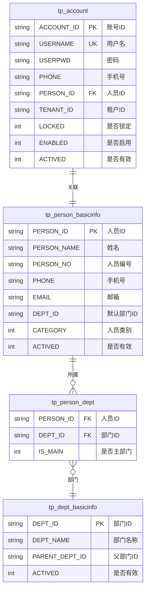
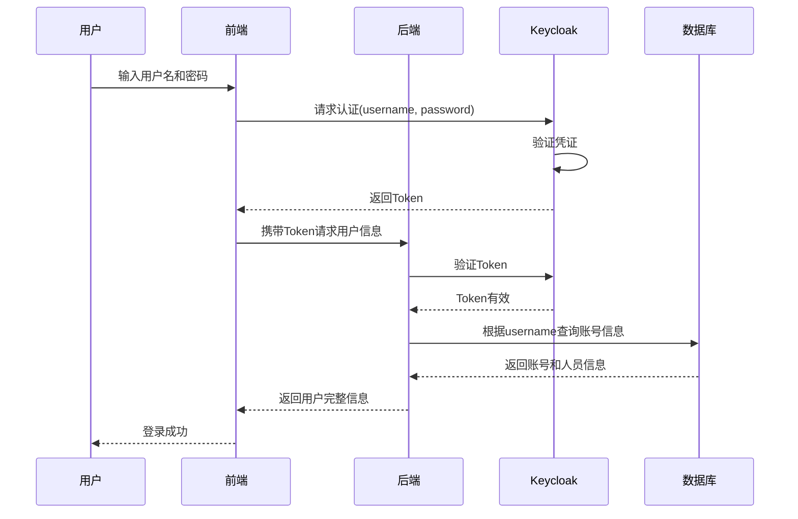
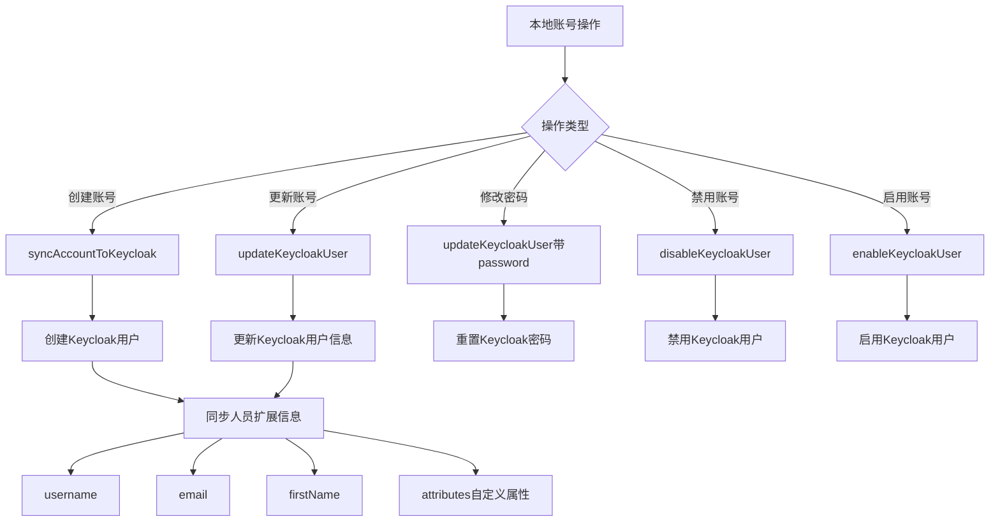
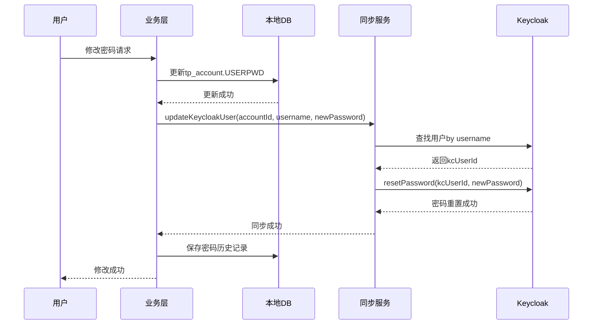
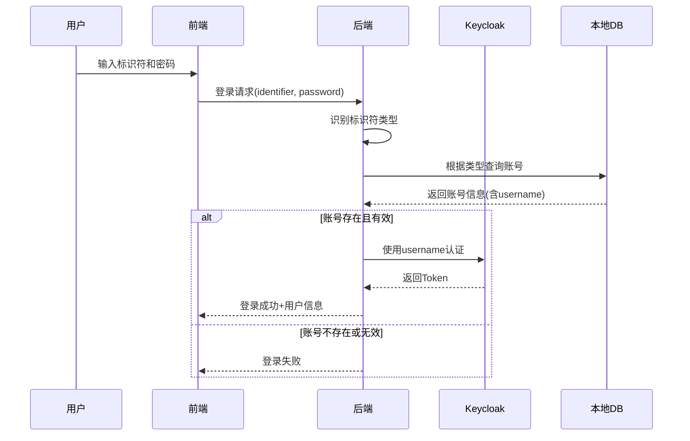

# 多方式登录功能设计文档

## 需求概述

**需求来源**:业务需求

**需求描述**:现有系统仅支持账号登录,需要扩展支持账号、手机号、邮箱三种方式任意登录。同时需要确保Keycloak也支持这三种登录方式,并分析对密码修改功能的影响。

**预期目标**:
- 用户可通过账号、手机号、邮箱任一方式完成登录
- 本地系统与Keycloak保持登录方式一致
- 保证密码修改功能正常运行

## 当前系统分析

### 数据模型分析

#### 账号与人员关系结构

系统采用账号与人员分离的设计模式:

**核心表关系图**



**关系说明**

| 关系类型 | 描述 | 业务规则 |
|---------|------|---------|
| 账号-人员 | 一对一关系 | tp_account.PERSON_ID → tp_person_basicinfo.PERSON_ID,一个人员对应一个账号 |
| 人员-部门 | 多对多关系 | 通过tp_person_dept中间表维护,一个人员可属于多个部门 |
| 部门层级 | 树形结构 | tp_dept_basicinfo.PARENT_DEPT_ID构成部门树 |
| 租户隔离 | 多租户 | 账号和人员均有TENANT_ID字段实现租户隔离 |

#### 字段唯一性分析

| 表名 | 字段 | 当前状态 | 存储位置 | 唯一性约束 |
|------|------|---------|---------|----------|
| tp_account | USERNAME | 存储账号名 | tp_account.USERNAME | 应有唯一索引 |
| tp_account | PHONE | 存储加密手机号 | tp_account.PHONE | 无唯一约束 |
| tp_person_basicinfo | PHONE | 存储加密手机号 | tp_person_basicinfo.PHONE | 无唯一约束 |
| tp_person_basicinfo | EMAIL | 存储明文邮箱 | tp_person_basicinfo.EMAIL | 无唯一约束 |

**关键发现**:
- 手机号同时存储在账号表和人员表两处
- 手机号已进行加密存储
- 邮箱仅存储在人员表
- 账号表未存储邮箱字段
- 缺少手机号和邮箱的唯一性约束

### 现有登录流程分析

#### 本地系统登录流程



**现有登录接口**

| 接口方法 | 功能描述 | 查询字段 |
|---------|---------|---------|
| KeycloakServiceImpl.authenticate | Keycloak认证 | username |
| UserAccountServiceImpl.getTpAccountByPhone | 根据手机号查询账号 | phone(加密后) |
| UserAccountServiceImpl.getTpAccountByEmail | 根据邮箱查询账号 | email |
| UserAccountMapper.getTpAccountByPhone | 数据层手机号查询 | PHONE |
| UserAccountMapper.getTpAccountByEmail | 数据层邮箱查询 | 关联查询 |

**当前限制**:
- Keycloak仅支持username字段认证
- 虽然存在手机号和邮箱查询方法,但未集成到登录流程
- 前端登录界面只有用户名输入框

### Keycloak集成现状

#### Keycloak用户同步机制



**同步字段映射**

| 本地字段 | Keycloak字段 | 同步时机 | 数据来源 |
|---------|-------------|---------|---------|
| tp_account.USERNAME | username | 创建/更新 | 账号表 |
| tp_person_basicinfo.EMAIL | email | 创建/更新 | 人员表 |
| tp_person_basicinfo.PERSON_NAME | firstName | 创建/更新 | 人员表 |
| tp_account.USERPWD | credentials.password | 创建/修改密码 | 账号表 |
| tp_person_basicinfo.PERSON_NO | attributes.PERSON_NO | 创建/更新 | 人员表 |

**关键代码位置**:
- KeycloakSyncServiceImpl.syncAccountToKeycloak: 账号同步入口
- KeycloakSyncServiceImpl.updateKeycloakUser: 用户信息更新
- KeycloakSyncServiceImpl.resetKeycloakUserPassword: 密码重置
- KeycloakSyncServiceImpl.buildPersonExtras: 构建人员扩展信息

### 密码修改流程分析

#### 现有密码修改场景

| 场景 | 入口方法 | 同步Keycloak | 密码历史记录 |
|------|---------|-------------|-------------|
| 用户主动修改密码 | UserAccountServiceImpl.updateAccountPwd | ✓ | ✓(类型1) |
| 密码过期强制修改 | UserAccountServiceImpl.updateExpirePwd | ✓ | ✓(类型2) |
| 管理员重置密码 | UserAccountServiceImpl.resetAccountPwd | ✓ | ✓(类型3) |
| 找回密码 | UserAccountServiceImpl.retrievePwd | ✓ | ✓(类型4) |

#### 密码修改同步流程



**密码同步关键点**:
- 密码修改必须同时更新本地数据库和Keycloak
- Keycloak通过username定位用户进行密码重置
- 密码历史记录仅保存在本地数据库
- 同步失败不影响本地密码修改成功

## 方案设计

### 整体设计思路

#### 设计原则

| 原则 | 说明 | 应用 |
|-----|------|-----|
| 最小改动原则 | 在现有架构基础上扩展 | 复用现有查询方法和同步机制 |
| 数据一致性原则 | 确保本地与Keycloak数据同步 | 统一登录标识符解析和同步策略 |
| 向后兼容原则 | 保持现有功能正常运行 | 原有username登录不受影响 |
| 唯一性保证原则 | 防止登录标识符冲突 | 添加数据库唯一约束和校验逻辑 |

#### 核心策略

**登录标识符统一识别策略**

输入内容通过格式判断自动识别类型:
- 包含@符号 → 识别为邮箱
- 纯数字且长度11位 → 识别为手机号
- 其他 → 识别为用户名

**查询策略**

| 标识符类型 | 查询表 | 查询字段 | 数据处理 |
|----------|-------|---------|---------|
| 用户名 | tp_account | USERNAME | 直接匹配 |
| 手机号 | tp_account | PHONE | 加密后匹配 |
| 邮箱 | tp_person_basicinfo + tp_account | EMAIL + PERSON_ID | 关联查询 |

### 数据库结构优化

#### 唯一性约束设计

**tp_account表约束**

| 约束类型 | 字段 | 约束名 | 说明 |
|---------|------|-------|------|
| 唯一索引 | USERNAME | uk_username | 用户名唯一 |
| 唯一索引 | PHONE | uk_phone | 手机号唯一(加密后) |
| 唯一索引 | TENANT_ID + USERNAME | uk_tenant_username | 租户内用户名唯一 |
| 唯一索引 | TENANT_ID + PHONE | uk_tenant_phone | 租户内手机号唯一 |

**tp_person_basicinfo表约束**

| 约束类型 | 字段 | 约束名 | 说明 |
|---------|------|-------|------|
| 唯一索引 | EMAIL | uk_email | 邮箱唯一 |
| 唯一索引 | PHONE | uk_person_phone | 人员手机号唯一(加密后) |
| 唯一索引 | TENANT_ID + EMAIL | uk_tenant_email | 租户内邮箱唯一 |

**约束添加策略**

执行时机:
1. 数据清洗 - 处理重复数据
2. 约束添加 - 添加唯一索引
3. 应用层校验 - 业务逻辑双重校验

数据清洗规则:
- 保留最早创建的记录
- 重复记录添加后缀标记
- 生成清洗报告供人工审核

#### tp_account表邮箱字段扩展

**字段添加设计**

| 字段名 | 数据类型 | 约束 | 默认值 | 说明 |
|-------|---------|-----|-------|------|
| EMAIL | VARCHAR(100) | 可空 | NULL | 账号关联邮箱,可选填 |

**添加理由**:
- 避免跨表关联查询提升性能
- 保持账号表字段完整性
- 便于后续邮箱登录扩展
- 与手机号字段保持对称

**数据迁移策略**:
- 从tp_person_basicinfo同步现有邮箱数据
- 优先使用账号表EMAIL字段
- 人员表EMAIL字段作为备份

### 本地系统登录改造

#### 登录标识符识别逻辑

**识别规则设计**

```mermaid
flowchart TD
    A[用户输入登录标识符] --> B{格式判断}
    B -->|包含@符号| C[邮箱类型]
    B -->|纯数字且长度11| D[手机号类型]
    B -->|其他| E[用户名类型]
    
    C --> F[查询人员表EMAIL]
    D --> G[加密后查询账号表PHONE]
    E --> H[查询账号表USERNAME]
    
    F --> I[获取PERSON_ID]
    I --> J[查询账号表获取完整账号信息]
    
    G --> K[获取账号信息]
    H --> K
    
    J --> L[账号信息]
    K --> L
    
    L --> M[验证账号状态]
    M --> N{账号有效?}
    N -->|是| O[准备Keycloak认证]
    N -->|否| P[返回账号异常]
```

**识别器接口定义**

功能名称:登录标识符类型识别器

输入参数:
- identifier: 用户输入的登录标识符

输出结果:
- identifierType: 标识符类型(USERNAME/PHONE/EMAIL)
- normalizedValue: 标准化后的值

识别规则:
- 邮箱: 包含@且符合邮箱格式规则
- 手机号: 纯数字且长度为11位
- 用户名: 其他情况

#### 账号查询服务改造

**查询服务接口设计**

服务名称:统一登录凭证查询服务

接口方法:queryAccountByLoginIdentifier

输入参数:
| 参数名 | 类型 | 必填 | 说明 |
|-------|------|------|------|
| identifier | String | 是 | 登录标识符 |
| tenantId | String | 否 | 租户ID |

输出结果:
| 字段名 | 类型 | 说明 |
|-------|------|------|
| accountId | String | 账号ID |
| username | String | 用户名 |
| personId | String | 人员ID |
| phone | String | 手机号 |
| email | String | 邮箱 |
| enabled | Integer | 是否启用 |
| locked | Integer | 是否锁定 |

查询流程:
1. 识别标识符类型
2. 根据类型选择查询策略
3. 验证账号状态(启用、未锁定、未过期)
4. 返回账号完整信息

**查询策略详细设计**

用户名查询:
- 查询表: tp_account
- 查询条件: USERNAME = ? AND TENANT_ID = ? AND ACTIVED = 1

手机号查询:
- 查询表: tp_account
- 查询条件: PHONE = 加密(?) AND TENANT_ID = ? AND ACTIVED = 1
- 特殊处理: 手机号需先加密再查询

邮箱查询:
- 查询表: tp_person_basicinfo关联tp_account
- 查询条件: 
  - tp_person_basicinfo.EMAIL = ? AND tp_person_basicinfo.ACTIVED = 1
  - tp_account.PERSON_ID = tp_person_basicinfo.PERSON_ID
  - tp_account.TENANT_ID = ? AND tp_account.ACTIVED = 1

#### 前端登录界面改造

**界面变更设计**

原有标签:
- 用户名输入框

变更后标签:
- 账号/手机号/邮箱输入框(统一输入框)

提示文案:
- "请输入账号、手机号或邮箱"

输入验证:
- 前端不限制格式
- 后端自动识别类型

错误提示优化:
- "账号、手机号或邮箱不存在"
- "账号已被锁定"
- "账号已被禁用"

### Keycloak登录改造

#### Keycloak认证流程调整

**当前Keycloak认证限制**

Keycloak标准认证流程:
- 仅支持username字段
- 使用username + password进行认证
- Token中包含username作为用户标识

**解决方案设计**

采用本地预查询 + Keycloak认证的混合模式:



**关键处理逻辑**

步骤1:本地预查询
- 根据标识符(邮箱/手机号/用户名)查询账号
- 获取对应的username字段
- 验证账号状态

步骤2:Keycloak认证
- 使用查询到的username + 用户输入的password
- 调用Keycloak认证接口
- 获取Token

步骤3:信息整合
- 合并本地账号信息和Keycloak认证结果
- 返回完整用户信息

**优势**:
- 无需修改Keycloak配置
- 保持Keycloak标准认证流程
- 灵活支持多种登录方式

#### Keycloak用户数据同步调整

**同步字段扩展**

| 本地字段 | Keycloak字段 | 字段类型 | 同步时机 | 说明 |
|---------|-------------|---------|---------|------|
| tp_account.USERNAME | username | 标准字段 | 创建/更新 | 必填,唯一标识 |
| tp_person_basicinfo.EMAIL | email | 标准字段 | 创建/更新 | 选填,可用于恢复密码 |
| tp_account.PHONE | attributes.phone | 自定义属性 | 创建/更新 | 加密存储,备用登录标识 |
| tp_person_basicinfo.EMAIL | attributes.email_backup | 自定义属性 | 创建/更新 | 邮箱备份,供查询使用 |

**同步时机**

| 操作场景 | 触发时机 | 同步内容 |
|---------|---------|---------|
| 创建账号 | 账号创建成功后 | username, email, phone, 人员信息 |
| 修改手机号 | 手机号更新后 | phone属性更新 |
| 修改邮箱 | 邮箱更新后 | email和email_backup更新 |
| 修改密码 | 密码更新后 | 密码重置 |
| 启用/禁用账号 | 状态变更后 | enabled状态更新 |

**同步一致性保证**

策略设计:
- 采用异步同步 + 失败重试机制
- 本地操作优先,同步失败记录日志
- 提供手动触发同步接口
- 定期同步检查任务

失败处理:
- 记录同步失败的账号ID
- 后台定时重试同步
- 管理界面显示同步状态
- 提供批量重新同步功能

### 密码修改功能影响分析

#### 密码修改场景分析

**受影响场景评估**

| 场景 | 影响程度 | 影响内容 | 处理方案 |
|------|---------|---------|---------|
| 用户主动修改密码 | 无影响 | 通过personId或accountId定位 | 无需调整 |
| 密码过期强制修改 | 无影响 | 登录时已完成身份确认 | 无需调整 |
| 管理员重置密码 | 无影响 | 通过accountId操作 | 无需调整 |
| 找回密码 | 需优化 | 目前仅支持手机号找回 | 扩展支持邮箱找回 |

#### 密码同步逻辑分析

**现有同步机制**

同步入口:
- UserAccountServiceImpl.updateAccountPwd
- UserAccountServiceImpl.updateExpirePwd  
- UserAccountServiceImpl.resetAccountPwd

同步关键代码:
```
keycloakSyncService.updateKeycloakUser(
    accountId,    // 账号ID
    username,     // 用户名(Keycloak定位标识)
    newPassword,  // 新密码
    operator      // 操作者
)
```

定位方式:
- 通过username在Keycloak中查找用户
- 使用kcUserId进行密码重置
- 与登录方式无关

**结论**:
- 密码修改不依赖登录标识符
- 所有场景均通过username定位Keycloak用户
- 多方式登录不影响密码修改流程
- 密码修改后所有登录方式均自动生效

#### 找回密码功能扩展

**现有找回密码流程**

当前支持:
- 仅支持手机号找回
- 验证码发送到手机
- 手机号验证成功后重置密码

**扩展设计**

增加邮箱找回方式:
- 支持邮箱验证码找回
- 验证码发送到邮箱
- 邮箱验证成功后重置密码

统一找回入口:
- 用户输入手机号或邮箱
- 系统自动识别类型
- 发送对应渠道验证码

验证流程:
1. 识别输入的是手机号还是邮箱
2. 验证该手机号或邮箱是否存在
3. 发送验证码
4. 验证码校验通过后重置密码
5. 同步密码到Keycloak

## 实施计划

### 阶段划分

**第一阶段:数据准备与约束添加**

目标:确保数据唯一性,为多方式登录奠定基础

任务清单:
- 数据唯一性分析
  - 统计tp_account表username重复情况
  - 统计tp_account表phone重复情况
  - 统计tp_person_basicinfo表email重复情况
  
- 数据清洗
  - 处理username重复记录
  - 处理phone重复记录
  - 处理email重复记录
  - 生成数据清洗报告
  
- 添加数据库约束
  - tp_account表添加username唯一索引
  - tp_account表添加phone唯一索引
  - tp_account表添加EMAIL字段
  - tp_person_basicinfo表添加email唯一索引
  - 添加租户级别组合唯一索引

**第二阶段:本地系统登录改造**

目标:实现本地系统支持多方式登录

任务清单:
- 后端服务改造
  - 实现登录标识符识别器
  - 实现统一登录凭证查询服务
  - 改造现有登录接口
  - 添加单元测试

- 前端界面改造
  - 修改登录页面输入框标签
  - 更新提示文案
  - 优化错误提示信息

- 测试验证
  - 用户名登录测试
  - 手机号登录测试
  - 邮箱登录测试
  - 异常场景测试

**第三阶段:Keycloak集成改造**

目标:确保Keycloak支持多方式登录认证

任务清单:
- 认证流程调整
  - 实现本地预查询逻辑
  - 调整Keycloak认证调用
  - 整合认证结果返回

- 数据同步调整
  - 扩展同步字段映射
  - 实现手机号同步到attributes
  - 实现邮箱同步到attributes
  - 优化同步失败处理

- 同步一致性保证
  - 实现同步失败重试机制
  - 实现同步状态监控
  - 提供手动同步接口

**第四阶段:密码修改与找回密码**

目标:验证密码功能正常,扩展找回密码方式

任务清单:
- 密码修改验证
  - 验证各场景密码修改功能
  - 验证Keycloak密码同步
  - 验证多登录方式下密码生效

- 找回密码扩展
  - 实现邮箱验证码发送
  - 实现邮箱验证码校验
  - 统一找回密码入口
  - 测试找回密码流程

**第五阶段:全面测试与上线**

目标:全面测试,确保功能稳定可靠

任务清单:
- 功能测试
  - 登录功能完整测试
  - 密码修改功能测试
  - 找回密码功能测试
  - Keycloak同步测试

- 性能测试
  - 登录性能测试
  - 并发登录测试
  - 数据库查询性能测试

- 安全测试
  - SQL注入测试
  - 暴力破解测试
  - 数据加密验证

- 上线部署
  - 生产环境数据清洗
  - 生产环境约束添加
  - 代码部署
  - 功能验证

### 关键风险与应对

**风险识别**

| 风险项 | 风险等级 | 影响范围 | 应对措施 |
|-------|---------|---------|---------|
| 数据重复导致约束添加失败 | 高 | 数据准备阶段 | 充分数据清洗,人工审核重复数据处理方案 |
| Keycloak认证性能下降 | 中 | 系统性能 | 增加本地查询缓存,优化数据库查询 |
| 历史数据邮箱缺失 | 中 | 邮箱登录功能 | 提供邮箱补录功能,引导用户完善信息 |
| 同步失败导致登录异常 | 高 | 用户体验 | 完善失败重试机制,提供手动同步功能 |
| 手机号格式多样性 | 低 | 手机号登录 | 统一手机号格式化规则 |

**回滚方案**

回滚触发条件:
- 登录成功率低于95%
- Keycloak同步失败率高于10%
- 出现严重安全漏洞

回滚步骤:
1. 禁用多方式登录功能开关
2. 恢复原有登录流程
3. 保留数据库约束(不影响现有功能)
4. 分析问题,制定修复方案

## 技术实现要点

### 数据加密处理

**手机号加密方案**

加密算法:国密SM4对称加密

加密时机:
- 用户注册时加密
- 手机号修改时加密
- 导入数据时加密

加密位置:
- 应用层统一加密
- 数据库存储密文

查询处理:
- 查询前先加密查询条件
- 查询后解密返回结果

**邮箱存储方案**

存储方式:明文存储(考虑业务便利性)

安全措施:
- 数据库访问权限控制
- 敏感信息脱敏展示
- 审计日志记录

### 性能优化策略

**数据库查询优化**

索引设计:
- tp_account.USERNAME添加普通索引
- tp_account.PHONE添加普通索引
- tp_person_basicinfo.EMAIL添加普通索引
- 租户+标识符组合索引

查询优化:
- 避免全表扫描
- 使用覆盖索引
- 适当使用查询缓存

**接口性能优化**

缓存策略:
- 账号信息短时缓存(5分钟)
- 标识符→username映射缓存
- 缓存键包含租户ID

响应时间目标:
- 登录标识符识别: < 10ms
- 账号查询: < 50ms
- Keycloak认证: < 200ms
- 整体登录: < 300ms

### 安全性考虑

**防暴力破解**

限流策略:
- 同一IP 5分钟内最多尝试5次
- 同一账号 5分钟内最多尝试3次
- 失败后递增等待时间

账号保护:
- 连续失败5次锁定账号15分钟
- 连续失败10次锁定账号1小时
- 记录异常登录日志

**数据脱敏**

脱敏规则:
- 手机号显示: 138****1234
- 邮箱显示: ab***@example.com
- 日志中完全脱敏

脱敏场景:
- 前端展示
- 日志输出
- 接口返回(非查询场景)

**审计日志**

记录内容:
- 登录时间
- 登录标识符类型
- 登录IP地址
- 登录结果(成功/失败)
- 失败原因

日志用途:
- 安全审计
- 异常行为分析
- 用户行为分析

## 置信度评估

### 评估结果

**置信度等级:中等偏高(75%)**

### 置信度分析

**高置信度因素(支持实施)**

| 因素 | 置信度贡献 | 说明 |
|-----|----------|------|
| 现有基础完善 | +20% | 已有手机号和邮箱查询方法,数据结构基本满足需求 |
| 技术方案成熟 | +15% | 本地预查询+Keycloak认证的方案是标准模式 |
| 同步机制健全 | +15% | 现有Keycloak同步机制完善,扩展性强 |
| 密码修改影响小 | +15% | 密码修改不依赖登录方式,改造风险低 |
| 回滚方案清晰 | +10% | 可快速回滚到原有方案 |

**低置信度因素(实施风险)**

| 因素 | 置信度影响 | 说明 |
|-----|----------|------|
| 数据唯一性未知 | -15% | 手机号和邮箱可能存在重复,需数据清洗 |
| 历史数据质量 | -10% | 可能存在邮箱缺失或格式不规范 |
| 性能影响未知 | -10% | 增加本地查询可能影响登录性能 |
| 测试覆盖度 | -5% | 需要大量场景测试验证 |

### 关键成功因素

**必须满足的前提条件**

| 条件 | 重要性 | 验证方式 |
|-----|-------|---------|
| 数据唯一性可保证 | 极高 | 数据分析+清洗验证 |
| Keycloak服务稳定 | 高 | 性能测试+监控 |
| 同步机制可靠 | 高 | 同步功能测试 |
| 性能可接受 | 中 | 性能测试 |

**提升置信度的措施**

优先措施:
1. 完成数据质量分析报告
2. 验证数据清洗方案可行性
3. 性能测试验证影响
4. 小范围灰度测试

建议:
- 在测试环境充分验证
- 生产环境分阶段上线
- 准备快速回滚方案
- 建立实时监控告警

### 不确定性分析

**技术不确定性**

| 不确定项 | 影响 | 验证方法 |
|---------|------|---------|
| 加密手机号查询性能 | 中 | 性能测试 |
| 邮箱跨表查询性能 | 中 | 压力测试 |
| Keycloak attributes查询支持 | 低 | 技术验证 |

**业务不确定性**

| 不确定项 | 影响 | 解决方案 |
|---------|------|---------|
| 用户接受度 | 低 | 用户调研+培训 |
| 邮箱补录意愿 | 中 | 引导提示+激励机制 |
| 历史数据清洗规则 | 高 | 业务部门确认 |

## 附录

### 相关表结构

#### tp_account表结构

```
表名: tp_account
说明: 账号信息表

主要字段:
- ACCOUNT_ID: 账号ID(主键)
- USERNAME: 用户名(唯一)
- USERPWD: 密码(加密)
- PHONE: 手机号(加密)
- EMAIL: 邮箱(待添加)
- PERSON_ID: 人员ID(外键)
- TENANT_ID: 租户ID
- LOCKED: 是否锁定
- ENABLED: 是否启用
- ACTIVED: 是否有效
- CREATE_TIME: 创建时间
- UPDATE_TIME: 更新时间
```

#### tp_person_basicinfo表结构

```
表名: tp_person_basicinfo
说明: 人员基本信息表

主要字段:
- PERSON_ID: 人员ID(主键)
- PERSON_NAME: 姓名
- PERSON_NO: 人员编号
- PHONE: 手机号(加密)
- EMAIL: 邮箱
- DEPT_ID: 默认部门ID
- CATEGORY: 人员类别
- ACTIVED: 是否有效
- TENANT_ID: 租户ID
- CREATE_TIME: 创建时间
- UPDATE_TIME: 更新时间
```

### Keycloak相关配置

#### Keycloak Realm配置

```
Realm: ps-realm
Client ID: ps-client
Client Type: OpenID Connect
Authentication Flow: Direct Grant (Resource Owner Password Credentials)
```

#### Keycloak用户属性映射

```
标准字段:
- username: 用户名(必填,唯一)
- email: 邮箱(选填)
- firstName: 名
- lastName: 姓
- enabled: 是否启用

自定义属性(attributes):
- PERSON_ID: 人员ID
- PERSON_NO: 人员编号
- phone: 手机号(加密)
- email_backup: 邮箱备份
```

### 关键接口清单

#### 登录相关接口

| 接口路径 | 方法 | 说明 |
|---------|------|------|
| /auth/login | POST | 统一登录接口 |
| /auth/logout | POST | 注销接口 |
| /auth/refresh | POST | Token刷新接口 |

#### 账号查询接口

| 接口路径 | 方法 | 说明 |
|---------|------|------|
| /api/account/query | POST | 统一账号查询接口 |
| /api/account/queryByPhone | GET | 手机号查询接口(现有) |
| /api/account/queryByEmail | GET | 邮箱查询接口(现有) |

#### 密码管理接口

| 接口路径 | 方法 | 说明 |
|---------|------|------|
| /api/account/changePassword | POST | 修改密码 |
| /api/account/resetPassword | POST | 重置密码 |
| /api/account/retrievePassword | POST | 找回密码 |

#### Keycloak同步接口

| 接口路径 | 方法 | 说明 |
|---------|------|------|
| /api/keycloak/sync | POST | 手动同步账号 |
| /api/keycloak/syncPassword | POST | 同步密码 |
| /api/keycloak/syncStatus | GET | 查询同步状态 |
