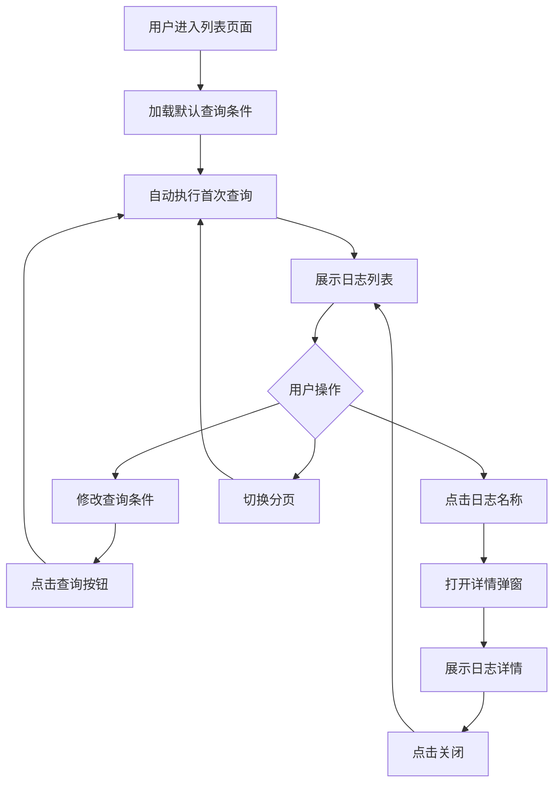
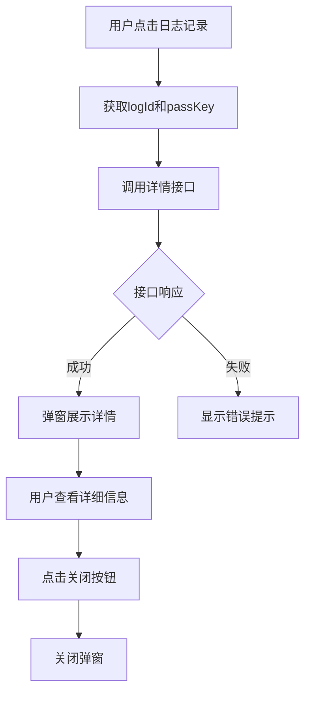
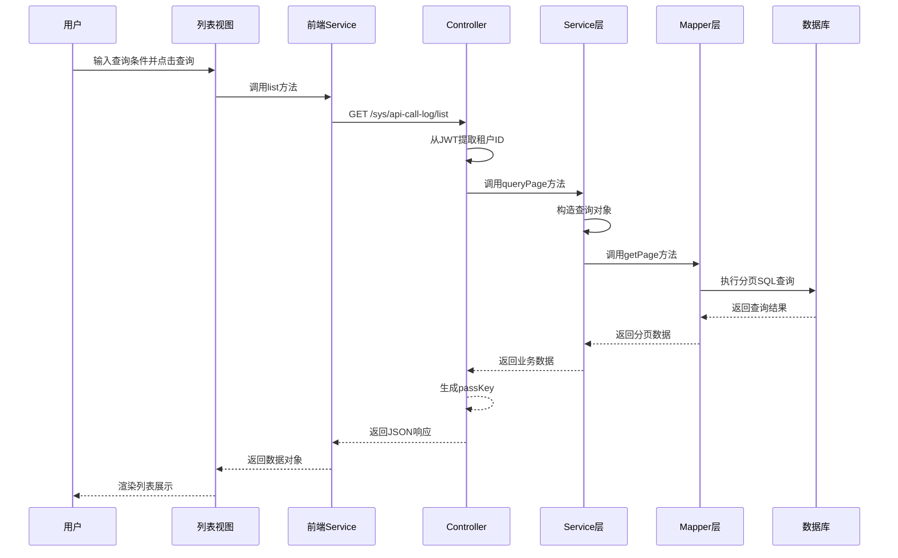
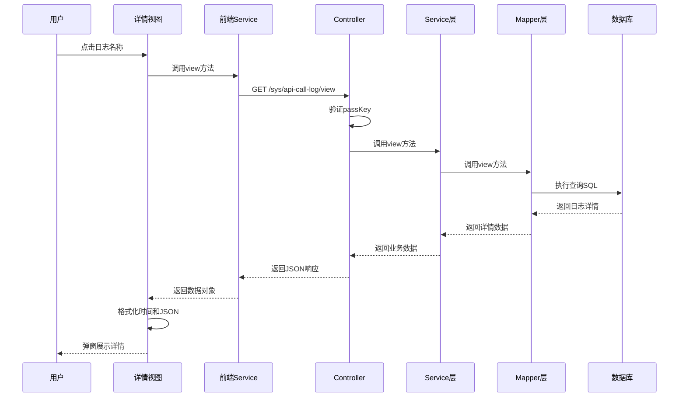

# API接口访问日志功能设计文档

## 一、功能概述

### 1.1 功能描述
API接口访问日志功能提供对第三方应用API调用记录的查询和分析能力，支持日志列表查看和详情查看，帮助系统管理员监控和追踪API调用情况。

### 1.2 业务价值
- 提供API调用的完整审计追踪能力
- 支持问题排查和性能分析
- 帮助管理员监控第三方应用调用行为
- 为系统优化提供数据支持

### 1.3 参考实现
本功能设计参考标签管理功能的实现风格，保持系统界面和交互的一致性。

## 二、数据模型设计

### 2.1 数据表结构

基于现有数据表 `tp_api_call_log`，字段说明如下：

| 字段名 | 类型 | 说明 | 约束 |
|--------|------|------|------|
| log_id | VARCHAR(19) | 日志ID | 主键 |
| app_id | VARCHAR(19) | 应用ID | 非空 |
| app_name | VARCHAR(100) | 应用名称（冗余） | 可空 |
| api_id | VARCHAR(19) | API ID | 可空 |
| api_path | VARCHAR(200) | 请求路径 | 非空 |
| http_method | VARCHAR(10) | HTTP请求方法 | 非空 |
| request_ip | VARCHAR(50) | 请求来源IP | 可空 |
| request_params | TEXT | 请求参数（已脱敏） | 可空 |
| response_status | INTEGER | HTTP响应状态码 | 非空 |
| response_time | INTEGER | 响应耗时（毫秒） | 可空 |
| error_message | TEXT | 错误信息 | 可空 |
| call_time | VARCHAR(14) | 调用时间（格式：YYYYMMDDHHmmss） | 非空 |
| tenant_id | VARCHAR(19) | 租户ID | 可空 |

### 2.2 索引设计说明

表已建立以下索引以支持高效查询：
- 应用和时间复合索引：`idx_app_call_time (app_id, call_time)`
- API和时间复合索引：`idx_api_call_time (api_id, call_time)`
- 响应状态索引：`idx_response_status (response_status)`
- 调用时间索引：`idx_call_time (call_time)`

## 三、功能设计

### 3.1 日志列表功能

#### 3.1.1 查询条件设计

| 查询条件 | 类型 | 说明 | 是否必填 |
|----------|------|------|----------|
| 应用名称 | 文本 | 支持模糊查询 | 否 |
| API路径 | 文本 | 支持模糊查询 | 否 |
| HTTP方法 | 下拉选择 | GET/POST/PUT/DELETE | 否 |
| 响应状态 | 下拉选择 | 200/400/401/403/404/500等 | 否 |
| 请求IP | 文本 | 精确匹配 | 否 |
| 调用时间范围 | 日期时间范围 | 起始时间-结束时间（转换为YYYYMMDDHHmmss格式传递） | 否 |

#### 3.1.2 列表展示字段

| 字段 | 说明 | 宽度 | 是否可排序 |
|------|------|------|-----------|
| 应用名称 | 带链接，点击查看详情 | 150px | 否 |
| API路径 | 显示完整路径 | 200px | 否 |
| HTTP方法 | GET/POST等 | 80px | 否 |
| 请求IP | 来源IP地址 | 120px | 否 |
| 响应状态 | 状态码，成功绿色、失败红色 | 80px | 否 |
| 响应时间 | 毫秒数，超过阈值标红 | 100px | 是 |
| 调用时间 | 格式化显示 YYYY-MM-DD HH:mm:ss | 160px | 是 |

#### 3.1.3 数据格式化规则

响应状态格式化：
- 2xx 状态码：显示为成功状态（绿色标识）
- 4xx 状态码：显示为客户端错误（橙色标识）
- 5xx 状态码：显示为服务器错误（红色标识）

响应时间格式化：
- 小于500ms：正常显示
- 500ms - 2000ms：黄色警告
- 大于2000ms：红色警告

调用时间格式化：
- 数据库存储格式为14位时间字符串：YYYYMMDDHHmmss
- 前端显示时格式化为：YYYY-MM-DD HH:mm:ss

#### 3.1.4 分页设计

采用后端分页模式：
- 默认每页显示 10 条记录
- 支持每页 10/20/50/100 条切换
- 显示总记录数和当前页码
- 默认按调用时间倒序排列（最新的在前）

### 3.2 日志详情功能

#### 3.2.1 详情展示字段设计

采用fb-property组件展示详情，字段按业务逻辑分组排列：

| 字段 | 显示标签 | 跨列(span) | 格式说明 |
|------|----------|-----------|----------|
| app_name | 应用名称 | 2 | 直接显示 |
| api_path | API路径 | 2 | 直接显示，长路径可换行 |
| http_method | HTTP方法 | 1 | 直接显示（GET/POST等） |
| request_ip | 请求IP | 1 | 直接显示 |
| response_status | 响应状态 | 1 | 状态码 + 颜色标识（2xx绿色/4xx橙色/5xx红色） |
| response_time | 响应时间 | 1 | XX毫秒，超时标红 |
| call_time | 调用时间 | 2 | 从YYYYMMDDHHmmss格式化为YYYY-MM-DD HH:mm:ss显示 |
| request_params | 请求参数 | 2 | 文本显示，空值显示'-' |
| error_message | 错误信息 | 2 | 存在时显示，不存在显示'-' |

#### 3.2.2 详情页面样式设计

**组件布局**
- 使用fb-property组件，设置bordered属性显示边框
- label-width设置为140px，保持标签宽度一致
- 字段按span属性控制跨列数（总列数为2列）

**状态颜色标识**
- 2xx状态码：绿色（#52c41a）加粗显示
- 4xx状态码：橙色（#faad14）加粗显示
- 5xx状态码：红色（#ff4d4f）加粗显示

**响应时间颜色标识**
- 小于500ms：正常颜色
- 500ms-2000ms：黄色（#faad14）
- 大于2000ms：红色（#ff4d4f）

#### 3.2.3 详情页面交互

- 采用弹窗形式展示详情
- 弹窗高度：600px（适应内容较多的情况）
- 弹窗宽度：800px
- 仅提供关闭按钮，不支持编辑操作（日志为只读数据）
- 时间格式化处理：数据库14位时间字符串（YYYYMMDDHHmmss）转换为YYYY-MM-DD HH:mm:ss格式显示
- 空值处理：对于空值统一显示为'-'

### 3.3 业务规则设计

#### 3.3.1 数据权限规则

- 租户数据隔离：仅查询当前租户的API调用日志
- 按租户ID过滤数据
- 不同租户之间数据完全隔离

#### 3.3.2 查询性能优化策略

- 必须指定调用时间范围（默认查询最近7天）
- 利用索引优化查询性能
- 时间范围超过30天时给予提示
- 对于大数据量查询，后端限制最多返回10000条记录

#### 3.3.3 数据保留策略说明

- 日志数据为只读，不支持修改和删除操作
- 历史数据清理由后台定时任务处理（非本次功能范围）

## 四、接口设计

### 4.1 后端API设计

#### 4.1.1 日志列表接口

**接口路径**
```
GET /sys/api-call-log/list
```

**请求参数**

| 参数名 | 类型 | 说明 | 必填 |
|--------|------|------|------|
| appName | String | 应用名称（模糊查询） | 否 |
| apiPath | String | API路径（模糊查询） | 否 |
| httpMethod | String | HTTP方法 | 否 |
| responseStatus | Integer | 响应状态码 | 否 |
| requestIp | String | 请求IP | 否 |
| startTime | String | 开始时间（14位YYYYMMDDHHmmss格式） | 否 |
| endTime | String | 结束时间（14位YYYYMMDDHHmmss格式） | 否 |
| current | Integer | 当前页码（默认1） | 否 |
| size | Integer | 每页条数（默认10） | 否 |
| jwtpid | String | 租户ID（来自JWT token） | 是 |

**响应数据结构**

```
响应对象包含以下属性：
- code: 响应码（1表示成功）
- message: 响应消息
- data: 分页数据对象
  - records: 日志记录列表
    - logId: 日志ID
    - appId: 应用ID
    - appName: 应用名称
    - apiId: API定义ID
    - apiPath: API路径
    - httpMethod: HTTP方法
    - requestIp: 请求IP
    - responseStatus: 响应状态码
    - responseTime: 响应耗时
    - callTime: 调用时间
  - total: 总记录数
  - current: 当前页码
  - size: 每页条数
- passKey: 数据权限密钥（用于详情查询）
```

#### 4.1.2 日志详情接口

**接口路径**
```
GET /sys/api-call-log/view
```

**请求参数**

| 参数名 | 类型 | 说明 | 必填 |
|--------|------|------|------|
| logId | String | 日志ID | 是 |
| passKey | String | 数据权限密钥 | 是 |

**响应数据结构**

```
响应对象包含以下属性：
- code: 响应码（1表示成功）
- message: 响应消息
- data: 日志详细信息
  - logId: 日志ID
  - appId: 应用ID
  - appName: 应用名称
  - apiId: API定义ID
  - apiPath: API路径
  - httpMethod: HTTP方法
  - requestIp: 请求IP
  - requestParams: 请求参数
  - responseStatus: 响应状态码
  - responseTime: 响应耗时
  - errorMessage: 错误信息
  - callTime: 调用时间
  - tenantId: 租户ID
```

### 4.2 前端服务层设计

**服务方法定义**

日志列表服务方法：
- 方法名：list
- 请求方式：GET
- 参数：formData（查询条件对象）
- 返回：Promise对象，包含分页数据

日志详情服务方法：
- 方法名：view
- 请求方式：GET
- 参数：formData（包含logId和passKey）
- 返回：Promise对象，包含日志详细信息

## 五、层次架构设计

### 5.1 后端层次设计

**Controller层职责**
- 接收HTTP请求并验证参数
- 从JWT token提取租户信息
- 调用Service层处理业务逻辑
- 构造统一响应格式
- 生成和验证数据权限密钥（passKey）

**Service层职责**
- 实现业务逻辑处理
- 构造查询条件对象
- 调用Mapper层执行数据查询
- 处理异常并记录日志
- 返回业务数据对象

**Mapper层职责**
- 定义数据访问接口
- 提供分页查询方法
- 提供详情查询方法
- 执行SQL查询并映射结果

**XML映射层职责**
- 编写SQL查询语句
- 使用动态SQL处理可选查询条件
- 映射数据库字段到Java对象
- 利用数据库索引优化查询性能

### 5.2 前端层次设计

**页面视图层职责**
- 渲染列表和详情界面
- 处理用户交互事件
- 调用服务层API
- 展示数据和提示信息

**服务层职责**
- 封装API请求
- 处理请求参数序列化
- 统一错误处理
- 返回Promise对象

**路由层职责**
- 定义页面路由路径
- 配置页面元信息（标题等）
- 实现懒加载组件

## 六、界面交互设计

### 6.1 列表页面交互流程



### 6.2 详情查看交互流程



### 6.3 响应式布局设计

查询表单布局：
- 使用栅格系统布局
- 每行最多3个查询条件
- 条件较多时自动换行
- 查询按钮固定在右侧

列表表格布局：
- 表格宽度自适应
- 固定表头，内容区域可滚动
- 最小宽度1200px，超出横向滚动
- 操作列固定在右侧

## 七、数据流转设计

### 7.1 列表查询数据流



### 7.2 详情查看数据流



## 八、后端组件设计

### 8.1 实体类设计

**TpApiCallLog实体类**

字段属性：
- logId: String - 日志ID
- appId: String - 应用ID
- appName: String - 应用名称
- apiId: String - API ID
- apiPath: String - API路径
- httpMethod: String - HTTP方法
- requestIp: String - 请求IP
- requestParams: String - 请求参数
- responseStatus: Integer - 响应状态码
- responseTime: Integer - 响应时间
- errorMessage: String - 错误信息
- callTime: String - 调用时间
- tenantId: String - 租户ID

### 8.2 查询对象设计

**TpApiCallLogQuery查询对象**

继承分页基础类，包含以下查询条件：
- appName: String - 应用名称（模糊查询）
- apiPath: String - API路径（模糊查询）
- httpMethod: String - HTTP方法
- responseStatus: Integer - 响应状态码
- requestIp: String - 请求IP
- startTime: String - 开始时间
- endTime: String - 结束时间
- tenantId: String - 租户ID
- current: Integer - 当前页码
- size: Integer - 每页大小

### 8.3 VO对象设计

**TpApiCallLogVO视图对象**

包含所有实体字段，无需额外扩展字段

### 8.4 Mapper接口设计

**TpApiCallLogMapper接口方法**

分页查询方法：
- 方法名：getPage
- 参数：Page对象、TpApiCallLogQuery查询对象
- 返回：IPage分页结果对象

详情查询方法：
- 方法名：view
- 参数：logId（日志ID）
- 返回：TpApiCallLogVO对象

### 8.5 Service接口设计

**TpApiCallLogService服务接口方法**

分页查询方法：
- 方法名：queryPage
- 参数：query（查询对象）、tenantId（租户ID）
- 返回：IPage分页结果
- 异常处理：捕获异常并抛出业务异常

详情查询方法：
- 方法名：view
- 参数：logId（日志ID）
- 返回：TpApiCallLogVO对象
- 异常处理：捕获异常并抛出业务异常

### 8.6 Controller设计

**TpApiCallLogController控制器**

列表接口：
- 路径：/sys/api-call-log/list
- 方法：list
- 参数：TpApiCallLogQuery、jwtpid（租户ID）
- 返回：JsonResponse包含分页数据
- 权限控制：需要登录认证

详情接口：
- 路径：/sys/api-call-log/view
- 方法：view
- 参数：logId、passKey
- 返回：JsonResponse包含详情数据
- 权限控制：需要登录认证和passKey验证

## 九、前端组件设计

### 9.1 路由配置

路由路径：/sys/api-call-log/list
页面标题：API调用日志
组件路径：views/sys/api-call-log/list.vue

### 9.2 列表页面组件结构

**主要组件组成**
- fb-page-search：页面搜索容器
  - query插槽：查询条件表单
  - buttons插槽：工具栏按钮（本功能无需新增按钮）
  - actions插槽：查询操作按钮
  - table插槽：数据表格
- tp-dialog：详情弹窗组件

**查询表单字段**
- 应用名称：文本输入框
- API路径：文本输入框
- HTTP方法：下拉选择框
- 响应状态：下拉选择框
- 请求IP：文本输入框
- 调用时间范围：日期时间范围选择器

**表格列配置**
- 应用名称列：带查看链接插槽
- API路径列：普通文本列
- HTTP方法列：普通文本列
- 请求IP列：普通文本列
- 响应状态列：带格式化显示
- 响应时间列：带格式化和颜色标识
- 调用时间列：带时间格式化

### 9.3 详情页面组件结构

**主要组件组成**
- tp-dialog容器：包含tp-dialog-top和tp-dialog-bottom两部分
- fb-property：属性展示容器，设置bordered和label-width属性
- fb-property-item：单个属性项，通过span属性控制跨列

**属性展示布局**
- 采用fb-property组件，无需手动使用fb-row和fb-col
- 通过fb-property-item的span属性控制字段宽度
- span="2"表示跨两列（占满整行）
- 未设置span或span="1"表示占一列（半行）

**样式类定义**
- status-success：响应状态2xx，绿色加粗
- status-client-error：响应状态4xx，橙色加粗
- status-server-error：响应状态5xx，红色加粗
- time-normal：响应时间正常
- time-warning：响应时间警告，黄色
- time-danger：响应时间超时，红色加粗

### 9.4 数据状态管理

**列表页面状态**
- formData：查询条件对象
  - 初始值：设置默认查询最近7天
- formatters：格式化函数对象
  - responseStatus：状态码格式化
  - responseTime：响应时间格式化
  - callTime：时间格式化
- table：表格配置对象
  - service：服务对象引用
  - primaryKey：主键字段名
  - columns：列配置数组

**详情页面状态**
- formData：详情数据对象
  - 初始值：包含所有字段的空对象
  - 字段包括：logId、appId、appName、apiId、apiPath、httpMethod、requestIp、requestParams、responseStatus、responseTime、errorMessage、callTime、tenantId
- service：服务对象引用（this.$svc.sys.apiCallLog）

**详情页面方法**
- init方法：初始化数据，获取logId和passKey后调用view方法
- handleClose方法：关闭弹窗
- formatTime方法：格式化14位时间字符串（YYYYMMDDHHmmss）为YYYY-MM-DD HH:mm:ss显示格式，空值返回'-'
- formatResponseStatus方法：格式化响应状态，返回状态码和对应的样式类
- formatResponseTime方法：格式化响应时间，返回时间值和对应的样式类
- view方法：调用API获取详情数据

## 十、SQL查询设计

### 10.1 列表查询SQL结构

查询字段：
- 选择所有必要的业务字段
- 不查询request_params和error_message（减少数据传输）

查询条件：
- 必须包含租户ID条件
- 动态拼接可选查询条件
- 使用LIKE实现模糊查询
- 使用等值匹配实现精确查询
- 时间范围使用BETWEEN或大于小于条件

排序规则：
- 默认按call_time倒序排列
- 支持响应时间排序

### 10.2 详情查询SQL结构

查询字段：
- 查询所有字段包括request_params和error_message

查询条件：
- 使用主键log_id精确查询
- 单条记录查询

## 十一、错误处理设计

### 11.1 后端错误处理策略

**异常分类处理**
- 业务异常：返回明确的错误提示信息
- 系统异常：记录详细日志，返回通用错误提示
- 参数验证异常：返回参数错误提示

**日志记录策略**
- 记录查询条件和错误堆栈
- 使用LOGGER记录错误信息
- 区分WARN和ERROR级别

### 11.2 前端错误处理策略

**接口调用错误处理**
- 使用统一的错误提示组件
- 区分不同错误类型给予不同提示
- 网络错误给予重试提示

**用户操作错误处理**
- 表单验证提示
- 数据格式错误提示
- 权限不足提示

## 十二、安全设计

### 12.1 数据权限控制

- 租户数据隔离：严格按租户ID过滤数据
- PassKey验证机制：详情查询需要验证passKey
- 接口认证：所有接口需要JWT token认证

### 12.2 敏感数据处理

- request_params字段在记录时已脱敏
- 详情展示时直接显示脱敏后的数据
- 不支持导出功能，避免数据泄露

### 12.3 SQL注入防护

- 使用MyBatis参数绑定
- 不直接拼接SQL语句
- 使用预编译语句

## 十三、性能优化设计

### 13.1 查询优化策略

**索引利用**
- 充分利用已建立的复合索引
- 查询条件优先使用索引字段
- 避免索引失效的查询方式

**分页优化**
- 使用数据库分页而非内存分页
- 限制单次查询最大数据量
- 时间范围查询避免全表扫描

**查询字段优化**
- 列表查询不返回大字段
- 详情查询才返回完整数据
- 减少不必要的JOIN操作

### 13.2 前端性能优化

**组件懒加载**
- 详情组件使用动态导入
- 减少首屏加载时间

**数据缓存**
- 表格组件自动缓存分页状态
- 减少重复请求

### 13.3 大数据量处理

**数据量限制**
- 单次查询最多返回10000条
- 超过限制提示用户缩小范围

**时间窗口建议**
- 默认查询最近7天
- 超过30天给予提示
- 引导用户使用合理的查询范围

## 十四、测试要点

### 14.1 功能测试要点

**列表功能测试**
- 默认查询正常显示
- 各查询条件单独生效
- 多条件组合查询正确
- 分页切换正常
- 排序功能正常

**详情功能测试**
- 详情数据完整显示
- 时间格式化正确
- JSON参数格式化正确
- 弹窗关闭正常

### 14.2 性能测试要点

- 大数据量分页查询响应时间
- 复杂条件查询响应时间
- 并发查询稳定性

### 14.3 安全测试要点

- 租户数据隔离验证
- PassKey验证有效性
- SQL注入测试
- 未授权访问测试

### 14.4 兼容性测试要点

- 浏览器兼容性
- 不同分辨率显示正常
- 移动端响应式布局

## 十五、部署说明

### 15.1 数据库准备

- 确认tp_api_call_log表已创建
- 确认索引已正确建立
- 确认测试数据存在

### 15.2 后端部署

- 编译打包后端代码
- 部署到应用服务器
- 验证接口可访问性

### 15.3 前端部署

- 构建前端资源
- 部署静态文件
- 配置路由和菜单
- 验证页面可访问性

### 15.4 功能验证

- 执行功能测试用例
- 验证数据正确性
- 验证性能指标
- 验证安全机制

## 十六、后续优化方向

### 16.1 功能增强

- 增加导出功能（需考虑权限和脱敏）
- 增加统计分析图表
- 增加实时监控告警
- 增加调用链路追踪

### 16.2 性能优化

- 考虑引入时序数据库存储日志
- 实现日志数据归档机制
- 优化大数据量查询性能

### 16.3 用户体验优化

- 增加常用查询条件保存
- 增加查询结果高亮
- 优化大字段展示方式
- 增加快捷筛选功能

### 15.1 数据库准备

- 确认tp_api_call_log表已创建
- 确认索引已正确建立
- 确认测试数据存在

### 15.2 后端部署

- 编译打包后端代码
- 部署到应用服务器
- 验证接口可访问性

### 15.3 前端部署

- 构建前端资源
- 部署静态文件
- 配置路由和菜单
- 验证页面可访问性

### 15.4 功能验证

- 执行功能测试用例
- 验证数据正确性
- 验证性能指标
- 验证安全机制

## 十六、后续优化方向

### 16.1 功能增强

- 增加导出功能（需考虑权限和脱敏）
- 增加统计分析图表
- 增加实时监控告警
- 增加调用链路追踪

### 16.2 性能优化

- 考虑引入时序数据库存储日志
- 实现日志数据归档机制
- 优化大数据量查询性能

### 16.3 用户体验优化

- 增加常用查询条件保存
- 增加查询结果高亮
- 优化大字段展示方式
- 增加快捷筛选功能
