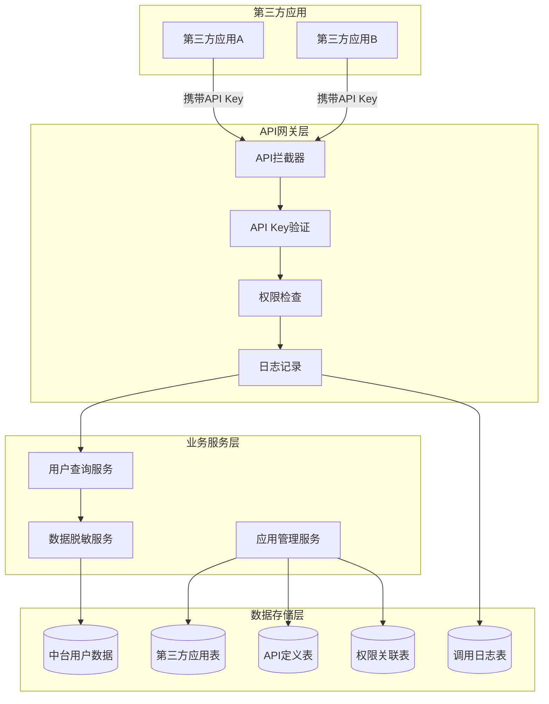
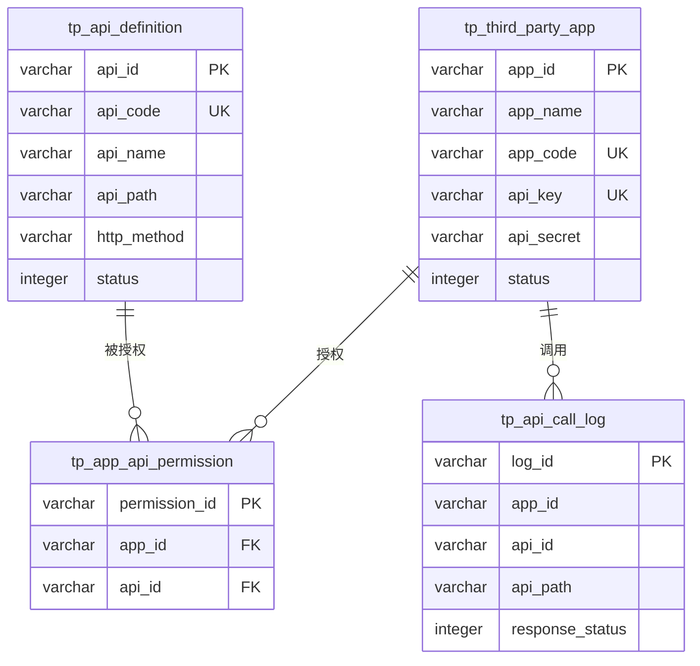
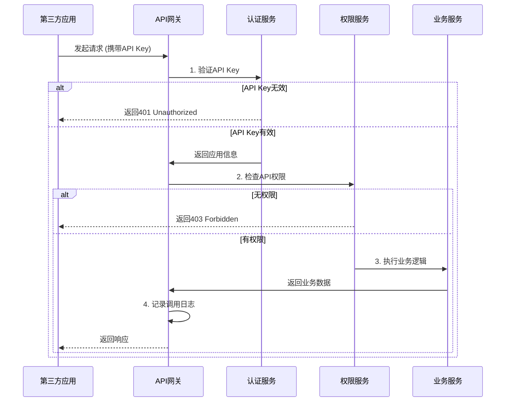
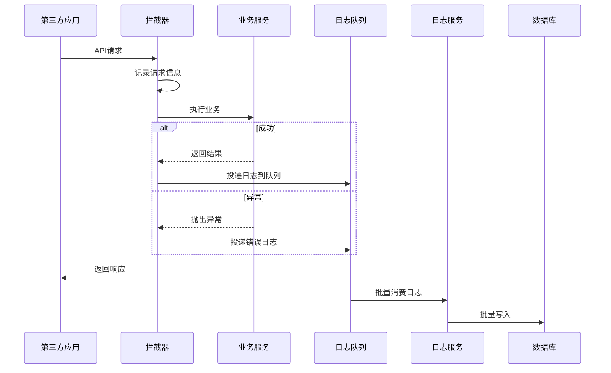

# API接口管理功能设计文档

## 1. 需求概述

### 1.1 功能背景
系统需要为第三方应用提供API接口访问能力，允许外部系统调用中台的用户信息查询等功能。第三方应用通过API Key进行身份认证，系统需要对API访问进行权限控制和日志记录。

### 1.2 核心需求

**需求1.8.1 - 提供标准API接口供第三方应用调用进行身份校验**
- 采用API Key方式进行身份认证
- 在中台内创建第三方应用及其API Key的管理功能
- 提供前端管理页面（列表、新增、编辑、删除），参考标签管理页面风格

**需求1.8.2 - 提供安全的API接口查询脱敏用户信息**
- 提供RESTful风格的用户信息查询API
- API返回的是中台用户数据（tp_person_basicinfo等表），非Keycloak用户
- Keycloak仅用于第三方应用的认证，不作为用户数据源
- 敏感信息需要脱敏处理

**需求1.8.3 - 对API调用进行权限控制和日志记录**
- 维护一个可供第三方调用的API清单
- 在应用管理页面提供API权限勾选功能
- 第三方应用只能访问被授权的API
- 记录所有第三方API调用日志

### 1.3 设计目标
- 简单、实用的API Key管理方案
- 清晰的权限控制机制
- 完整的访问日志记录
- 友好的前端管理界面

---

## 2. 系统架构设计

### 2.1 整体架构



### 2.2 核心组件说明

| 组件名称 | 职责描述 | 关键技术 |
|---------|---------|---------|
| API拦截器 | 拦截所有第三方API请求 | Spring AOP |
| API Key验证 | 验证请求中的API Key有效性 | 自定义拦截器 |
| 权限检查 | 检查应用是否有权访问该API | 权限验证逻辑 |
| 日志记录 | 异步记录API调用日志 | 异步线程池 |
| 数据脱敏 | 对敏感字段进行脱敏处理 | 脱敏工具类 |

---

## 3. 数据模型设计

### 3.1 第三方应用表 (tp_third_party_app)

用于存储第三方应用的基本信息和API Key。

| 字段名 | 数据类型 | 长度 | 允许空 | 说明 |
|-------|---------|-----|-------|------|
| app_id | VARCHAR | 19 | 否 | 应用ID（主键） |
| app_name | VARCHAR | 100 | 否 | 应用名称 |
| app_code | VARCHAR | 50 | 否 | 应用编码（唯一） |
| api_key | VARCHAR | 64 | 否 | API密钥（UUID） |
| api_secret | VARCHAR | 128 | 否 | API密钥（加密存储） |
| status | INTEGER | - | 否 | 状态（1:启用 0:禁用） |
| expire_time | VARCHAR | 14 | 是 | 过期时间（yyyyMMddHHmmss） |
| description | TEXT | - | 是 | 应用描述 |
| contact_person | VARCHAR | 50 | 是 | 联系人 |
| contact_phone | VARCHAR | 20 | 是 | 联系电话 |
| contact_email | VARCHAR | 100 | 是 | 联系邮箱 |
| ip_whitelist | TEXT | - | 是 | IP白名单（逗号分隔） |
| rate_limit | INTEGER | - | 否 | 限流配置（次/秒），默认100 |
| actived | INTEGER | - | 否 | 是否有效（1:有效 0:无效） |
| creator | VARCHAR | 19 | 否 | 创建人 |
| create_time | VARCHAR | 14 | 否 | 创建时间 |
| updator | VARCHAR | 19 | 是 | 修改人 |
| update_time | VARCHAR | 14 | 是 | 修改时间 |
| tenant_id | VARCHAR | 19 | 是 | 租户ID |

**索引设计**
- PRIMARY KEY: app_id
- UNIQUE INDEX: app_code
- UNIQUE INDEX: api_key
- INDEX: status, actived

### 3.2 API定义表 (tp_api_definition)

维护系统中所有可供第三方调用的API清单。

| 字段名 | 数据类型 | 长度 | 允许空 | 说明 |
|-------|---------|-----|-------|------|
| api_id | VARCHAR | 19 | 否 | API ID（主键） |
| api_code | VARCHAR | 50 | 否 | API编码（唯一） |
| api_name | VARCHAR | 100 | 否 | API名称 |
| api_path | VARCHAR | 200 | 否 | API路径（如:/api/v1/users/{id}） |
| http_method | VARCHAR | 10 | 否 | HTTP方法（GET/POST等） |
| category | VARCHAR | 50 | 是 | API分类 |
| description | TEXT | - | 是 | API描述 |
| is_sensitive | INTEGER | - | 否 | 是否敏感接口（1:是 0:否） |
| require_secret | INTEGER | - | 否 | 是否需要签名验证（1:是 0:否） |
| status | INTEGER | - | 否 | 状态（1:启用 0:禁用） |
| order_index | DOUBLE | - | 否 | 排序序号 |
| actived | INTEGER | - | 否 | 是否有效（1:有效 0:无效） |
| creator | VARCHAR | 19 | 否 | 创建人 |
| create_time | VARCHAR | 14 | 否 | 创建时间 |
| updator | VARCHAR | 19 | 是 | 修改人 |
| update_time | VARCHAR | 14 | 是 | 修改时间 |

**索引设计**
- PRIMARY KEY: api_id
- UNIQUE INDEX: api_code
- INDEX: api_path, http_method
- INDEX: category, status

### 3.3 应用API权限关联表 (tp_app_api_permission)

存储第三方应用与API的授权关系。

| 字段名 | 数据类型 | 长度 | 允许空 | 说明 |
|-------|---------|-----|-------|------|
| permission_id | VARCHAR | 19 | 否 | 权限ID（主键） |
| app_id | VARCHAR | 19 | 否 | 应用ID（外键） |
| api_id | VARCHAR | 19 | 否 | API ID（外键） |
| creator | VARCHAR | 19 | 否 | 创建人 |
| create_time | VARCHAR | 14 | 否 | 创建时间 |

**索引设计**
- PRIMARY KEY: permission_id
- UNIQUE INDEX: app_id, api_id（联合唯一索引）
- INDEX: app_id
- INDEX: api_id

### 3.4 API调用日志表 (tp_api_call_log)

记录所有第三方API的调用日志。

| 字段名 | 数据类型 | 长度 | 允许空 | 说明 |
|-------|---------|-----|-------|------|
| log_id | VARCHAR | 19 | 否 | 日志ID（主键） |
| app_id | VARCHAR | 19 | 否 | 应用ID |
| app_name | VARCHAR | 100 | 是 | 应用名称（冗余） |
| api_id | VARCHAR | 19 | 是 | API ID |
| api_path | VARCHAR | 200 | 否 | 请求路径 |
| http_method | VARCHAR | 10 | 否 | HTTP方法 |
| request_ip | VARCHAR | 50 | 是 | 请求IP |
| request_params | TEXT | - | 是 | 请求参数（脱敏） |
| response_status | INTEGER | - | 否 | 响应状态码 |
| response_time | INTEGER | - | 是 | 响应时间（毫秒） |
| error_message | TEXT | - | 是 | 错误信息 |
| call_time | VARCHAR | 14 | 否 | 调用时间 |
| tenant_id | VARCHAR | 19 | 是 | 租户ID |

**索引设计**
- PRIMARY KEY: log_id
- INDEX: app_id, call_time
- INDEX: api_id, call_time
- INDEX: response_status
- INDEX: call_time（用于日志清理）

### 3.5 数据库表关系



---

## 4. 功能详细设计

### 4.1 第三方应用管理（需求1.8.1）

#### 4.1.1 管理后台页面设计

参考标签管理页面风格，提供统一的管理界面。

**页面结构**

| 区域 | 功能说明 |
|-----|---------|
| 顶部搜索栏 | 应用名称、应用编码、状态筛选 |
| 操作按钮 | 新增应用 |
| 数据列表 | 展示应用列表，支持编辑、删除、查看权限 |
| 分页组件 | 支持分页浏览 |

**列表字段**

| 字段名 | 显示内容 | 说明 |
|-------|---------|------|
| 应用名称 | app_name | - |
| 应用编码 | app_code | - |
| API Key | api_key | 显示前8位+*** |
| 状态 | status | 启用/禁用（带颜色标签） |
| 过期时间 | expire_time | 格式化显示 |
| 创建时间 | create_time | 格式化显示 |
| 操作 | - | 编辑、删除、权限配置、查看密钥 |

#### 4.1.2 新增/编辑应用功能

**表单字段**

| 字段 | 类型 | 必填 | 校验规则 | 说明 |
|-----|------|------|---------|------|
| 应用名称 | 文本框 | 是 | 长度1-100 | - |
| 应用编码 | 文本框 | 是 | 字母数字下划线，唯一 | 不可修改 |
| 应用描述 | 文本域 | 否 | 长度0-500 | - |
| 联系人 | 文本框 | 否 | 长度0-50 | - |
| 联系电话 | 文本框 | 否 | 手机号格式 | - |
| 联系邮箱 | 文本框 | 否 | 邮箱格式 | - |
| 状态 | 单选按钮 | 是 | 启用/禁用 | - |
| 过期时间 | 日期选择器 | 否 | 不早于当前 | 为空表示永不过期 |
| IP白名单 | 文本域 | 否 | IP格式，逗号分隔 | 示例:192.168.1.1,192.168.1.2 |
| 限流配置 | 数字框 | 否 | 正整数，默认100 | 单位:次/秒 |

**业务规则**

| 场景 | 规则说明 |
|-----|---------|
| 新增应用 | 自动生成API Key（UUID格式）和API Secret（加密存储） |
| 编辑应用 | API Key和Secret不允许修改，需通过"重置密钥"功能 |
| 删除应用 | 逻辑删除（actived=0），同时删除权限关联 |
| 重置密钥 | 重新生成API Key和Secret，需二次确认 |
| 查看密钥 | 弹窗显示完整的API Key和Secret，仅一次，需操作员身份验证 |

#### 4.1.3 后端接口设计

##### 接口A: 分页查询应用列表

| 项目 | 内容 |
|-----|------|
| 接口路径 | GET /api/admin/third-party-apps |
| 功能描述 | 分页查询第三方应用列表 |
| 权限要求 | 需要管理员权限 |

**请求参数**

| 参数名 | 类型 | 必填 | 说明 |
|-------|------|------|------|
| appName | String | 否 | 应用名称（模糊查询） |
| appCode | String | 否 | 应用编码（模糊查询） |
| status | Integer | 否 | 状态筛选 |
| page | Integer | 否 | 页码，默认1 |
| size | Integer | 否 | 每页条数，默认20 |

**响应结构**

```json
{
  "success": true,
  "data": {
    "total": 50,
    "records": [
      {
        "appId": "1234567890123456789",
        "appName": "外部系统A",
        "appCode": "external_system_a",
        "apiKey": "abc12345***",
        "status": 1,
        "expireTime": "20251231235959",
        "contactPerson": "张三",
        "contactPhone": "13800138000",
        "rateLimit": 100,
        "createTime": "20250115100000",
        "createPersonName": "管理员"
      }
    ]
  }
}
```

##### 接口B: 新增应用

| 项目 | 内容 |
|-----|------|
| 接口路径 | POST /api/admin/third-party-apps |
| 功能描述 | 新增第三方应用 |
| 权限要求 | 需要管理员权限 |

**请求体**

```json
{
  "appName": "外部系统A",
  "appCode": "external_system_a",
  "description": "系统描述",
  "contactPerson": "张三",
  "contactPhone": "13800138000",
  "contactEmail": "zhangsan@example.com",
  "status": 1,
  "expireTime": "20251231235959",
  "ipWhitelist": "192.168.1.1,192.168.1.2",
  "rateLimit": 100
}
```

**响应结构**

```json
{
  "success": true,
  "data": {
    "appId": "1234567890123456789",
    "apiKey": "a1b2c3d4-e5f6-7890-abcd-ef1234567890",
    "apiSecret": "secret_1234567890abcdefghijklmnopqrstuvwxyz",
    "message": "应用创建成功，请妥善保管API密钥，密钥仅显示一次"
  }
}
```

##### 接口C: 更新应用

| 项目 | 内容 |
|-----|------|
| 接口路径 | PUT /api/admin/third-party-apps/{appId} |
| 功能描述 | 更新第三方应用信息 |
| 权限要求 | 需要管理员权限 |

##### 接口D: 删除应用

| 项目 | 内容 |
|-----|------|
| 接口路径 | DELETE /api/admin/third-party-apps/{appId} |
| 功能描述 | 删除第三方应用（逻辑删除） |
| 权限要求 | 需要管理员权限 |

##### 接口E: 重置密钥

| 项目 | 内容 |
|-----|------|
| 接口路径 | POST /api/admin/third-party-apps/{appId}/reset-secret |
| 功能描述 | 重置应用的API密钥 |
| 权限要求 | 需要管理员权限 |

**响应结构**

```json
{
  "success": true,
  "data": {
    "apiKey": "new-api-key",
    "apiSecret": "new-api-secret",
    "message": "密钥已重置，请妥善保管新密钥"
  }
}
```

### 4.2 API权限管理（需求1.8.3）

#### 4.2.1 API清单管理

**API清单初始化**

系统需要预定义可供第三方调用的API清单，存储在tp_api_definition表中。

**初始API清单**

| API编码 | API名称 | API路径 | HTTP方法 | 分类 | 是否敏感 |
|--------|---------|---------|---------|------|---------|
| api_user_query | 查询用户信息 | /open-api/v1/users/{personId} | GET | 用户管理 | 是 |
| api_user_list | 用户列表查询 | /open-api/v1/users | GET | 用户管理 | 是 |
| api_user_search | 搜索用户 | /open-api/v1/users/search | POST | 用户管理 | 是 |
| api_dept_query | 查询部门信息 | /open-api/v1/departments/{deptId} | GET | 组织管理 | 否 |
| api_dept_tree | 部门树查询 | /open-api/v1/departments/tree | GET | 组织管理 | 否 |

#### 4.2.2 权限配置页面

在应用编辑页面或独立的权限配置页面，提供API权限勾选功能。

**页面布局**

```
┌─────────────────────────────────────────┐
│ 应用: 外部系统A                          │
│ API Key: abc12345***                    │
├─────────────────────────────────────────┤
│ API权限配置                              │
│                                         │
│ 用户管理                                 │
│ ☑ 查询用户信息                           │
│ ☑ 用户列表查询                           │
│ ☐ 搜索用户                               │
│                                         │
│ 组织管理                                 │
│ ☑ 查询部门信息                           │
│ ☐ 部门树查询                             │
│                                         │
│ [全选] [反选] [保存]                     │
└─────────────────────────────────────────┘
```

**功能说明**

| 功能 | 说明 |
|-----|------|
| 按分类展示 | API按category分组展示 |
| 复选框勾选 | 勾选表示授予权限 |
| 敏感标识 | 敏感API标记红色图标 |
| 批量操作 | 全选、反选功能 |
| 保存 | 批量保存权限配置 |

#### 4.2.3 权限配置接口

##### 接口F: 查询应用已授权API

| 项目 | 内容 |
|-----|------|
| 接口路径 | GET /api/admin/third-party-apps/{appId}/permissions |
| 功能描述 | 查询应用已授权的API列表 |
| 权限要求 | 需要管理员权限 |

**响应结构**

```json
{
  "success": true,
  "data": {
    "appId": "1234567890123456789",
    "appName": "外部系统A",
    "permissions": [
      {
        "apiId": "api_001",
        "apiCode": "api_user_query",
        "apiName": "查询用户信息",
        "apiPath": "/open-api/v1/users/{personId}",
        "httpMethod": "GET",
        "category": "用户管理",
        "isSensitive": 1
      }
    ]
  }
}
```

##### 接口G: 批量保存API权限

| 项目 | 内容 |
|-----|------|
| 接口路径 | POST /api/admin/third-party-apps/{appId}/permissions |
| 功能描述 | 批量保存应用的API权限 |
| 权限要求 | 需要管理员权限 |

**请求体**

```json
{
  "apiIds": ["api_001", "api_002", "api_003"]
}
```

**业务逻辑**
1. 删除该应用的所有现有权限
2. 批量插入新的权限关联记录

### 4.3 第三方API接口（需求1.8.2）

#### 4.3.1 API认证机制

所有第三方API请求必须在HTTP Header中携带API Key：

```
Authorization: Bearer ${API_KEY}
```

**认证流程**



#### 4.3.2 用户信息查询API

##### 接口H: 查询单个用户信息

| 项目 | 内容 |
|-----|------|
| 接口路径 | GET /open-api/v1/users/{personId} |
| 功能描述 | 查询指定用户的脱敏信息 |
| 认证方式 | Header: Authorization |
| 数据来源 | tp_person_basicinfo等中台表 |

**路径参数**

| 参数名 | 类型 | 说明 |
|-------|------|------|
| personId | String | 人员ID |

**响应结构**

```json
{
  "success": true,
  "data": {
    "personId": "1234567890123456789",
    "personName": "张*",
    "personNo": "P001***",
    "sex": 1,
    "sexName": "男",
    "phone": "138****5678",
    "email": "z***@example.com",
    "deptId": "dept_001",
    "deptName": "技术部",
    "status": 1,
    "createTime": "20200101120000"
  }
}
```

##### 接口I: 用户列表查询

| 项目 | 内容 |
|-----|------|
| 接口路径 | GET /open-api/v1/users |
| 功能描述 | 分页查询用户列表 |
| 认证方式 | Header: Authorization |

**查询参数**

| 参数名 | 类型 | 必填 | 说明 |
|-------|------|------|------|
| deptId | String | 否 | 部门ID筛选 |
| page | Integer | 否 | 页码，默认1 |
| size | Integer | 否 | 每页条数，默认20，最大100 |

**响应结构**

```json
{
  "success": true,
  "data": {
    "total": 100,
    "records": [
      {
        "personId": "1234567890123456789",
        "personName": "张*",
        "phone": "138****5678",
        "deptName": "技术部"
      }
    ]
  }
}
```

##### 接口J: 搜索用户

| 项目 | 内容 |
|-----|------|
| 接口路径 | POST /open-api/v1/users/search |
| 功能描述 | 根据条件搜索用户 |
| 认证方式 | Header: Authorization |

**请求体**

```json
{
  "keyword": "张",
  "deptId": "dept_001",
  "page": 1,
  "size": 20
}
```

#### 4.3.3 数据脱敏规则

| 字段类型 | 原始数据示例 | 脱敏规则 | 脱敏结果 |
|---------|-------------|---------|---------|
| 姓名 | 张三 | 保留姓氏，其他替换为* | 张* |
| 姓名 | 欧阳峰 | 保留姓氏，其他替换为* | 欧阳* |
| 手机号 | 13812345678 | 保留前3后4位，中间4位*** | 138****5678 |
| 邮箱 | zhangsan@example.com | 用户名保留首尾，域名完整 | z***n@example.com |
| 身份证号 | 110101199001011234 | 保留前6后4位 | 110101********1234 |
| 工号 | P001234 | 保留前4位 | P001*** |
| 地址 | 北京市朝阳区xx路xx号 | 保留到区级 | 北京市朝阳区*** |

**脱敏工具类设计**

脱敏逻辑通过独立的工具类实现，方便复用和维护。

| 方法名 | 功能说明 |
|-------|---------|
| maskName(String name) | 姓名脱敏 |
| maskPhone(String phone) | 手机号脱敏 |
| maskEmail(String email) | 邮箱脱敏 |
| maskIdCard(String idCard) | 身份证号脱敏 |
| maskEmployeeNo(String no) | 工号脱敏 |
| maskAddress(String address) | 地址脱敏 |

### 4.4 调用日志记录（需求1.8.3）

#### 4.4.1 日志记录策略

| 记录时机 | 记录内容 | 存储方式 |
|---------|---------|---------|
| 请求到达 | 请求参数、请求IP | 内存暂存 |
| 响应返回 | 响应状态、响应时间 | 异步写入数据库 |
| 发生异常 | 异常堆栈信息 | 异步写入数据库 |

**日志记录流程**



#### 4.4.2 日志查询接口

##### 接口K: 分页查询调用日志

| 项目 | 内容 |
|-----|------|
| 接口路径 | GET /api/admin/api-call-logs |
| 功能描述 | 分页查询API调用日志 |
| 权限要求 | 需要管理员权限 |

**查询参数**

| 参数名 | 类型 | 必填 | 说明 |
|-------|------|------|------|
| appId | String | 否 | 应用ID |
| apiId | String | 否 | API ID |
| responseStatus | Integer | 否 | 响应状态码 |
| startTime | String | 否 | 开始时间 |
| endTime | String | 否 | 结束时间 |
| page | Integer | 否 | 页码 |
| size | Integer | 否 | 每页条数 |

**响应结构**

```json
{
  "success": true,
  "data": {
    "total": 1000,
    "records": [
      {
        "logId": "log_001",
        "appName": "外部系统A",
        "apiPath": "/open-api/v1/users/123",
        "httpMethod": "GET",
        "requestIp": "192.168.1.100",
        "responseStatus": 200,
        "responseTime": 150,
        "callTime": "20250115103000"
      }
    ]
  }
}
```

##### 接口L: 调用统计

| 项目 | 内容 |
|-----|------|
| 接口路径 | GET /api/admin/api-call-logs/statistics |
| 功能描述 | 获取API调用统计数据 |
| 权限要求 | 需要管理员权限 |

**响应结构**

```json
{
  "success": true,
  "data": {
    "totalCalls": 10000,
    "successCalls": 9800,
    "failedCalls": 200,
    "avgResponseTime": 120,
    "topApps": [
      {
        "appName": "外部系统A",
        "callCount": 5000
      }
    ],
    "topApis": [
      {
        "apiName": "查询用户信息",
        "callCount": 3000
      }
    ]
  }
}
```

---

## 5. 安全加固措施

### 5.1 API Key安全

| 安全措施 | 实施方式 | 目的 |
|---------|---------|------|
| Secret加密存储 | 使用BCrypt加密存储API Secret | 防止数据库泄露 |
| Key唯一性 | UUID生成，保证全局唯一 | 避免冲突 |
| 密钥仅显示一次 | 创建/重置时仅返回一次明文 | 防止泄露 |
| 过期时间 | 可配置密钥过期时间 | 定期更新 |
| IP白名单 | 验证请求来源IP | 限制访问来源 |

### 5.2 访问控制

| 控制维度 | 控制方式 | 说明 |
|---------|---------|------|
| 应用级 | 验证API Key是否有效 | 第一层防护 |
| 权限级 | 检查应用是否有API权限 | 第二层防护 |
| 限流级 | 根据rate_limit配置限流 | 防止滥用 |
| 状态级 | 检查应用和API是否启用 | 动态控制 |

### 5.3 限流策略

**基于Token Bucket算法的限流**

| 限流维度 | 配置方式 | 默认值 |
|---------|---------|-------|
| 单应用总QPS | tp_third_party_app.rate_limit | 100次/秒 |
| 单IP QPS | 配置文件 | 50次/秒 |
| 全局QPS | 配置文件 | 10000次/秒 |

**限流响应**

当触发限流时，返回HTTP 429状态码：

```json
{
  "success": false,
  "message": "请求过于频繁，请稍后重试",
  "errorCode": "RATE_LIMIT_EXCEEDED"
}
```

### 5.4 敏感信息保护

| 保护对象 | 保护措施 |
|---------|---------|
| API Secret | BCrypt加密存储 |
| 用户手机号 | 返回时自动脱敏 |
| 用户身份证 | 返回时自动脱敏 |
| 用户邮箱 | 返回时自动脱敏 |
| 请求参数 | 日志中敏感字段脱敏 |

---

## 6. 实施方案

### 6.1 开发任务分解

| 序号 | 任务模块 | 任务内容 | 预估工时 | 依赖项 |
|-----|---------|---------|---------|-------|
| **阶段1: 数据库设计** | | | | |
| 1.1 | 数据建模 | 设计4张表结构 | 0.5人日 | - |
| 1.2 | SQL脚本 | 编写建表SQL | 0.5人日 | 1.1 |
| 1.3 | 初始数据 | 准备API清单初始数据 | 0.5人日 | 1.2 |
| **阶段2: 后端开发** | | | | |
| 2.1 | Entity/Mapper | 生成实体类和Mapper | 1人日 | 1.2 |
| 2.2 | 应用管理Service | CRUD业务逻辑 | 2人日 | 2.1 |
| 2.3 | 应用管理Controller | 管理接口 | 1.5人日 | 2.2 |
| 2.4 | 权限管理Service | 权限配置逻辑 | 1.5人日 | 2.1 |
| 2.5 | 权限管理Controller | 权限接口 | 1人日 | 2.4 |
| 2.6 | API Key拦截器 | 认证拦截器 | 1.5人日 | 2.2 |
| 2.7 | 权限验证拦截器 | 权限检查拦截器 | 1.5人日 | 2.4 |
| 2.8 | 日志记录拦截器 | 日志记录AOP | 1人日 | 2.1 |
| 2.9 | 脱敏工具类 | 数据脱敏实现 | 1人日 | - |
| 2.10 | 开放API接口 | 用户查询接口 | 2人日 | 2.9 |
| 2.11 | 日志查询Service | 日志查询逻辑 | 1人日 | 2.1 |
| 2.12 | 日志查询Controller | 日志查询接口 | 0.5人日 | 2.11 |
| 2.13 | 限流实现 | 基于Redis的限流 | 1.5人日 | 2.6 |
| **阶段3: 前端开发** | | | | |
| 3.1 | 应用列表页面 | 参考标签管理风格 | 2人日 | 2.3 |
| 3.2 | 应用新增/编辑页面 | 表单页面 | 2人日 | 2.3 |
| 3.3 | 权限配置页面 | API权限勾选 | 2人日 | 2.5 |
| 3.4 | 日志查询页面 | 日志列表和统计 | 1.5人日 | 2.12 |
| 3.5 | API清单管理页面 | API定义管理（可选） | 1人日 | 后端接口 |
| **阶段4: 测试部署** | | | | |
| 4.1 | 单元测试 | 核心逻辑测试 | 2人日 | 全部后端 |
| 4.2 | 集成测试 | 接口联调测试 | 2人日 | 全部开发 |
| 4.3 | 安全测试 | 权限、限流测试 | 1人日 | 全部开发 |
| 4.4 | 文档编写 | 接入文档、使用手册 | 1人日 | 全部开发 |

**总计**: 约32人日

### 6.2 技术实现要点

#### 6.2.1 后端技术栈

| 技术组件 | 用途 | 版本要求 |
|---------|------|---------|
| Spring Boot | 基础框架 | 当前版本 |
| MyBatis | 持久层框架 | 当前版本 |
| Redis | 缓存、限流 | 当前版本 |
| Spring AOP | 日志拦截 | 当前版本 |
| Hutool | 工具类库 | 5.x |

#### 6.2.2 前端技术栈

| 技术组件 | 用途 |
|---------|------|
| Vue2.6.12 | 前端框架 |
| fb-ui | UI组件库 |
| Axios | HTTP客户端 |

#### 6.2.3 核心代码结构

```
ps-be/src/main/java/com/jiuxi/
├── admin/core/
│   ├── bean/
│   │   ├── entity/
│   │   │   ├── TpThirdPartyApp.java
│   │   │   ├── TpApiDefinition.java
│   │   │   ├── TpAppApiPermission.java
│   │   │   └── TpApiCallLog.java
│   │   ├── vo/
│   │   │   ├── TpThirdPartyAppVO.java
│   │   │   └── TpApiCallLogVO.java
│   │   └── query/
│   │       └── TpThirdPartyAppQuery.java
│   ├── mapper/
│   │   ├── TpThirdPartyAppMapper.java
│   │   ├── TpApiDefinitionMapper.java
│   │   ├── TpAppApiPermissionMapper.java
│   │   └── TpApiCallLogMapper.java
│   ├── service/
│   │   ├── TpThirdPartyAppService.java
│   │   ├── TpApiPermissionService.java
│   │   └── TpApiCallLogService.java
│   ├── controller/
│   │   ├── TpThirdPartyAppController.java  # 管理后台接口
│   │   └── TpApiCallLogController.java
│   └── interceptor/
│       ├── ApiKeyInterceptor.java  # API Key验证
│       ├── ApiPermissionInterceptor.java  # 权限检查
│       └── ApiCallLogInterceptor.java  # 日志记录
├── openapi/  # 新增模块
│   ├── controller/
│   │   └── OpenApiUserController.java  # 开放API接口
│   ├── service/
│   │   └── OpenApiUserService.java
│   └── util/
│       ├── DataMaskUtil.java  # 脱敏工具类
│       └── RateLimiter.java  # 限流工具类
```

### 6.3 部署配置

#### 6.3.1 数据库部署

在现有数据库中执行建表SQL脚本，创建4张新表。

#### 6.3.2 应用配置

在 `application.yml` 中新增配置：

```yaml
# 开放API配置
open-api:
  enabled: true  # 是否启用开放API
  rate-limit:
    enabled: true  # 是否启用限流
    global-qps: 10000  # 全局QPS限制
    ip-qps: 50  # 单IP QPS限制
  log:
    async: true  # 异步记录日志
    batch-size: 100  # 批量写入大小
    retention-days: 90  # 日志保留天数
  security:
    ip-whitelist-enabled: true  # 是否启用IP白名单
    require-https: false  # 是否强制HTTPS（生产环境建议true）
```

#### 6.3.3 Redis配置

复用现有Redis配置，用于限流和缓存。

---

## 7. 测试方案

### 7.1 功能测试

| 测试模块 | 测试场景 | 预期结果 |
|---------|---------|---------|
| 应用管理 | 新增应用 | 生成API Key和Secret |
| 应用管理 | 编辑应用 | 信息更新成功 |
| 应用管理 | 删除应用 | 逻辑删除，关联权限同步删除 |
| 应用管理 | 重置密钥 | 生成新密钥，旧密钥失效 |
| 权限管理 | 勾选API权限 | 权限保存成功 |
| 权限管理 | 取消API权限 | 权限移除成功 |
| API调用 | 携带有效API Key | 调用成功，返回脱敏数据 |
| API调用 | 携带无效API Key | 返回401 |
| API调用 | 访问无权限API | 返回403 |
| API调用 | 超过限流阈值 | 返回429 |
| 数据脱敏 | 查询用户信息 | 敏感字段已脱敏 |
| 日志记录 | API调用 | 日志记录完整 |

### 7.2 性能测试

| 测试指标 | 测试方法 | 目标值 |
|---------|---------|-------|
| 单API响应时间 | JMeter压测 | P95 < 200ms |
| 并发支持能力 | 模拟100并发 | 成功率 > 99% |
| 限流准确性 | 超出配置QPS | 准确触发限流 |
| 日志写入性能 | 高并发场景 | 不影响API响应时间 |

### 7.3 安全测试

| 测试场景 | 测试方法 | 预期结果 |
|---------|---------|---------|
| API Key篡改 | 修改Key值 | 返回401 |
| 无API Key | 不传Header | 返回401 |
| SQL注入 | 构造恶意参数 | 安全拦截 |
| XSS攻击 | 构造脚本参数 | 安全拦截 |
| 权限越权 | 访问未授权API | 返回403 |

---

## 8. 第三方接入指南

### 8.1 接入流程


### 8.2 快速接入示例

#### 8.2.1 Java示例

```java
// 此处展示接入示例的伪代码逻辑描述，不提供真实代码

接入步骤：
1. 在HTTP请求头中添加API Key
2. 构造请求URL和参数
3. 发起HTTP GET或POST请求
4. 解析JSON响应结果
5. 处理错误码

关键配置：
- 请求头字段名: Authorization
- 超时时间建议: 30秒
- 重试策略: 失败重试3次
- 错误处理: 根据HTTP状态码和业务错误码处理
```

#### 8.2.2 Python示例

```python
# 此处展示接入示例的伪代码逻辑描述，不提供真实代码

接入步骤：
1. 安装requests库
2. 设置请求头，包含API Key
3. 发起HTTP请求
4. 解析JSON响应
5. 异常处理

关键配置：
- 请求头: {"Authorization": "Bearer your-api-key"}
- 超时: 30秒
- 重试: 使用requests.adapters.HTTPAdapter配置重试
```

### 8.3 常见错误码

| HTTP状态码 | 错误码 | 错误信息 | 处理建议 |
|-----------|-------|---------|---------|
| 400 | INVALID_PARAM | 参数错误 | 检查请求参数格式 |
| 401 | INVALID_API_KEY | API Key无效 | 检查API Key是否正确 |
| 401 | API_KEY_EXPIRED | API Key已过期 | 联系管理员更新密钥 |
| 403 | NO_PERMISSION | 无权限访问 | 联系管理员分配权限 |
| 404 | RESOURCE_NOT_FOUND | 资源不存在 | 检查请求的资源ID |
| 429 | RATE_LIMIT_EXCEEDED | 请求过于频繁 | 降低请求频率 |
| 500 | INTERNAL_ERROR | 服务器错误 | 联系技术支持 |

### 8.4 最佳实践

| 实践项 | 建议 |
|-------|------|
| API Key保护 | 不要在前端代码中暴露API Key |
| 缓存策略 | 对不常变化的数据进行缓存 |
| 错误重试 | 实现指数退避的重试策略 |
| 日志记录 | 记录请求和响应日志便于排查问题 |
| 超时设置 | 设置合理的超时时间，避免长时间等待 |

---

## 9. 运维监控

### 9.1 监控指标

| 指标类型 | 指标名称 | 告警阈值 | 说明 |
|---------|---------|---------|------|
| 可用性 | API成功率 | < 99% | 应用级监控 |
| 性能 | 响应时间P95 | > 500ms | 性能监控 |
| 安全 | 401错误次数 | > 100次/分钟 | 可能存在攻击 |
| 安全 | 403错误次数 | > 50次/分钟 | 可能存在越权尝试 |
| 限流 | 429错误次数 | > 1000次/分钟 | 某应用请求过载 |
| 容量 | 日志表记录数 | > 1亿条 | 需要归档清理 |

### 9.2 日志清理策略

| 清理策略 | 配置 |
|---------|------|
| 保留时长 | 90天（可配置） |
| 清理频率 | 每天凌晨2点 |
| 清理方式 | 删除90天前的日志记录 |
| 归档 | 重要日志可归档到对象存储 |

### 9.3 应急预案

| 场景 | 处理措施 |
|-----|---------|
| API大面积超时 | 1. 检查数据库连接<br>2. 检查Redis状态<br>3. 增加限流保护 |
| 某应用滥用API | 1. 临时禁用该应用<br>2. 降低其限流配置<br>3. 联系应用方沟通 |
| 日志表过大 | 1. 手动执行清理脚本<br>2. 分表或归档历史数据 |
| API Key泄露 | 1. 立即重置密钥<br>2. 通知应用方更新配置<br>3. 审查日志排查异常调用 |

---

## 10. 后续演进方向

| 演进方向 | 优先级 | 说明 |
|---------|-------|------|
| API版本管理 | P1 | 支持v1、v2等多版本API共存 |
| 签名验证 | P1 | 对敏感API增加请求签名验证 |
| WebHook通知 | P2 | 数据变更主动通知第三方 |
| API文档生成 | P2 | 集成Swagger自动生成API文档 |
| SDK封装 | P2 | 提供Java、Python等语言SDK |
| GraphQL支持 | P3 | 允许灵活查询字段 |
| 自助管理平台 | P3 | 第三方自助申请和管理API Key |
| API市场 | P3 | 提供API商店模式 |

---

## 11. 附录

### 11.1 数据库建表SQL

建表SQL脚本参考路径：`ps-be/sql/third_party_api_management.sql`

建议包含以下内容：
- 4张表的CREATE TABLE语句
- 索引创建语句
- 初始API清单数据INSERT语句
- 表和字段注释

### 11.2 参考文档

| 文档名称 | 说明 |
|---------|------|
| 标签管理功能 | 参考前端页面风格 |
| tp_person_basicinfo表结构 | 用户数据来源 |
| 现有API接口清单 | 确定开放哪些API |

### 11.3 名词解释

| 名词 | 解释 |
|-----|------|
| API Key | 用于识别第三方应用身份的唯一密钥 |
| API Secret | 用于签名验证的密钥（本期可选） |
| 脱敏 | 对敏感信息进行遮蔽处理，如138****5678 |
| 限流 | 限制单位时间内的请求次数，防止滥用 |
| QPS | Queries Per Second，每秒查询次数 |
