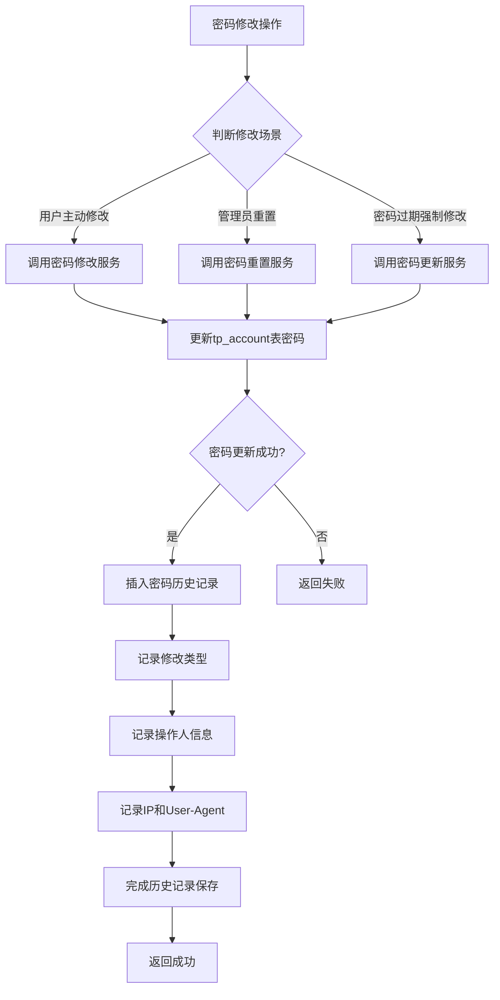
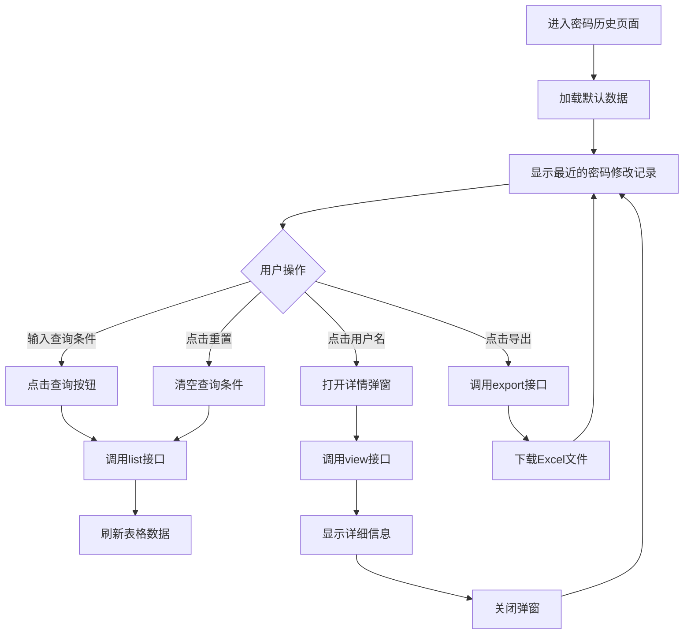

# 密码历史表设计文档

## 一、设计概述

### 1.1 功能目标
为系统建立密码历史记录机制，当用户密码被修改时（包括用户主动修改、管理员重置、密码过期强制修改等场景），自动记录密码变更历史，为后续的密码策略增强（如禁止重复使用最近N次密码）提供数据基础。

### 1.2 设计原则
- 完整性：记录所有场景下的密码修改行为
- 安全性：存储加密后的密码哈希值，不存储明文密码
- 可追溯性：记录修改时间、修改人、修改原因等关键信息
- 独立性：当前阶段作为独立的历史记录功能，不对业务流程产生影响

## 二、数据库设计

### 2.1 表结构设计

**表名：** `tp_password_history`

**表说明：** 密码修改历史记录表

| 字段名 | 数据类型 | 约束 | 默认值 | 说明 |
|--------|---------|------|--------|------|
| history_id | VARCHAR(36) | PRIMARY KEY NOT NULL | - | 历史记录ID，UUID生成 |
| account_id | VARCHAR(36) | NOT NULL | - | 账号ID，关联tp_account.ACCOUNT_ID |
| person_id | VARCHAR(36) | NOT NULL | - | 人员ID，关联tp_account.PERSON_ID |
| username | VARCHAR(100) | NOT NULL | - | 账号用户名（冗余字段，便于查询） |
| password_hash | VARCHAR(256) | NOT NULL | - | 密码哈希值（SM3加密后的密码） |
| change_type | TINYINT(4) | NOT NULL | - | 修改类型：1-用户主动修改 2-管理员重置 3-密码过期强制修改 4-其他 |
| change_reason | VARCHAR(500) | NULL | - | 修改原因说明 |
| changed_by | VARCHAR(36) | NULL | - | 修改操作人ID（用户主动修改时为用户本人，管理员重置时为管理员ID） |
| changed_by_name | VARCHAR(100) | NULL | - | 修改操作人姓名（冗余字段） |
| change_time | DATETIME | NOT NULL | CURRENT_TIMESTAMP | 密码修改时间 |
| ip_address | VARCHAR(50) | NULL | - | 修改操作的IP地址 |
| user_agent | VARCHAR(500) | NULL | - | 修改操作的用户代理信息 |
| tenant_id | VARCHAR(36) | NULL | - | 租户ID（多租户场景） |
| remark | VARCHAR(1000) | NULL | - | 备注信息 |
| created_time | DATETIME | NOT NULL | CURRENT_TIMESTAMP | 记录创建时间 |

### 2.2 索引设计

| 索引名 | 索引类型 | 字段 | 说明 |
|--------|---------|------|------|
| idx_account_id | 普通索引 | account_id | 按账号查询历史记录 |
| idx_person_id | 普通索引 | person_id | 按人员查询历史记录 |
| idx_change_time | 普通索引 | change_time | 按时间范围查询 |
| idx_change_type | 普通索引 | change_type | 按修改类型查询 |
| idx_tenant_id | 普通索引 | tenant_id | 多租户场景下的数据隔离 |
| idx_account_change_time | 复合索引 | account_id, change_time DESC | 查询某账号最近N次密码记录（为未来重复性校验优化） |

### 2.3 字段说明

#### 修改类型枚举值
| 值 | 说明 | 触发场景 |
|----|------|---------|
| 1 | 用户主动修改 | 用户在"修改密码"功能中主动修改 |
| 2 | 管理员重置 | 管理员在管理后台重置用户密码 |
| 3 | 密码过期强制修改 | 密码到期后系统强制用户修改 |
| 4 | 其他 | 其他特殊场景 |

## 三、业务流程设计

### 3.1 密码修改记录流程



### 3.2 历史记录保存时机

密码历史记录应在以下时机保存：

| 触发点 | 服务方法 | 修改类型 | 说明 |
|--------|---------|---------|------|
| 用户主动修改密码 | UserAccountService.updatePwd() | 1 | 用户在个人中心修改密码 |
| 管理员重置密码 | UserAccountService.resetPwd() | 2 | 管理员在后台重置用户密码 |
| 密码过期强制修改 | UserAccountService.updatePwd() | 3 | 根据密码过期策略强制用户修改 |
| 账号新增时设置密码 | UserAccountService.accountManage() | 4 | 新建账号时的初始密码（可选记录） |

## 四、系统集成方案

### 4.1 服务层设计

#### 4.1.1 密码历史服务接口

**接口名称：** PasswordHistoryService

**主要方法：**

| 方法名 | 参数 | 返回值 | 说明 |
|--------|------|--------|------|
| savePasswordHistory | accountId, passwordHash, changeType, changedBy, ipAddress, userAgent | int | 保存密码历史记录 |
| queryByAccountId | accountId, pageNum, pageSize | List&lt;PasswordHistoryVO&gt; | 查询指定账号的密码历史 |
| queryByPersonId | personId, pageNum, pageSize | List&lt;PasswordHistoryVO&gt; | 查询指定人员的密码历史 |
| countByAccountId | accountId | int | 统计某账号的密码历史记录数 |

#### 4.1.2 集成到现有服务

在现有的密码修改相关方法中集成历史记录保存逻辑：

**修改点1：用户主动修改密码**
- 位置：UserAccountServiceImpl.updatePwd()
- 时机：密码更新成功后
- 数据来源：从方法参数和上下文获取

**修改点2：管理员重置密码**
- 位置：UserAccountServiceImpl.resetPwd()
- 时机：密码重置成功后
- 数据来源：从方法参数和JWT token中获取操作人信息

**修改点3：账号管理（新增/修改）**
- 位置：UserAccountServiceImpl.accountManage()
- 时机：密码设置或修改成功后
- 数据来源：从formData和JWT token中获取

### 4.2 数据访问层设计

#### 4.2.1 实体类

**类名：** TpPasswordHistory

**包路径：** com.jiuxi.admin.core.bean.entity

**主要属性：** 参照数据库表结构设计

#### 4.2.2 Mapper接口

**接口名称：** TpPasswordHistoryMapper

**包路径：** com.jiuxi.admin.core.mapper

**主要方法：**

| 方法名 | 参数 | 返回值 | 说明 |
|--------|------|--------|------|
| insert | TpPasswordHistory | int | 插入历史记录 |
| selectByAccountId | accountId | List&lt;TpPasswordHistory&gt; | 查询账号历史 |
| selectByPersonId | personId | List&lt;TpPasswordHistory&gt; | 查询人员历史 |
| countByAccountId | accountId | int | 统计记录数 |

#### 4.2.3 Mapper XML

**文件名：** TpPasswordHistoryMapper.xml

**存放路径：** src/main/resources/mapper/admin/

**主要SQL：**
- 插入密码历史记录
- 根据账号ID查询历史（支持分页，按时间倒序）
- 根据人员ID查询历史（支持分页，按时间倒序）
- 统计历史记录数量

### 4.3 视图对象设计

#### VO对象

**类名：** TpPasswordHistoryVO

**包路径：** com.jiuxi.admin.core.bean.vo

**主要属性：**
- 包含TpPasswordHistory的所有字段
- 新增格式化后的时间字段（用于前端展示）
- 新增修改类型的文本描述

## 五、数据安全设计

### 5.1 密码哈希存储

- 使用与tp_account表一致的加密方式：SM3哈希算法
- 不存储密码明文或可逆加密形式
- 密码哈希值存储后不可解密

### 5.2 访问控制

- 密码历史记录仅供管理员和安全审计人员查询
- 普通用户不能查看自己或他人的密码历史
- 查询操作需要记录审计日志

### 5.3 数据保留策略

当前阶段采用保留所有历史记录的策略，为未来可能的策略变更预留空间：

| 策略类型 | 当前实现 | 未来扩展可能性 |
|---------|---------|--------------|
| 保留数量 | 无限制 | 可配置保留最近N次记录 |
| 保留时长 | 永久保留 | 可配置保留N个月/年 |
| 清理机制 | 无 | 定时清理超期记录 |

## 六、实施步骤

### 6.1 数据库变更

**步骤1：** 创建SQL脚本文件
- 文件名：create_tp_password_history.sql
- 存放位置：ps-be/sql/update/
- 内容：包含表创建、索引创建、注释添加

**步骤2：** 执行数据库变更
- 开发环境先行验证
- 测试环境完整测试
- 生产环境备份后执行

### 6.2 后端代码开发

**步骤1：** 创建实体类和VO类
- TpPasswordHistory（entity）
- TpPasswordHistoryVO（vo）

**步骤2：** 创建Mapper接口和XML
- TpPasswordHistoryMapper（接口）
- TpPasswordHistoryMapper.xml（SQL映射）

**步骤3：** 创建Service层
- PasswordHistoryService（接口）
- PasswordHistoryServiceImpl（实现）

**步骤4：** 集成到现有服务
- 在UserAccountServiceImpl的密码修改相关方法中调用密码历史记录保存

**步骤5：** （可选）创建管理接口
- PasswordHistoryController（用于管理员查询历史记录）

### 6.3 测试验证

**功能测试点：**

| 测试场景 | 验证内容 | 预期结果 |
|---------|---------|---------|
| 用户主动修改密码 | 检查历史记录是否创建，修改类型是否为1 | 创建成功，类型正确 |
| 管理员重置密码 | 检查历史记录是否创建，修改类型是否为2，操作人信息是否正确 | 创建成功，信息完整 |
| 密码过期强制修改 | 检查历史记录是否创建，修改类型是否为3 | 创建成功，类型正确 |
| 密码哈希一致性 | 对比tp_account和tp_password_history中的密码哈希值 | 两者一致 |
| 历史记录查询 | 查询指定账号的历史记录，按时间倒序 | 查询成功，排序正确 |
| 并发修改 | 多次快速修改密码 | 每次修改都生成独立的历史记录 |

## 七、风险与注意事项

### 7.1 潜在风险

| 风险项 | 影响 | 应对措施 |
|--------|------|---------|
| 数据量增长 | 长期使用后表数据量较大 | 预留清理机制扩展点，建立归档策略 |
| 性能影响 | 每次密码修改多一次写操作 | 异步记录（可选）、索引优化 |
| 事务一致性 | 密码更新成功但历史记录失败 | 使用事务保证一致性，记录失败时打印日志 |

### 7.2 开发注意事项

1. **加密一致性**：确保历史表中的密码哈希值与tp_account表使用相同的加密方式（SM3）
2. **时间准确性**：change_time应使用数据库时间而非应用服务器时间，保证时间准确性
3. **租户隔离**：多租户场景下需正确设置tenant_id，确保数据隔离
4. **操作人追踪**：从JWT token或HttpServletRequest中获取操作人信息和IP地址
5. **事务管理**：密码修改和历史记录保存应在同一事务中，保证数据一致性
6. **日志记录**：历史记录保存失败时应记录详细的错误日志，便于问题排查

### 7.3 后续优化方向

1. **密码重复使用检查**：基于历史记录实现"禁止使用最近N次密码"的策略
2. **密码强度趋势分析**：分析用户密码修改模式，优化密码策略
3. **安全审计报告**：定期生成密码修改统计报告
4. **异常检测**：识别异常的密码修改行为（如频繁修改、批量重置等）

## 八、前端界面设计

### 8.1 页面结构

**页面路径：** ps-fe/@fb/admin-base/views/sys/password-history/list.vue

**页面标题：** 密码修改历史

**页面布局：** 采用fb-page-search组件，包含查询区、操作区、表格区

### 8.2 查询条件设计

| 查询字段 | 字段类型 | 组件类型 | 说明 |
|---------|---------|---------|------|
| 用户名 | username | fb-input | 支持模糊查询 |
| 人员姓名 | personName | fb-input | 支持模糊查询（冗余字段，需从person表关联） |
| 修改类型 | changeType | fb-select | 下拉选择：全部/用户主动修改/管理员重置/密码过期强制修改/其他 |
| 修改时间范围 | dateRange | fb-datepicker | 时间范围选择器，支持选择起止时间 |
| 操作人 | changedByName | fb-input | 支持模糊查询 |

### 8.3 表格列设计

| 列名 | 字段名 | 宽度 | 格式化 | 说明 |
|------|--------|------|--------|------|
| 修改时间 | changeTime | 160px | YYYY-MM-DD HH:mm:ss | 密码修改时间 |
| 用户名 | username | 120px | - | 账号用户名，支持点击查看详情 |
| 人员姓名 | personName | 120px | - | 人员姓名（需关联查询） |
| 修改类型 | changeType | 140px | fb-tag组件 | 不同类型显示不同颜色标签 |
| 操作人 | changedByName | 100px | - | 修改操作人姓名 |
| IP地址 | ipAddress | 130px | - | 修改操作的IP地址 |
| 修改原因 | changeReason | 200px | 超长省略 | 显示修改原因，支持悬浮查看完整内容 |

### 8.4 修改类型标签样式

| 修改类型 | 值 | 标签颜色 | 显示文本 |
|---------|---|---------|----------|
| 用户主动修改 | 1 | success（绿色） | 用户主动修改 |
| 管理员重置 | 2 | warning（橙色） | 管理员重置 |
| 密码过期强制修改 | 3 | danger（红色） | 密码过期修改 |
| 其他 | 4 | default（灰色） | 其他 |

### 8.5 功能按钮设计

**查询操作：**
- 查询按钮：触发表格数据查询
- 重置按钮：清空查询条件

**表格操作：**
- 查看详情：点击用户名可查看该条历史记录的详细信息
- 导出功能（可选）：导出查询结果到Excel

### 8.6 详情弹窗设计

**弹窗标题：** 密码修改历史详情

**弹窗尺寸：** 宽度800px，高度600px

**展示内容：**

| 字段标签 | 字段名 | 说明 |
|---------|--------|------|
| 历史记录ID | historyId | - |
| 账号ID | accountId | - |
| 人员ID | personId | - |
| 用户名 | username | - |
| 人员姓名 | personName | - |
| 修改类型 | changeType | 显示文字描述 |
| 修改时间 | changeTime | YYYY-MM-DD HH:mm:ss |
| 操作人 | changedByName | - |
| IP地址 | ipAddress | - |
| 用户代理 | userAgent | 可折叠显示 |
| 修改原因 | changeReason | 支持换行显示 |
| 备注信息 | remark | 支持换行显示 |

### 8.7 Service层设计

**Service文件路径：** ps-fe/@fb/admin-base/service/sys/passwordHistory/index.js

**主要方法：**

| 方法名 | 请求方式 | API路径 | 说明 |
|--------|---------|---------|------|
| list | GET | /sys/password-history/list | 分页查询密码历史列表 |
| view | GET | /sys/password-history/view | 查看单条历史记录详情 |
| export | POST | /sys/password-history/export | 导出历史记录到Excel（可选） |

**list方法示例：**

```javascript
list(formData) {
    return app.service.get('/sys/password-history/list', {params: formData})
}
```

**view方法示例：**

```javascript
view(formData) {
    return app.service.get('/sys/password-history/view', {params: formData})
}
```

### 8.8 查询参数设计

**列表查询参数：**

| 参数名 | 类型 | 必填 | 说明 |
|--------|------|------|------|
| username | String | 否 | 用户名（模糊查询） |
| personName | String | 否 | 人员姓名（模糊查询） |
| changeType | Integer | 否 | 修改类型 |
| startTime | String | 否 | 开始时间（格式：YYYY-MM-DD HH:mm:ss） |
| endTime | String | 否 | 结束时间（格式：YYYY-MM-DD HH:mm:ss） |
| changedByName | String | 否 | 操作人姓名（模糊查询） |
| current | Integer | 是 | 当前页码（默认1） |
| size | Integer | 是 | 每页条数（默认20） |

**返回数据结构：**

```javascript
{
    code: 1,
    message: '查询成功',
    data: {
        records: [          // 数据列表
            {
                historyId: 'xxx',
                accountId: 'xxx',
                personId: 'xxx',
                username: 'admin',
                personName: '张三',
                changeType: 1,
                changeTime: '2025-01-15 10:30:00',
                changedBy: 'xxx',
                changedByName: '张三',
                ipAddress: '192.168.1.100',
                changeReason: '定期修改密码',
                userAgent: 'Mozilla/5.0...',
                remark: ''
            }
        ],
        current: 1,         // 当前页码
        size: 20,           // 每页条数
        total: 100,         // 总记录数
        pages: 5            // 总页数
    }
}
```

### 8.9 页面交互流程



### 8.10 权限控制

**菜单权限：** SYS_PASSWORD_HISTORY_VIEW

**功能权限：**
- 查询列表：SYS_PASSWORD_HISTORY_VIEW（默认拥有）
- 查看详情：SYS_PASSWORD_HISTORY_VIEW（默认拥有）
- 导出数据：SYS_PASSWORD_HISTORY_EXPORT（可选）

### 8.11 前端实现要点

1. **时间格式化**：使用dayjs库格式化时间显示，格式为YYYY-MM-DD HH:mm:ss
2. **修改类型映射**：前端维护修改类型的枚举映射，用于显示中文标签和颜色
3. **分页组件**：使用fb-simple-table内置的分页功能，默认每页20条
4. **查询条件**：时间范围选择器返回数组，需要拆分为startTime和endTime传给后端
5. **详情弹窗**：使用tp-dialog组件动态加载view.vue页面
6. **超长文本**：changeReason、userAgent等长文本字段使用ellipsis配置实现超长省略
7. **响应式布局**：查询条件区域使用fb-row和fb-col实现响应式布局

### 8.12 辅助功能设计（可选）

1. **统计面板**：页面顶部显示统计信息
   - 今日密码修改总数
   - 本周密码修改总数
   - 本月密码修改总数
   - 各类型修改占比（饼图）

2. **快捷筛选**：提供快捷时间范围按钮
   - 今天
   - 最近7天
   - 最近30天
   - 最近90天

3. **数据可视化**：提供图表展示（可选）
   - 密码修改趋势图（折线图）
   - 修改类型分布图（饼图）
   - 活跃用户排行（柱状图）

## 九、SQL脚本示例

```sql
-- 创建密码历史表
CREATE TABLE `tp_password_history` (
  `history_id` varchar(36) NOT NULL COMMENT '历史记录ID',
  `account_id` varchar(36) NOT NULL COMMENT '账号ID',
  `person_id` varchar(36) NOT NULL COMMENT '人员ID',
  `username` varchar(100) NOT NULL COMMENT '账号用户名',
  `password_hash` varchar(256) NOT NULL COMMENT '密码哈希值',
  `change_type` tinyint(4) NOT NULL COMMENT '修改类型：1-用户主动修改 2-管理员重置 3-密码过期强制修改 4-其他',
  `change_reason` varchar(500) DEFAULT NULL COMMENT '修改原因说明',
  `changed_by` varchar(36) DEFAULT NULL COMMENT '修改操作人ID',
  `changed_by_name` varchar(100) DEFAULT NULL COMMENT '修改操作人姓名',
  `change_time` datetime NOT NULL DEFAULT CURRENT_TIMESTAMP COMMENT '密码修改时间',
  `ip_address` varchar(50) DEFAULT NULL COMMENT '修改操作的IP地址',
  `user_agent` varchar(500) DEFAULT NULL COMMENT '修改操作的用户代理信息',
  `tenant_id` varchar(36) DEFAULT NULL COMMENT '租户ID',
  `remark` varchar(1000) DEFAULT NULL COMMENT '备注信息',
  `created_time` datetime NOT NULL DEFAULT CURRENT_TIMESTAMP COMMENT '记录创建时间',
  PRIMARY KEY (`history_id`),
  KEY `idx_account_id` (`account_id`),
  KEY `idx_person_id` (`person_id`),
  KEY `idx_change_time` (`change_time`),
  KEY `idx_change_type` (`change_type`),
  KEY `idx_tenant_id` (`tenant_id`),
  KEY `idx_account_change_time` (`account_id`,`change_time` DESC)
) ENGINE=InnoDB DEFAULT CHARSET=utf8mb4 COLLATE=utf8mb4_unicode_ci COMMENT='密码修改历史记录表';
```
