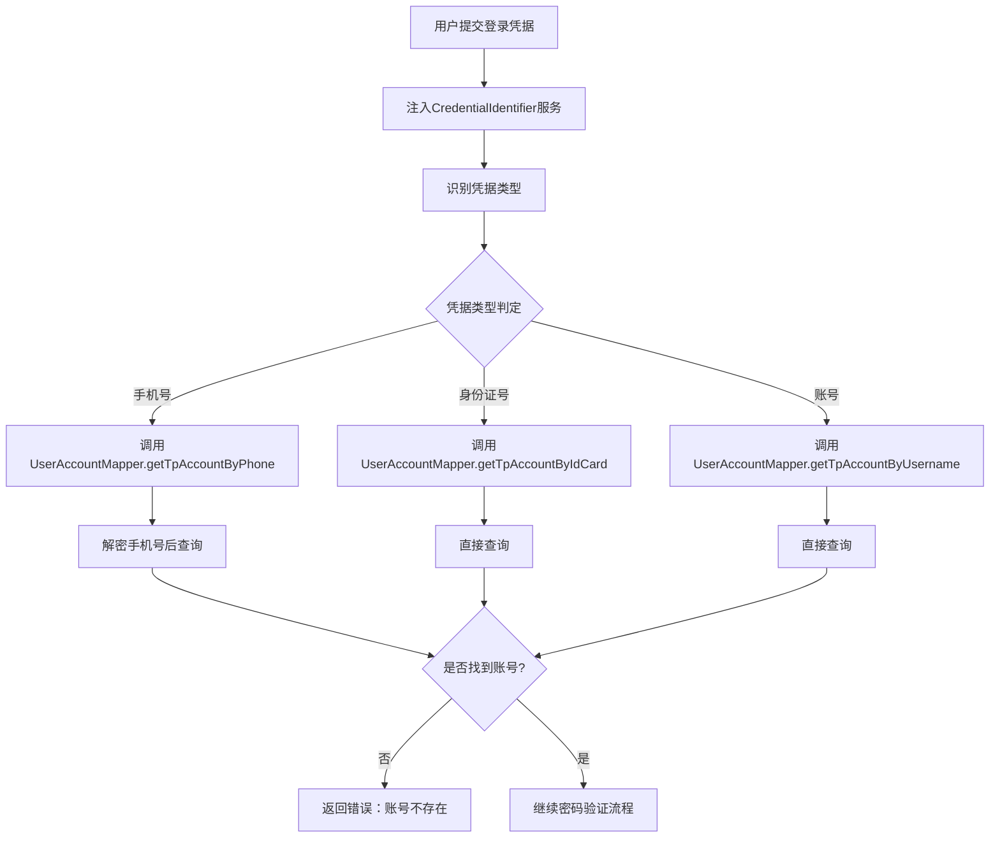
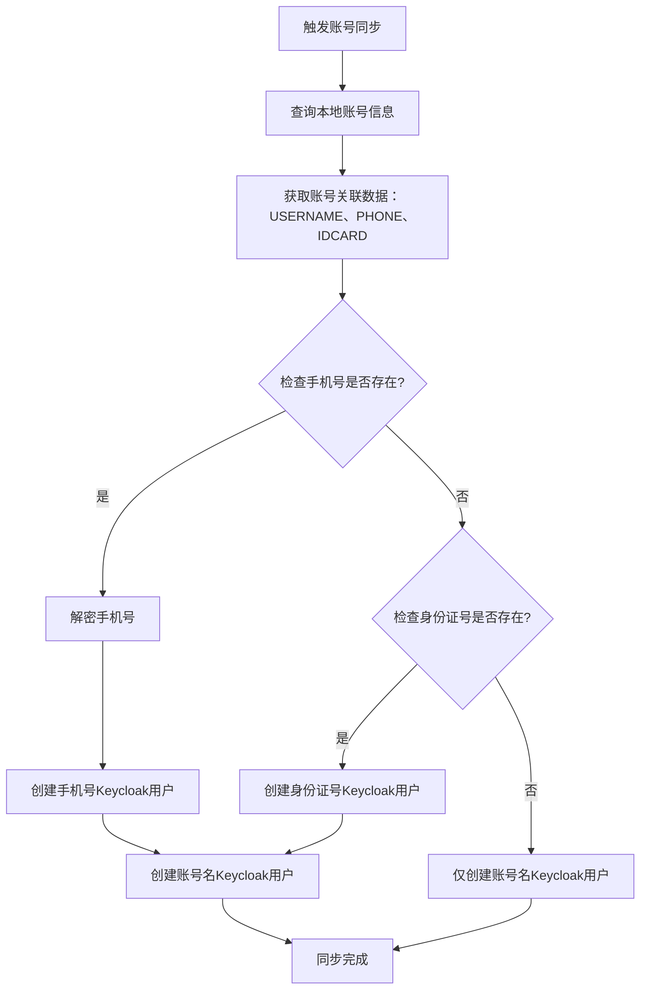
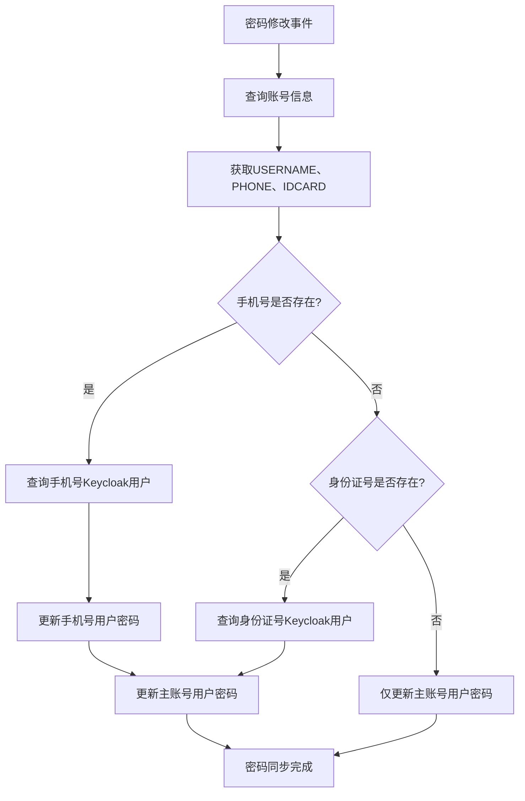
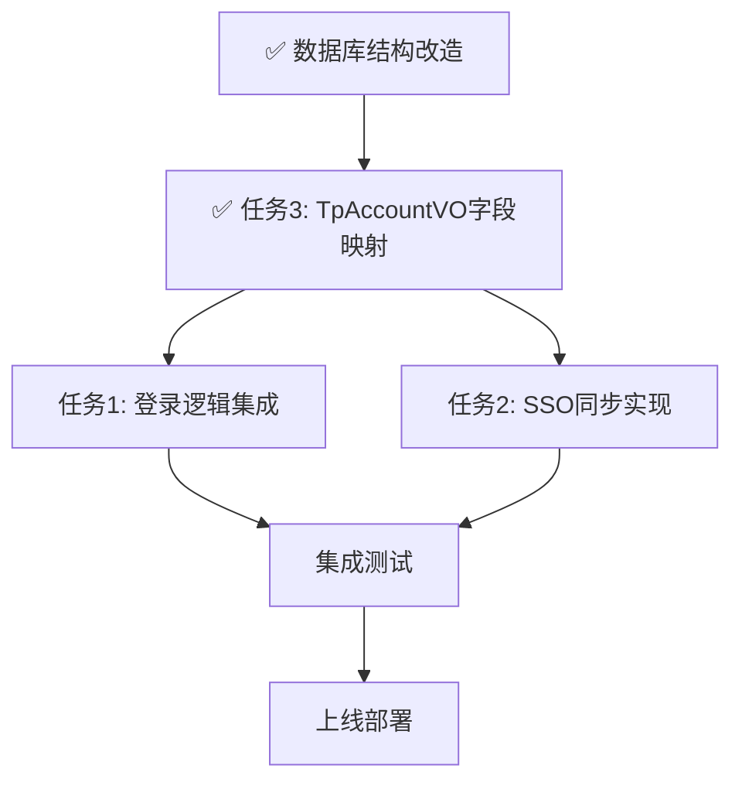

# 账号多因子登录扩展 - 后续实施任务设计

## 一、任务背景

账号多因子登录扩展的核心基础工作进展：

**已完成**：
- ✅ 阶段1：数据库IDCARD字段扩展（数据迁移、索引创建）
- ✅ 阶段2：凭据识别服务（CredentialIdentifier）
- ✅ 阶段3：账号查询扩展（支持手机号和身份证号查询）
- ✅ 阶段4：唯一性校验服务（AccountUniquenessValidator）
- ✅ 阶段5：人员账号同步逻辑
- ✅ 任务3：TpAccountVO字段映射完善

**待完成的高优先级任务**：
1. **任务1**：登录逻辑集成（核心功能）
2. **任务2**：SSO同步实现（支持多凭据）

**当前状态**：所有基础工作已完成，可以开始核心功能开发。

## 二、任务1：登录逻辑集成

### 2.1 需求说明

在现有登录Controller中集成凭据识别服务，使系统支持通过账号、手机号、身份证号三种方式登录。

### 2.2 现状分析

#### 2.2.1 现有登录架构

当前登录入口为`SecurityPlatformController`，使用策略模式支持多种登录方式：

| 登录服务 | Bean名称 | 用途 |
|---------|---------|------|
| pwdLoginService | AbstractLoginService实现 | 密码登录 |
| smsLoginService | AbstractLoginService实现 | 短信验证码登录 |
| clientLoginService | AbstractLoginService实现 | 客户端登录 |

#### 2.2.2 密码登录流程

当前密码登录逻辑（pwdLoginService）：
```
用户输入凭据 + 密码
  ↓
验证码校验
  ↓
根据username查询账号（TpAccountMapper.selectByUsername）
  ↓
密码验证
  ↓
构建会话
  ↓
返回Token
```

### 2.3 设计方案

#### 2.3.1 集成点识别

需要在密码登录服务（pwdLoginService）中集成凭据识别逻辑，修改账号查询策略。

#### 2.3.2 凭据识别流程



#### 2.3.3 服务层改造

**改造对象**：AbstractLoginService的实现类（pwdLoginService）

改造内容：

| 改造项 | 原有逻辑 | 改造后逻辑 |
|-------|---------|-----------|
| 凭据输入 | username参数 | credential参数（含义更通用） |
| 账号查询 | 直接调用selectByUsername | 先识别凭据类型，再调用对应查询方法 |
| 手机号处理 | 无 | 需要加密后查询（PhoneEncryptionUtils） |
| 身份证号处理 | 无 | 直接查询 |
| 错误提示 | "用户名或密码错误" | "账号、手机号或身份证号不存在" |

#### 2.3.4 数据流转

登录凭据的数据流转过程：

```
前端输入 → Controller接收 → 凭据识别 → 加密处理（手机号） → 数据库查询 → 解密（手机号） → 密码验证
```

**关键数据处理**：

| 凭据类型 | 存储格式 | 查询前处理 | 查询后处理 |
|---------|---------|-----------|-----------|
| 账号 | 明文 | 无需处理 | 无需处理 |
| 手机号 | 加密（PhoneEncryptionUtils） | 加密后查询 | 返回时无需解密（仅用于匹配） |
| 身份证号 | 明文（待加密） | 无需处理 | 无需处理 |

#### 2.3.5 错误处理策略

| 错误场景 | 错误码 | 错误提示 | 处理逻辑 |
|---------|-------|---------|---------|
| 凭据不存在 | 401 | "账号、手机号或身份证号不存在，请检查输入" | 不暴露具体是哪种凭据 |
| 密码错误 | 401 | "密码错误" | 记录失败次数 |
| 账号锁定 | 403 | "账号已锁定，请联系管理员" | 阻止登录 |
| 账号禁用 | 403 | "账号已禁用" | 阻止登录 |
| 凭据识别异常 | 500 | "登录服务异常" | 记录日志 |

#### 2.3.6 日志记录规范

登录过程中的日志记录要求：

| 日志级别 | 记录时机 | 日志内容（脱敏） |
|---------|---------|----------------|
| INFO | 登录请求 | "用户登录请求：凭据类型={}, 脱敏凭据={}" |
| DEBUG | 凭据识别 | "凭据识别结果：类型={}" |
| INFO | 登录成功 | "用户登录成功：accountId={}, 凭据类型={}" |
| WARN | 登录失败 | "用户登录失败：凭据类型={}, 失败原因={}" |
| ERROR | 系统异常 | "登录服务异常：凭据类型={}, 异常信息={}" |

**脱敏规则**：
- 手机号：显示前3位和后4位，中间4位用*代替（138****1234）
- 身份证号：显示前6位和后4位，中间8位用*代替（420106********1234）
- 账号：不脱敏

### 2.4 接口兼容性

保持现有API接口不变：

| 接口属性 | 现有值 | 改造后 |
|---------|-------|--------|
| 请求路径 | /platform/login | 保持不变 |
| 请求参数 | username, password, captcha | username改为credential，其他不变 |
| 响应格式 | JsonResponse包装Token | 保持不变 |
| 错误码 | 现有错误码体系 | 保持不变 |

**前端兼容性**：
- 如需保持前端完全兼容，参数名保持为username，但在后端将其视为通用凭据处理
- 建议前端同步更新参数名为credential，更准确表达语义

## 三、任务2：SSO同步实现

### 3.1 需求说明

扩展KeycloakSyncService，支持一个本地账号同步创建1-3个Keycloak用户（基于账号名、手机号、身份证号）。

### 3.2 现状分析

#### 3.2.1 现有KeycloakSyncService能力

当前KeycloakSyncService支持的操作：

| 方法 | 功能 | 参数 | 返回 |
|------|------|------|------|
| syncAccountToKeycloak | 同步账号到Keycloak | accountId, username, password, creator | KeycloakSyncResult |
| updateKeycloakUser | 更新Keycloak用户 | accountId, username, password, operator | KeycloakSyncResult |
| disableKeycloakUser | 禁用Keycloak用户 | accountId | KeycloakSyncResult |
| enableKeycloakUser | 启用Keycloak用户 | accountId | KeycloakSyncResult |
| deleteKeycloakUser | 删除Keycloak用户 | accountId | KeycloakSyncResult |

#### 3.2.2 现有同步触发点

根据代码分析，账号同步的触发点：

| 触发场景 | 触发位置 | 触发方式 |
|---------|---------|---------|
| 新增账号 | UserAccountServiceImpl.accountAdd | 发布KeycloakSyncEvent事件 |
| 修改密码（重置） | UserAccountServiceImpl.resetPwd | 直接调用updateKeycloakUser |
| 修改密码（用户主动） | UserAccountServiceImpl.changePwd | 直接调用updateKeycloakUser |
| 修改账号信息 | UserAccountServiceImpl.accountUpdate | 调用updateKeycloakUser（不含密码） |

### 3.3 设计方案

#### 3.3.1 多凭据同步策略

**核心设计理念**：一个本地账号可能产生1-3个Keycloak用户

同步决策矩阵：

| 本地账号特征 | 创建Keycloak用户数量 | Username取值 |
|------------|---------------------|-------------|
| 仅有账号名 | 1个 | 账号名 |
| 账号名+手机号 | 2个 | 账号名、手机号 |
| 账号名+身份证号 | 2个 | 账号名、身份证号 |
| 账号名+手机号+身份证号 | 3个 | 账号名、手机号、身份证号 |

#### 3.3.2 服务方法扩展

**新增方法**：

| 方法名 | 功能 | 参数 | 说明 |
|-------|------|------|------|
| syncMultipleCredentials | 同步账号的多个凭据到Keycloak | accountId | 根据账号信息创建1-3个Keycloak用户 |
| updatePasswordForAllCredentials | 更新账号所有凭据的密码 | accountId, newPassword | 同步更新3个Keycloak用户的密码 |
| deleteAllCredentials | 删除账号的所有凭据 | accountId | 删除账号关联的所有Keycloak用户 |
| enableAllCredentials | 启用账号的所有凭据 | accountId | 启用所有关联Keycloak用户 |
| disableAllCredentials | 禁用账号的所有凭据 | accountId | 禁用所有关联Keycloak用户 |

#### 3.3.3 多凭据同步流程



#### 3.3.4 Keycloak用户属性映射

每个Keycloak用户的属性构建规则：

| Keycloak属性 | 主账号用户 | 手机号用户 | 身份证号用户 |
|-------------|-----------|-----------|-------------|
| username | tp_account.USERNAME | tp_account.PHONE（解密） | tp_account.IDCARD |
| password | tp_account.USERPWD | 相同 | 相同 |
| email | tp_person.EMAIL | 相同 | 相同 |
| firstName | tp_person.PERSON_NAME | 相同 | 相同 |
| attributes.accountId | tp_account.ACCOUNT_ID | 相同 | 相同 |
| attributes.personId | tp_account.PERSON_ID | 相同 | 相同 |
| attributes.tenantId | tp_account.TENANT_ID | 相同 | 相同 |
| attributes.USERNAME | tp_account.USERNAME | 相同（用于追溯） | 相同（用于追溯） |
| attributes.PHONE | tp_account.PHONE（解密） | 相同 | 相同 |
| attributes.IDCARD | tp_account.IDCARD | 相同 | 相同 |

**关键说明**：
- 三个Keycloak用户的唯一区别是username字段
- 密码、邮箱、姓名等属性完全相同
- 通过attributes存储原始账号的所有凭据，便于追溯和管理

#### 3.3.5 密码同步策略

密码修改时的同步逻辑：



**密码同步要求**：
- 必须同步更新所有关联的Keycloak用户
- 采用批量更新策略，提高效率
- 部分失败时记录日志，不影响其他用户更新
- 返回详细同步结果（成功/失败数量）

#### 3.3.6 用户查询策略

根据username查询Keycloak用户的方法：

| 场景 | 查询条件 | Keycloak API |
|------|---------|-------------|
| 精确匹配 | username=凭据值 | GET /users?username={value}&exact=true |
| 批量查询 | 多个username | 循环调用精确匹配API |

**查询优化**：
- 使用Keycloak缓存机制，减少API调用
- 批量查询时使用异步并发处理
- 查询结果缓存5分钟（Redis）

#### 3.3.7 同步冲突处理

Keycloak用户已存在时的处理策略：

| 冲突场景 | 检测方式 | 处理策略 |
|---------|---------|---------|
| username已存在 | 查询返回用户 | 更新现有用户，覆盖attributes |
| 不同accountId的用户 | 比较attributes.accountId | 报错，禁止同步，记录日志 |
| 已存在但已禁用 | 检查enabled字段 | 更新并启用 |

#### 3.3.8 异常处理与重试

同步失败的处理机制：

| 异常类型 | 处理策略 | 重试策略 |
|---------|---------|---------|
| Keycloak服务不可用 | 记录失败日志，稍后重试 | 最多重试3次，间隔5秒 |
| 网络超时 | 记录失败日志 | 重试1次 |
| 用户创建失败（已存在） | 转为更新操作 | 无需重试 |
| 部分用户同步失败 | 记录失败凭据，继续其他 | 独立重试失败项 |

**失败记录**：
- 记录到tp_keycloak_sync_log表（如存在）
- 日志内容包括：accountId、凭据类型、失败原因、重试次数
- 定时任务扫描失败记录并重试

#### 3.3.9 性能优化措施

| 优化项 | 措施 | 预期效果 |
|-------|------|---------|
| 批量同步 | 异步并发处理 | 提升3倍同步速度 |
| API调用优化 | 合并查询请求 | 减少50%网络开销 |
| 缓存策略 | Redis缓存查询结果 | 减少重复查询 |
| 事件驱动 | 异步事件处理 | 不阻塞主流程 |

### 3.4 改造影响范围

需要修改的代码位置：

| 文件 | 改造内容 | 影响等级 |
|------|---------|---------|
| KeycloakSyncService（接口） | 新增多凭据同步方法 | 高 |
| KeycloakSyncServiceImpl | 实现多凭据同步逻辑 | 高 |
| UserAccountServiceImpl | 修改同步调用点 | 中 |
| KeycloakSyncEvent | 扩展事件属性（可选） | 低 |

### 3.5 数据一致性保障

同步过程中的一致性保障措施：

| 保障措施 | 实现方式 | 目的 |
|---------|---------|------|
| 事务控制 | 本地数据库操作在事务内 | 确保本地数据一致 |
| 补偿机制 | Keycloak同步失败时记录待同步任务 | 后续补偿同步 |
| 幂等性 | 相同accountId多次同步结果相同 | 避免重复创建 |
| 日志审计 | 记录所有同步操作 | 问题追溯 |

## 四、任务3：TpAccountVO字段映射完善✅

### 4.1 任务状态

**✅ 已完成** - 2024-12-16

### 4.2 实施总结

经过检查和修复，以下工作已完成：

#### 4.2.1 VO类字段

- ✅ TpAccountVO类已包含idcard字段
- ✅ TpAccount实体类已包含idcard字段
- ✅ getter/setter方法已存在

#### 4.2.2 Mapper XML完善

所有UserAccountMapper.xml中的SQL语句已更新：

| SQL ID | 是否包含IDCARD | 状态 |
|--------|---------------|--------|
| viewByPersonId | ✅ 已包含 | 完成 |
| selectByAccountId | ✅ 已包含 | 完成 |
| getTpAccountByPhone | ✅ 已包含 | 完成 |
| getTpAccountByUsername | ✅ 已包含 | 完成 |
| getTpAccountByIdCard | ✅ 已包含 | 完成 |
| getTpAccountByEmail | ✅ 已包含 | 完成 |
| selectByPrimaryKey | ✅ 已包含 | 完成 |
| selectByPersonId | ✅ 已包含 | 完成 |
| selectByCondition | ✅ 已包含 | 完成 |
| updateByPrimaryKey | ✅ 已包含 | 完成 |
| resultMap | ✅ 已添加idcard映射 | 完成 |

#### 4.2.3 修复详情

1. **添加resultMap映射**：在tpAccountMap中添加了idcard字段映射
2. **更新SELECT语句**：所有返回TpAccountVO的查询都包含IDCARD字段
3. **更新UPDATE语句**：updateByPrimaryKey添加了IDCARD字段的更新

### 4.3 验证结果

- ✅ 编译检查：无错误
- ✅ 字段映射：完整
- ✅ SQL语句：所有相关SQL已更新

### 4.4 后续建议

根据设计文档，以下功能可在后纭任务中实现：

1. **数据脱敏**：在Controller返回前端前根据权限脱敏身份证号
2. **日志脱敏**：在日志记录时统一脱敏身份证号
3. **字段验证**：在新增/修改时添加身份证号格式校验

---

## 五、任务1：登录逻辑集成

### 5.1 需求说明

### 5.1 实施顺序



**顺序说明**：
1. ✅ 数据库结构改造已完成
2. ✅ 任务3（TpAccountVO字段映射）已完成
3. **下一步**：开始任务1（登录逻辑集成）或任务2（SSO同步实现）
4. 任务1和任务2可并行开发
5. 所有任务完成后进行集成测试

### 5.2 任务依赖关系

| 任务 | 依赖项 | 状态 | 依赖说明 |
|------|-------|------|----------|
| 任务1 | 凭据识别服务 | ✅ 已完成 | CredentialIdentifier已实现 |
| 任务1 | 账号查询扩展 | ✅ 已完成 | getTpAccountByIdCard已实现 |
| 任务1 | TpAccountVO字段映射 | ✅ 已完成 | 任务3已完成 |
| 任务2 | 账号查询扩展 | ✅ 已完成 | 查询方法已就绪 |
| 任务2 | KeycloakSyncService | ✅ 已存在 | 现有服务需扩展 |
| 任务2 | TpAccountVO字段映射 | ✅ 已完成 | 任务3已完成 |
| 任务3 | 数据库IDCARD字段 | ✅ 已完成 | DDL和数据迁移已执行 |

## 六、测试策略

### 6.1 单元测试

| 测试对象 | 测试用例数 | 覆盖率要求 |
|---------|-----------|-----------|
| 登录凭据识别 | 15个 | 90%以上 |
| 多凭据同步逻辑 | 20个 | 85%以上 |
| 字段映射 | 10个 | 95%以上 |

### 6.2 集成测试

| 测试场景 | 测试内容 | 预期结果 |
|---------|---------|---------|
| 账号登录 | 使用账号名登录 | 登录成功 |
| 手机号登录 | 使用手机号登录 | 登录成功 |
| 身份证号登录 | 使用身份证号登录 | 登录成功 |
| Keycloak同步（单凭据） | 创建仅有账号名的账号 | 创建1个Keycloak用户 |
| Keycloak同步（双凭据） | 创建有账号名+手机号的账号 | 创建2个Keycloak用户 |
| Keycloak同步（三凭据） | 创建完整凭据的账号 | 创建3个Keycloak用户 |
| 密码修改同步 | 修改密码 | 所有Keycloak用户密码同步更新 |

### 6.3 端到端测试

| 测试流程 | 测试步骤 | 验证点 |
|---------|---------|-------|
| 完整登录流程 | 1. 创建账号 → 2. Keycloak同步 → 3. 使用手机号登录 → 4. SSO跳转 | 所有环节正常 |
| 密码修改流程 | 1. 修改密码 → 2. Keycloak同步 → 3. 重新登录 | 密码生效 |

## 七、风险评估

### 7.1 技术风险

| 风险项 | 风险等级 | 影响 | 缓解措施 |
|-------|---------|------|---------|
| Keycloak同步性能 | 中 | 创建3个用户耗时增加 | 异步处理，批量优化 |
| 登录凭据冲突 | 中 | 多凭据可能导致混淆 | 统一错误提示，不暴露具体凭据类型 |
| 数据不一致 | 高 | Keycloak与本地数据不同步 | 补偿机制，定时校验 |
| 手机号加密性能 | 低 | 查询前需加密 | 使用索引优化 |

### 7.2 兼容性风险

| 风险项 | 风险等级 | 影响 | 缓解措施 |
|-------|---------|------|---------|
| 前端参数适配 | 低 | 参数名变化 | 保持向后兼容 |
| 现有登录逻辑 | 低 | 可能影响现有用户 | 灰度发布，逐步迁移 |
| Keycloak版本 | 中 | API兼容性 | 测试验证，版本锁定 |

### 7.3 业务风险

| 风险项 | 风险等级 | 影响 | 缓解措施 |
|-------|---------|------|---------|
| 用户凭据混淆 | 中 | 用户不知道用哪个凭据登录 | 前端提示，用户教育 |
| 历史数据迁移 | 高 | 历史账号无手机号/身份证号 | 数据补全，分批迁移 |
| 重复凭据 | 高 | 唯一性约束冲突 | 数据清理，人工介入 |

## 八、部署方案

### 8.1 部署检查清单

| 检查项 | 检查内容 | 责任人 |
|-------|---------|-------|
| 数据库变更 | IDCARD字段已添加 | DBA |
| 数据迁移 | 手机号和身份证号已同步 | 开发 |
| 代码审查 | 所有代码已通过Review | Tech Lead |
| 单元测试 | 覆盖率达标 | 开发 |
| 集成测试 | 所有场景通过 | 测试 |
| Keycloak配置 | Realm配置正确 | 运维 |

### 8.2 部署步骤

| 步骤 | 操作 | 预计耗时 |
|------|------|---------|
| 1. 停止应用 | 停止应用服务 | 2分钟 |
| 2. 数据备份 | 备份tp_account和tp_person_basicinfo | 5分钟 |
| 3. 部署代码 | 替换应用文件 | 3分钟 |
| 4. 启动应用 | 启动应用服务 | 2分钟 |
| 5. 冒烟测试 | 测试基本登录功能 | 5分钟 |
| 6. Keycloak同步验证 | 创建测试账号，验证同步 | 10分钟 |

### 8.3 回滚方案

| 回滚场景 | 回滚步骤 | 预计耗时 |
|---------|---------|---------|
| 应用启动失败 | 恢复旧版本代码 | 5分钟 |
| 登录功能异常 | 恢复旧版本代码 | 5分钟 |
| Keycloak同步异常 | 禁用同步功能，保留本地登录 | 2分钟 |
| 数据异常 | 恢复数据库备份 | 10分钟 |

## 九、监控与告警

### 9.1 监控指标

| 监控项 | 指标 | 告警阈值 |
|-------|------|---------|
| 登录成功率 | 成功次数/总次数 | <95% |
| Keycloak同步成功率 | 成功次数/总次数 | <90% |
| 登录响应时间 | 平均响应时间 | >2秒 |
| Keycloak同步耗时 | 平均同步时间 | >5秒 |

### 9.2 日志监控

| 日志类型 | 监控内容 | 告警条件 |
|---------|---------|---------|
| 错误日志 | 登录失败、同步失败 | 1分钟内超过10次 |
| 异常日志 | 系统异常 | 任何异常 |
| 性能日志 | 慢查询、慢同步 | 响应时间超过阈值 |

## 十、后续优化建议

### 10.1 短期优化

| 优化项 | 优先级 | 预期收益 |
|-------|-------|---------|
| 身份证号加密存储 | 高 | 提升安全性 |
| Keycloak同步性能优化 | 中 | 减少同步耗时 |
| 凭据识别缓存 | 低 | 提升识别性能 |

### 10.2 长期优化

| 优化项 | 优先级 | 预期收益 |
|-------|-------|---------|
| 支持邮箱登录 | 中 | 扩展登录方式 |
| 多因子认证（MFA） | 高 | 提升安全性 |
| 凭据规则配置化 | 低 | 提升灵活性 |
| Keycloak同步监控面板 | 中 | 提升运维效率 |
|-------|---------|------|---------|
| 用户凭据混淆 | 中 | 用户不知道用哪个凭据登录 | 前端提示，用户教育 |
| 历史数据迁移 | 高 | 历史账号无手机号/身份证号 | 数据补全，分批迁移 |
| 重复凭据 | 高 | 唯一性约束冲突 | 数据清理，人工介入 |

## 八、部署方案

### 8.1 部署检查清单

| 检查项 | 检查内容 | 责任人 |
|-------|---------|-------|
| 数据库变更 | IDCARD字段已添加 | DBA |
| 数据迁移 | 手机号和身份证号已同步 | 开发 |
| 代码审查 | 所有代码已通过Review | Tech Lead |
| 单元测试 | 覆盖率达标 | 开发 |
| 集成测试 | 所有场景通过 | 测试 |
| Keycloak配置 | Realm配置正确 | 运维 |

### 8.2 部署步骤

| 步骤 | 操作 | 预计耗时 |
|------|------|---------|
| 1. 停止应用 | 停止应用服务 | 2分钟 |
| 2. 数据备份 | 备份tp_account和tp_person_basicinfo | 5分钟 |
| 3. 部署代码 | 替换应用文件 | 3分钟 |
| 4. 启动应用 | 启动应用服务 | 2分钟 |
| 5. 冒烟测试 | 测试基本登录功能 | 5分钟 |
| 6. Keycloak同步验证 | 创建测试账号，验证同步 | 10分钟 |

### 8.3 回滚方案

| 回滚场景 | 回滚步骤 | 预计耗时 |
|---------|---------|---------|
| 应用启动失败 | 恢复旧版本代码 | 5分钟 |
| 登录功能异常 | 恢复旧版本代码 | 5分钟 |
| Keycloak同步异常 | 禁用同步功能，保留本地登录 | 2分钟 |
| 数据异常 | 恢复数据库备份 | 10分钟 |

## 九、监控与告警

### 9.1 监控指标

| 监控项 | 指标 | 告警阈值 |
|-------|------|---------|
| 登录成功率 | 成功次数/总次数 | <95% |
| Keycloak同步成功率 | 成功次数/总次数 | <90% |
| 登录响应时间 | 平均响应时间 | >2秒 |
| Keycloak同步耗时 | 平均同步时间 | >5秒 |

### 9.2 日志监控

| 日志类型 | 监控内容 | 告警条件 |
|---------|---------|---------|
| 错误日志 | 登录失败、同步失败 | 1分钟内超过10次 |
| 异常日志 | 系统异常 | 任何异常 |
| 性能日志 | 慢查询、慢同步 | 响应时间超过阈值 |

## 十、后续优化建议

### 10.1 短期优化

| 优化项 | 优先级 | 预期收益 |
|-------|-------|---------|
| 身份证号加密存储 | 高 | 提升安全性 |
| Keycloak同步性能优化 | 中 | 减少同步耗时 |
| 凭据识别缓存 | 低 | 提升识别性能 |

### 10.2 长期优化

| 优化项 | 优先级 | 预期收益 |
|-------|-------|---------|
| 支持邮箱登录 | 中 | 扩展登录方式 |
| 多因子认证（MFA） | 高 | 提升安全性 |
| 凭据规则配置化 | 低 | 提升灵活性 |
| Keycloak同步监控面板 | 中 | 提升运维效率 |
| 风险项 | 风险等级 | 影响 | 缓解措施 |
