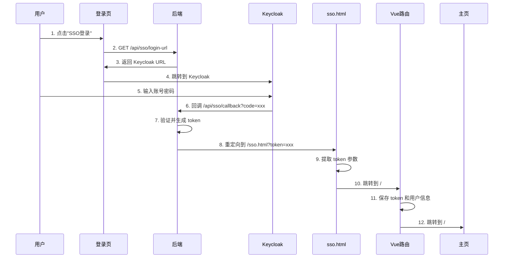

# SSO 登录使用 sso.html 中转页面方案

## 方案概述

使用 `/public/sso.html` 静态页面作为 SSO 登录的中转页面，完美解决 Hash 路由带来的参数传递问题。

## 为什么需要中转页面？

### 原有问题

1. **Hash 路由参数混乱**：
   - 后端重定向：`https://mid.shxdx.com/#/sso/login?token=xxx`
   - URL 参数在 Hash 后面，可能被路由框架误解析

2. **错误 URL 格式问题**：
   - 原方案：`https://mid.shxdx.com/?error_detail=xxx#/login`
   - 需要复杂的字符串拼接逻辑

3. **依赖 Vue Router**：
   - 必须等待 Vue 应用加载才能处理参数
   - 增加了登录流程的复杂度

### 中转方案优势

1. **URL 结构清晰**：
   - 成功：`https://mid.shxdx.com/sso.html?token=xxx`
   - 失败：`https://mid.shxdx.com/sso.html?error_detail=xxx`

2. **独立于框架**：
   - `sso.html` 是纯静态页面
   - 不依赖 Vue Router 或任何框架
   - 加载快速，用户体验好

3. **逻辑简单**：
   - 后端只需重定向到 `/sso.html?token=xxx`
   - 无需处理 Hash 路由的复杂性

4. **统一错误处理**：
   - 所有错误都通过同一个中转页面处理
   - 统一的用户体验

## 完整流程图



## 实现细节

### 1. sso.html 中转页面

**位置**：`ps-fe/public/sso.html`

**核心功能**：
```javascript
// 1. 获取 URL 参数（token 或 error_detail）
var token = getUrlParameter('token');
var errorDetail = getUrlParameter('error_detail');

// 2. 错误处理
if (errorDetail) {
    显示错误信息
    3秒后跳转到登录页
    return;
}

// 3. 成功处理
if (token) {
    显示"登录成功"
    跳转到 Vue 路由：/#/sso/login?token=xxx
}
```

**特性**：
- ✅ 加载动画和状态提示
- ✅ 错误信息显示
- ✅ 自动跳转
- ✅ 详细的控制台日志

### 2. 后端修改

**文件**：`SsoController.java`

#### 2.1 成功重定向修改

**修改前**：
```java
String successUrl = properties.getRedirect().getSuccessUrl();
if (successUrl.contains("?")) {
    successUrl += "&token=" + token;
} else {
    successUrl += "?token=" + token;
}
response.sendRedirect(successUrl);  // https://mid.shxdx.com/#/sso/login?token=xxx
```

**修改后**：
```java
// 获取前端基础 URL
String frontendUrl = tpSystemConfigService.getConfigValue("sso.keycloak.callback.url");
if (frontendUrl == null || frontendUrl.trim().isEmpty()) {
    // 降级方案
    String successUrl = properties.getRedirect().getSuccessUrl();
    if (successUrl != null && successUrl.contains("#")) {
        frontendUrl = successUrl.substring(0, successUrl.indexOf("#"));
    } else {
        frontendUrl = "https://mid.shxdx.com";
    }
}

// 确保 URL 不以 / 结尾
if (frontendUrl.endsWith("/")) {
    frontendUrl = frontendUrl.substring(0, frontendUrl.length() - 1);
}

// 构建中转页面 URL
String redirectUrl = frontendUrl + "/sso.html?token=" + URLEncoder.encode(token, "UTF-8");
response.sendRedirect(redirectUrl);  // https://mid.shxdx.com/sso.html?token=xxx
```

#### 2.2 错误重定向修改

**buildErrorUrl 方法**：
```java
private String buildErrorUrl(String baseUrl, String errorDetail) {
    String encodedError = URLEncoder.encode(errorDetail, "UTF-8");
    
    // 如果是 Hash 路由地址，使用 sso.html 作为中转页面
    if (baseUrl.contains("#")) {
        // 提取基础 URL（# 之前的部分）
        String frontendBaseUrl = baseUrl.substring(0, baseUrl.indexOf("#"));
        
        // 确保 URL 不以 / 结尾
        if (frontendBaseUrl.endsWith("/")) {
            frontendBaseUrl = frontendBaseUrl.substring(0, frontendBaseUrl.length() - 1);
        }
        
        // 使用 sso.html 作为中转页面
        return frontendBaseUrl + "/sso.html?error_detail=" + encodedError;
    }
    // ... 其他情况
}
```

### 3. Vue Router 页面保持不变

**文件**：`ps-fe/src/views/sso/login.vue`

**作用**：接收 token 并完成最终的登录逻辑
- 保存 token 到本地存储
- 获取用户信息
- 跳转到主页

**流程**：
```javascript
mounted() {
    // 从 URL 获取 token（由 sso.html 传递过来）
    let token = this.getQueryStr("token");
    this.$datax.set('token', token);
    
    // 获取用户信息
    this.$svc.platform.getUserInfo().then(res => {
        this.$datax.set('userInfo', res.data);
        this.$router.replace('/main');
    });
}
```

## 配置要求

### 数据库配置

需要在 `tp_system_config` 表中添加前端基础 URL 配置：

```sql
INSERT INTO tp_system_config (config_key, config_value, config_desc, create_time, update_time)
VALUES ('sso.keycloak.callback.url', 'https://mid.shxdx.com', '前端基础URL（用于SSO回调）', NOW(), NOW())
ON DUPLICATE KEY UPDATE 
    config_value = 'https://mid.shxdx.com',
    update_time = NOW();
```

### 配置文件

`security-dev.yml` 保持原有配置作为降级方案：

```yaml
keycloak:
  sso:
    redirect:
      success-url: https://mid.shxdx.com/#/sso/login
      error-url: https://mid.shxdx.com/#/login
```

## 测试验证

### 测试用例 1：正常登录

**步骤**：
1. 访问 `https://mid.shxdx.com/#/login`
2. 点击"使用SSO统一登录"
3. 在 Keycloak 输入账号密码
4. 观察跳转流程

**预期行为**：
```
Keycloak 登录成功
    ↓
https://mid.shxdx.com/sso.html?token=xxx
    ↓ (显示"登录成功，正在跳转...")
https://mid.shxdx.com/#/sso/login?token=xxx
    ↓ (Vue处理token)
https://mid.shxdx.com/#/main
```

### 测试用例 2：错误登录（用户不存在）

**步骤**：
1. 使用 Keycloak 中存在但 ps-be 中不存在的账号登录

**预期行为**：
```
Keycloak 登录成功
    ↓
https://mid.shxdx.com/sso.html?error_detail=用户名在系统中不存在
    ↓ (显示错误信息3秒)
https://mid.shxdx.com/#/login
```

### 测试用例 3：浏览器开发者工具检查

**Network 标签检查**：
1. 观察重定向链：
   ```
   /api/sso/callback?code=xxx  → 302
   /sso.html?token=xxx          → 200
   /#/sso/login?token=xxx       → (客户端路由)
   /#/main                       → (客户端路由)
   ```

2. 确认没有 404 或其他错误

**Console 标签检查**：
```
SSO 中转页: token=已获取, error=
SSO 登录成功，跳转到 Vue 路由处理
```

## URL 对比

### 原方案 vs 新方案

| 场景 | 原方案 | 新方案 |
|------|--------|--------|
| 成功登录 | `https://mid.shxdx.com/#/sso/login?token=xxx`<br>（参数可能被路由误解析） | `https://mid.shxdx.com/sso.html?token=xxx`<br>→ `/#/sso/login?token=xxx`<br>（清晰的两步跳转） |
| 错误登录 | `https://mid.shxdx.com/?error_detail=xxx#/login`<br>（参数顺序复杂） | `https://mid.shxdx.com/sso.html?error_detail=xxx`<br>→ `/#/login`<br>（统一的错误处理） |

## 优势总结

### 1. 技术优势
- ✅ 完全避免 Hash 路由参数问题
- ✅ URL 结构简单清晰
- ✅ 加载速度快（静态页面）
- ✅ 易于调试和排查问题

### 2. 用户体验
- ✅ 平滑的页面过渡
- ✅ 明确的状态提示
- ✅ 友好的错误信息

### 3. 维护性
- ✅ 逻辑清晰，易于理解
- ✅ 前后端职责分明
- ✅ 易于扩展和修改

### 4. 兼容性
- ✅ 不依赖特定框架版本
- ✅ 支持所有现代浏览器
- ✅ 提供降级方案

## 注意事项

### 1. Nginx 配置

确保 Nginx 正确处理 `sso.html`：

```nginx
location /sso.html {
    root /path/to/frontend;
    try_files $uri $uri/ =404;
}
```

### 2. 缓存控制

建议对 `sso.html` 设置较短的缓存时间：

```nginx
location /sso.html {
    expires 5m;
    add_header Cache-Control "public, must-revalidate";
}
```

### 3. 日志监控

关注以下日志：
- 后端：`重定向到 SSO 中转页面: xxx`
- 浏览器控制台：`SSO 中转页: token=已获取`

### 4. 安全考虑

- Token 通过 URL 传递，确保使用 HTTPS
- Token 应该是短期有效的
- 在 Vue 页面接收 token 后立即清除 URL 参数

## 回滚方案

如果新方案出现问题，可以快速回滚到原方案：

### 前端回滚
保留原有的 `sso.html`，恢复为简单的空页面

### 后端回滚
恢复 `handleCallback` 方法中的重定向逻辑：
```java
// 恢复为原来的方式
String successUrl = properties.getRedirect().getSuccessUrl();
if (successUrl.contains("?")) {
    successUrl += "&token=" + token;
} else {
    successUrl += "?token=" + token;
}
response.sendRedirect(successUrl);
```

## 相关文件

- 前端中转页：`ps-fe/public/sso.html`
- 前端Vue页面：`ps-fe/src/views/sso/login.vue`
- 后端控制器：`ps-be/src/main/java/com/jiuxi/security/sso/controller/SsoController.java`
- 配置文件：`ps-be/src/main/resources/config/sec/security-dev.yml`

---

**方案版本**：1.0  
**最后更新**：2025-12-03  
**状态**：已实现，待测试
