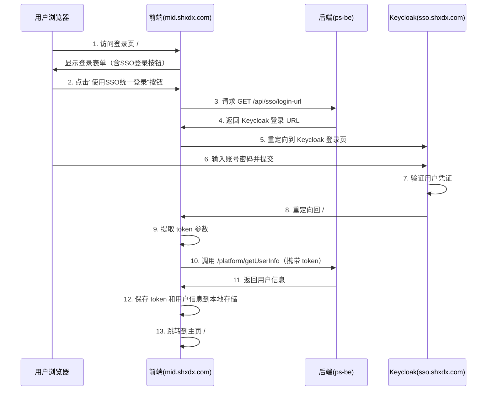
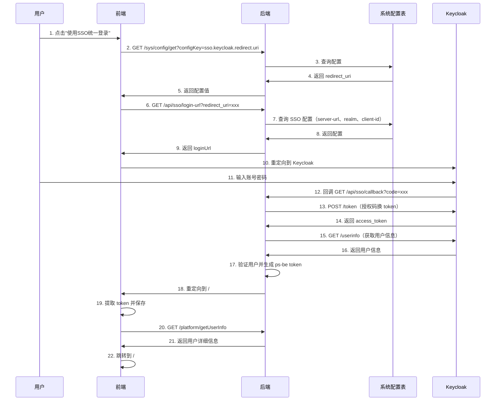

# SSO 登录流程检查设计文档

## 文档概述

本文档针对已部署的前后端服务及 Keycloak SSO 系统，对现有代码中的 SSO 登录流程进行全面检查和分析，验证其是否能够支持正常的单点登录功能。

## 部署环境信息

| 服务类型 | 部署地址 | 说明 |
|---------|---------|------|
| 前端服务 | https://mid.shxdx.com | 使用 Nginx 部署 |
| 后端服务 | https://mid.shxdx.com/ps-be | 使用 Nginx 反向代理 |
| Keycloak SSO | https://sso.shxdx.com | 统一认证服务 |

## SSO 登录流程设计

### 预期登录流程



### 核心登录步骤说明

1. **初始访问**：用户访问前端登录页面 `https://mid.shxdx.com/#/login`
2. **发起 SSO 登录**：点击"使用SSO统一登录"按钮触发 SSO 流程
3. **获取登录 URL**：前端调用后端 `/api/sso/login-url` 接口获取 Keycloak 授权地址
4. **跳转认证页**：浏览器重定向至 Keycloak 登录页面
5. **用户认证**：在 Keycloak 页面输入账号密码完成认证
6. **回调处理**：Keycloak 认证成功后重定向回前端 `/#/sso/login?token=xxx`
7. **会话建立**：前端提取 token，调用后端获取用户信息并保存
8. **完成登录**：跳转到系统主页 `/#/main`

## 现有代码分析

### 前端代码结构

#### 1. 登录页面 SSO 按钮

**位置**：`ps-fe/@fb/admin-base/components/login/LoginCardScanCodeVerify.vue`

**功能描述**：
- 在登录表单中提供"使用SSO统一登录"按钮
- 点击按钮触发 `handleSSOLogin` 方法

**关键逻辑**：
- 首先调用 `/sys/config/get` 接口获取系统配置的 `redirect_uri`（配置项：`sso.keycloak.redirect.uri`）
- 然后调用 `/api/sso/login-url` 接口获取 Keycloak 登录 URL（携带 redirect_uri 参数）
- 接收到登录 URL 后，通过 `window.location.href` 重定向到 Keycloak

**潜在问题**：
- 依赖系统配置表中的 `sso.keycloak.redirect.uri` 配置项，需确保该配置已正确设置
- 错误处理机制较为简单，配置缺失时仅提示用户

#### 2. SSO 回调处理页面

**位置**：`ps-fe/src/views/sso/login.vue`

**路由配置**：`/sso/login`

**功能描述**：
- 处理 Keycloak 认证成功后的回调跳转
- 从 URL 参数中提取 `token` 参数
- 调用后端 `/platform/getUserInfo` 接口获取用户信息
- 保存 token 和用户信息后跳转到主页

**关键实现**：
```
mounted() -> init()
  ├─ 从 URL 提取 token 参数（使用 getQueryStr 方法）
  ├─ 保存 token 到本地存储（datax.set）
  ├─ 调用 getUserInfo 接口
  ├─ 保存用户信息到本地存储
  └─ 延迟 3 秒后跳转到 /main
```

**潜在问题识别**：
- **核心问题**：页面期望从 URL 中获取 `token` 参数，但根据 OAuth2.0 标准流程，Keycloak 回调应该携带的是 `code`（授权码）而非直接的 `token`
- **流程不匹配**：当前实现假设后端已在重定向 URL 中直接附加了 token，但标准 OAuth2 流程需要前端用 code 换取 token

#### 3. 备用回调页面（未使用）

**位置**：`ps-fe/src/views/sso/callback.vue`

**路由配置**：未在路由表中注册

**功能描述**：
- 实现了标准的 OAuth2 授权码流程处理
- 从 URL 提取 `code` 和 `state` 参数
- 调用后端 `/api/sso/callback` 接口交换 token
- 处理错误情况并跳转

**状态**：此页面实现了正确的 OAuth2 流程，但未被激活使用

#### 4. 路由配置

**位置**：`ps-fe/src/router/index.js`

**已注册路由**：
- `/sso/login`：映射到 `@/views/sso/login.vue`

**路由白名单**（`project.config.js`）：
```
whiteList: ['/login/*', '/register', '/sso/main', '/sso/login']
```

**其他相关路由**：
- `/sso/main`：位于 `@fb/admin-base/router/index.js`，映射到 `@fb/admin-base/views/common/sso/main.vue`（单点登录缓冲页）

### 后端代码结构

#### 1. SSO 控制器

**位置**：`ps-be/src/main/java/com/jiuxi/security/sso/controller/SsoController.java`

**基础信息**：
- 路径映射：`/api/sso`
- 启用条件：`keycloak.sso.enabled = true`

#### 2. 获取登录 URL 接口

**端点**：`GET /api/sso/login-url`

**功能描述**：
- 从系统配置表读取 Keycloak 相关配置（server-url、realm、client-id、redirect-uri）
- 构建 Keycloak OAuth2 授权 URL
- 返回登录 URL 供前端跳转

**实现逻辑**：
```
1. 从系统配置表获取 SSO 配置项：
   - sso.keycloak.server.url
   - sso.keycloak.realm
   - sso.keycloak.client.id
   - sso.keycloak.redirect.uri
2. 验证必要配置是否完整
3. 从请求参数或配置中确定 redirect_uri
4. 构建标准 OAuth2 授权 URL：
   {serverUrl}/realms/{realm}/protocol/openid-connect/auth
   ?client_id={clientId}
   &redirect_uri={redirectUri}
   &response_type=code
   &scope=openid
5. 返回 JSON 响应
```

**返回数据格式**：
```
{
  "success": true,
  "data": {
    "loginUrl": "https://sso.shxdx.com/realms/ps-realm/protocol/openid-connect/auth?...",
    "redirectUri": "https://mid.shxdx.com/#/sso/login"
  }
}
```

#### 3. SSO 回调处理接口

**端点**：`GET /api/sso/callback`

**功能描述**：
- 接收 Keycloak 回调请求（携带 code 和 state）
- 使用授权码向 Keycloak 换取访问令牌
- 获取用户信息并在 ps-be 系统中验证用户
- 验证登录时间规则
- 生成 ps-be 系统的 token
- 重定向到前端成功页面（在 URL 中附加 token）

**实现逻辑**：
```
1. 验证回调参数（检查 error、code）
2. 使用授权码调用 Keycloak Token 端点换取访问令牌
3. 使用访问令牌获取 Keycloak 用户信息
4. 在 ps-be 系统中查询用户是否存在
5. 验证用户登录时间规则
6. 生成 ps-be 系统的 JWT token
7. 重定向到成功页面：
   {successUrl}?token={token}
   或
   {successUrl}&token={token}
8. 错误情况重定向到 {errorUrl}&error_detail={错误信息}
```

**成功重定向示例**：
```
https://mid.shxdx.com/#/sso/login?token=eyJhbGc...
```

#### 4. Keycloak 配置

**配置文件**：`ps-be/src/main/resources/config/sec/security-dev.yml`

**当前配置值**：
```yaml
keycloak:
  server-url: https://sso.shxdx.com
  realm: ps-realm
  sso:
    enabled: true
    server-url: https://sso.shxdx.com
    realm: ps-realm
    client-id: ps-be
    client-secret: xMXvDGzby4Z48szob7i2fuZlZy5Wlqrh
    redirect:
      success-url: https://mid.shxdx.com/#/sso/login
      error-url: https://mid.shxdx.com/#/login
```

#### 5. Shiro 安全过滤器配置

**位置**：
- `ps-be/src/main/java/com/jiuxi/security/sso/config/KeycloakShiroConfiguration.java`
- `ps-be/src/main/java/com/jiuxi/security/config/DefaultShiroConfiguration.java`

**SSO 相关端点的访问控制**：
```
/api/sso/callback -> anon（匿名访问）
/api/sso/login-url -> anon（匿名访问）
/api/sso/auth-status -> anon（匿名访问）
```

### 文件路径说明

#### `/sso/main`

**位置**：`@fb/admin-base/views/common/sso/main.vue`

**路由配置**：在 `@fb/admin-base/router/index.js` 中注册

**设计用途**：单点登录缓冲页

**状态**：已在路由白名单中，但未在当前 SSO 流程中被使用

#### `/sso/login`

**位置**：`ps-fe/src/views/sso/login.vue`

**路由配置**：在 `ps-fe/src/router/index.js` 中注册

**实际作用**：作为 Keycloak 认证成功后的回调地址

**工作方式**：
- Keycloak 重定向回此页面时，URL 中包含 token 参数
- 页面提取 token 并完成会话建立
- 最终跳转到 `/main` 主页

#### `ps-be/api/sso/callback`

**功能**：OAuth2 授权码流程的回调处理端点

**实际角色**：
- 这是后端的回调处理接口
- 当前配置中，Keycloak 回调直接到前端而非此端点
- 但后端逻辑实现正确，在授权码换取 token 后重定向回前端

## 流程完整性检查

### 前端流程检查表

| 检查项 | 状态 | 说明 |
|-------|------|------|
| SSO 登录按钮存在 | ✅ 正常 | 位于登录表单组件中 |
| 获取配置接口调用 | ✅ 正常 | 调用 `/sys/config/get` 获取 redirect_uri |
| 获取登录 URL | ✅ 正常 | 调用 `/api/sso/login-url` |
| 跳转到 Keycloak | ✅ 正常 | 使用 `window.location.href` |
| 回调路由注册 | ✅ 正常 | `/sso/login` 已注册 |
| 回调路由白名单 | ✅ 正常 | 已加入路由白名单 |
| Token 提取逻辑 | ✅ 正常 | 从 URL 参数提取 token |
| 用户信息获取 | ✅ 正常 | 调用 `/platform/getUserInfo` |
| 会话保存 | ✅ 正常 | 保存 token 和 userInfo |
| 主页跳转 | ✅ 正常 | 跳转到 `/main` |

### 后端流程检查表

| 检查项 | 状态 | 说明 |
|-------|------|------|
| SSO 功能启用 | ⚠️ 待验证 | 取决于 `keycloak.sso.enabled` 配置 |
| 登录 URL 接口 | ✅ 正常 | `/api/sso/login-url` 已实现 |
| 配置读取逻辑 | ⚠️ 风险 | 从系统配置表读取，需确保配置已录入 |
| URL 构建逻辑 | ✅ 正常 | 符合 OAuth2 标准 |
| 回调接口实现 | ✅ 正常 | `/api/sso/callback` 逻辑完整 |
| 授权码换 Token | ✅ 正常 | 调用 Keycloak Token 端点 |
| 用户信息获取 | ✅ 正常 | 从 Keycloak 获取用户信息 |
| 本地用户验证 | ✅ 正常 | 在 ps-be 中验证用户存在性 |
| 时间规则验证 | ✅ 正常 | 调用 `TpTimeRuleService` |
| Token 生成 | ✅ 正常 | 生成 ps-be 系统 token |
| 成功重定向 | ✅ 正常 | 重定向到前端并附加 token |
| 错误处理 | ✅ 正常 | 错误情况重定向到登录页 |
| 安全过滤器配置 | ✅ 正常 | SSO 端点允许匿名访问 |

### 配置依赖检查表

| 配置项 | 位置 | 状态 | 默认值/示例 |
|-------|------|------|-----------|
| sso.keycloak.server.url | 系统配置表 | ⚠️ 待验证 | https://sso.shxdx.com |
| sso.keycloak.realm | 系统配置表 | ⚠️ 待验证 | ps-realm |
| sso.keycloak.client.id | 系统配置表 | ⚠️ 待验证 | ps-be |
| sso.keycloak.redirect.uri | 系统配置表 | ⚠️ 待验证 | https://mid.shxdx.com/#/sso/login |
| keycloak.sso.enabled | 配置文件 | ✅ 正常 | true（security-dev.yml） |
| keycloak.sso.client-secret | 配置文件 | ✅ 正常 | xMXvDGzby4Z48szob7i2fuZlZy5Wlqrh |
| keycloak.sso.redirect.success-url | 配置文件 | ✅ 正常 | https://mid.shxdx.com/#/sso/login |
| keycloak.sso.redirect.error-url | 配置文件 | ✅ 正常 | https://mid.shxdx.com/#/login |

## 问题识别与风险评估

### 关键问题

#### 问题 1：系统配置表依赖

**问题描述**：后端 `/api/sso/login-url` 接口从系统配置表（`tp_system_config`）读取 Keycloak 配置，而非使用配置文件中的值。

**影响范围**：如果系统配置表中缺少以下配置项，SSO 登录将无法启动：
- `sso.keycloak.server.url`
- `sso.keycloak.realm`
- `sso.keycloak.client.id`
- `sso.keycloak.redirect.uri`

**风险等级**：⚠️ 高

**解决方案**：
1. 确认系统配置表中已录入上述配置项
2. 或修改后端代码，优先使用配置文件中的值，配置表作为覆盖选项

#### 问题 2：前端配置获取失败处理

**问题描述**：前端在获取 `redirect_uri` 配置失败时，仅提示用户"获取SSO登录地址失败"，但未提供降级方案。

**影响范围**：配置缺失将导致 SSO 登录完全不可用。

**风险等级**：⚠️ 中

**建议优化**：
- 在前端代码中硬编码默认的 `redirect_uri` 作为备用
- 或直接跳过配置获取步骤，由后端接口使用默认值

#### 问题 3：标准 OAuth2 流程未完全激活

**问题描述**：
- `callback.vue` 实现了标准的授权码换 token 流程，但未被路由激活
- 当前使用的 `login.vue` 期望直接从 URL 获取 token，而非 code

**实际情况**：
- 后端 `/api/sso/callback` 已正确实现授权码流程
- 后端在处理完授权码后，会重定向到前端并在 URL 中附加 token
- 因此前端 `login.vue` 的实现与后端行为匹配

**风险等级**：✅ 无风险（当前设计可行）

### 次要问题

#### 问题 4：未使用的路由和文件

**问题描述**：
- `/sso/main` 路由已配置但未在流程中使用
- `callback.vue` 文件存在但未注册路由
- `public/sso.html` 文件内容为空模板

**影响**：不影响核心功能，但增加维护复杂度

**建议**：清理未使用的代码或明确其用途

#### 问题 5：用户友好性

**问题描述**：
- SSO 登录成功后有 3 秒延迟才跳转到主页
- 登录过程中缺少加载动画或进度提示

**影响**：用户体验不佳，但不影响功能

**优化建议**：
- 减少不必要的延迟
- 添加登录状态提示

## 流程可行性结论

### 核心结论

基于现有代码分析，**当前实现能够支持 SSO 登录功能**，前提是满足以下条件：

1. **后端配置文件正确**：
   - `keycloak.sso.enabled = true`
   - `keycloak.sso.server-url = https://sso.shxdx.com`
   - `keycloak.sso.realm = ps-realm`
   - `keycloak.sso.client-id = ps-be`
   - `keycloak.sso.client-secret` 已正确设置
   - `keycloak.sso.redirect.success-url = https://mid.shxdx.com/#/sso/login`

2. **系统配置表已录入**：
   - `sso.keycloak.server.url = https://sso.shxdx.com`
   - `sso.keycloak.realm = ps-realm`
   - `sso.keycloak.client.id = ps-be`
   - `sso.keycloak.redirect.uri = https://mid.shxdx.com/#/sso/login`

3. **Keycloak 已正确配置**：
   - Realm `ps-realm` 已创建
   - Client `ps-be` 已创建并启用
   - Client Secret 与后端配置匹配
   - 回调 URL `https://mid.shxdx.com/#/sso/login` 已加入白名单

### 实际登录流程

基于代码分析，实际运行时的 SSO 登录流程如下：



### 关键差异说明

与预期流程的主要差异：
1. **增加了配置获取步骤**：前端需先从后端获取 `redirect_uri` 配置
2. **后端参与回调处理**：Keycloak 回调先到后端 `/api/sso/callback`，而非直接到前端
3. **Token 由后端生成**：后端完成授权码换 token、用户验证后，生成 ps-be 系统的 token 并附加到重定向 URL 中

这种设计实际上是合理的，因为：
- 授权码换 token 需要 client_secret，应在后端完成
- 后端可以进行额外的用户验证（如时间规则）
- 前端无需处理 OAuth2 协议细节

## 验证建议

### 配置验证步骤

#### 步骤 1：检查后端配置文件

验证 `ps-be/src/main/resources/config/sec/security-dev.yml` 或对应环境的配置文件：

```yaml
keycloak:
  sso:
    enabled: true  # 必须为 true
    server-url: https://sso.shxdx.com
    realm: ps-realm
    client-id: ps-be
    client-secret: [需确认]
    redirect:
      success-url: https://mid.shxdx.com/#/sso/login
      error-url: https://mid.shxdx.com/#/login
```

#### 步骤 2：检查系统配置表

查询数据库表 `tp_system_config`，确认以下记录存在：

| config_key | config_value | 说明 |
|-----------|-------------|------|
| sso.keycloak.server.url | https://sso.shxdx.com | Keycloak 服务地址 |
| sso.keycloak.realm | ps-realm | Realm 名称 |
| sso.keycloak.client.id | ps-be | Client ID |
| sso.keycloak.redirect.uri | https://mid.shxdx.com/#/sso/login | 回调地址 |

如果配置不存在，需执行 SQL 插入语句：

```sql
INSERT INTO tp_system_config (config_key, config_value, config_desc) VALUES
('sso.keycloak.server.url', 'https://sso.shxdx.com', 'Keycloak服务地址'),
('sso.keycloak.realm', 'ps-realm', 'Keycloak Realm名称'),
('sso.keycloak.client.id', 'ps-be', 'Keycloak Client ID'),
('sso.keycloak.redirect.uri', 'https://mid.shxdx.com/#/sso/login', 'SSO登录回调地址');
```

#### 步骤 3：验证 Keycloak 配置

在 Keycloak 管理控制台检查：

1. **Realm 存在**：`ps-realm` 已创建
2. **Client 配置**：
   - Client ID: `ps-be`
   - Client Protocol: `openid-connect`
   - Access Type: `confidential`
   - Valid Redirect URIs: 包含 `https://mid.shxdx.com/*`
   - Web Origins: 包含 `https://mid.shxdx.com`
3. **Client Secret**：复制 Secret 并确保与后端配置一致
4. **用户存在**：测试账号已在 Realm 中创建

### 功能测试步骤

#### 测试用例 1：正常登录流程

**前置条件**：
- 所有配置已正确设置
- 测试用户在 Keycloak 和 ps-be 系统中都存在

**测试步骤**：
1. 访问 `https://mid.shxdx.com/#/login`
2. 点击"使用SSO统一登录"按钮
3. 观察是否跳转到 Keycloak 登录页（`https://sso.shxdx.com/realms/ps-realm/protocol/openid-connect/auth?...`）
4. 在 Keycloak 页面输入测试账号密码
5. 点击登录
6. 观察是否跳转回 `https://mid.shxdx.com/#/sso/login?token=xxx`
7. 等待页面处理（约 3 秒）
8. 观察是否跳转到 `https://mid.shxdx.com/#/main`
9. 验证用户信息是否正确加载

**预期结果**：全部步骤顺利完成，最终成功登录到系统主页

#### 测试用例 2：配置缺失场景

**前置条件**：系统配置表中缺少 `sso.keycloak.redirect.uri` 配置

**测试步骤**：
1. 访问登录页并点击 SSO 登录按钮
2. 观察前端提示信息

**预期结果**：显示"获取SSO登录地址失败"错误提示

#### 测试用例 3：用户不存在场景

**前置条件**：Keycloak 中存在用户，但 ps-be 系统中不存在

**测试步骤**：
1. 完成 Keycloak 认证
2. 观察跳转结果

**预期结果**：跳转回登录页并显示"用户名在系统中不存在"错误提示

#### 测试用例 4：时间规则限制场景

**前置条件**：用户存在但当前时间不在允许登录的时间段内

**测试步骤**：
1. 完成 Keycloak 认证
2. 观察跳转结果

**预期结果**：跳转回登录页并显示时间规则限制信息

### 日志监控建议

在测试过程中，建议监控以下日志：

**前端控制台日志**：
- `handleSSOLogin` 方法的执行日志
- API 调用响应日志
- 错误提示信息

**后端应用日志**：
- `SsoController` 的请求日志
- Token 交换日志
- 用户验证日志
- 重定向 URL 构建日志

**Keycloak 日志**：
- 认证请求日志
- Token 颁发日志
- 回调请求日志

## 优化建议

### 短期优化（建议实施）

1. **配置容错处理**
   - 在后端代码中，当系统配置表读取失败时，回退到配置文件中的值
   - 避免因配置表问题导致 SSO 功能完全不可用

2. **前端用户体验优化**
   - 减少或移除 `login.vue` 中的 3 秒延迟
   - 在跳转过程中显示加载动画和状态信息
   - 优化错误提示的友好性

3. **代码清理**
   - 移除未使用的 `/sso/main` 路由或明确其用途
   - 决定是否保留 `callback.vue` 文件

### 长期优化（可选）

1. **配置管理改进**
   - 将 SSO 配置统一管理，避免配置文件和数据库的双重维护
   - 提供配置界面，允许管理员在线修改 SSO 设置

2. **安全性增强**
   - 实现 state 参数的验证，防止 CSRF 攻击
   - 添加 nonce 参数支持
   - 实现 Token 刷新机制

3. **监控和日志**
   - 添加 SSO 登录成功/失败的统计
   - 记录详细的登录日志以便问题排查
   - 实现异常告警机制

## 问题诊断：redirect_uri 不匹配错误

### 错误现象

用户点击 SSO 登录按钮后，输入正确的账号密码，但跳转到以下错误页面：

```
http://localhost:10801/#/login&error_detail=处理回调失败:+Error+exchanging+code+for+token:+400+BAD_REQUEST+-+{"error":"invalid_grant","error_description":"Incorrect+redirect_uri"}
```

**错误解析**：
- Keycloak 返回 `invalid_grant` 错误
- 错误描述：`Incorrect redirect_uri`
- 这表明在授权码换取 token 时，提供的 `redirect_uri` 与授权请求时使用的不一致

### 问题根因分析

#### 核心问题：redirect_uri 两阶段不匹配

OAuth2 授权码流程分为两个阶段，每个阶段都需要传递 `redirect_uri` 参数：

**阶段 1：授权请求**（前端 → Keycloak）
- 前端调用 `/api/sso/login-url` 获取授权 URL
- 后端从系统配置表读取 `redirect_uri`
- 当前配置：`sso.keycloak.redirect.uri = https://mid.shxdx.com/ps-be/api/sso/callback`

**阶段 2：Token 交换**（后端 → Keycloak）
- Keycloak 回调到 `/api/sso/callback?code=xxx`
- 后端使用 `code` 向 Keycloak 请求 token
- **问题代码位置**：`SsoController.java` 第 528 行

```java
// 当前代码（错误）
String redirectUri = request.getRequestURL().toString();
KeycloakOAuth2Service.TokenResponse tokenResponse = oAuth2Service.exchangeCodeForToken(code, redirectUri);
```

**问题说明**：
- `request.getRequestURL().toString()` 返回的是当前回调请求的完整 URL
- 例如：`https://mid.shxdx.com/ps-be/api/sso/callback?code=xxx&state=yyy`（包含查询参数）
- 或者：`https://mid.shxdx.com/ps-be/api/sso/callback`（不含查询参数，但与授权时的 URL 结构不同）
- 这与阶段 1 中使用的 `redirect_uri` 不一致
- Keycloak 要求两个阶段的 `redirect_uri` 必须完全一致

#### 配置不一致问题

**当前系统配置**：
```
sso.keycloak.redirect.uri = https://mid.shxdx.com/ps-be/api/sso/callback
sso.keycloak.callback.url = https://mid.shxdx.com/
sso.keycloak.server.url = https://sso.shxdx.com
```

**Keycloak 客户端配置**：
```
有效的重定向 URI：
- http://192.168.0.139/*
- https://mid.shxdx.com/ps-be/api/sso/callback
```

**配置分析**：
1. 系统配置表中的 `redirect_uri` 正确指向回调接口
2. Keycloak 已将该 URI 加入白名单
3. **但代码实现错误**：Token 交换时使用了动态计算的 URL，而非固定的 `redirect_uri`

### 解决方案

#### 方案 1：修复代码逻辑（推荐）

**修改位置**：`SsoController.java` 的 `handleCallback` 方法

**当前代码**（第 526-529 行）：
```java
try {
    // 1. 使用授权码向 Keycloak 换取访问令牌
    String redirectUri = request.getRequestURL().toString();
    KeycloakOAuth2Service.TokenResponse tokenResponse = oAuth2Service.exchangeCodeForToken(code, redirectUri);
```

**修复后代码**：
```java
try {
    // 1. 使用授权码向 Keycloak 换取访问令牌
    // 从系统配置表获取与授权请求时相同的 redirect_uri
    String redirectUri = tpSystemConfigService.getConfigValue("sso.keycloak.redirect.uri");
    if (redirectUri == null || redirectUri.trim().isEmpty()) {
        // 降级到配置文件中的值
        redirectUri = properties.getRedirect().getSuccessUrl();
        // 如果配置中是前端地址，需要替换为后端回调地址
        if (redirectUri.contains("/#/sso/login")) {
            redirectUri = redirectUri.replace("/#/sso/login", "/ps-be/api/sso/callback");
        }
    }
    
    logger.info("Token交换使用的redirect_uri: {}", redirectUri);
    KeycloakOAuth2Service.TokenResponse tokenResponse = oAuth2Service.exchangeCodeForToken(code, redirectUri);
```

**关键点**：
- 从系统配置表读取 `redirect_uri`，确保与授权阶段一致
- 提供降级逻辑，避免配置缺失导致功能完全失效
- 添加日志记录，便于问题排查

#### 方案 2：统一 redirect_uri 配置

**目标**：确保授权请求和 Token 交换使用相同的 `redirect_uri`

**步骤 1**：在 `KeycloakSsoProperties` 中新增配置项

```java
// 在 KeycloakSsoProperties 类中添加
private String callbackUri; // 回调 URI

public String getCallbackUri() {
    return callbackUri;
}

public void setCallbackUri(String callbackUri) {
    this.callbackUri = callbackUri;
}
```

**步骤 2**：在配置文件中添加配置

```yaml
keycloak:
  sso:
    callback-uri: https://mid.shxdx.com/ps-be/api/sso/callback
```

**步骤 3**：修改代码统一使用该配置

在 `getLoginUrl` 方法中：
```java
String redirectUri = properties.getCallbackUri();
if (redirectUri == null || redirectUri.trim().isEmpty()) {
    redirectUri = tpSystemConfigService.getConfigValue("sso.keycloak.redirect.uri");
}
```

在 `handleCallback` 方法中：
```java
String redirectUri = properties.getCallbackUri();
if (redirectUri == null || redirectUri.trim().isEmpty()) {
    redirectUri = tpSystemConfigService.getConfigValue("sso.keycloak.redirect.uri");
}
```

#### 方案 3：动态拼接回调 URL（备选）

如果必须使用动态 URL，需要去除查询参数：

```java
String redirectUri = request.getRequestURL().toString();
// 去除查询参数，只保留基础 URL
if (redirectUri.contains("?")) {
    redirectUri = redirectUri.substring(0, redirectUri.indexOf("?"));
}
logger.info("Token交换使用的redirect_uri: {}", redirectUri);
```

**注意**：此方案不如方案 1 可靠，因为依赖 HTTP 请求头信息，在反向代理环境中可能不准确。

### 验证步骤

#### 步骤 1：检查日志

在修复代码后，重新测试 SSO 登录，检查后端日志中的以下信息：

```
[SsoController] 生成的登录 URL: https://sso.shxdx.com/realms/ps-realm/protocol/openid-connect/auth?client_id=ps-be&redirect_uri=https://mid.shxdx.com/ps-be/api/sso/callback&...

[SsoController] 收到 OIDC 回调请求: code=xxx, state=yyy

[KeycloakOAuth2Service] 开始使用授权码交换访问令牌: code=xxx, redirectUri=https://mid.shxdx.com/ps-be/api/sso/callback

[KeycloakOAuth2Service] Token端点URL: https://sso.shxdx.com/realms/ps-realm/protocol/openid-connect/token

[KeycloakOAuth2Service] 请求参数: grant_type=authorization_code, code=xxx, redirect_uri=https://mid.shxdx.com/ps-be/api/sso/callback, client_id=ps-be
```

**关键检查点**：
- 授权 URL 中的 `redirect_uri` 参数值
- Token 交换请求中的 `redirect_uri` 参数值
- 两者必须完全一致

#### 步骤 2：使用浏览器开发者工具

1. 打开浏览器开发者工具（F12）
2. 切换到 Network（网络）标签
3. 点击 SSO 登录按钮
4. 观察重定向流程：
   - 请求 `/api/sso/login-url`，查看响应中的 `loginUrl`
   - 跳转到 Keycloak，查看 URL 中的 `redirect_uri` 参数
   - 登录后回调到 `/api/sso/callback`，查看请求参数

#### 步骤 3：验证完整流程

1. 清除浏览器缓存和 Cookie
2. 访问 `https://mid.shxdx.com/#/login`
3. 点击"使用SSO统一登录"按钮
4. 在 Keycloak 页面输入正确的账号密码
5. 观察是否成功跳转到 `https://mid.shxdx.com/#/sso/login?token=xxx`
6. 验证是否自动跳转到主页 `https://mid.shxdx.com/#/main`

### 其他潜在问题

#### 问题 1：错误 URL 中出现 localhost

错误 URL 显示：
```
http://localhost:10801/#/login&error_detail=...
```

**问题原因**：
- `properties.getRedirect().getErrorUrl()` 返回的是 `localhost` 地址
- 这表明配置文件中的 `error-url` 配置不正确

**检查配置**：
查看 `security-dev.yml` 中的配置：
```yaml
keycloak:
  sso:
    redirect:
      error-url: https://mid.shxdx.com/#/login
```

**可能原因**：
- 使用了错误的配置文件（如 test 环境配置）
- 配置文件未正确加载
- Spring Profile 设置错误

**解决方法**：
1. 确认当前激活的 Spring Profile：`spring.profiles.active=dev`
2. 检查对应环境的配置文件路径
3. 验证配置是否正确加载：在启动日志中查找配置加载信息

#### 问题 2：URL 参数格式错误

错误 URL 使用了 `&` 作为第一个参数分隔符：
```
http://localhost:10801/#/login&error_detail=...
```

正确格式应该是：
```
http://localhost:10801/#/login?error_detail=...
```

**问题位置**：`SsoController.java` 第 513 行

```java
String errorUrl = properties.getRedirect().getErrorUrl() + "&error_detail=" + ...
```

**修复代码**：
```java
String errorUrl = properties.getRedirect().getErrorUrl();
// 判断 URL 中是否已有查询参数
if (errorUrl.contains("?")) {
    errorUrl += "&error_detail=" + java.net.URLEncoder.encode(errorDescription != null ? errorDescription : error, "UTF-8");
} else {
    errorUrl += "?error_detail=" + java.net.URLEncoder.encode(errorDescription != null ? errorDescription : error, "UTF-8");
}
response.sendRedirect(errorUrl);
```

但由于前端路由使用 Hash 模式（`#/login`），实际上应该将参数放在 hash 前面：
```java
String errorUrl = properties.getRedirect().getErrorUrl();
// 处理 Hash 路由
if (errorUrl.contains("#")) {
    String[] parts = errorUrl.split("#", 2);
    errorUrl = parts[0] + "?error_detail=" + 
        java.net.URLEncoder.encode(errorDescription != null ? errorDescription : error, "UTF-8") + 
        "#" + parts[1];
} else {
    errorUrl += "?error_detail=" + java.net.URLEncoder.encode(errorDescription != null ? errorDescription : error, "UTF-8");
}
response.sendRedirect(errorUrl);
```

### 修复优先级

| 优先级 | 问题 | 影响 | 修复方案 |
|-------|------|------|---------|
| P0（紧急） | redirect_uri 不匹配 | SSO 登录完全失败 | 修改 `handleCallback` 方法使用配置的 redirect_uri |
| P1（高） | 错误重定向 URL 配置错误 | 错误提示跳转到 localhost | 检查并修正配置文件和 Spring Profile |
| P2（中） | URL 参数格式错误 | 前端无法正确解析错误信息 | 修复参数拼接逻辑 |

### 临时快速修复

如果无法立即修改代码，可以通过调整 Keycloak 配置来缓解问题：

**步骤 1**：在 Keycloak 客户端配置中添加更多重定向 URI 模式

在 ps-be 客户端的"有效的重定向 URI"中添加：
```
https://mid.shxdx.com/ps-be/api/sso/callback*
```

**注意**：此方法仅能解决部分 URL 变体问题，无法根本解决代码逻辑错误。

## 附录：路径和接口速查表

### 前端路由速查

| 路径 | 组件文件 | 用途 | 是否在白名单 |
|------|---------|------|------------|
| /login | @fb/admin-base/views/login/SystemLogin2.vue | 登录页 | ✅ |
| /sso/login | ps-fe/src/views/sso/login.vue | SSO 回调处理 | ✅ |
| /sso/main | @fb/admin-base/views/common/sso/main.vue | SSO 缓冲页 | ✅ |
| /main | @fb/admin-base/views/main/SystemApplicationLayout | 系统主页 | ❌ |

### 后端接口速查

| 接口路径 | 方法 | 功能 | 认证要求 |
|---------|------|------|---------|
| /sys/config/get | GET | 获取系统配置 | 匿名 |
| /api/sso/login-url | GET | 获取 Keycloak 登录 URL | 匿名 |
| /api/sso/callback | GET | 处理 Keycloak 回调 | 匿名 |
| /platform/getUserInfo | GET/POST | 获取用户信息 | 需要 Token |

### Keycloak 端点速查

| 端点 | 用途 |
|-----|------|
| /realms/{realm}/protocol/openid-connect/auth | 授权端点（用户登录） |
| /realms/{realm}/protocol/openid-connect/token | Token 端点（授权码换 token） |
| /realms/{realm}/protocol/openid-connect/userinfo | 用户信息端点 |
| /realms/{realm}/protocol/openid-connect/logout | 登出端点 |

---

**文档版本**：1.0  
**创建日期**：2025-01-24  
**最后更新**：2025-01-24