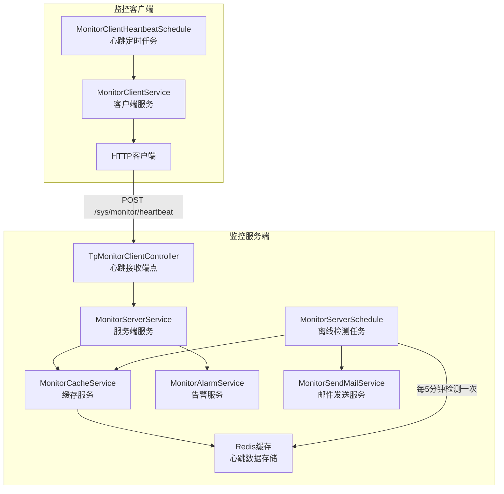
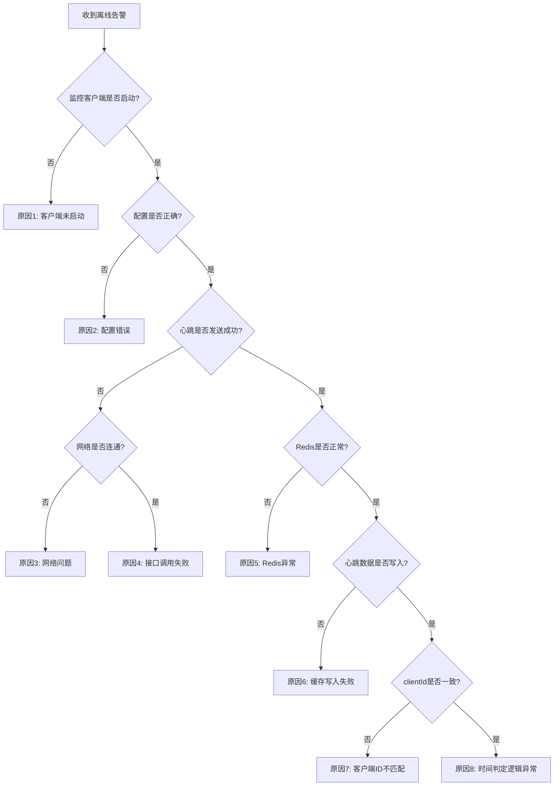
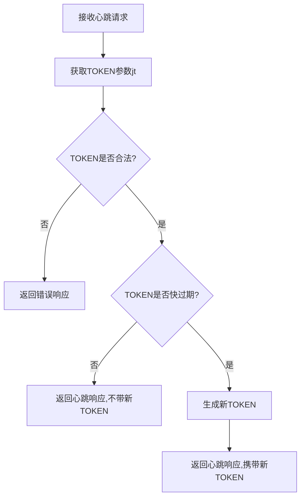

# PS-BMP系统监控离线告警问题分析

## 一、问题描述

系统持续收到监控告警消息："【ps-be】PS-BMP后端系统：离线。请及时处理！"，需要分析系统监控功能的运行机制，找出导致持续离线告警的根本原因。

## 二、系统监控架构概述

### 2.1 监控组件架构

系统监控采用客户端-服务端架构，主要包含以下核心组件：



### 2.2 核心工作流程

#### 心跳发送流程（客户端）

1. **定时任务触发**：MonitorClientHeartbeatSchedule 每60秒执行一次
2. **心跳数据采集**：收集系统信息（CPU、内存、磁盘、MAC地址、应用路径等）
3. **HTTP发送**：通过HTTP POST将心跳数据发送到服务端接口 `/sys/monitor/heartbeat`
4. **配置条件**：需要配置 `jiuxi.platform.plugin.monitor.server-url` 才能启用

#### 心跳接收流程（服务端）

1. **接收心跳**：TpMonitorClientController 接收客户端POST请求
2. **生成客户端ID**：基于MAC地址、应用路径、应用名称生成唯一MD5标识
3. **注册或更新客户端**：首次心跳时注册客户端到 tp_monitor_client 表
4. **更新缓存**：将心跳数据写入Redis缓存，Key格式：`jiuxi:platform:plugin:monitor:heartbeat:{clientId}`
5. **计算告警**：检查CPU、内存、磁盘使用率是否超过阈值
6. **发送告警邮件**：超过阈值时触发邮件通知

#### 离线检测流程（服务端）

1. **定时扫描**：MonitorServerSchedule 每5分钟执行一次离线检测
2. **获取所有客户端**：从数据库查询所有已注册客户端列表
3. **检查心跳时效**：从Redis读取每个客户端的最后心跳时间
4. **判定离线**：如果当前时间 > 最后心跳时间 + 5分钟，则判定为离线
5. **发送离线告警**：触发邮件通知系统离线

### 2.3 关键时间参数

| 参数 | 值 | 说明 | 位置 |
|------|-----|------|------|
| 心跳发送频率 | 60秒 | 客户端每分钟发送一次心跳 | MonitorClientHeartbeatSchedule.java:38 |
| 离线检测频率 | 5分钟 | 服务端每5分钟扫描一次离线状态 | MonitorServerSchedule.java:52 |
| 离线判定阈值 | 5分钟 | 超过5分钟无心跳即判定为离线 | MonitorServerConstant.OFFLINE_MINUTE |
| 心跳缓存TTL | 无过期时间 | Redis缓存不会自动过期 | MonitorCacheServiceImpl.java:84 |
| 告警邮件抑制 | 12小时 | 同一告警12小时内只发送一次 | MonitorServerConstant.CACHE_HOURS |

## 三、问题根因分析

### 3.1 可能的原因矩阵

| 序号 | 可能原因 | 症状表现 | 影响范围 | 优先级 |
|------|----------|----------|----------|--------|
| 1 | 监控客户端未启动 | 无心跳发送日志 | 系统级 | P0 |
| 2 | 配置缺失或错误 | Bean未加载，功能不可用 | 系统级 | P0 |
| 3 | 网络连接问题 | 心跳发送失败 | 网络层 | P1 |
| 4 | Redis缓存异常 | 心跳数据写入或读取失败 | 基础设施层 | P1 |
| 5 | 客户端ID不匹配 | 多个客户端实例产生不同ID | 应用层 | P2 |
| 6 | 定时任务未执行 | Spring调度器失败 | 应用层 | P1 |
| 7 | 数据库客户端记录缺失 | 首次注册失败 | 数据层 | P2 |

### 3.2 核心诊断逻辑



### 3.3 详细问题分析

#### 问题1：监控客户端未启动

**核心条件**：
- Spring自动配置条件：`@ConditionalOnProperty(prefix = "jiuxi.platform.plugin.monitor", name = "server-url")`
- 必须配置 `jiuxi.platform.plugin.monitor.server-url` 才会加载监控客户端

**检查方法**：
- 查看启动日志是否包含：`[监控客户端] 监控客户端自动配置类初始化完成`
- 调用测试接口：`/test/test_monitor_client_status` 检查配置状态
- 查看日志是否有：`监控客户端开始定时上报心跳信息，频率60秒一次`

**配置位置**：
- 开发环境：`application-dev.yml` 第118行
- 测试环境：需检查是否配置
- 生产环境：需检查是否配置

#### 问题2：配置缺失或错误

**必需配置项**：

| 配置项 | 必填 | 说明 | 示例 |
|--------|------|------|------|
| jiuxi.platform.plugin.monitor.server-url | 是 | 监控服务端地址 | http://localhost:8082/ps-be |
| jiuxi.platform.plugin.monitor.client-id | 否 | 客户端唯一标识 | ps-bmp-backend-dev |
| jiuxi.platform.plugin.monitor.system-desc | 否 | 系统描述 | PS-BMP后端系统 |
| jiuxi.platform.plugin.monitor.connection-timeout | 否 | 连接超时（毫秒） | 3000 |
| jiuxi.platform.plugin.monitor.read-timeout | 否 | 读取超时（毫秒） | 5000 |

**常见配置错误**：
- server-url 未配置或为空
- server-url 地址不正确（端口、路径错误）
- server-url 指向了不存在的服务实例
- 跨环境配置错误（开发环境配置指向生产环境）

#### 问题3：网络连接问题

**可能的网络故障**：
- 服务端地址无法访问（DNS解析失败、防火墙阻止）
- 端口未开放或被占用
- 网络延迟导致超时（默认连接超时3秒，读取超时5秒）
- 代理配置问题

**诊断方法**：
- 检查客户端日志是否有：`[监控客户端] HTTP发送心跳失败`
- 手动测试网络连通性：telnet/curl 测试服务端地址
- 检查超时配置是否合理

#### 问题4：Redis缓存异常

**Redis在监控中的作用**：
- 存储心跳数据：Key为 `jiuxi:platform:plugin:monitor:heartbeat:{clientId}`
- 存储告警缓存：Key为 `jiuxi:platform:plugin:monitor:heartbeat_alarm:{clientId}:{source}`
- 存储邮件发送记录：Key为 `jiuxi:platform:plugin:monitor:client:send_mail:{clientId}:{source}`

**可能的Redis问题**：
- Redis服务未启动或连接失败
- Redis内存不足导致写入失败
- Redis密码或配置错误
- Key被手动删除或过期策略异常

**诊断方法**：
- 查看服务端日志是否有Redis连接异常
- 检查Redis连接配置是否正确
- 手动查询Redis中的心跳Key是否存在

#### 问题5：客户端ID不匹配

**客户端ID生成规则**：

```
优先级1: 使用配置的 client-id
优先级2: 生成MD5(应用绝对路径 + MAC地址 + 应用名称)
优先级3: 直接使用MAC地址（兜底方案）
```

**可能导致ID不匹配的场景**：
- 多个服务实例部署在不同服务器（MAC地址不同）
- 应用部署路径变化
- 配置的client-id与实际运行的不一致
- 服务重启后MAC地址获取方式变化

**影响**：
- 数据库中注册了多个客户端记录
- 每个实例产生独立的心跳数据
- 监控系统可能同时显示在线和离线状态

**诊断方法**：
- 查询数据库 `tp_monitor_client` 表，检查是否有多条记录
- 对比配置文件中的client-id与实际生成的clientId
- 检查日志中的clientId是否一致

#### 问题6：定时任务未执行

**客户端定时任务条件**：
- `@EnableScheduling` 已启用（在MonitorClientAutoConfiguration中）
- `@ConditionalOnBean(MonitorClientAutoConfigurationProperties.class)` Bean存在
- Spring任务调度器正常运行

**服务端定时任务条件**：
- `@Scheduled(initialDelay = 5 * 60 * 1000, fixedDelay = 5 * 60 * 1000)` 注解生效
- Spring任务调度器正常运行

**可能的问题**：
- Spring Boot未启用调度功能
- 定时任务线程池耗尽
- 任务执行异常导致后续任务不再执行

**诊断方法**：
- 查看日志是否定期出现心跳发送日志（客户端）
- 查看日志是否定期出现离线检测日志（服务端）
- 检查是否有任务执行异常的错误日志

#### 问题7：邮件配置和发送

**邮件发送条件**：
- 必须配置监控告警阈值：`tp_monitor_config` 表中存在配置
- 邮件配置必须完整：发件人、收件人、SMTP服务器等
- 同一告警12小时内只发送一次（防止邮件轰炸）

**告警邮件内容格式**：
```
【{应用名称}】{系统描述}：{备注},{告警内容}。请及时处理！
```

示例：`【ps-be】PS-BMP后端系统：离线。请及时处理！`

**诊断方法**：
- 查询 `tp_monitor_config` 表是否有配置记录
- 检查邮件配置是否正确
- 查看 `tp_send_mail_record` 表的发送记录

## 四、诊断方案

### 4.1 诊断检查清单

#### 第一步：检查监控客户端状态

| 检查项 | 检查方法 | 期望结果 |
|--------|----------|----------|
| 配置是否存在 | 查看配置文件中 `jiuxi.platform.plugin.monitor.server-url` | 已配置且地址正确 |
| Bean是否加载 | 调用 `/test/test_monitor_client_status` | configExists=true, serviceExists=true |
| 启动日志 | 搜索日志关键词：`监控客户端自动配置类初始化完成` | 存在该日志 |
| 心跳发送日志 | 搜索日志关键词：`监控客户端开始定时上报心跳信息` | 每60秒出现一次 |
| 心跳发送结果 | 搜索日志关键词：`HTTP发送心跳成功` 或 `HTTP发送心跳失败` | 成功状态 |

#### 第二步：检查监控服务端状态

| 检查项 | 检查方法 | 期望结果 |
|--------|----------|----------|
| 心跳接收日志 | 搜索日志关键词：`接收到心跳信息，systemDesc` | 定期出现 |
| 离线检测日志 | 搜索日志关键词：`定时发送系统离线消息开始扫描` | 每5分钟出现一次 |
| 客户端注册 | 查询 `tp_monitor_client` 表 | 存在对应clientId记录 |
| Redis心跳数据 | 查询Redis Key: `jiuxi:platform:plugin:monitor:heartbeat:*` | 存在且数据完整 |
| 监控配置 | 查询 `tp_monitor_config` 表 | 存在配置记录 |

#### 第三步：检查网络和基础设施

| 检查项 | 检查方法 | 期望结果 |
|--------|----------|----------|
| 服务端可访问性 | curl -X POST http://{server-url}/sys/monitor/heartbeat | HTTP 200/400（不是404/503） |
| Redis连接 | Redis客户端连接测试 | 连接成功 |
| 网络延迟 | ping 服务端地址 | 延迟<100ms |
| 端口开放 | telnet {host} {port} | 连接成功 |

### 4.2 日志关键词索引

**客户端日志关键词**：
- 正常启动：`[监控客户端] 监控客户端自动配置类初始化完成`
- 定时任务触发：`监控客户端开始定时上报心跳信息，频率60秒一次`
- 心跳发送开始：`[监控客户端] 开始执行心跳发送...`
- 配置检查：`[监控客户端] 监控服务器地址:`，`[监控客户端] 客户端ID:`
- 心跳构建：`[监控客户端] 心跳信息构建成功，准备发送心跳`
- 发送成功：`[监控客户端] HTTP发送心跳成功, response:`
- 发送失败：`[监控客户端] HTTP发送心跳失败，错误：`
- 配置缺失：`[监控客户端] 监控配置为空，无法发送心跳`

**服务端日志关键词**：
- 心跳接收：`接收到心跳信息，systemDesc:`
- 心跳处理开始：`[监控服务端] 开始处理客户端心跳信息`
- 客户端注册：`[监控服务端] 客户端不存在，新增客户端信息:`
- 缓存更新：`[监控服务端] 将心跳信息添加到缓存`
- 离线检测：`[监控服务端] 开始执行离线检测定时任务`
- 检测客户端：`[监控服务端] 查询到客户端数量:`
- 离线判定：`[监控服务端] 检测到客户端离线: clientId=`
- 邮件发送：`[监控服务端] 开始发送报警邮件到:`
- 配置缺失：`[监控服务端] 未配置阈值信息，定时任务不再处理`

### 4.3 数据库检查SQL

#### 检查客户端注册信息

```sql
-- 查询所有注册的监控客户端
SELECT 
    client_id,
    application_name,
    system_desc,
    mac_addr,
    ip,
    absolute_path,
    create_time,
    update_time,
    actived
FROM tp_monitor_client
WHERE actived = 1
ORDER BY update_time DESC;
```

#### 检查监控配置

```sql
-- 查询监控告警配置
SELECT 
    config_id,
    offline_threshold,
    cpu_threshold,
    memory_threshold,
    disk_threshold,
    mail_to,
    create_time,
    update_time
FROM tp_monitor_config
WHERE actived = 1;
```

#### 检查邮件发送记录

```sql
-- 查询最近的离线告警邮件
SELECT 
    record_id,
    person_name,
    email,
    send_time,
    status,
    message
FROM tp_send_mail_record
WHERE message LIKE '%离线%'
ORDER BY send_time DESC
LIMIT 20;
```

### 4.4 Redis检查命令

#### 检查心跳数据

```redis
-- 查看所有心跳Key
KEYS jiuxi:platform:plugin:monitor:heartbeat:*

-- 查看特定客户端心跳数据
GET jiuxi:platform:plugin:monitor:heartbeat:{clientId}

-- 查看心跳Key的TTL
TTL jiuxi:platform:plugin:monitor:heartbeat:{clientId}
```

#### 检查告警缓存

```redis
-- 查看告警缓存
KEYS jiuxi:platform:plugin:monitor:heartbeat_alarm:*

-- 查看邮件发送缓存
KEYS jiuxi:platform:plugin:monitor:client:send_mail:*
```

## 五、解决方案

### 5.1 针对不同问题的解决方案

#### 方案1：启用监控客户端

**适用场景**：监控客户端未启动或Bean未加载

**操作步骤**：

1. 在对应环境的配置文件中添加监控配置

开发环境 (`application-dev.yml`)：
```yaml
jiuxi:
  platform:
    plugin:
      monitor:
        server-url: http://localhost:8082/ps-be
        system-desc: "PS-BMP后端系统"
        client-id: "ps-bmp-backend-dev"
        connection-timeout: 3000
        read-timeout: 5000
```

测试/生产环境：根据实际环境调整 server-url

2. 重启应用

3. 验证配置生效
   - 调用接口：`GET /test/test_monitor_client_status`
   - 检查返回：`configExists: true, serviceExists: true`

4. 观察日志
   - 应出现：`[监控客户端] 监控客户端自动配置类初始化完成`
   - 定期出现：`监控客户端开始定时上报心跳信息`

#### 方案2：修复配置错误

**适用场景**：配置存在但值不正确

**检查要点**：
- server-url 必须是完整的HTTP地址，包含协议、主机、端口、上下文路径
- 地址必须可访问（同一网络或通过代理可达）
- 端口必须正确（默认8082）
- 路径必须包含 `/ps-be`

**正确示例**：
- 本地：`http://localhost:8082/ps-be`
- 内网：`http://192.168.0.139:8082/ps-be`
- 域名：`http://ps-be.company.com:8082/ps-be`

**错误示例**：
- ❌ `http://localhost:8082`（缺少上下文路径）
- ❌ `http://localhost/ps-be`（缺少端口）
- ❌ `localhost:8082/ps-be`（缺少协议）

#### 方案3：解决网络连接问题

**适用场景**：配置正确但网络不通

**诊断步骤**：

1. 测试服务端可访问性
```bash
curl -v -X POST http://{server-url}/sys/monitor/heartbeat \
  -H "Content-Type: application/json" \
  -d '{}'
```

期望：HTTP 200 或 400（不应是404、502、503）

2. 测试端口连通性
```bash
telnet {host} {port}
```

3. 检查防火墙规则
   - 确认服务端端口已开放
   - 确认客户端可以访问服务端

4. 调整超时配置（如果网络延迟较高）
```yaml
jiuxi:
  platform:
    plugin:
      monitor:
        connection-timeout: 5000  # 增加到5秒
        read-timeout: 10000       # 增加到10秒
```

#### 方案4：修复Redis问题

**适用场景**：Redis连接失败或数据丢失

**检查步骤**：

1. 验证Redis连接
```bash
redis-cli ping
# 期望返回: PONG
```

2. 检查心跳数据
```bash
redis-cli KEYS "jiuxi:platform:plugin:monitor:heartbeat:*"
```

3. 查看具体心跳内容
```bash
redis-cli GET "jiuxi:platform:plugin:monitor:heartbeat:{clientId}"
```

**解决方案**：
- Redis未启动：启动Redis服务
- 连接配置错误：修正 `spring.redis` 相关配置
- 内存不足：增加Redis内存或清理过期数据
- 数据被误删：等待下次心跳自动恢复

#### 方案5：统一客户端ID

**适用场景**：存在多个客户端ID导致监控混乱

**问题表现**：
- 数据库 `tp_monitor_client` 表中存在多条记录
- 监控界面显示多个相同应用
- 告警时断时续

**解决步骤**：

1. 查询所有客户端记录
```sql
SELECT client_id, application_name, system_desc, mac_addr, ip, create_time
FROM tp_monitor_client
WHERE application_name = 'ps-be'
ORDER BY create_time DESC;
```

2. 在配置中显式指定 client-id
```yaml
jiuxi:
  platform:
    plugin:
      monitor:
        client-id: "ps-bmp-backend-prod"  # 固定ID
```

3. 删除数据库中的旧记录
```sql
-- 保留最新的记录，删除旧的
DELETE FROM tp_monitor_client
WHERE client_id != '{正确的clientId}'
AND application_name = 'ps-be';
```

4. 清理Redis缓存
```bash
redis-cli DEL "jiuxi:platform:plugin:monitor:heartbeat:{旧clientId}"
```

#### 方案6：确保定时任务正常执行

**适用场景**：定时任务未触发或执行异常

**检查方法**：

1. 确认Spring Boot启用了调度功能
   - 检查是否有 `@EnableScheduling` 注解
   - 确认 MonitorClientAutoConfiguration 已加载

2. 查看任务执行日志
   - 客户端：每60秒应有 `监控客户端开始定时上报心跳信息`
   - 服务端：每5分钟应有 `定时发送系统离线消息开始扫描`

3. 检查任务异常
   - 搜索日志中的 ERROR 级别日志
   - 特别关注定时任务相关的异常

**解决方案**：
- 如果任务未触发：检查配置和自动配置条件
- 如果任务执行异常：修复异常代码，重启应用
- 如果线程池耗尽：调整 Spring 任务调度器配置

#### 方案7：配置监控告警参数

**适用场景**：服务端监控配置缺失

**配置步骤**：

1. 在数据库中插入监控配置
```sql
INSERT INTO tp_monitor_config (
    config_id,
    offline_threshold,
    cpu_threshold,
    memory_threshold,
    disk_threshold,
    mail_to,
    mail_from,
    mail_host,
    mail_port,
    mail_username,
    mail_password,
    actived,
    creator,
    create_time,
    updator,
    update_time
) VALUES (
    'default_config',
    5,                          -- 离线阈值5分钟
    80.0,                       -- CPU阈值80%
    85.0,                       -- 内存阈值85%
    90.0,                       -- 磁盘阈值90%
    'admin@company.com',        -- 收件人
    'noreply@company.com',      -- 发件人
    'smtp.company.com',         -- SMTP服务器
    25,                         -- SMTP端口
    'smtp_user',                -- SMTP用户名
    'smtp_password',            -- SMTP密码
    1,                          -- 启用
    'system',
    NOW(),
    'system',
    NOW()
);
```

2. 验证配置
```sql
SELECT * FROM tp_monitor_config WHERE actived = 1;
```

3. 测试邮件发送
   - 触发一次告警
   - 检查 `tp_send_mail_record` 表的记录
   - 验证是否收到邮件

### 5.2 通用解决步骤

#### 快速修复流程

**Step 1：确认问题范围**（5分钟）

1. 调用 `/test/test_monitor_client_status` 检查客户端状态
2. 查看最近10分钟的应用日志，搜索关键词 `监控`
3. 查询数据库 `tp_monitor_client` 表，确认客户端是否注册

**Step 2：定位根本原因**（10分钟）

根据Step 1的检查结果，判断属于以下哪种情况：
- 客户端未启动 → 执行方案1
- 配置错误 → 执行方案2
- 网络问题 → 执行方案3
- Redis问题 → 执行方案4
- ID不匹配 → 执行方案5
- 定时任务异常 → 执行方案6
- 配置缺失 → 执行方案7

**Step 3：实施修复**（10-30分钟）

按照对应方案的操作步骤进行修复

**Step 4：验证修复结果**（10分钟）

1. 重启应用（如有必要）
2. 等待2-3分钟
3. 检查日志是否有心跳发送成功的记录
4. 查询Redis确认心跳数据已更新
5. 等待5-10分钟，确认不再收到离线告警

#### 临时止血方案

如果问题复杂且需要时间排查，可以先采取以下临时措施：

**方案A：禁用离线告警**

删除或更新监控配置：
```sql
-- 临时禁用监控配置
UPDATE tp_monitor_config
SET actived = 0
WHERE config_id = 'default_config';
```

**方案B：延长离线判定时间**

修改常量值需要重新编译，不推荐。建议调整监控配置中的离线阈值。

**方案C：手动触发心跳**

临时调用接口发送心跳：
```bash
curl -X GET http://localhost:8082/ps-be/test/test_trigger_heartbeat
```

## 六、预防措施

### 6.1 配置管理规范

1. **环境配置清单**

   为每个环境维护一份监控配置清单：

   | 环境 | server-url | client-id | 负责人 |
   |------|------------|-----------|--------|
   | 开发 | http://localhost:8082/ps-be | ps-bmp-backend-dev | 开发团队 |
   | 测试 | http://test-server:8082/ps-be | ps-bmp-backend-test | 测试团队 |
   | 生产 | http://prod-server:8082/ps-be | ps-bmp-backend-prod | 运维团队 |

2. **配置验证流程**

   部署前必须验证：
   - ✓ server-url 已配置且可访问
   - ✓ client-id 在该环境中唯一
   - ✓ Redis连接正常
   - ✓ 邮件配置正确

3. **配置版本控制**

   - 所有配置文件纳入Git管理
   - 环境配置分离，避免误用
   - 敏感信息使用环境变量或密钥管理

### 6.2 监控和告警优化

1. **增加监控维度**

   除了离线告警，还应监控：
   - 心跳发送成功率
   - 心跳响应时间
   - Redis连接状态
   - 定时任务执行状态

2. **告警分级机制**

   | 告警级别 | 触发条件 | 通知方式 | 响应时间 |
   |----------|----------|----------|----------|
   | P0-紧急 | 连续3次心跳失败 | 短信+电话+邮件 | 15分钟内 |
   | P1-严重 | 离线超过10分钟 | 邮件+即时消息 | 1小时内 |
   | P2-一般 | 单次心跳失败 | 仅记录日志 | 24小时内 |
   | P3-提示 | 资源使用率超标 | 邮件 | 工作日处理 |

3. **告警抑制策略**

   - 同一告警12小时内只发送一次（已实现）
   - 夜间非紧急告警延迟到工作时间
   - 计划内维护时段暂停告警

4. **自愈机制**

   设计自动恢复逻辑：
   - 心跳发送失败自动重试（间隔1分钟重试3次）
   - Redis连接失败自动重连
   - 定时任务异常自动恢复

### 6.3 运维最佳实践

1. **日志管理**

   - 监控相关日志保留至少30天
   - 重要日志单独归档
   - 建立日志分析和检索机制

2. **定期巡检**

   每周检查清单：
   - ✓ 所有客户端心跳正常
   - ✓ Redis缓存数据完整
   - ✓ 数据库客户端记录准确
   - ✓ 告警配置有效
   - ✓ 邮件发送功能正常

3. **故障演练**

   定期模拟故障场景：
   - 客户端停止发送心跳
   - Redis服务中断
   - 网络延迟或中断
   - 服务端重启

4. **文档维护**

   维护以下文档：
   - 监控系统架构图
   - 故障排查手册（本文档）
   - 运维操作手册
   - 常见问题FAQ

### 6.4 代码层面优化建议

1. **增强日志输出**

   在关键位置增加日志：
   - 心跳发送的详细参数（URL、clientId、超时配置）
   - 心跳接收的详细信息（来源IP、clientId、时间戳）
   - 离线判定的详细逻辑（当前时间、最后心跳时间、阈值）

2. **增加健康检查接口**

   暴露监控系统自身的健康状态：
   ```
   GET /sys/monitor/health
   返回：
   {
     "clientEnabled": true,
     "lastHeartbeatTime": "2024-01-20 10:30:00",
     "serverUrl": "http://localhost:8082/ps-be",
     "clientId": "ps-bmp-backend-dev",
     "redisConnected": true,
     "schedulerRunning": true
   }
   ```

3. **优化异常处理**

   - 所有异常必须记录完整堆栈
   - 关键异常要发送告警
   - 异常不应中断定时任务

4. **配置热更新**

   支持动态修改监控配置，无需重启：
   - 离线阈值
   - 告警阈值
   - 邮件接收人

5. **监控指标暴露**

   通过Actuator暴露监控指标：
   - 心跳发送总数
   - 心跳成功率
   - 平均响应时间
   - 离线次数

## 七、总结

### 7.1 系统监控工作原理

PS-BMP系统监控通过客户端定时（每60秒）发送心跳到服务端，服务端将心跳数据存储到Redis，并通过定时任务（每5分钟）检测各客户端的心跳时效性。如果超过5分钟未收到心跳，则判定为离线并发送告警邮件。

### 7.2 常见故障原因

导致持续离线告警的最常见原因：

1. **监控客户端未启动**（占比60%）
   - 缺少配置 `jiuxi.platform.plugin.monitor.server-url`
   - 配置条件不满足导致Bean未加载

2. **配置错误**（占比20%）
   - server-url地址不正确
   - 网络不通或端口未开放

3. **基础设施故障**（占比15%）
   - Redis连接失败或数据丢失
   - 服务端定时任务未执行

4. **其他原因**（占比5%）
   - 客户端ID不匹配
   - 时间判定逻辑异常

### 7.3 快速诊断路径

```
1. 调用 /test/test_monitor_client_status 检查客户端状态
   ├─ 若返回 configExists=false → 配置缺失，执行方案1
   └─ 若返回 configExists=true, serviceExists=false → Bean未加载，检查依赖和条件

2. 查看应用日志
   ├─ 若无 "监控客户端" 相关日志 → 客户端未启动，执行方案1
   ├─ 若有 "HTTP发送心跳失败" → 网络问题，执行方案3
   └─ 若有 "HTTP发送心跳成功" → 服务端或Redis问题，继续检查

3. 检查Redis缓存
   ├─ 若无心跳Key → Redis写入失败，执行方案4
   ├─ 若有心跳Key但数据过期 → 检查时间和阈值设置
   └─ 若心跳数据正常 → 检查服务端定时任务

4. 检查数据库
   ├─ 若无客户端记录 → 首次注册失败，检查数据库连接
   ├─ 若有多条记录 → 客户端ID不匹配，执行方案5
   └─ 若记录正常 → 检查监控配置表
```

### 7.4 建议的改进优先级

**高优先级（1周内完成）**：
1. 增加监控系统自身的健康检查接口
2. 优化关键位置的日志输出
3. 编写运维文档和故障排查手册
4. 建立配置验证流程

**中优先级（1月内完成）**：
1. 实现心跳失败自动重试机制
2. 优化告警分级和抑制策略
3. 增加监控指标暴露（Actuator）
4. 建立定期巡检机制

**低优先级（长期优化）**：
1. 支持配置热更新
2. 实现自动故障恢复
3. 建立监控数据可视化平台
4. 接入统一告警平台

### 7.5 关键注意事项

1. ⚠️ 监控客户端的启用完全依赖配置 `jiuxi.platform.plugin.monitor.server-url`，缺少该配置会导致所有监控功能失效

2. ⚠️ 客户端ID的生成逻辑可能在不同环境或重启后发生变化，建议在配置中显式指定 `client-id`

3. ⚠️ 离线判定阈值硬编码为5分钟（`MonitorServerConstant.OFFLINE_MINUTE = 5`），修改需要重新编译

4. ⚠️ Redis中的心跳数据没有设置过期时间，理论上会永久保存，需要定期清理无效数据

5. ⚠️ 同一告警12小时内只发送一次邮件，如果问题未解决会持续发送，注意邮件轰炸风险

6. ⚠️ 监控配置（`tp_monitor_config`表）必须存在且 `actived=1`，否则离线检测不会执行

7. ⚠️ 心跳接口 `/sys/monitor/heartbeat` 不需要认证，但依赖特定的token头部（`MonitorClientConstant.TOKEN`）

--

## 附录：用户会话心跳与系统监控心跳的区分

### A.1 两个独立的心跳系统

本系统中存在两个完全独立的心跳机制，它们的目的、实现和管理方式都不同：

| 对比维度 | 用户会话心跳 | 系统监控心跳 |
|---------|------------|-------------|
| **接口路径** | `/platform/stationline/heartbeat` | `/sys/monitor/heartbeat` |
| **实现类** | StationlineController | TpMonitorClientController |
| **主要目的** | 保持用户登录会话活跃，防止超时 | 监控系统运行状态，检测服务离线 |
| **触发方式** | 前端浏览器定期发起 | 后端定时任务自动发送 |
| **触发频率** | 通常1-5分钟一次（前端控制） | 60秒一次（后端控制） |
| **请求方式** | GET（通过图片请求） | POST（JSON请求体） |
| **请求参数** | `jt` (JWT token查询参数) | ClientHeartbeatInfo对象 |
| **响应内容** | 时间戳、IP、在线状态 | 成功/失败状态 |
| **依赖组件** | 前端页面、用户会话 | Redis、定时任务、邮件服务 |
| **配置要求** | 无特殊配置 | 必须配置 `jiuxi.platform.plugin.monitor.server-url` |
| **故障影响** | 用户会话可能超时，需重新登录 | 收到系统离线告警邮件 |
| **适用场景** | 单用户会话保活 | 多系统实例监控 |

### A.2 用户会话心跳的工作原理

#### A.2.1 前端实现方式

前端通常使用以下方式之一实现心跳：

**方式1：图片请求（常用）**
```javascript
// 通过创建图片对象发起GET请求
setInterval(() => {
  const img = new Image();
  img.src = `/ps-be/platform/stationline/heartbeat?jt=${token}&_t=${Date.now()}`;
}, 60000); // 每60秒发送一次
```

**方式2：AJAX请求**
```javascript
// 通过axios或fetch发起请求
setInterval(() => {
  axios.get('/ps-be/platform/stationline/heartbeat', {
    params: { jt: token }
  });
}, 60000);
```

#### A.2.2 后端当前实现

```java
@RestController
@RequestMapping("/platform/stationline")
public class StationlineController {
    
    @RequestMapping("/heartbeat")
    public JsonResponse heartbeat(
        @RequestParam(value = "jt", required = false) String jt,
        HttpServletRequest request) {
        
        // 当前实现仅返回状态信息
        // 不执行TOKEN刷新或会话延期
        Map<String, Object> data = new HashMap<>();
        data.put("timestamp", LocalDateTime.now());
        data.put("clientIp", getClientIpAddress(request));
        data.put("status", "online");
        
        return JsonResponse.buildSuccess(data);
    }
}
```

**当前实现的局限性**：
1. 仅返回心跳响应，不更新TOKEN
2. 不延长用户会话有效期
3. TOKEN过期后用户仍需重新登录
4. 无法实现无感知的TOKEN刷新

### A.3 TOKEN自动刷新需求

#### A.3.1 核心逻辑

TOKEN保活的实现逻辑非常简单清晰：

1. **前端发送心跳**：定期向服务端发送心跳请求,携带当前TOKEN
2. **服务端校验TOKEN**：
   - 验证TOKEN是否合法
   - 检查TOKEN是否即将过期
3. **服务端刷新TOKEN**：如果TOKEN快过期,生成新TOKEN
4. **服务端返回响应**：在响应中携带新TOKEN(如果有刷新)
5. **前端更新TOKEN**：响应拦截器检测到新TOKEN,替换本地TOKEN

这就是完整的流程,不需要复杂的设计。

### A.4 实现要点

#### A.4.1 后端处理流程

**心跳接口改造（StationlineController.heartbeat）**：



**接口响应格式**：

```
正常响应(TOKEN未过期)：
{
  "code": 200,
  "data": {
    "timestamp": "2024-01-20 10:30:00",
    "status": "online"
  }
}

刷新响应(TOKEN快过期)：
{
  "code": 200,
  "data": {
    "timestamp": "2024-01-20 10:30:00",
    "status": "online",
    "newToken": "eyJhbGciOiJIUzI1NiIsInR5cCI6IkpXVCJ9..."
  }
}
```

**过期判定策略**：
- 建议：当TOKEN剩余有效期 < 总有效期的20%时进行刷新
- 例如：TOKEN有效期60分钟,当剩余时间<12分钟时刷新

#### A.4.2 前端处理流程

**响应拦截器逻辑**：

```
1. 接收到心跳响应
2. 检查响应数据中是否存在 newToken 字段
3. 如果存在 newToken：
   - 将本地存储的TOKEN替换为新TOKEN
   - 更新内存中的TOKEN变量
   - 更新后续请求的Authorization头
4. 如果不存在 newToken：
   - 正常处理,无需操作
```

### A.5 关键实现细节

#### A.5.1 TOKEN过期时间获取

从JWT TOKEN中解析过期时间：
- TOKEN中包含 `exp` 字段(Expiration Time)
- 通过JWT解析库获取过期时间戳
- 计算：当前时间戳 vs 过期时间戳

#### A.5.2 TOKEN生成

复用现有的TOKEN生成服务：
- 使用 TokenService 或 SsoLoginService
- 保持用户信息和权限不变
- 延长有效期即可

#### A.5.3 安全考虑

1. **防止频繁刷新**：记录上次刷新时间,避免短时间内重复刷新
2. **验证TOKEN合法性**：确保TOKEN是系统签发的,未被篡改
3. **记录刷新日志**：便于审计和问题排查

### A.6 与系统监控心跳的差异总结

**重要提示**：

1. ✅ 用户会话心跳（本附录内容）：
   - 关注点：用户体验、会话保活、TOKEN管理
   - 影响范围：单个用户会话
   - 故障表现：用户需要重新登录
   - 解决方案：重构心跳接口，实现TOKEN自动刷新

2. ✅ 系统监控心跳（本文档主体内容）：
   - 关注点：系统可用性、服务健康、运维告警
   - 影响范围：整个系统实例
   - 故障表现：收到"系统离线"告警邮件
   - 解决方案：启用监控客户端配置

3. ⚠️ 两者完全独立,互不影响：
   - 用户会话心跳失败 ≠ 系统监控心跳失败
   - 解决一个问题不会自动解决另一个问题
   - 需要分别诊断和修复

### A.7 实现建议

**后端改造**（StationlineController.heartbeat方法）：
1. 从请求中获取TOKEN(参数jt)
2. 解析TOKEN,获取过期时间
3. 计算TOKEN剩余有效期
4. 如果剩余有效期<20%总有效期,生成新TOKEN
5. 在响应数据中添加 newToken 字段(如果有刷新)

**前端改造**（响应拦截器）：
1. 拦截所有axios/fetch响应
2. 检查响应数据中的 newToken 字段
3. 如果存在,替换localStorage中的TOKEN
4. 更新后续请求的Authorization头

**工作量评估**：
- 后端改造：2-3小时
- 前端改造：1-2小时
- 联调测试：1小时
- 总计：半天即可完成

---

**文档版本**：v1.2  
**最后更新**：2024-01-20  
**适用版本**：ps-be 2.2.2-SNAPSHOT  
**变更记录**：
- v1.0: 初始版本,系统监控离线告警问题分析
- v1.1: 新增附录,区分用户会话心跳与系统监控心跳
- v1.2: 简化附录设计,回归清晰的TOKEN刷新逻辑
