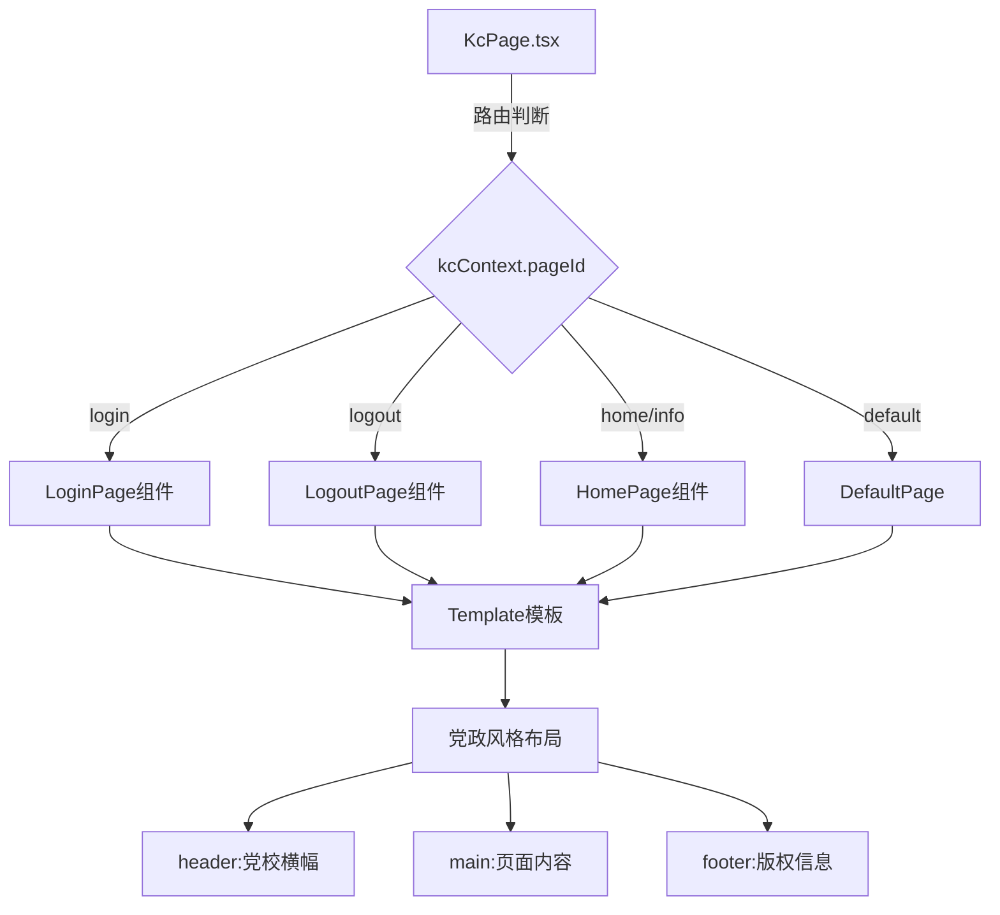
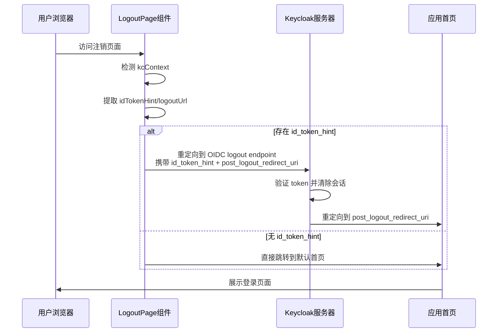

# ps-theme 主题覆盖和自动注销功能设计

## 需求概述

为 ps-theme Keycloak 主题项目追加两项增强功能:

1. **主页主题覆盖**: 对 Keycloak 主页(Home Page)应用自定义主题样式,保持与登录页面一致的党政风格
2. **注销页自动注销**: 实现注销页面的自动跳转逻辑,无需用户手动点击,自动完成 OIDC 注销流程并跳转到指定地址

---

## 功能一:主页主题覆盖

### 业务目标

统一 Keycloak 各页面的视觉体验,将主页(Home Page)纳入自定义主题覆盖范围,确保用户在访问 Keycloak 主页时看到与登录页面一致的党政风格界面。

### 设计方案

#### 主题覆盖策略

采用 Keycloakify 的页面级主题定制能力,针对主页(pageId 为 `login.ftl` 或相关主页类型)进行独立组件开发。

#### 实现架构



#### 组件结构设计

| 组件层级 | 组件名称 | 职责说明 |
|---------|---------|---------|
| 路由层 | KcPage.tsx | 根据 pageId 分发到不同页面组件 |
| 页面层 | HomePage.tsx | 主页内容渲染,展示 Keycloak 主页信息 |
| 布局层 | Template.tsx | 统一的党政风格模板(已存在) |
| 样式层 | login.css | 主页专属样式定义 |

#### 主页内容设计

主页应包含以下信息展示:

| 内容模块 | 展示内容 | 数据来源 |
|---------|---------|---------|
| 用户信息区 | 当前登录用户名、邮箱 | kcContext.user |
| 快捷入口 | 账户管理、修改密码、安全设置 | Keycloak 默认链接 |
| 系统信息 | Realm 名称、应用名称 | kcContext.realm |
| 操作区域 | 注销按钮 | url.logoutUrl |

#### 样式继承策略

复用现有 Template.tsx 的党政风格布局:
- **Header**: 保留党校横幅和标题
- **Main Content**: 添加主页专属内容区域样式
- **Footer**: 保持版权信息一致

---

## 功能二:注销页自动注销

### 业务目标

优化用户注销体验,消除传统注销页面的手动确认步骤,实现页面加载后自动完成 OIDC 标准注销流程,并跳转到指定的后置登录页面。

### 设计方案

#### 注销流程设计



#### 注销页面实现逻辑

| 处理阶段 | 逻辑描述 | 关键参数 |
|---------|---------|---------|
| 参数提取 | 从 kcContext 获取注销所需信息 | url.logoutUrl, idTokenHint, realm |
| URL 构建 | 拼接 OIDC logout endpoint | `{realm}/protocol/openid-connect/logout` |
| 参数拼接 | 附加查询参数 | `id_token_hint`, `post_logout_redirect_uri` |
| 重定向执行 | 使用 window.location.replace() | 完整 logoutUrl |

#### 注销参数配置表

| 参数名称 | 参数类型 | 来源 | 说明 |
|---------|---------|------|------|
| id_token_hint | Query String | kcContext.idTokenHint | OIDC ID Token,用于验证注销请求合法性 |
| post_logout_redirect_uri | Query String | kcContext.url.login 或自定义 | 注销后跳转目标地址 |
| realm | Path Variable | kcContext.url.realm | Keycloak Realm 路径 |

#### 降级策略

当无法获取 `id_token_hint` 时的处理方案:

| 场景 | 策略 | 跳转目标 |
|------|------|---------|
| id_token_hint 为空或未定义 | 跳过 OIDC 标准注销,直接跳转 | kcContext.url.login 或应用首页 |
| post_logout_redirect_uri 未配置 | 使用默认值 | window.location.origin |
| 网络异常 | 显示简短提示后延迟跳转 | 默认首页 |

#### 用户体验设计

| 元素 | 设计要求 |
|------|---------|
| 加载提示 | 显示"正在退出登录,稍候..."文案 |
| 视觉反馈 | 展示加载动画或进度指示器(可选) |
| 跳转延迟 | 建议无延迟立即跳转,提升响应速度 |
| 错误处理 | 捕获异常后显示友好提示,3秒后自动跳转 |

#### 注销页面布局结构

采用极简布局,减少用户感知的停留时间:

| 区域 | 内容 | 样式说明 |
|------|------|---------|
| Header | 保留党校横幅(可选简化版) | 与登录页一致 |
| Main Content | 注销提示文案 + 加载指示器 | 居中显示,字体清晰 |
| Footer | 版权信息(可选) | 与登录页一致 |

---

## 技术实现要点

### Keycloakify 集成方式

| 集成点 | 实现方式 | 文件位置 |
|-------|---------|---------|
| 页面路由 | 在 KcPage.tsx 的 switch 语句中添加 case 分支 | src/login/KcPage.tsx |
| 主页组件 | 创建 HomePage.tsx 导出 React 组件 | src/login/pages/HomePage.tsx |
| 注销组件 | 创建 LogoutPage.tsx 包含自动跳转逻辑 | src/login/pages/LogoutPage.tsx |
| 样式扩展 | 在 login.css 中添加主页和注销页专属样式 | src/login/resources/css/login.css |

### KcContext 上下文数据获取

从 kcContext 获取所需数据的映射关系:

| 数据需求 | kcContext 路径 | 类型 | 用途 |
|---------|---------------|------|------|
| Realm 基础 URL | kcContext.url.realm | string | 拼接 OIDC logout endpoint |
| 登录页 URL | kcContext.url.login | string | 作为 post_logout_redirect_uri |
| ID Token Hint | kcContext.idTokenHint | string? | OIDC 注销验证参数 |
| 用户信息 | kcContext.user | object? | 主页用户信息展示 |
| Realm 名称 | kcContext.realm.displayName | string | 主页系统信息展示 |

### React 组件生命周期策略

| 生命周期钩子 | 使用场景 | 执行逻辑 |
|------------|---------|---------|
| useEffect([], []) | 注销页自动跳转 | 组件挂载后立即执行 window.location.replace() |
| useEffect | 主页数据获取 | 从 kcContext 提取用户信息并渲染 |
| useState | 加载状态管理 | 控制加载提示的显示/隐藏 |

### URL 构造逻辑

注销 URL 拼接规则示例:

```
基础 URL: {kcContext.url.realm}/protocol/openid-connect/logout
查询参数:
  - id_token_hint: {kcContext.idTokenHint}
  - post_logout_redirect_uri: {encodeURIComponent(kcContext.url.login)}

完整示例:
https://keycloak.example.com/realms/ps-realm/protocol/openid-connect/logout?id_token_hint=eyJhbGc...&post_logout_redirect_uri=https%3A%2F%2Fapp.example.com%2Flogin
```

---

## 样式设计规范

### 主页样式扩展

| 样式类名 | 作用对象 | 样式说明 |
|---------|---------|---------|
| .home-page-container | 主页主容器 | 最大宽度 800px,居中对齐 |
| .home-user-info | 用户信息卡片 | 白色背景,圆角 8px,阴影效果 |
| .home-quick-links | 快捷入口区域 | Grid 布局,2列或3列 |
| .home-link-item | 单个快捷入口 | 悬停效果,边框高亮 |

### 注销页样式扩展

| 样式类名 | 作用对象 | 样式说明 |
|---------|---------|---------|
| .logout-page-container | 注销页主容器 | 居中对齐,最小高度 400px |
| .logout-message | 注销提示文案 | 字体 18px,颜色 #333 |
| .logout-loader | 加载指示器 | 旋转动画,直径 40px |

### 复用现有党政风格变量

保持与登录页一致的设计 token:

| 变量名 | 值 | 用途 |
|-------|---|------|
| 主题色(党政红) | #C8102E | 横幅背景、强调元素 |
| 金色装饰 | #FFD700 | 分隔线、图标高亮 |
| 文字主色 | #333333 | 正文内容 |
| 背景色 | #F5F5F5 | 页面整体背景 |

---

## 构建和部署影响

### 构建流程无变化

新增页面组件不影响现有构建流程,仍然通过以下命令构建主题:

```
npm run build-keycloak-theme
```

### JAR 文件变化

| 变化项 | 说明 |
|-------|------|
| 文件大小 | 预计增加约 5-10 KB(新增 2 个页面组件) |
| 主题范围 | 新增 Home Page 和 Logout Page 的主题覆盖 |
| 向后兼容性 | 完全兼容现有登录页主题,不影响其他页面 |

### Keycloak 部署配置

| 配置项 | 调整说明 |
|-------|---------|
| Realm Theme 设置 | 无需调整,继续使用 ps-theme |
| Logout Redirect URI | 需在 Keycloak Client 配置中添加 Valid Post Logout Redirect URIs |
| 主题刷新 | 替换 JAR 文件后重启 Keycloak 服务 |

---

## 测试验证要点

### 主页功能测试

| 测试场景 | 验证要点 | 期望结果 |
|---------|---------|---------|
| 访问主页 | 浏览器访问 `/realms/{realm}/account` | 展示党政风格主页,包含用户信息 |
| 样式检查 | 检查 Header/Footer 一致性 | 与登录页布局风格完全一致 |
| 快捷链接 | 点击"账户管理"等链接 | 正常跳转到对应功能页面 |
| 响应式布局 | 在移动端和桌面端访问 | 自适应屏幕尺寸 |

### 注销功能测试

| 测试场景 | 验证要点 | 期望结果 |
|---------|---------|---------|
| 正常注销 | 登录后点击注销 | 自动跳转到 logout endpoint,然后返回登录页 |
| Token 验证 | 检查网络请求的 id_token_hint 参数 | 携带有效的 ID Token |
| 会话清除 | 注销后尝试访问受保护资源 | 需要重新登录 |
| 降级测试 | 模拟无 id_token_hint 场景 | 直接跳转到登录页,不报错 |
| 重定向 URI | 检查 post_logout_redirect_uri | 跳转到预期的登录页地址 |

### 浏览器兼容性测试

| 浏览器 | 测试版本 | 重点验证 |
|-------|---------|---------|
| Chrome | 最新稳定版 | window.location.replace() 行为 |
| Firefox | 最新稳定版 | URL 参数编码正确性 |
| Safari | 最新稳定版 | 重定向延迟和动画流畅性 |
| Edge | 最新稳定版 | 样式兼容性 |

---

## 风险与限制

### 技术风险

| 风险项 | 影响 | 缓解措施 |
|-------|------|---------|
| kcContext 数据缺失 | idTokenHint 可能为 undefined | 实现降级逻辑,直接跳转到登录页 |
| OIDC 标准兼容性 | 不同 Keycloak 版本行为差异 | 测试 Keycloak 22-25 版本的注销流程 |
| 浏览器重定向拦截 | 部分浏览器可能阻止自动跳转 | 添加用户可点击的"继续"按钮作为备选 |

### 功能限制

| 限制项 | 说明 | 应对方案 |
|-------|------|---------|
| 主页内容定制深度 | 当前仅覆盖样式,不修改 Keycloak 核心功能 | 若需深度定制,需开发 Account Theme |
| 注销跳转目标 | 仅支持配置单一的 post_logout_redirect_uri | 可通过 URL 参数动态传递目标地址 |
| 多 Realm 场景 | 不同 Realm 可能有不同的注销逻辑 | 通过 kcContext.realm 区分处理 |

### 用户体验限制

| 限制项 | 影响 | 优化建议 |
|-------|------|---------|
| 注销确认 | 无二次确认,可能误触发 | 在应用层添加"确认注销"弹窗 |
| 加载时间 | 网络慢时跳转延迟 | 添加超时处理和友好提示 |
| 返回导航 | 浏览器后退按钮行为未定义 | 使用 replace() 而非 href 避免历史记录堆积 |

---

## 交付物清单

### 源代码文件

| 文件路径 | 文件类型 | 说明 |
|---------|---------|------|
| src/login/pages/HomePage.tsx | React 组件 | 主页视图组件 |
| src/login/pages/LogoutPage.tsx | React 组件 | 注销页自动跳转组件 |
| src/login/KcPage.tsx | 路由配置 | 新增 home 和 logout 页面路由 |
| src/login/resources/css/login.css | 样式文件 | 新增主页和注销页样式 |

### 构建产物

| 产物 | 位置 | 说明 |
|------|------|------|
| Keycloak Theme JAR | dist_keycloak/keycloak-theme-for-kc-22-to-25.jar | 包含新功能的主题包 |

### 文档更新

| 文档 | 更新内容 |
|------|---------|
| KEYCLOAK_THEME_BUILD_GUIDE.md | 新增主页和注销页功能说明 |
| README.md | 更新功能特性列表 |

---

## 后续优化方向

### 功能增强

| 优化项 | 优先级 | 说明 |
|-------|-------|------|
| 主页个性化内容 | 中 | 支持用户自定义快捷入口和常用功能 |
| 注销确认弹窗 | 低 | 在应用层提供可配置的二次确认 |
| 注销日志记录 | 中 | 记录用户注销行为到审计日志 |

### 性能优化

| 优化项 | 优先级 | 说明 |
|-------|-------|------|
| 组件懒加载 | 低 | 对主页和注销页实现按需加载 |
| 样式压缩 | 低 | 进一步减小 CSS 文件体积 |

### 用户体验优化

| 优化项 | 优先级 | 说明 |
|-------|-------|------|
| 注销动画效果 | 低 | 添加渐出动画提升视觉体验 |
| 多语言支持 | 中 | 为主页和注销页添加英文翻译 |
| 移动端适配 | 高 | 优化小屏设备的布局和交互 |
