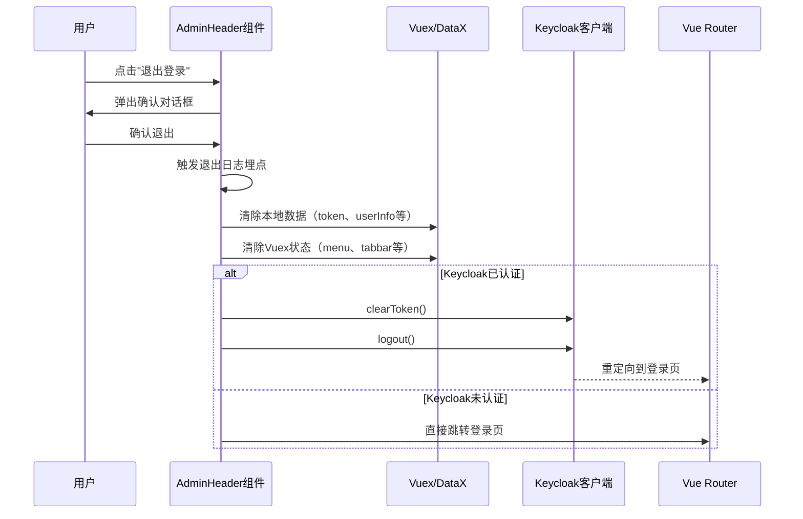
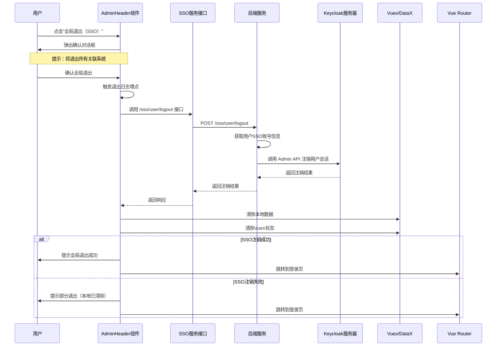

# AdminHeader 添加 SSO 全局退出功能设计文档

## 1. 需求概述

在 AdminHeader 组件的退出功能中，增加一个新的"全局退出"选项。该选项将触发 SSO（单点登录）的全局退出功能，确保用户在所有关联系统中的会话都被清除。

### 1.1 业务背景

当前系统已集成 Keycloak SSO 单点登录功能，用户可在多个子系统间免登录访问。现有的退出功能仅执行本地退出或部分退出，不能完全清除 Keycloak 服务器端的会话状态。

### 1.2 核心诉求

- 在用户头像下拉菜单中，增加"全局退出"选项
- "全局退出"需要调用 Keycloak 的全局注销接口，清除服务器端所有会话
- 保留现有的"退出登录"功能作为本地退出选项
- 两种退出方式需要明确区分，避免用户混淆

## 2. 功能设计

### 2.1 用户界面设计

#### 2.1.1 下拉菜单结构调整

在用户头像下拉弹出菜单的 `card-footer` 区域，增加"全局退出"选项：

**原有结构：**
- 修改密码（card-body）
- 退出登录（card-footer）

**调整后结构：**
- 修改密码（card-body）
- 退出登录（card-footer）
- 全局退出（card-footer，新增）

#### 2.1.2 视觉区分

两个退出选项需要视觉上的区分：

| 功能项 | 图标 | 文本标签 | 位置 | 视觉样式 |
|-------|------|---------|------|---------|
| 退出登录 | exit | "退出登录" | card-footer 第一项 | 默认样式 |
| 全局退出 | logout（或其他合适图标） | "全局退出（SSO）" | card-footer 第二项 | 可选择不同颜色或图标以示区别 |

### 2.2 交互流程设计

#### 2.2.1 本地退出流程

保持现有逻辑不变：



#### 2.2.2 全局退出流程（新增）



### 2.3 后端接口设计

系统已提供 SSO 用户退出接口，无需新增后端功能。

#### 2.3.1 现有接口说明

**接口路径：** `/sso/user/logout`  
**请求方法：** POST  
**功能描述：** 注销当前用户的所有 SSO 会话

**请求参数：** 无（从会话中获取当前用户信息）

**响应数据结构：**

| 字段 | 类型 | 说明 |
|-----|------|------|
| code | Integer | 响应码（1：成功，其他：失败） |
| message | String | 响应消息 |
| data.logoutType | String | 退出类型：sso（SSO退出成功）/ local（本地退出）/ partial（部分退出） |
| data.message | String | 详细说明 |

**退出类型说明：**

- `sso`：成功通过 Keycloak REST API 注销用户会话
- `local`：用户未绑定 SSO 账号或无法连接 Keycloak，仅执行本地退出
- `partial`：Keycloak 注销失败，但本地会话已清除

## 3. 实现要点

### 3.1 前端组件改动点

**文件路径：** `ps-fe\@fb\admin-base\views\main\components\AdminHeader.vue`

#### 3.1.1 模板（Template）调整

在用户头像下拉弹出菜单的 `card-footer` 部分，增加全局退出选项：

**位置：** 第 143-148 行（card-footer 区域）

**改动内容：**
- 保留现有的"退出登录"选项
- 新增"全局退出（SSO）"选项
- 调整容器布局以容纳两个退出选项

**布局要求：**
- 两个退出选项垂直排列
- 每个选项包含图标和文字标签
- 支持独立的点击事件

#### 3.1.2 脚本（Script）调整

**新增方法：**

方法名称：`globalLogout`

功能描述：执行 SSO 全局退出

处理逻辑：
1. 弹出确认对话框，提示用户将退出所有关联系统
2. 用户确认后，调用 SSO 用户退出接口
3. 根据后端返回的 `logoutType` 判断退出结果
4. 触发退出日志埋点
5. 清除本地数据（调用现有的数据清理逻辑）
6. 清除 Vuex 状态
7. 显示退出结果提示
8. 跳转到登录页面

**错误处理：**
- 接口调用失败时，执行本地清理并提示用户
- 确保无论 SSO 注销是否成功，本地会话都被清除

**日志埋点：**
- 复用现有的 `logoutLog` 方法
- 或根据退出类型记录不同的日志标识

### 3.2 服务接口调用

**文件路径：** `ps-fe\@fb\admin-base\service\sys\sso\index.js`

**已有方法：** `user.logout()`

调用方式：
```javascript
// 在 AdminHeader.vue 的 globalLogout 方法中调用
this.$svc.sys.sso.user.logout()
```

返回值处理：
- 检查 `code` 字段判断成功或失败
- 根据 `data.logoutType` 判断退出类型
- 显示 `data.message` 或 `message` 字段作为提示信息

### 3.3 样式调整

**文件路径：** `ps-fe\@fb\admin-base\views\main\components\AdminHeader.vue`（`<style>` 部分）

**位置：** 第 1130-1134 行（card-footer 样式）

**改动要求：**
- 确保 card-footer 容器能够容纳两个退出选项
- 两个选项垂直排列，间距合理
- 保持与现有 card-item 样式一致
- hover 效果与其他菜单项一致

**可选样式区分：**
- 为全局退出选项添加特定的 CSS 类名（如 `global-logout-item`）
- 可通过颜色或图标进行视觉区分

## 4. 数据流设计

### 4.1 前端数据清理流程

无论是本地退出还是全局退出，都需要执行以下数据清理操作：

**DataX 存储清理：**
- `login`
- `token`
- `TOKEN_REAL`
- `userInfo`

**Vuex 状态清理：**
- `admin/removeToken`
- `menu/clear`
- `tabbar/clear`

**Keycloak 客户端清理：**
- 调用 `clearToken()` 清除本地令牌缓存
- 对于本地退出：调用 `logout()` 跳转到登录页
- 对于全局退出：依赖后端 API 清除服务器端会话

### 4.2 会话清除范围对比

| 清除范围 | 本地退出 | 全局退出（SSO） |
|---------|---------|----------------|
| 浏览器本地存储 | ✓ | ✓ |
| Vuex 状态 | ✓ | ✓ |
| Keycloak 客户端令牌 | ✓ | ✓ |
| Keycloak 服务器会话 | 部分（仅当前客户端） | ✓（所有客户端） |
| 其他关联系统会话 | ✗ | ✓ |

## 5. 异常处理设计

### 5.1 网络异常处理

**场景：** 调用 `/sso/user/logout` 接口失败（网络错误、超时等）

**处理策略：**
1. 捕获异常，显示错误提示："SSO 退出服务暂时不可用，已执行本地退出"
2. 继续执行本地数据清理流程
3. 跳转到登录页面
4. 记录错误日志

### 5.2 SSO 服务异常处理

**场景：** 后端无法连接 Keycloak 服务器，返回 `logoutType: 'local'` 或 `logoutType: 'partial'`

**处理策略：**
1. 根据返回的 `message` 提示用户
2. 执行本地数据清理
3. 跳转到登录页面
4. 不影响用户正常退出流程

### 5.3 用户取消操作

**场景：** 用户在确认对话框中点击"取消"

**处理策略：**
- 不执行任何退出操作
- 关闭确认对话框
- 保持当前登录状态

## 6. 兼容性设计

### 6.1 SSO 功能未启用场景

**判断依据：**
- 用户未绑定 SSO 账号
- Keycloak 配置未启用
- 后端返回 `logoutType: 'local'`

**处理方式：**
- 前端不做特殊判断，统一调用 `/sso/user/logout` 接口
- 由后端判断并返回相应的退出类型
- 前端根据返回类型显示相应提示

### 6.2 降级策略

如果 SSO 全局退出接口调用失败：
1. 确保本地退出逻辑正常执行
2. 清除所有本地会话数据
3. 跳转到登录页面
4. 显示降级提示信息

## 7. 用户体验优化

### 7.1 确认对话框文案

**本地退出确认：**
- 标题："退出确认"
- 内容："确定要退出吗？"（保持现有文案）

**全局退出确认：**
- 标题："全局退出确认"
- 内容："确定要退出所有关联系统吗？退出后需要重新登录才能访问。"

### 7.2 退出结果提示

根据不同的退出类型，显示相应的提示信息：

| 退出类型 | 提示信息 | 提示类型 |
|---------|---------|---------|
| sso | "全局退出成功，已清除所有系统会话" | success |
| local | "本地退出成功" | success |
| partial | "部分退出成功，本地会话已清除" | warning |
| 网络异常 | "SSO 退出服务暂时不可用，已执行本地退出" | warning |

### 7.3 图标选择建议

| 功能项 | 推荐图标 | 语义说明 |
|-------|---------|---------|
| 退出登录 | exit | 表示退出当前应用 |
| 全局退出（SSO） | logout / power-off / sign-out-alt | 表示全局注销 |

## 8. 测试验证要点

### 8.1 功能测试场景

**场景 1：正常全局退出**
- 前置条件：用户已通过 SSO 登录，绑定了 Keycloak 账号
- 操作步骤：点击"全局退出（SSO）"→ 确认退出
- 预期结果：后端返回 `logoutType: 'sso'`，显示成功提示，跳转到登录页

**场景 2：用户未绑定 SSO**
- 前置条件：用户通过本地账号登录，未绑定 Keycloak 账号
- 操作步骤：点击"全局退出（SSO）"→ 确认退出
- 预期结果：后端返回 `logoutType: 'local'`，显示本地退出提示，跳转到登录页

**场景 3：Keycloak 服务不可用**
- 前置条件：Keycloak 服务器停止或网络不通
- 操作步骤：点击"全局退出（SSO）"→ 确认退出
- 预期结果：后端返回 `logoutType: 'partial'` 或接口超时，显示降级提示，本地会话清除成功，跳转到登录页

**场景 4：本地退出功能**
- 前置条件：用户已登录
- 操作步骤：点击"退出登录"→ 确认退出
- 预期结果：执行现有本地退出逻辑，本地数据清除，跳转到登录页

**场景 5：用户取消退出**
- 前置条件：用户已登录
- 操作步骤：点击"退出登录"或"全局退出（SSO）"→ 点击取消
- 预期结果：关闭确认对话框，保持登录状态

### 8.2 UI 测试要点

- 下拉菜单中两个退出选项布局正常
- 图标和文字对齐一致
- hover 效果正常显示
- 确认对话框样式和文案正确
- 退出提示信息显示位置和样式合理

### 8.3 数据清理验证

- 检查 localStorage / sessionStorage 中的 token、userInfo 等数据是否清除
- 检查 Vuex 状态是否清空
- 检查 Keycloak 客户端令牌是否清除
- 尝试访问受保护页面，验证是否正确跳转到登录页

### 8.4 日志验证

- 验证退出操作是否记录日志埋点
- 检查日志中的 `operateType` 是否为 `logout`
- 验证错误情况下是否记录异常日志

## 9. 风险评估

### 9.1 潜在风险

| 风险项 | 影响程度 | 概率 | 应对措施 |
|-------|---------|------|---------|
| SSO 服务不稳定导致退出失败 | 中 | 低 | 实现降级策略，确保本地退出始终可用 |
| 用户误操作全局退出影响其他系统使用 | 中 | 中 | 提供明确的确认提示和功能说明 |
| 后端接口响应慢导致用户体验下降 | 低 | 低 | 添加 loading 提示，设置合理的超时时间 |
| 前后端对退出类型理解不一致 | 高 | 低 | 严格按照接口文档处理返回值 |

### 9.2 兼容性风险

- 现有"退出登录"功能的用户习惯：通过保留现有功能，新增全局退出选项，降低用户习惯改变的影响
- 未启用 SSO 的租户：后端自动判断并返回本地退出类型，前端统一处理
- 移动端或响应式布局：需确保两个退出选项在小屏幕设备上也能正常显示和操作

## 10. 后续优化建议

### 10.1 短期优化

- 在用户首次使用全局退出时，显示功能说明提示
- 为全局退出添加独立的埋点事件，便于统计使用情况
- 根据用户反馈调整确认对话框文案

### 10.2 长期优化

- 考虑在系统设置中增加默认退出方式配置
- 提供退出历史记录查询功能
- 支持退出后自动清理浏览器缓存的选项
- 考虑添加"退出其他设备"功能

## 11. 关键约束与依赖

### 11.1 技术依赖

- 后端已实现 `/sso/user/logout` 接口
- Keycloak 服务器正常运行
- 前端已集成 `@fb/admin-base/service/sys/sso` 服务模块
- Vue Router 配置正确

### 11.2 业务约束

- 全局退出需要用户已绑定 SSO 账号
- 必须保留现有的本地退出功能
- 退出操作需要用户确认
- 退出后必须跳转到登录页面

### 11.3 性能约束

- 退出接口响应时间应控制在 3 秒以内
- 超时情况下需执行降级策略
- 本地数据清理操作不应阻塞页面跳转
