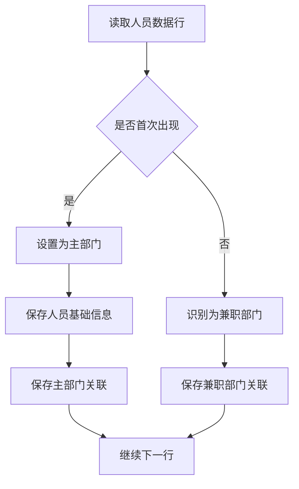

## 13. 格式统一说明

### 13.1 导入导出格式一致性

**核心原则**：导出的Excel文件可以直接用于导入，无需任何格式转换

**统一规范**：

| 项目 | 规范说明 |
|-----|---------|
| 列名一致 | 导出和导入使用完全相同的列名 |
| 列顺序一致 | 导出和导入的列顺序保持一致 |
| 数据格式一致 | 日期、数字、枚举值格式完全一致 |
| 路径分隔符 | 统一使用">"分隔层级路径 |
| 编号格式 | 部门编号统一使用两位字母+3位数字（AB001） |
| 编码路径分隔 | 统一使用">"分隔编号路径（AB001>CD001） |

### 13.2 部门导入导出格式对照

**Excel列定义**

| 列名 | 数据类型 | 格式说明 | 导入必填 | 导出是否包含 |
|-----|---------|---------|--------|-----------|
| 部门层级路径 | 文本 | 用">"分隔，如：学校 > 计算机学院 > 软件工程系 | 是 | 是 |
| 部门编号 | 文本 | 两位字母+3位数字，如：AB001 | 否 | 是 |
| 部门全称 | 文本 | - | 是 | 是 |
| 部门简称 | 文本 | - | 否 | 是 |
| 部门类型 | 文本 | 字典值 | 是 | 是 |
| 负责人姓名 | 文本 | - | 否 | 是 |
| 负责人电话 | 文本 | - | 否 | 是 |
| 协办人 | 文本 | - | 否 | 是 |
| 显示顺序 | 数字 | - | 否 | 是 |
| 部门描述 | 文本 | - | 否 | 是 |

### 13.3 人员导入导出格式对照

**Excel列定义**

| 列名 | 数据类型 | 格式说明 | 导入必填 | 导出是否包含 |
|-----|---------|---------|--------|-----------|
| 人员姓名 | 文本 | - | 是 | 是 |
| 人员编号 | 文本 | - | 否 | 是 |
| 所属部门 | 文本 | 用">"分隔，如：学校 > 计算机学院 > 软件工程系 | 是 | 是 |
| 状态 | 文本 | 试用/试用延期/正式/临时/实习/离职/退休/解聘/无效 | **是** | 是 |
| 上级 | 文本 | 人员姓名（单个） | 否 | 是 |
| 助理 | 文本 | 人员姓名，多个用","分割 | 否 | 是 |
| 其他上级 | 文本 | 人员姓名，多个用","分割 | 否 | 是 |
| 户口类型 | 文本 | 本市城镇/本市农村/外埠城镇/外埠农村 | 否 | 是 |
| 婚姻状况 | 文本 | 已婚/未婚/离异/丧偶 | 否 | 是 |
| 解除账号 | 文本 | 是/否 | 否 | 是 |
| 性别 | 文本 | 男/女 | 否 | 是 |
| 手机号码 | 文本 | - | 否 | 是 |
| 电子邮箱 | 文本 | - | 否 | 是 |
| 证件类型 | 文本 | 字典值 | 否 | 是 |
| 证件号码 | 文本 | - | 否 | 是 |
| 职位 | 文本 | - | 否 | 是 |
| 办公室 | 文本 | - | 否 | 是 |
| 备注 | 文本 | - | 否 | 是 |

### 13.4 Excel模板结构规范

**通用结构要求**

| 项目 | 规范说明 |
|-----|--------|
| Sheet数量 | 2个Sheet页 |
| 第一页名称 | 数据导入页（组织架构/人员信息） |
| 第二页名称 | 导入说明 |
| 第一页第1行 | 列标题行，字段名称 |
| 第一页第2行起 | 数据行（无说明行） |
| 单元格批注 | 关键字段通过批注提供填写说明 |

**部门导入模板（组织架构导入模板.xlsx）**

- Sheet1：组织架构
  - 第1行：列标题（部门层级路径、部门编号、部门全称等）
  - 第2行起：部门数据
- Sheet2：导入说明
  - 详细的填写规则和示例
  - 字段约束说明
  - 注意事项

**人员导入模板（人员导入模板.xlsx）**

- Sheet1：人员信息
  - 第1行：列标题（人员姓名、人员编号、所属部门、状态等）
  - 第2行起：人员数据
  - 关键字段带批注：
    - 助理：此列请输入人员姓名，多个之间请用,分割
    - 其他上级：此列请输入人员姓名，多个之间请用,分割
    - 上级：此列请输入人员姓名，不支持多个
    - 状态：可选项为：试用、试用延期、正式、临时、实习、离职、退休、解聘、无效（必填）
    - 户口类型：可选项为：本市城镇、本市农村、外埠城镇、外埠农村
    - 婚姻状况：可选项为：已婚、未婚、离异、丧偶
    - 解除账号：如果需要解除人员账号，请选择"是"，解除人员账号导入时，这些字段的内容将被忽略：账号、登录手机号、登录邮箱、登录名、密码
- Sheet2：导入说明
  - 详细的填写规则和示例
  - 字段约束说明
  - 特殊场景说明（如兼职处理）
  - 注意事项

### 13.5 人员兼职处理规则

**兼职场景识别**

当同一人员在导入数据中出现多次（通过姓名或人员编号识别为同一人）时，视为兼职场景。

**主部门确定规则**

| 规则 | 说明 |
|-----|-----|
| 识别依据 | 人员姓名 + 人员编号（如提供） |
| 主部门判定 | 首次出现的所属部门为主部门 |
| 兼职部门 | 后续出现的所属部门为兼职部门 |
| 数据存储 | 主部门写入主字段，兼职部门关联存储 |

**兼职处理流程**

**字段继承规则**

| 字段类型 | 兼职时处理方式 |
|---------|-------------|
| 基础信息字段 | 仅主部门行生效（姓名、编号、性别、手机等） |
| 部门相关字段 | 每个部门独立（所属部门、上级、助理、其他上级） |
| 职位字段 | 每个部门可不同 |
| 状态字段 | 以主部门为准 |

**示例说明**

假设导入数据如下：

| 行号 | 人员姓名 | 人员编号 | 所属部门 | 职位 | 手机号码 |
|-----|---------|---------|---------|------|--------|
| 2 | 张三 | P001 | 计算机学院 > 软件工程系 | 教授 | 13800138000 |
| 5 | 张三 | P001 | 计算机学院 > 人工智能系 | 兼职教授 | - |

处理结果：
- 主部门：计算机学院 > 软件工程系
- 兼职部门：计算机学院 > 人工智能系
- 手机号码：13800138000（仅主部门行生效）
- 软件工程系职位：教授
- 人工智能系职位：兼职教授

**冲突处理**

| 冲突场景 | 处理策略 |
|---------|--------|
| 基础信息不一致 | 以主部门（首次出现）为准，记录警告 |
| 人员编号冲突 | 姓名+编号必须完全一致，否则报错 |
| 兼职部门不存在 | 整体导入失败，提示具体行号 |
