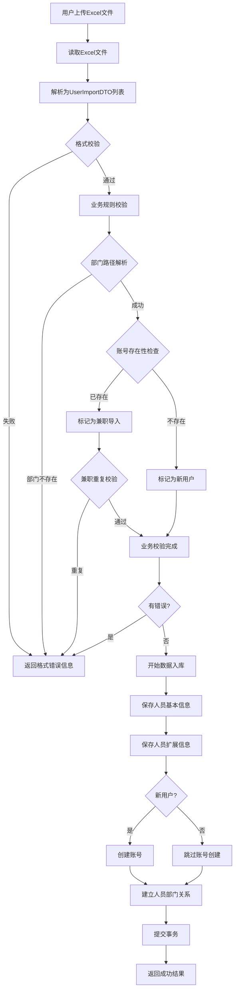
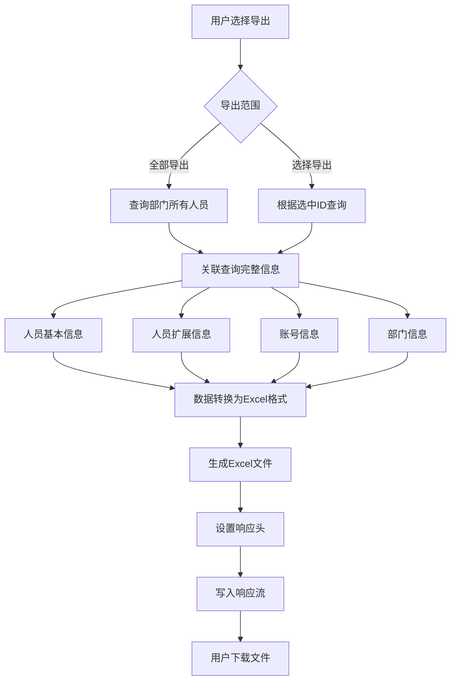

# 用户导入导出功能重构设计

## 1. 需求概述

本设计针对系统中用户导入导出功能进行重构，实现基于Excel模板的用户批量导入和数据导出功能，支持用户基本信息、扩展信息、部门关系、账号信息的完整管理。

### 1.1 核心目标

- 支持通过Excel模板批量导入用户数据
- 支持用户数据导出为Excel文件
- 支持用户兼职部门管理
- 确保导入导出数据的一致性和完整性
- 提供完善的数据校验和错误处理机制

### 1.2 导入模板字段定义

根据提供的Excel模板，系统需处理以下字段：

| Excel列名 | 字段说明 | 数据类型 | 是否必填 | 备注 |
|----------|---------|---------|---------|------|
| 账号名 | 登录账号 | 文本 | 是 | 唯一性约束 |
| 初始密码 | 账号密码 | 文本 | 是 | 明文输入，系统加密存储 |
| 姓名 | 人员姓名 | 文本 | 是 | - |
| 性别 | 性别信息 | 枚举 | 否 | 男/女 |
| 部门 | 所属部门 | 文本 | 是 | 支持层级路径格式 |
| 参加工作时间 | 工作起始时间 | 日期 | 否 | 格式：YYYY.MM |
| 职务职级 | 职务信息 | 文本 | 否 | - |
| 职称 | 专业技术职称 | 文本 | 否 | - |
| 身份证号码 | 身份证号 | 文本 | 否 | 唯一性约束 |

## 2. 数据库表结构分析

### 2.1 现有表结构

#### 2.1.1 用户基本信息表 (tp_person_basicinfo)

存储用户的核心基本信息。

| 字段名 | 类型 | 说明 | 对应模板字段 |
|-------|------|------|-------------|
| PERSON_ID | VARCHAR(50) | 人员ID（主键） | - |
| PERSON_NAME | VARCHAR(100) | 人员姓名 | 姓名 |
| PERSON_NO | VARCHAR(50) | 人员编号 | - |
| SEX | INTEGER | 性别（0保密/1男/2女） | 性别 |
| IDCARD | VARCHAR(50) | 身份证号码 | 身份证号码 |
| PHONE | VARCHAR(50) | 手机号码（加密存储） | - |
| EMAIL | VARCHAR(100) | 电子邮箱 | - |
| OFFICE | VARCHAR(100) | 职位 | 职务职级 |
| ASCN_ID | VARCHAR(50) | 所属机构ID | - |
| ACTIVED | INTEGER | 是否有效（1有效/0无效） | - |
| CATEGORY | VARCHAR(20) | 人员类别 | - |
| CREATOR | VARCHAR(50) | 创建人 | - |
| CREATE_TIME | DATETIME | 创建时间 | - |
| UPDATOR | VARCHAR(50) | 更新人 | - |
| UPDATE_TIME | DATETIME | 更新时间 | - |
| TENANT_ID | VARCHAR(50) | 租户ID | - |

#### 2.1.2 用户扩展信息表 (tp_person_exinfo)

存储用户的扩展属性信息。

| 字段名 | 类型 | 说明 | 对应模板字段 |
|-------|------|------|-------------|
| PERSON_ID | VARCHAR(50) | 人员ID（主键） | - |
| TITLE_CODE | VARCHAR(50) | 职称代码 | 职称 |
| PART_WORK_DATE | VARCHAR(20) | 参加工作时间 | 参加工作时间 |
| POSITION | VARCHAR(100) | 职务 | 职务职级 |
| POLITICS_CODE | VARCHAR(20) | 政治面貌代码 | - |
| DIPLOMA_CODE | VARCHAR(20) | 学历代码 | - |
| DEGREE | VARCHAR(50) | 学位 | - |
| SCHOOL | VARCHAR(200) | 毕业学校 | - |
| SEPC_SUBJECT | VARCHAR(100) | 专业 | - |

#### 2.1.3 账号表 (tp_account)

存储用户的登录账号信息。

| 字段名 | 类型 | 说明 | 对应模板字段 |
|-------|------|------|-------------|
| ACCOUNT_ID | VARCHAR(50) | 账号ID（主键） | - |
| USERNAME | VARCHAR(100) | 账号名 | 账号名 |
| USERPWD | VARCHAR(200) | 密码（SM3加密） | 初始密码 |
| PERSON_ID | VARCHAR(50) | 关联人员ID | - |
| PHONE | VARCHAR(50) | 手机号（加密存储） | - |
| LOCKED | INTEGER | 是否冻结（0未冻结/1冻结） | - |
| ENABLED | INTEGER | 是否启用（0禁用/1启用） | - |
| ACTIVED | INTEGER | 是否有效（1有效/0无效） | - |
| TENANT_ID | VARCHAR(50) | 租户ID | - |
| CREATE_TIME | DATETIME | 创建时间 | - |
| UPDATE_TIME | DATETIME | 更新时间 | - |

#### 2.1.4 人员部门关系表 (tp_person_dept)

存储用户与部门的关联关系，支持主部门和兼职部门。

| 字段名 | 类型 | 说明 |
|-------|------|------|
| PERSON_ID | VARCHAR(50) | 人员ID |
| DEPT_ID | VARCHAR(50) | 部门ID |
| DEFAULT_DEPT | INTEGER | 默认部门标识（1主部门/0兼职部门） |

#### 2.1.5 部门基本信息表 (tp_dept_basicinfo)

存储部门的基本信息和层级关系。

| 字段名 | 类型 | 说明 |
|-------|------|------|
| DEPT_ID | VARCHAR(50) | 部门ID（主键） |
| PDEPT_ID | VARCHAR(50) | 父部门ID |
| DEPT_LEVELCODE | VARCHAR(100) | 部门层级编码 |
| DEPT_NO | VARCHAR(50) | 部门编号 |
| DEPT_FULL_NAME | VARCHAR(200) | 部门全称 |
| DEPT_SIMPLE_NAME | VARCHAR(100) | 部门简称 |
| DEPT_TYPE | VARCHAR(20) | 部门类型 |
| CATEGORY | INTEGER | 部门类别（0政府/1企业） |
| ASCN_ID | VARCHAR(50) | 所属机构ID |
| ACTIVED | INTEGER | 是否有效 |
| TENANT_ID | VARCHAR(50) | 租户ID |

### 2.2 新增字段需求

#### 2.2.1 部门表新增字段

为支持部门层级路径匹配功能，需在部门表中新增以下字段：

| 字段名 | 类型 | 长度 | 默认值 | 说明 |
|-------|------|------|-------|------|
| FULL_DEPT_NAME | VARCHAR | 500 | '' | 部门名称层级全路径（如："AAA部>BBB部>CCC办公室"） |
| FULL_DEPT_CODE | VARCHAR | 500 | '' | 部门编码层级全路径（各级部门编号以>连接） |

**字段说明**：
- 层级间使用`>`符号连接
- 路径从根部门到当前部门完整记录
- 冗余存储以提高查询效率
- 在部门创建、移动、重命名时同步维护

## 3. 业务规则定义

### 3.1 数据导入规则

#### 3.1.1 部门匹配规则

1. **部门路径格式**：支持完整层级路径表示，如"AAA部>BBB部>CCC办公室"
2. **部门匹配优先级**：
   - 优先使用FULL_DEPT_NAME字段精确匹配
   - 如路径不存在，报错提示部门不存在
3. **部门唯一性**：同一层级路径必须对应唯一部门

#### 3.1.2 用户兼职规则

1. **主部门确定**：
   - 如果系统中不存在该账号，第一条数据的部门为主部门
   - 如果系统中已存在该账号，所有导入数据的部门均作为兼职部门
2. **兼职约束**：
   - 不允许在同一部门重复兼职
   - 不允许主部门与兼职部门重复
   - 发现重复立即抛出异常并回滚事务
3. **主部门保护**：已有用户的主部门不因导入操作改变

#### 3.1.3 账号创建规则

1. **账号唯一性**：账号名（USERNAME）必须全局唯一
2. **密码处理**：
   - 模板中的初始密码为明文
   - 存储前使用SM3算法加密
   - 不支持空密码
3. **账号默认状态**：
   - LOCKED = 0（未冻结）
   - ENABLED = 1（启用）
   - ACTIVED = 1（有效）

#### 3.1.4 性别值映射

| Excel值 | 数据库值 | 说明 |
|---------|---------|------|
| 男 | 1 | 男性 |
| 女 | 2 | 女性 |
| 空值 | 0 | 保密 |

#### 3.1.5 数据校验规则

**必填项校验**：
- 账号名不能为空
- 初始密码不能为空
- 姓名不能为空
- 部门不能为空

**格式校验**：
- 身份证号：15位或18位，符合身份证校验规则
- 参加工作时间：YYYY.MM格式
- 账号名：字母、数字、下划线组合，长度4-20位

**唯一性校验**：
- 账号名不能与已有账号重复
- 身份证号不能与已有人员重复（如填写）

**业务逻辑校验**：
- 部门路径必须在系统中存在
- 同一账号不能在同一部门多次兼职

### 3.2 数据导出规则

#### 3.2.1 导出数据范围

1. **全部导出**：导出当前部门（含子部门）所有有效用户
2. **选择导出**：仅导出勾选的用户记录

#### 3.2.2 导出字段映射

| Excel列名 | 数据来源 | 处理逻辑 |
|----------|---------|---------|
| 账号名 | tp_account.USERNAME | 直接取值 |
| 初始密码 | - | 导出时不包含密码（安全考虑） |
| 姓名 | tp_person_basicinfo.PERSON_NAME | 直接取值 |
| 性别 | tp_person_basicinfo.SEX | 反向映射（1→男，2→女） |
| 部门 | tp_dept_basicinfo.FULL_DEPT_NAME | 使用层级全路径 |
| 参加工作时间 | tp_person_exinfo.PART_WORK_DATE | 直接取值 |
| 职务职级 | tp_person_exinfo.POSITION 或 tp_person_basicinfo.OFFICE | 优先取POSITION |
| 职称 | 通过tp_person_exinfo.TITLE_CODE关联字典表获取名称 | - |
| 身份证号码 | tp_person_basicinfo.IDCARD | 直接取值 |

#### 3.2.3 导出文件规范

- **文件格式**：Excel 2007+ (.xlsx)
- **文件名规范**：用户信息_yyyyMMddHHmmss.xlsx
- **编码格式**：UTF-8
- **首行**：字段名称（中文表头）
- **数据脱敏**：
  - 手机号脱敏处理（中间4位显示为*）
  - 不导出密码信息

## 4. 事务与异常处理策略

### 4.1 事务控制

#### 4.1.1 导入事务策略

采用**全量预验证 + 单事务提交**模式：

```
开始事务
├─ 阶段1：数据解析与格式校验
│  ├─ 读取Excel文件所有行
│  ├─ 解析每行数据到DTO对象
│  └─ 基础格式校验（非空、格式、长度等）
│
├─ 阶段2：业务规则预校验（不写库）
│  ├─ 账号唯一性校验
│  ├─ 身份证唯一性校验
│  ├─ 部门路径存在性校验
│  ├─ 兼职重复性校验
│  └─ 收集所有错误信息
│
├─ 阶段3：判断是否继续
│  ├─ 如有任何错误 → 回滚事务，返回错误详情
│  └─ 如无错误 → 继续执行
│
└─ 阶段4：数据入库
   ├─ 插入/更新tp_person_basicinfo
   ├─ 插入/更新tp_person_exinfo
   ├─ 插入tp_account（新用户）
   ├─ 插入tp_person_dept（主部门/兼职部门）
   └─ 提交事务
```

#### 4.1.2 事务超时设置

- **超时时间**：300秒（5分钟）
- **适用场景**：支持大批量数据导入不被中断

### 4.2 异常处理机制

#### 4.2.1 错误分类

| 错误类型 | 错误级别 | 处理方式 |
|---------|---------|---------|
| 文件格式错误 | 严重 | 立即返回，不进行后续处理 |
| 必填字段缺失 | 严重 | 记录行号和字段名，继续校验其他行 |
| 格式校验失败 | 严重 | 记录行号和错误原因，继续校验其他行 |
| 唯一性冲突 | 严重 | 记录行号和冲突值，继续校验其他行 |
| 部门不存在 | 严重 | 记录行号和部门路径，继续校验其他行 |
| 兼职重复 | 严重 | 记录行号和部门信息，继续校验其他行 |
| 数据库异常 | 严重 | 立即回滚事务并返回 |

#### 4.2.2 错误返回格式

```
导入失败响应示例：
{
  "code": 0,
  "message": "数据导入失败，发现以下错误",
  "data": {
    "totalRows": 100,
    "successRows": 0,
    "failedRows": 3,
    "errors": [
      {
        "row": 5,
        "field": "账号名",
        "value": "test001",
        "message": "账号名已存在"
      },
      {
        "row": 12,
        "field": "部门",
        "value": "办公室>财务部",
        "message": "部门路径不存在"
      },
      {
        "row": 18,
        "field": "部门",
        "value": "技术部",
        "message": "账号zhangsan在部门[技术部]重复兼职"
      }
    ]
  }
}
```

### 4.3 回滚策略

- **触发条件**：任何阶段发现错误
- **回滚范围**：整个导入操作的所有数据库变更
- **数据保护**：确保不产生脏数据或部分数据

## 5. 数据流转设计

### 5.1 导入数据流



### 5.2 导出数据流



## 6. 核心数据传输对象

### 6.1 用户导入DTO

```
UserImportDTO {
  rowNumber: Integer           // Excel行号（用于错误定位）
  username: String             // 账号名（必填）
  password: String             // 初始密码（必填）
  personName: String           // 姓名（必填）
  sex: String                  // 性别（男/女）
  deptPath: String             // 部门层级路径（必填，如"AAA部>BBB部>CCC办公室"）
  partWorkDate: String         // 参加工作时间（格式：YYYY.MM）
  position: String             // 职务职级
  titleName: String            // 职称名称
  idcard: String               // 身份证号码
}
```

### 6.2 用户导出DTO

```
UserExportDTO {
  username: String             // 账号名
  personName: String           // 姓名
  sexName: String              // 性别（男/女）
  deptFullPath: String         // 部门全路径
  partWorkDate: String         // 参加工作时间
  position: String             // 职务职级
  titleName: String            // 职称名称
  idcard: String               // 身份证号码
}
```

### 6.3 导入结果DTO

```
ImportResultDTO {
  success: Boolean             // 是否成功
  totalRows: Integer           // 总行数
  successRows: Integer         // 成功行数
  failedRows: Integer          // 失败行数
  errors: List<ImportErrorDTO> // 错误明细
}

ImportErrorDTO {
  row: Integer                 // 错误行号
  field: String                // 错误字段
  value: String                // 字段值
  message: String              // 错误信息
}
```

## 7. 字段映射与转换规则

### 7.1 导入映射表

| Excel字段 | DTO字段 | 目标表 | 目标字段 | 转换规则 |
|----------|--------|--------|---------|---------|
| 账号名 | username | tp_account | USERNAME | 直接映射 |
| 初始密码 | password | tp_account | USERPWD | SM3加密 |
| 姓名 | personName | tp_person_basicinfo | PERSON_NAME | 直接映射 |
| 性别 | sex | tp_person_basicinfo | SEX | 男→1, 女→2, 空→0 |
| 部门 | deptPath | tp_person_dept | DEPT_ID | 路径解析为DEPT_ID |
| 参加工作时间 | partWorkDate | tp_person_exinfo | PART_WORK_DATE | 直接映射 |
| 职务职级 | position | tp_person_exinfo | POSITION | 直接映射 |
| 职务职级 | position | tp_person_basicinfo | OFFICE | 同时填充OFFICE字段 |
| 职称 | titleName | tp_person_exinfo | TITLE_CODE | 通过字典表查询CODE |
| 身份证号码 | idcard | tp_person_basicinfo | IDCARD | 直接映射 |

### 7.2 导出映射表

| Excel字段 | 数据来源 | 转换规则 |
|----------|---------|---------|
| 账号名 | tp_account.USERNAME | 直接取值 |
| 姓名 | tp_person_basicinfo.PERSON_NAME | 直接取值 |
| 性别 | tp_person_basicinfo.SEX | 1→男, 2→女, 0→空 |
| 部门 | tp_dept_basicinfo.FULL_DEPT_NAME | 直接取值 |
| 参加工作时间 | tp_person_exinfo.PART_WORK_DATE | 直接取值 |
| 职务职级 | tp_person_exinfo.POSITION 或 tp_person_basicinfo.OFFICE | 优先POSITION，否则OFFICE |
| 职称 | tp_person_exinfo.TITLE_CODE → tp_dictionary.DIC_NAME | 通过字典表转换 |
| 身份证号码 | tp_person_basicinfo.IDCARD | 直接取值 |

## 8. 接口定义

### 8.1 导入接口

**接口路径**：POST /sys/person/import-excel

**请求参数**：
- file: MultipartFile（Excel文件）
- deptId: String（默认部门ID，可选）
- jwtpid: String（操作人ID）

**返回结构**：
```
{
  "code": 1,
  "message": "导入成功",
  "data": {
    "totalRows": 100,
    "successRows": 98,
    "failedRows": 2,
    "errors": [...]
  }
}
```

### 8.2 导出接口

**接口路径**：POST /sys/person/export-excel

**请求参数**：
```
{
  "deptId": "部门ID",
  "deptLevelcode": "部门层级码",
  "personName": "人员姓名（可选）",
  "selectedUserIds": ["用户ID列表（可选）"]
}
```

**响应类型**：application/vnd.openxmlformats-officedocument.spreadsheetml.sheet

**响应头**：Content-Disposition: attachment; filename=用户信息_时间戳.xlsx

### 8.3 下载模板接口

**接口路径**：GET /sys/person/download-template

**响应类型**：application/vnd.openxmlformats-officedocument.spreadsheetml.sheet

**响应内容**：包含表头和示例数据的空白模板

## 9. 部门路径维护策略

### 9.1 路径生成规则

**生成时机**：
- 新建部门时自动生成
- 部门移动时重新计算
- 部门重命名时更新路径

**生成逻辑**：
```
IF 当前部门为根部门 THEN
  FULL_DEPT_NAME = 当前部门名称
  FULL_DEPT_CODE = 当前部门编号
ELSE
  父部门路径 = 查询父部门的FULL_DEPT_NAME
  FULL_DEPT_NAME = 父部门路径 + ">" + 当前部门名称
  
  父部门编码路径 = 查询父部门的FULL_DEPT_CODE
  FULL_DEPT_CODE = 父部门编码路径 + ">" + 当前部门编号
END IF
```

### 9.2 路径更新策略

**触发场景**：
1. 部门重命名：更新当前部门及所有子孙部门的FULL_DEPT_NAME
2. 部门移动：重新计算当前部门及所有子孙部门的路径
3. 部门编号变更：更新当前部门及所有子孙部门的FULL_DEPT_CODE

**更新方式**：
- 使用递归或队列方式逐层更新子部门
- 在事务中完成所有路径更新
- 记录更新日志便于审计

### 9.3 路径查询优化

**查询方式**：
```
查询部门（使用FULL_DEPT_NAME精确匹配）：
SELECT DEPT_ID 
FROM tp_dept_basicinfo 
WHERE FULL_DEPT_NAME = ? 
  AND ACTIVED = 1 
  AND TENANT_ID = ?
```

## 10. 性能优化建议

### 10.1 批量导入优化

1. **批量插入**：使用批处理模式插入数据，每批100-500条
2. **索引优化**：在FULL_DEPT_NAME字段上建立索引加速部门查询
3. **缓存使用**：
   - 部门路径映射缓存（路径 → 部门ID）
   - 字典数据缓存（职称名称 → CODE）
4. **内存管理**：采用流式读取Excel，避免一次性加载全部数据到内存

### 10.2 导出性能优化

1. **分页查询**：大数据量时采用分页查询+流式写入
2. **索引利用**：确保查询条件字段有索引支持
3. **字段精简**：只查询必要字段，避免select *
4. **异步处理**：超大数据量导出采用异步任务+文件下载模式

### 10.3 数据库索引建议

```
-- 部门表索引
CREATE INDEX idx_full_dept_name ON tp_dept_basicinfo(FULL_DEPT_NAME);
CREATE INDEX idx_full_dept_code ON tp_dept_basicinfo(FULL_DEPT_CODE);

-- 人员表索引
CREATE INDEX idx_person_idcard ON tp_person_basicinfo(IDCARD);

-- 账号表索引  
CREATE UNIQUE INDEX uk_username ON tp_account(USERNAME);

-- 人员部门关系表索引
CREATE INDEX idx_person_dept ON tp_person_dept(PERSON_ID, DEPT_ID);
```

## 11. 安全性考虑

### 11.1 数据安全

1. **密码加密**：导入的明文密码使用SM3算法加密后存储
2. **手机号加密**：手机号使用加密工具加密存储
3. **导出脱敏**：
   - 不导出密码信息
   - 手机号中间4位脱敏显示
4. **权限控制**：
   - 只能导入到有权限的部门
   - 只能导出有权限查看的人员

### 11.2 文件安全

1. **文件类型校验**：仅接受.xlsx和.xls格式文件
2. **文件大小限制**：限制上传文件不超过10MB
3. **文件内容校验**：校验文件是否为有效的Excel格式
4. **临时文件清理**：处理完成后立即清理临时文件

### 11.3 注入防护

1. **SQL注入防护**：所有数据库操作使用参数化查询
2. **Excel公式注入防护**：导出时转义可能的公式字符（=, +, -, @）

## 12. 测试要点

### 12.1 功能测试

1. **正常导入流程**：
   - 新用户导入
   - 已有用户添加兼职部门
   - 各字段格式正确的完整导入

2. **异常场景测试**：
   - 必填字段缺失
   - 账号名重复
   - 身份证号重复
   - 部门路径不存在
   - 兼职部门重复
   - 文件格式错误
   - 文件为空

3. **边界条件测试**：
   - 单行数据导入
   - 大批量数据导入（1000+行）
   - 极长文本字段
   - 特殊字符处理

### 12.2 性能测试

1. **导入性能**：
   - 100条数据导入耗时
   - 1000条数据导入耗时
   - 5000条数据导入耗时

2. **导出性能**：
   - 100条数据导出耗时
   - 1000条数据导出耗时
   - 5000条数据导出耗时

### 12.3 并发测试

1. **多用户同时导入**：验证事务隔离性
2. **导入导出并发**：验证性能影响
3. **账号唯一性并发**：验证唯一性约束在并发下的有效性

## 13. 实施步骤

### 13.1 数据库变更

1. 在tp_dept_basicinfo表中添加FULL_DEPT_NAME和FULL_DEPT_CODE字段
2. 为已有部门数据初始化路径字段值
3. 创建必要的索引

### 13.2 代码实现顺序

1. **第一阶段：基础设施层**
   - 实现Excel文件读写工具类
   - 实现部门路径生成工具类
   - 实现数据校验工具类

2. **第二阶段：领域服务层**
   - 实现用户导入领域服务
   - 实现部门路径维护领域服务
   - 实现数据校验领域服务

3. **第三阶段：应用服务层**
   - 实现用户导入应用服务
   - 实现用户导出应用服务
   - 实现错误处理和结果封装

4. **第四阶段：接口层**
   - 实现导入导出Controller
   - 实现参数校验
   - 实现异常处理

### 13.3 测试与上线

1. 单元测试覆盖核心逻辑
2. 集成测试覆盖完整流程
3. 性能测试验证大数据量场景
4. 灰度发布验证功能稳定性

## 14. 风险与应对

### 14.1 潜在风险

| 风险项 | 影响程度 | 应对措施 |
|-------|---------|---------|
| 大批量导入性能问题 | 高 | 采用批量插入、优化索引、异步处理 |
| 部门路径维护复杂度 | 中 | 在部门变更时触发路径更新，使用事务保证一致性 |
| 并发导入数据冲突 | 中 | 使用数据库唯一约束+事务隔离 |
| 历史数据路径缺失 | 中 | 编写数据回填脚本，完善历史数据 |
| Excel格式兼容性 | 低 | 限定支持的Excel版本，提供标准模板 |

### 14.2 回退方案

如出现严重问题，提供以下回退策略：
1. 保留原有导入导出接口，新接口独立部署
2. 新增字段设置默认值，不影响原有功能
3. 提供数据回滚脚本，可恢复到变更前状态

## 15. 后续优化方向

1. **模板动态配置**：支持通过配置灵活调整导入模板字段
2. **导入历史记录**：记录每次导入操作的详细日志
3. **异步导入**：超大批量数据采用异步任务处理
4. **导入进度反馈**：实时显示导入进度
5. **批量更新支持**：支持通过导入更新已有用户信息
6. **多语言支持**：支持国际化的导入导出模板
