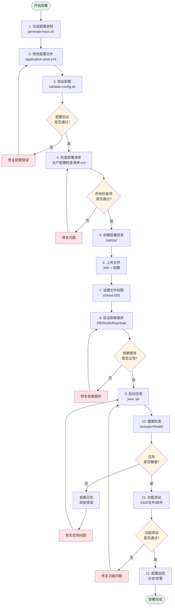
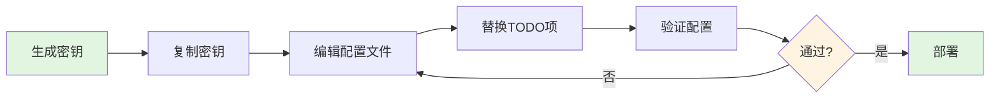
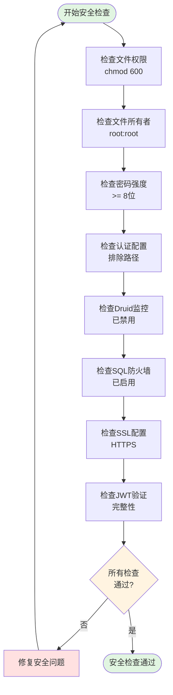
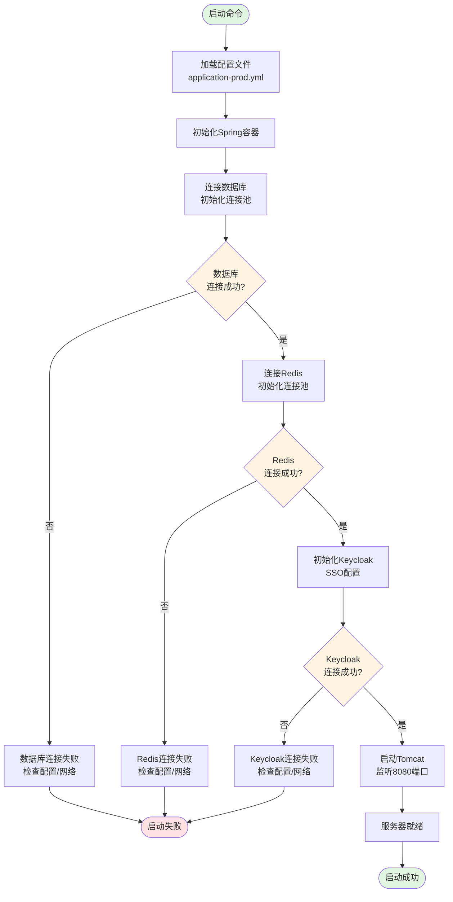
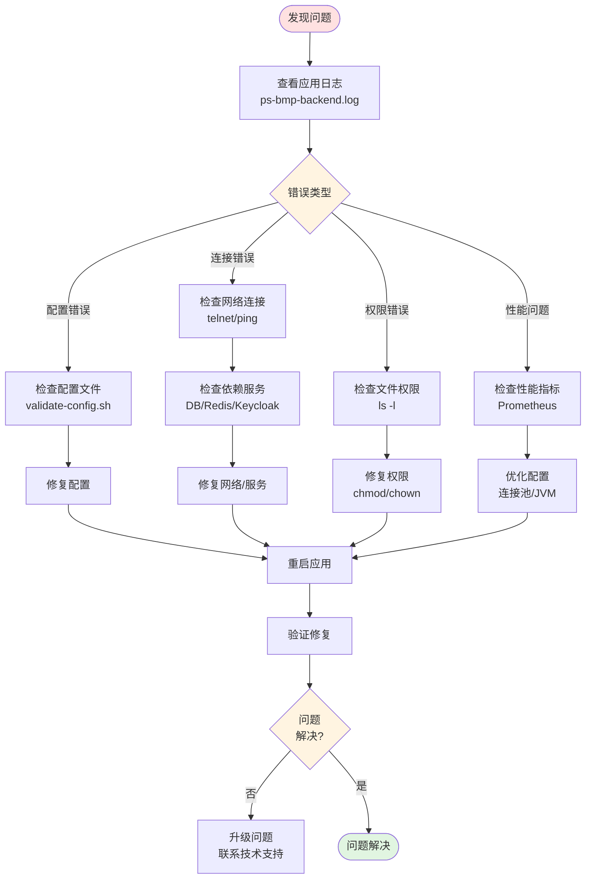
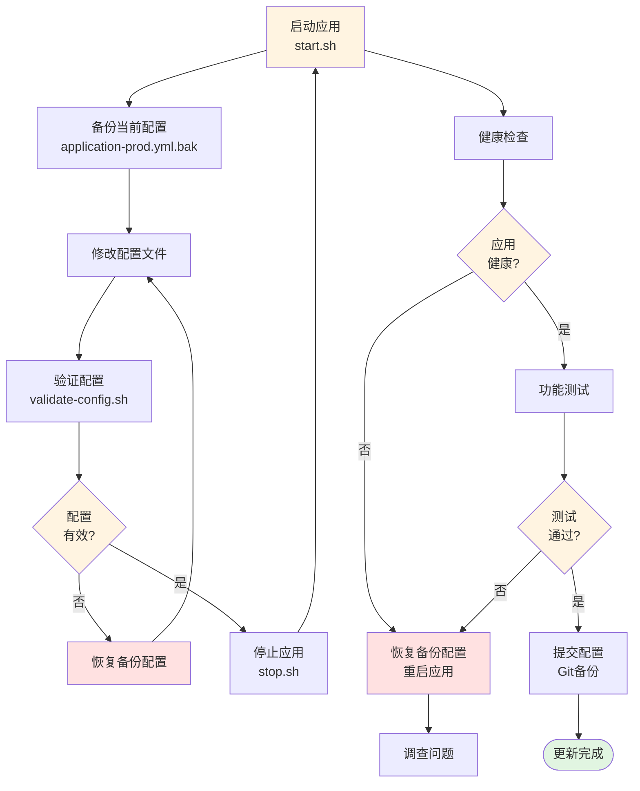

# PS-BE 生产环境部署流程图

## 📊 整体部署流程

## 🔄 配置修改流程

## 🔐 安全检查流程

## 📈 应用启动流程

## 🔍 故障排查流程

## 📝 配置更新流程

## 🎯 使用建议

1. **首次部署**：按照"整体部署流程"逐步执行
2. **配置修改**：参考"配置修改流程"和"配置更新流程"
3. **安全加固**：使用"安全检查流程"进行全面检查
4. **启动问题**：查看"应用启动流程"了解启动过程
5. **故障处理**：使用"故障排查流程"快速定位问题

## 📊 关键检查点

| 阶段 | 关键检查点 | 工具/命令 |
|------|-----------|----------|
| 配置准备 | 所有TODO已替换 | `grep TODO application-prod.yml` |
| 配置验证 | YAML语法正确 | `validate-config.sh` |
| 文件权限 | 配置文件600权限 | `ls -l application-prod.yml` |
| 依赖服务 | 数据库可连接 | `telnet 192.168.1.100 3306` |
| 依赖服务 | Redis可连接 | `redis-cli -h 192.168.1.101 ping` |
| 应用启动 | 进程正常运行 | `ps aux | grep ps-be.jar` |
| 应用启动 | 端口已监听 | `netstat -tlnp | grep 8080` |
| 健康检查 | Health端点返回UP | `curl /actuator/health` |
| 功能验证 | SSO登录正常 | 浏览器测试 |
| 监控配置 | Prometheus指标导出 | `curl /actuator/prometheus` |

---

**提示**: 本流程图可配合 [README-生产配置部署指南.md](./README-生产配置部署指南.md) 使用，获得最佳部署效果。
