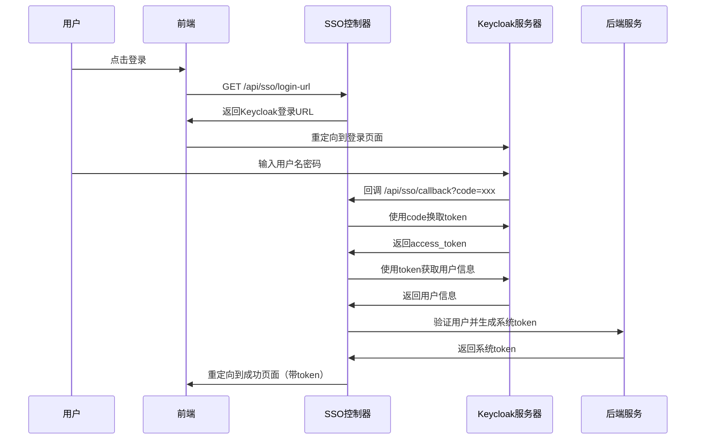
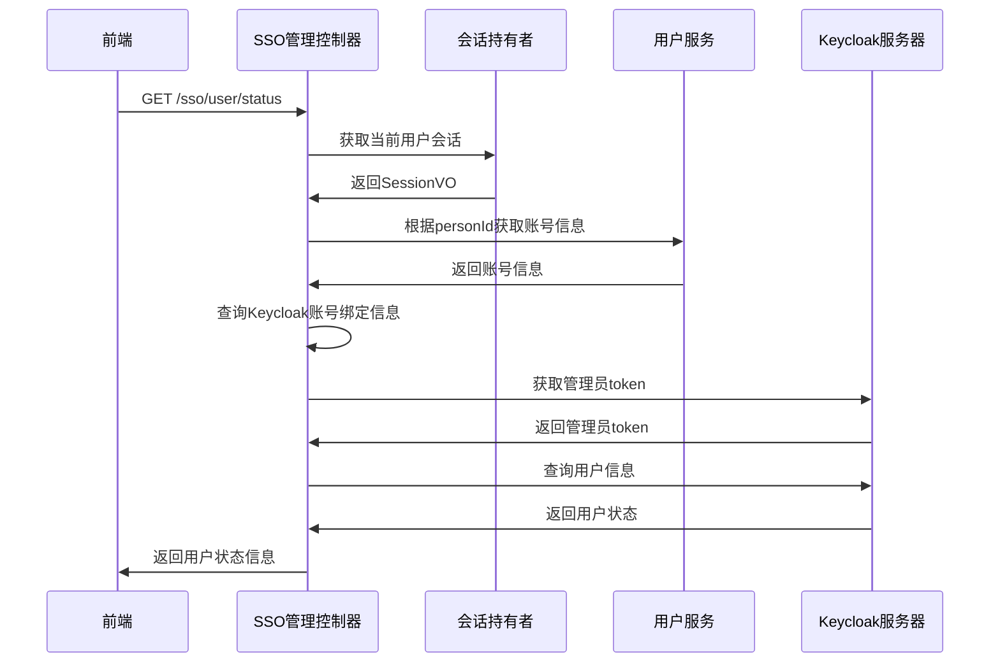
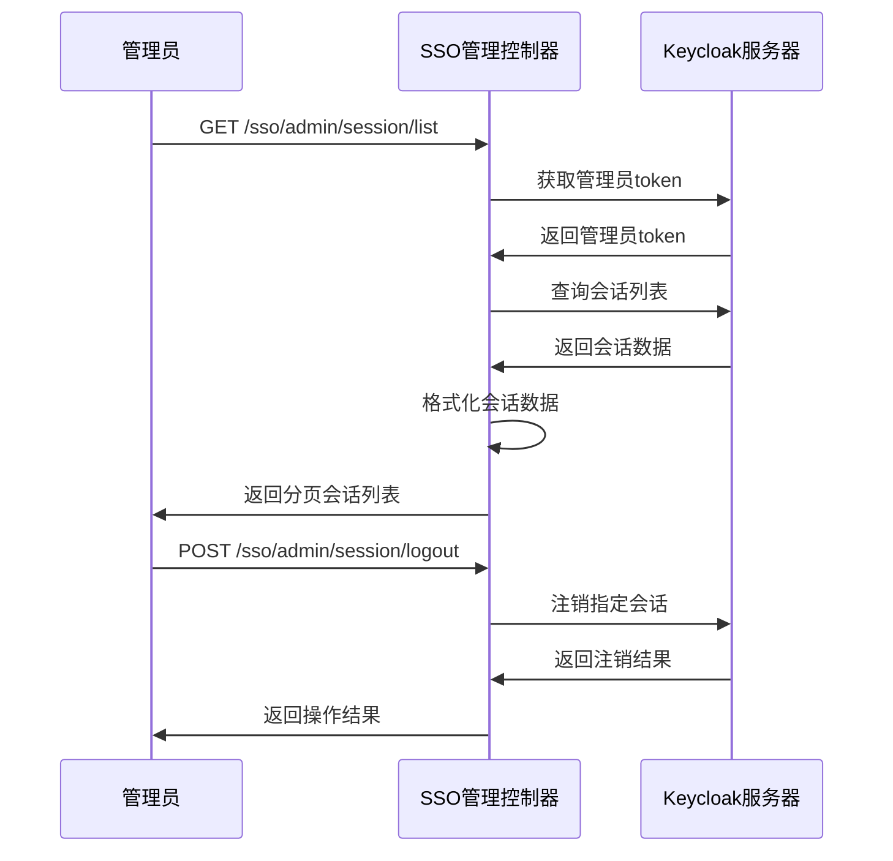
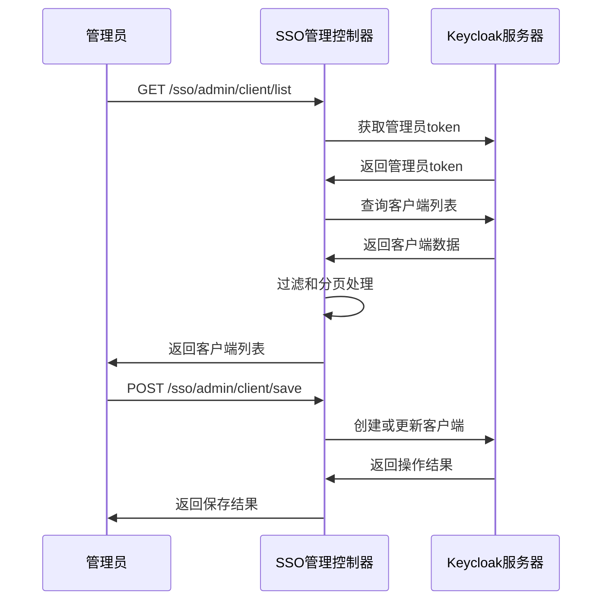
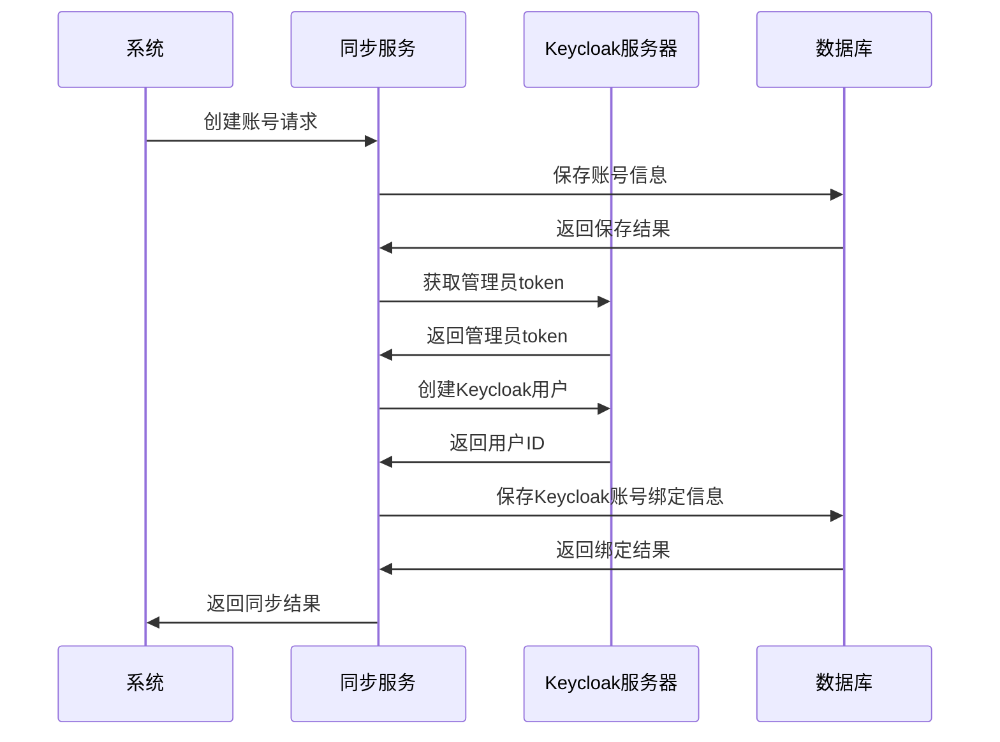

# ps-be 项目 SSO & Keycloak 后端接口清单

## 概述

本文档整理了 `ps-be` 项目中与 SSO（单点登录）和 Keycloak 相关的所有后端接口，包括接口的用途、参数、返回值和调用流程图。

## 目录

1. [核心SSO控制器](#1-核心sso控制器)
2. [SSO管理控制器](#2-sso管理控制器)
3. [Keycloak服务接口](#3-keycloak服务接口)
4. [Keycloak测试控制器](#4-keycloak测试控制器)
5. [Keycloak账号同步控制器](#5-keycloak账号同步控制器)
6. [配置类和属性](#6-配置类和属性)
7. [调用流程图](#7-调用流程图)
8. [使用示例](#8-使用示例)
9. [注意事项](#9-注意事项)

---

## 1. 核心SSO控制器

**文件路径**: `com.jiuxi.security.sso.controller.SsoController`  
**基础路径**: `/api/sso`  
**启用条件**: `keycloak.sso.enabled=true`

### 1.1 用户信息接口

#### GET /api/sso/user
- **用途**: 获取当前登录用户的详细信息
- **参数**: 无（从认证上下文获取）
- **返回值**: 
  ```json
  {
    "success": true,
    "data": {
      "userId": "用户ID",
      "username": "用户名",
      "email": "邮箱",
      "name": "姓名",
      "roles": ["角色列表"],
      "permissions": ["权限列表"],
      "attributes": {},
      "tokenExpired": false
    }
  }
  ```

#### GET /api/sso/status
- **用途**: 检查用户认证状态
- **参数**: 无
- **返回值**:
  ```json
  {
    "success": true,
    "data": {
      "authenticated": true,
      "remembered": false,
      "username": "用户名",
      "tokenExpired": false
    }
  }
  ```

### 1.2 客户端管理接口

#### GET /api/sso/clients
- **用途**: 获取用户可访问的Keycloak客户端列表
- **参数**: 无
- **返回值**: 客户端列表数组

#### GET /api/sso/test_clients
- **用途**: 测试获取用户可访问的Keycloak客户端列表
- **参数**: 
  - `Authorization` 头: Bearer token
- **返回值**: 格式化的客户端列表

### 1.3 登录登出接口

#### GET /api/sso/login-url
- **用途**: 获取Keycloak登录URL
- **参数**: 
  - `redirect_uri` (可选): 登录成功后的重定向地址
- **返回值**:
  ```json
  {
    "success": true,
    "data": {
      "loginUrl": "Keycloak登录URL"
    }
  }
  ```

#### GET /api/sso/login
- **用途**: 重定向到Keycloak登录页面
- **参数**: 
  - `redirect_uri` (可选): 登录成功后的重定向地址
- **返回值**: 302重定向到Keycloak

#### GET /api/sso/callback
- **用途**: 处理Keycloak登录回调
- **参数**:
  - `code`: 授权码
  - `state`: 状态参数
  - `error`: 错误信息（可选）
  - `error_description`: 错误描述（可选）
- **返回值**: 重定向到成功或错误页面

#### POST /api/sso/logout
- **用途**: 本地登出
- **参数**: 无
- **返回值**: 登出结果

#### POST /api/sso/sso-logout
- **用途**: SSO单点登出
- **参数**: 无（从认证上下文获取用户信息）
- **返回值**: 登出结果和Keycloak登出URL

### 1.4 配置接口

#### GET /api/sso/keycloak-config
- **用途**: 获取当前用户的Keycloak配置信息
- **参数**: 无
- **返回值**:
  ```json
  {
    "success": true,
    "data": {
      "kcRealm": "realm名称",
      "kcServerUrl": "Keycloak服务器地址",
      "kcClientId": "客户端ID",
      "kcUsername": "Keycloak用户名",
      "kcUserId": "Keycloak用户ID",
      "kcPostLogoutRedirectUri": "登出重定向地址"
    }
  }
  ```

---

## 2. SSO管理控制器

**文件路径**: `com.jiuxi.admin.core.controller.pc.TpSsoController`  
**基础路径**: `/sso`

### 2.1 用户状态接口

#### GET /sso/user/status
- **用途**: 获取用户SSO状态信息
- **参数**: 无（从SessionHolder获取当前用户）
- **返回值**:
  ```json
  {
    "success": true,
    "data": {
      "authenticated": true,
      "keycloakBound": true,
      "keycloakUserId": "Keycloak用户ID",
      "keycloakUsername": "Keycloak用户名",
      "enabled": true,
      "emailVerified": true,
      "firstName": "名",
      "lastName": "姓",
      "email": "邮箱",
      "createdTimestamp": 1234567890
    }
  }
  ```

### 2.2 用户资源接口

#### GET /sso/user/clients
- **用途**: 获取用户可访问的客户端列表
- **参数**: 无
- **返回值**: 客户端列表

#### GET /sso/user/roles
- **用途**: 获取用户角色列表
- **参数**: 无
- **返回值**: 角色列表

#### GET /sso/user/resources
- **用途**: 获取用户可访问的资源列表
- **参数**: 无
- **返回值**: 资源列表

#### POST /sso/user/logout
- **用途**: 用户登出（包括Keycloak登出）
- **参数**: 无
- **返回值**: 登出结果

### 2.3 管理员会话管理接口

#### GET /sso/admin/session/list
- **用途**: 获取Keycloak会话列表（分页）
- **参数**:
  - `page` (默认1): 页码
  - `size` (默认20): 每页大小
  - `search` (可选): 搜索关键词
- **返回值**: 分页的会话列表

#### POST /sso/admin/session/logout
- **用途**: 注销指定会话
- **参数**:
  ```json
  {
    "sessionId": "会话ID"
  }
  ```
- **返回值**: 注销结果

#### POST /sso/admin/session/batch-logout
- **用途**: 批量注销会话
- **参数**:
  ```json
  {
    "sessionIds": ["会话ID1", "会话ID2"]
  }
  ```
- **返回值**: 批量注销结果

### 2.4 管理员客户端管理接口

#### GET /sso/admin/client/list
- **用途**: 获取Keycloak客户端列表（分页）
- **参数**:
  - `page` (默认1): 页码
  - `size` (默认10): 每页大小
  - `search` (可选): 搜索关键词
- **返回值**: 分页的客户端列表

#### GET /sso/admin/client/get
- **用途**: 获取指定客户端详情
- **参数**:
  - `clientId`: 客户端ID
- **返回值**: 客户端详细信息

#### POST /sso/admin/client/save
- **用途**: 保存客户端配置
- **参数**: 客户端配置对象
- **返回值**: 保存结果

#### DELETE /sso/admin/client/delete
- **用途**: 删除客户端
- **参数**:
  - `clientId`: 客户端ID
- **返回值**: 删除结果

### 2.5 管理员事件管理接口

#### GET /sso/admin/user-event/list
- **用途**: 获取用户事件列表（分页）
- **参数**:
  - `page` (默认1): 页码
  - `size` (默认20): 每页大小
  - `username` (可选): 用户名过滤
  - `type` (可选): 事件类型过滤
  - `clientId` (可选): 客户端ID过滤
  - `dateFrom` (可选): 开始日期
  - `dateTo` (可选): 结束日期
- **返回值**: 分页的用户事件列表

#### GET /sso/admin/admin-event/list
- **用途**: 获取管理员事件列表（分页）
- **参数**:
  - `page` (默认1): 页码
  - `size` (默认20): 每页大小
  - `authUser` (可选): 操作用户过滤
  - `operationType` (可选): 操作类型过滤
  - `resourceType` (可选): 资源类型过滤
  - `dateFrom` (可选): 开始日期
  - `dateTo` (可选): 结束日期
- **返回值**: 分页的管理员事件列表

---

## 3. Keycloak服务接口

**文件路径**: `com.jiuxi.common.service.impl.KeycloakServiceImpl`  
**接口**: `com.jiuxi.common.service.KeycloakService`

### 3.1 认证相关接口

#### authenticate(String username, String password)
- **用途**: 用户名密码认证
- **参数**:
  - `username`: 用户名
  - `password`: 密码
- **返回值**: Token响应对象（包含access_token、refresh_token等）

#### refreshToken(String refreshToken)
- **用途**: 刷新访问令牌
- **参数**:
  - `refreshToken`: 刷新令牌
- **返回值**: 新的Token响应对象

#### logout(String refreshToken)
- **用途**: 用户登出
- **参数**:
  - `refreshToken`: 刷新令牌
- **返回值**: 登出是否成功

#### validateToken(String accessToken)
- **用途**: 验证访问令牌有效性
- **参数**:
  - `accessToken`: 访问令牌
- **返回值**: 令牌是否有效

#### getUserInfo(String accessToken)
- **用途**: 获取用户信息
- **参数**:
  - `accessToken`: 访问令牌
- **返回值**: 用户信息对象

### 3.2 用户管理接口

#### createUser(Map<String, Object> userInfo)
- **用途**: 创建用户
- **参数**:
  - `userInfo`: 用户信息对象
- **返回值**: 创建是否成功

#### updateUser(String userId, Map<String, Object> userInfo)
- **用途**: 更新用户信息
- **参数**:
  - `userId`: 用户ID
  - `userInfo`: 用户信息对象
- **返回值**: 更新是否成功

#### deleteUser(String userId)
- **用途**: 删除用户
- **参数**:
  - `userId`: 用户ID
- **返回值**: 删除是否成功

#### setUserEnabled(String userId, boolean enabled)
- **用途**: 设置用户启用/禁用状态
- **参数**:
  - `userId`: 用户ID
  - `enabled`: 是否启用
- **返回值**: 设置是否成功

#### resetUserPassword(String userId, String newPassword, boolean temporary)
- **用途**: 重置用户密码
- **参数**:
  - `userId`: 用户ID
  - `newPassword`: 新密码
  - `temporary`: 是否为临时密码
- **返回值**: 重置是否成功

#### getUsers(String search, Integer first, Integer max)
- **用途**: 获取用户列表
- **参数**:
  - `search`: 搜索关键词
  - `first`: 起始位置
  - `max`: 最大数量
- **返回值**: 用户列表

#### getUserByUsername(String username)
- **用途**: 根据用户名查找用户
- **参数**:
  - `username`: 用户名
- **返回值**: 用户信息对象

#### getUserByEmail(String email)
- **用途**: 根据邮箱查找用户
- **参数**:
  - `email`: 邮箱
- **返回值**: 用户信息对象

### 3.3 角色管理接口

#### getUserRoles(String userId)
- **用途**: 获取用户角色列表
- **参数**:
  - `userId`: 用户ID
- **返回值**: 角色列表

#### assignRolesToUser(String userId, List<String> roleNames)
- **用途**: 为用户分配角色
- **参数**:
  - `userId`: 用户ID
  - `roleNames`: 角色名称列表
- **返回值**: 分配是否成功

#### removeRolesFromUser(String userId, List<String> roleNames)
- **用途**: 移除用户角色
- **参数**:
  - `userId`: 用户ID
  - `roleNames`: 角色名称列表
- **返回值**: 移除是否成功

#### getAllRoles()
- **用途**: 获取所有角色
- **参数**: 无
- **返回值**: 角色列表

#### createRole(String roleName, String description)
- **用途**: 创建角色
- **参数**:
  - `roleName`: 角色名称
  - `description`: 角色描述
- **返回值**: 创建是否成功

#### deleteRole(String roleName)
- **用途**: 删除角色
- **参数**:
  - `roleName`: 角色名称
- **返回值**: 删除是否成功

### 3.4 会话管理接口

#### getUserSessions(String userId)
- **用途**: 获取用户会话列表
- **参数**:
  - `userId`: 用户ID
- **返回值**: 会话列表

#### logoutSession(String sessionId)
- **用途**: 注销指定会话
- **参数**:
  - `sessionId`: 会话ID
- **返回值**: 注销是否成功

#### logoutAllUserSessions(String userId)
- **用途**: 注销用户所有会话
- **参数**:
  - `userId`: 用户ID
- **返回值**: 注销是否成功

### 3.5 客户端管理接口

#### getClients()
- **用途**: 获取客户端列表
- **参数**: 无
- **返回值**: 客户端列表

#### getClient(String clientId)
- **用途**: 获取指定客户端信息
- **参数**:
  - `clientId`: 客户端ID
- **返回值**: 客户端信息对象

#### createClient(Map<String, Object> clientInfo)
- **用途**: 创建客户端
- **参数**:
  - `clientInfo`: 客户端信息对象
- **返回值**: 创建是否成功

#### updateClient(String clientId, Map<String, Object> clientInfo)
- **用途**: 更新客户端信息
- **参数**:
  - `clientId`: 客户端ID
  - `clientInfo`: 客户端信息对象
- **返回值**: 更新是否成功

#### deleteClient(String clientId)
- **用途**: 删除客户端
- **参数**:
  - `clientId`: 客户端ID
- **返回值**: 删除是否成功

---

## 4. Keycloak测试控制器

**文件路径**: `com.jiuxi.admin.core.controller.KeycloakTestController`  
**基础路径**: `/test`

### 4.1 账号同步测试接口

#### POST /test/test_sync_account_to_keycloak
- **用途**: 测试同步账号到Keycloak
- **参数**:
  - `accountId`: 账号ID
  - `username`: 用户名
  - `password`: 密码
  - `creator` (默认"system"): 创建人ID
- **返回值**: 同步结果

#### POST /test/test_update_keycloak_user
- **用途**: 测试更新Keycloak用户
- **参数**:
  - `accountId`: 账号ID
  - `username`: 用户名
  - `password` (可选): 新密码
  - `updater` (默认"system"): 更新人ID
- **返回值**: 更新结果

#### POST /test/test_disable_keycloak_user
- **用途**: 测试禁用Keycloak用户
- **参数**:
  - `accountId`: 账号ID
- **返回值**: 禁用结果

#### POST /test/test_enable_keycloak_user
- **用途**: 测试启用Keycloak用户
- **参数**:
  - `accountId`: 账号ID
- **返回值**: 启用结果

#### POST /test/test_delete_keycloak_user
- **用途**: 测试删除Keycloak用户
- **参数**:
  - `accountId`: 账号ID
- **返回值**: 删除结果

---

## 5. Keycloak账号同步控制器

**文件路径**: `com.jiuxi.module.user.intf.web.controller.KeycloakAccountSyncController`  
**基础路径**: `/test_keycloak_sync`

### 5.1 账号同步接口

#### POST /test_keycloak_sync/test_create_account_sync
- **用途**: 测试新增账号同步到Keycloak
- **参数**:
  - `username`: 用户名
  - `password`: 密码
  - `email` (可选): 邮箱
  - `firstName` (可选): 名字
  - `lastName` (可选): 姓氏
- **返回值**: 创建同步结果

#### POST /test_keycloak_sync/test_update_account_sync
- **用途**: 测试更新Keycloak用户信息
- **参数**:
  - `username`: 用户名
  - `newPassword` (可选): 新密码
  - `email` (可选): 新邮箱
- **返回值**: 更新同步结果

#### POST /test_keycloak_sync/test_disable_account_sync
- **用途**: 测试禁用Keycloak用户
- **参数**:
  - `username`: 用户名
- **返回值**: 禁用结果

#### POST /test_keycloak_sync/test_enable_account_sync
- **用途**: 测试启用Keycloak用户
- **参数**:
  - `username`: 用户名
- **返回值**: 启用结果

#### POST /test_keycloak_sync/test_delete_account_sync
- **用途**: 测试删除Keycloak用户
- **参数**:
  - `username`: 用户名
- **返回值**: 删除结果

#### GET /test_keycloak_sync/test_keycloak_connection
- **用途**: 测试Keycloak连接状态
- **参数**: 无
- **返回值**: 连接状态

#### POST /test_keycloak_sync/test_account_manage
- **用途**: 测试账号管理功能
- **参数**:
  ```json
  {
    "username": "用户名",
    "password": "密码",
    "personId": "人员ID"
  }
  ```
- **返回值**: 账号管理结果

---

## 6. 配置类和属性

### 6.1 KeycloakSsoProperties
**文件路径**: `com.jiuxi.security.sso.config.KeycloakSsoProperties`  
**配置前缀**: `keycloak.sso`

主要配置项：
- `enabled`: 是否启用Keycloak SSO
- `serverUrl`: Keycloak服务器地址
- `realm`: Realm名称
- `clientId`: 客户端ID
- `clientSecret`: 客户端密钥
- `jwt`: JWT验证配置
- `userHeader`: 用户信息头配置
- `redirect`: 回调重定向配置

### 6.2 SecurityProperties.Keycloak
**文件路径**: `com.jiuxi.shared.security.config.SecurityProperties`

主要配置项：
- `enabled`: 是否启用Keycloak SSO
- `serverUrl`: Keycloak服务器地址
- `realm`: Realm名称
- `clientId`: 客户端ID
- `clientSecret`: 客户端密钥
- `adminUsername`: 管理员用户名
- `adminPassword`: 管理员密码
- `connectionTimeout`: 连接超时时间
- `readTimeout`: 读取超时时间
- `syncEnabled`: 是否启用用户同步

---

## 7. 调用流程图

### 7.1 SSO登录流程



### 7.2 用户状态检查流程



### 7.3 会话管理流程



### 7.4 客户端管理流程



### 7.5 账号同步流程



---

## 8. 使用示例

### 8.1 SSO登录示例

```javascript
// 前端获取登录URL
const response = await fetch('/api/sso/login-url?redirect_uri=' + encodeURIComponent(window.location.origin + '/callback'));
const data = await response.json();
if (data.success) {
    window.location.href = data.data.loginUrl;
}
```

### 8.2 检查用户状态示例

```javascript
// 检查用户SSO状态
const response = await fetch('/sso/user/status');
const data = await response.json();
if (data.success) {
    const userStatus = data.data;
    console.log('用户认证状态:', userStatus.authenticated);
    console.log('Keycloak绑定状态:', userStatus.keycloakBound);
}
```

### 8.3 管理员会话管理示例

```javascript
// 获取会话列表
const response = await fetch('/sso/admin/session/list?page=1&size=20');
const data = await response.json();
if (data.success) {
    const sessions = data.data.records;
    sessions.forEach(session => {
        console.log('会话ID:', session.id);
        console.log('用户名:', session.username);
        console.log('最后访问时间:', session.lastAccess);
    });
}

// 注销会话
const logoutResponse = await fetch('/sso/admin/session/logout', {
    method: 'POST',
    headers: {
        'Content-Type': 'application/json'
    },
    body: JSON.stringify({
        sessionId: 'session-id-here'
    })
});
```

### 8.4 Keycloak服务使用示例

```java
@Autowired
private KeycloakService keycloakService;

// 用户认证
Map<String, Object> tokenResponse = keycloakService.authenticate("username", "password");
if (tokenResponse != null) {
    String accessToken = (String) tokenResponse.get("access_token");
    String refreshToken = (String) tokenResponse.get("refresh_token");
}

// 获取用户信息
Map<String, Object> userInfo = keycloakService.getUserInfo(accessToken);
if (userInfo != null) {
    String username = (String) userInfo.get("preferred_username");
    String email = (String) userInfo.get("email");
}

// 创建用户
Map<String, Object> newUser = new HashMap<>();
newUser.put("username", "newuser");
newUser.put("email", "newuser@example.com");
newUser.put("enabled", true);
boolean created = keycloakService.createUser(newUser);
```

---

## 9. 注意事项

### 9.1 配置要求

1. **启用条件**: 大部分SSO功能需要配置 `keycloak.sso.enabled=true`
2. **必需配置**: 
   - `keycloak.server-url`: Keycloak服务器地址
   - `keycloak.realm`: Realm名称
   - `keycloak.client-id`: 客户端ID
   - `keycloak.admin.username`: 管理员用户名
   - `keycloak.admin.password`: 管理员密码

### 9.2 安全注意事项

1. **Token管理**: 访问令牌有过期时间，需要定期刷新
2. **权限控制**: 管理员接口需要适当的权限验证
3. **敏感信息**: 配置中的密钥和密码需要妥善保护
4. **HTTPS**: 生产环境建议使用HTTPS协议

### 9.3 错误处理

1. **连接失败**: Keycloak服务不可用时的降级处理
2. **认证失败**: Token过期或无效时的处理逻辑
3. **同步失败**: 账号同步失败时的回滚机制
4. **日志记录**: 重要操作需要记录详细日志

### 9.4 性能优化

1. **Token缓存**: 管理员token可以缓存复用
2. **连接池**: 使用连接池管理HTTP连接
3. **异步处理**: 非关键操作可以异步执行
4. **分页查询**: 大量数据查询使用分页

### 9.5 测试建议

1. **单元测试**: 为每个服务方法编写单元测试
2. **集成测试**: 测试与Keycloak的集成功能
3. **性能测试**: 测试高并发场景下的性能表现
4. **安全测试**: 验证认证和授权机制的安全性

---

## 更新日志

- **2025-01-21**: 初始版本，整理所有SSO和Keycloak相关接口
- **作者**: lincong1987@gmail.com

---

*本文档基于ps-be项目当前代码结构生成，如有接口变更请及时更新此文档。*