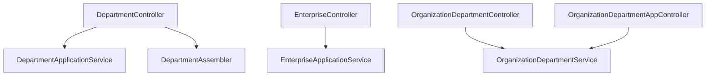
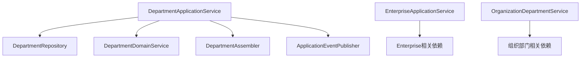
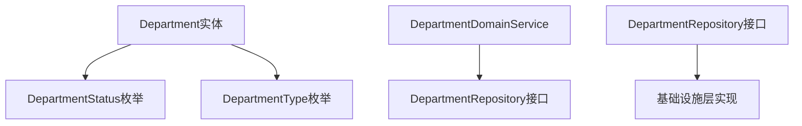
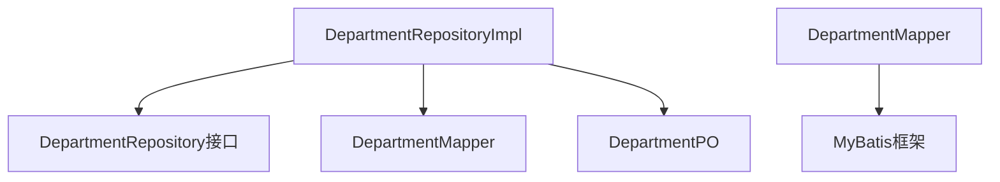
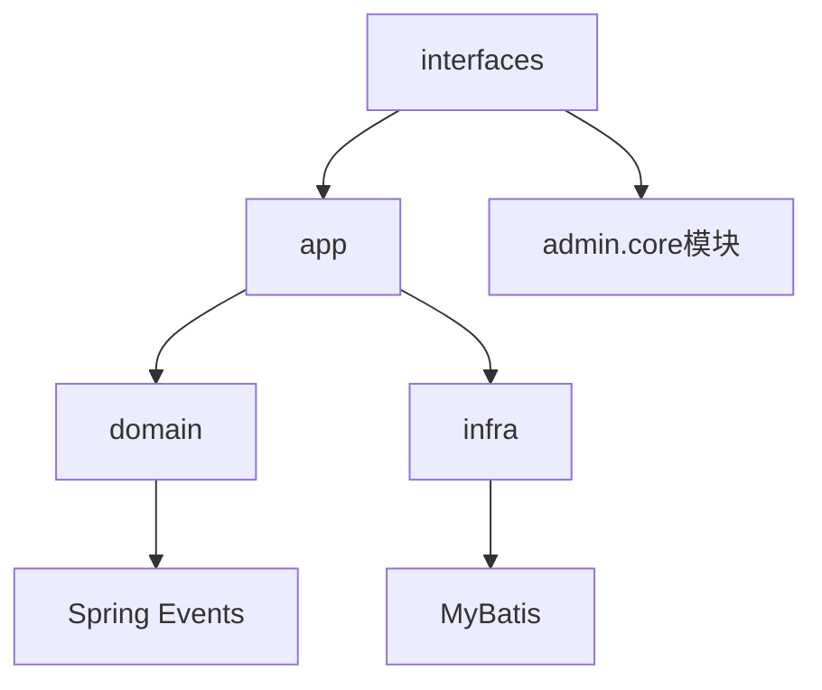
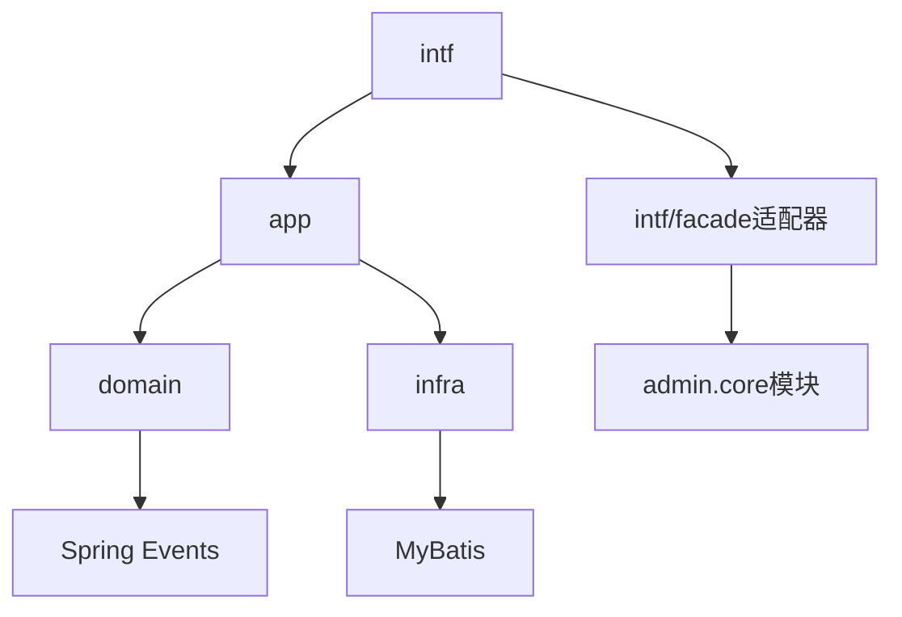

# org模块依赖关系分析文档

> **生成时间**：2025-09-17  
> **模块路径**：`D:\keycloak_sb_sso_new0910_claude\ps\ps-be\src\main\java\com\jiuxi\module\org`  
> **分析版本**：v1.0

## 📋 分析概览

本文档全面分析org模块的依赖关系，包括模块内部依赖、外部模块依赖、第三方依赖，以及潜在的循环依赖风险。分析结果将为模块重构提供重要参考。

## 🏗️ 1. 模块内部依赖关系分析

### 1.1 分层依赖关系

#### 1.1.1 接口适配器层 (interfaces/intf)
**依赖方向**：interfaces → app → domain → infra



**具体依赖关系**：
- `DepartmentController` 依赖：
  - `DepartmentApplicationService` (应用服务)
  - `DepartmentQueryService` (查询服务)
  - `DepartmentStatisticsService` (统计服务)
  - `DepartmentAssembler` (装配器)

- `EnterpriseController` 依赖：
  - `EnterpriseApplicationService` (应用服务)

- `OrganizationDepartmentController` 依赖：
  - `OrganizationDepartmentService` (组织部门服务)

#### 1.1.2 应用服务层 (app)
**依赖方向**：app → domain → infra



**具体依赖关系**：
- `DepartmentApplicationService` 依赖：
  - `DepartmentRepository` (仓储接口)
  - `DepartmentDomainService` (领域服务)
  - `DepartmentAssembler` (装配器)
  - `ApplicationEventPublisher` (事件发布器)

- `EnterpriseApplicationService` 依赖：
  - Enterprise相关的Repository和Service
  - 外部查询类（TpEntBasicQuery、TpEntAccountQuery）

#### 1.1.3 领域层 (domain)
**依赖方向**：domain → 基础设施接口（依赖倒置）



**具体依赖关系**：
- `Department` 实体依赖：
  - `DepartmentStatus` (状态枚举)
  - `DepartmentType` (类型枚举)
  - Java标准库（LocalDateTime、List等）

- `DepartmentDomainService` 依赖：
  - `DepartmentRepository` (仓储接口)

#### 1.1.4 基础设施层 (infra)
**依赖方向**：infra → domain接口（实现依赖倒置）



**具体依赖关系**：
- `DepartmentRepositoryImpl` 依赖：
  - `DepartmentRepository` (实现的接口)
  - `DepartmentMapper` (MyBatis映射器)
  - `DepartmentPO` (持久化对象)

### 1.2 组件间依赖关系矩阵

| 组件层级 | interfaces | app | domain | infra |
|----------|------------|-----|---------|--------|
| **interfaces** | ❌ | ✅ | ❌ | ❌ |
| **app** | ❌ | ❌ | ✅ | ❌ |
| **domain** | ❌ | ❌ | ❌ | ❌ |
| **infra** | ❌ | ❌ | ✅ | ❌ |

**说明**：
- ✅ 表示存在依赖关系
- ❌ 表示不应存在依赖关系
- 当前架构基本符合DDD分层依赖原则

### 1.3 包内依赖关系

#### 1.3.1 DTO包依赖
```
app/dto/
├── DepartmentCreateDTO
├── DepartmentUpdateDTO
├── DepartmentResponseDTO
├── DepartmentQueryDTO
└── DepartmentStatisticsDTO
```

**依赖关系**：
- 各DTO类相互独立，无循环依赖
- 依赖Java标准验证注解（@NotNull、@Size等）

#### 1.3.2 实体包依赖
```
domain/entity/
├── Department (聚合根)
├── Enterprise (聚合根)
├── Organization (聚合根)
├── DepartmentStatus (枚举)
├── DepartmentType (枚举)
├── EnterpriseStatus (枚举)
└── OrganizationType (枚举)
```

**依赖关系**：
- Department依赖DepartmentStatus和DepartmentType
- Enterprise依赖EnterpriseStatus
- Organization依赖OrganizationStatus和OrganizationType

## 🔗 2. 外部模块依赖分析

### 2.1 共享模块依赖

#### 2.1.1 公共模块依赖
```java
// 认证和授权
import com.jiuxi.shared.common.annotation.Authorization;
import com.jiuxi.shared.common.annotation.IgnoreAuthorization;
import com.jiuxi.shared.common.context.TenantContextHolder;

// 验证组
import com.jiuxi.shared.common.validation.group.AddGroup;
import com.jiuxi.shared.common.validation.group.UpdateGroup;
```

**依赖模块**：
- `shared.common.annotation` - 权限注解
- `shared.common.context` - 租户上下文
- `shared.common.validation` - 验证分组

#### 2.1.2 通用响应模块
```java
// 通用响应
import com.jiuxi.common.bean.JsonResponse;
import com.jiuxi.common.bean.TreeNode;
import com.jiuxi.common.constant.TpConstant;
```

**依赖模块**：
- `common.bean` - 通用响应对象
- `common.constant` - 常量定义

#### 2.1.3 管理后台模块
```java
// 管理后台VO
import com.jiuxi.admin.core.bean.query.TpEntAccountQuery;
import com.jiuxi.admin.core.bean.query.TpEntBasicQuery;
import com.jiuxi.admin.core.bean.vo.TpEntAccountVO;
import com.jiuxi.admin.core.bean.vo.TpEntBasicinfoVO;
import com.jiuxi.admin.core.bean.vo.TpDeptBasicinfoVO;
import com.jiuxi.admin.core.bean.vo.TpDeptExinfoVO;
import com.jiuxi.admin.core.bean.vo.TpPersonDeptVO;
```

**依赖模块**：
- `admin.core.bean.query` - 查询对象
- `admin.core.bean.vo` - 值对象

### 2.2 外部依赖强度分析

| 依赖模块 | 依赖强度 | 风险等级 | 说明 |
|----------|----------|----------|------|
| shared.common | 高 | 低 | 内部共享模块，稳定性高 |
| common.bean | 高 | 低 | 通用响应格式，变更概率低 |
| admin.core | 中 | 中 | 管理后台模块，可能存在变更 |

### 2.3 模块边界分析

#### 2.3.1 清晰边界
- ✅ 权限控制边界清晰（通过注解实现）
- ✅ 数据传输边界清晰（通过DTO隔离）
- ✅ 业务逻辑边界清晰（通过服务层封装）

#### 2.3.2 模糊边界
- ⚠️ 与admin.core模块的边界模糊，直接使用其VO对象
- ⚠️ 组织部门管理功能可能与用户模块存在重叠

## 📦 3. 第三方依赖分析

### 3.1 Spring框架依赖

#### 3.1.1 Spring Boot核心
```java
import org.springframework.beans.factory.annotation.Autowired;
import org.springframework.stereotype.Service;
import org.springframework.stereotype.Component;
import org.springframework.web.bind.annotation.*;
```

**依赖组件**：
- `spring-boot-starter-web` - Web框架
- `spring-context` - 依赖注入容器
- `spring-tx` - 事务管理

#### 3.1.2 Spring Data
```java
import org.springframework.transaction.annotation.Transactional;
import org.springframework.context.ApplicationEventPublisher;
```

**依赖组件**：
- 事务管理支持
- 事件发布机制

### 3.2 数据访问依赖

#### 3.2.1 MyBatis Plus
```java
import com.baomidou.mybatisplus.core.metadata.IPage;
```

**依赖组件**：
- `mybatis-plus-boot-starter` - MyBatis增强框架
- 分页查询支持

### 3.3 工具类依赖

#### 3.3.1 Hutool工具库
```java
import cn.hutool.core.util.StrUtil;
```

**依赖组件**：
- `hutool-all` - Java工具集合
- 字符串处理工具

#### 3.3.2 验证框架
```java
import org.springframework.validation.annotation.Validated;
import javax.validation.constraints.*;
```

**依赖组件**：
- `spring-boot-starter-validation` - 数据验证
- `hibernate-validator` - 验证实现

### 3.4 第三方依赖风险评估

| 依赖库 | 版本稳定性 | 社区活跃度 | 安全性 | 风险等级 |
|--------|------------|------------|--------|----------|
| Spring Boot | 高 | 高 | 高 | 低 |
| MyBatis Plus | 高 | 高 | 高 | 低 |
| Hutool | 中 | 高 | 中 | 中 |
| Hibernate Validator | 高 | 高 | 高 | 低 |

## 🔄 4. 循环依赖风险分析

### 4.1 潜在循环依赖识别

#### 4.1.1 服务层循环依赖风险
**当前状态**：✅ 无循环依赖
- DepartmentApplicationService → DepartmentDomainService ✅
- EnterpriseApplicationService → 独立服务 ✅
- OrganizationDepartmentService → 独立服务 ✅

#### 4.1.2 实体间循环依赖风险
**当前状态**：✅ 无循环依赖
- Department ↔ Enterprise：无直接引用 ✅
- Department ↔ Organization：无直接引用 ✅
- Enterprise ↔ Organization：无直接引用 ✅

#### 4.1.3 接口层循环依赖风险
**发现问题**：⚠️ 存在潜在风险
```java
// 在OrganizationDepartmentController中
// 可能间接依赖Department相关服务，存在潜在循环依赖风险
```

### 4.2 循环依赖检测结果

#### 4.2.1 直接循环依赖
🟢 **检测结果**：未发现直接循环依赖

#### 4.2.2 间接循环依赖
🟡 **检测结果**：存在潜在间接循环依赖风险
- OrganizationDepartmentService 可能通过共享的Repository产生间接依赖

#### 4.2.3 传递性循环依赖
🟢 **检测结果**：未发现传递性循环依赖

### 4.3 循环依赖预防措施

#### 4.3.1 架构层面预防
1. **严格分层架构**：强制执行单向依赖原则
2. **接口隔离**：通过接口实现依赖倒置
3. **事件驱动**：使用事件机制解耦模块间通信

#### 4.3.2 代码层面预防
1. **依赖注入检查**：使用Spring的循环依赖检测
2. **静态分析工具**：引入依赖分析工具
3. **代码审查**：在代码审查中重点关注依赖关系

## 📊 5. 依赖关系优化建议

### 5.1 内部依赖优化

#### 5.1.1 服务层重构建议
```java
// 当前：app/service/impl/ (违反DDD规范)
// 建议：app/impl/ 与 app/service/ 平级
```

**优化措施**：
1. 移动impl目录到service同级
2. 保持接口与实现的清晰分离
3. 统一命名约定

#### 5.1.2 包结构优化建议
```java
// 当前：domain/valueobject/
// 建议：domain/vo/ (符合DDD规范)

// 当前：interfaces/ 和 intf/ 并存
// 建议：统一使用 intf/
```

### 5.2 外部依赖优化

#### 5.2.1 减少admin.core依赖
**问题**：直接使用admin.core模块的VO对象

**优化方案**：
1. 创建org模块内部的DTO
2. 使用Assembler进行数据转换
3. 减少对外部模块的直接依赖

#### 5.2.2 接口隔离优化
**建议**：
1. 定义org模块的标准接口
2. 通过适配器模式隔离外部依赖
3. 建立清晰的模块边界

### 5.3 第三方依赖优化

#### 5.3.1 依赖版本管理
**建议**：
1. 统一依赖版本管理
2. 定期更新安全补丁
3. 监控依赖库的安全漏洞

#### 5.3.2 依赖范围控制
**建议**：
1. 最小化依赖范围
2. 避免传递性依赖冲突
3. 使用依赖排除机制

## 🎯 6. 重构依赖关系规划

### 6.1 重构前依赖关系


### 6.2 重构后目标依赖关系


### 6.3 依赖关系迁移计划

#### 阶段1：目录结构调整
- 重命名 interfaces → intf
- 重命名 valueobject → vo
- 调整 service/impl 结构

#### 阶段2：依赖关系重构
- 引入facade适配器层
- 减少对admin.core的直接依赖
- 建立清晰的模块边界

#### 阶段3：循环依赖清理
- 消除潜在的循环依赖
- 强化分层架构约束
- 引入依赖检测工具

## 📋 7. 依赖关系验证清单

### 7.1 内部依赖验证
- [ ] 分层架构依赖方向正确
- [ ] 无服务间循环依赖
- [ ] 包结构符合DDD规范
- [ ] 接口与实现分离清晰

### 7.2 外部依赖验证
- [ ] 共享模块依赖稳定
- [ ] 模块边界清晰
- [ ] 无不必要的外部依赖
- [ ] 依赖版本兼容

### 7.3 第三方依赖验证
- [ ] 依赖库版本稳定
- [ ] 无安全漏洞
- [ ] 依赖范围最小化
- [ ] 无传递性冲突

### 7.4 循环依赖验证
- [ ] 无直接循环依赖
- [ ] 无间接循环依赖
- [ ] 无传递性循环依赖
- [ ] 依赖检测工具集成

## 🔧 8. 依赖管理工具推荐

### 8.1 静态分析工具
- **JDepend**：Java依赖分析工具
- **Degraph**：依赖图可视化工具
- **ArchUnit**：架构单元测试工具

### 8.2 构建工具集成
- **Maven Dependency Plugin**：依赖分析插件
- **Gradle Dependencies**：Gradle依赖管理
- **OWASP Dependency Check**：安全漏洞检测

### 8.3 IDE插件
- **IntelliJ IDEA Dependencies Analyzer**
- **Eclipse Dependency Viewer**
- **VS Code Dependency Graph**

## 📈 9. 依赖关系监控

### 9.1 监控指标
- 依赖深度（Dependency Depth）
- 循环依赖数量（Cyclic Dependencies）
- 外部依赖数量（External Dependencies）
- 不稳定依赖比例（Instability Ratio）

### 9.2 监控方法
1. **持续集成检查**：在CI/CD中集成依赖检查
2. **定期依赖审计**：定期进行依赖关系审计
3. **自动化报告**：生成依赖关系报告
4. **趋势分析**：监控依赖关系变化趋势

## 📝 10. 总结

### 10.1 当前状态评估
- **优点**：基本符合DDD分层架构，无明显循环依赖
- **问题**：目录结构不完全规范，外部依赖耦合度较高
- **风险**：潜在的间接循环依赖风险

### 10.2 重构优先级
1. **高优先级**：目录结构调整，消除架构不规范
2. **中优先级**：外部依赖解耦，建立模块边界
3. **低优先级**：工具集成，监控机制建立

### 10.3 预期收益
- 提高代码可维护性
- 降低模块间耦合度
- 增强架构稳定性
- 便于功能扩展和测试