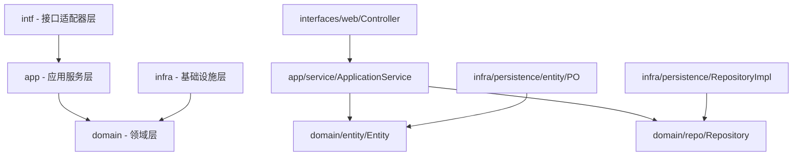

# sys模块依赖关系分析报告

> **生成时间**：2025-09-18  
> **模块名称**：sys（系统管理模块）  
> **分析版本**：v1.0

## 1. 分析概述

本文档对sys模块的依赖关系进行全面分析，包括内部依赖、外部模块依赖、第三方库依赖，并识别潜在的循环依赖风险。

## 2. 模块内部依赖关系

### 2.1 分层依赖结构



### 2.2 详细依赖关系图

#### 2.2.1 接口层依赖
```
interfaces/web/
├── DictionaryController
│   ├── → app.service.DictionaryApplicationService
│   ├── → app.dto.DictionaryCreateDTO
│   ├── → app.dto.DictionaryUpdateDTO
│   └── → app.dto.DictionaryResponseDTO
├── DictionaryItemController
│   ├── → app.service.DictionaryItemApplicationService
│   └── → app.dto.*
├── SystemConfigController
│   ├── → app.service.SystemConfigApplicationService
│   ├── → com.jiuxi.admin.core.bean.query.TpSystemConfigQuery
│   ├── → com.jiuxi.admin.core.bean.vo.TpSystemConfigVO
│   ├── → com.jiuxi.admin.core.bean.entity.TpSystemConfig
│   └── → com.jiuxi.common.bean.JsonResponse
└── controller/SystemMenuManagementController
    └── → 待分析具体依赖
```

#### 2.2.2 应用层依赖
```
app/
├── service/
│   ├── DictionaryApplicationService
│   │   ├── → domain.entity.Dictionary
│   │   ├── → domain.entity.ConfigType
│   │   ├── → domain.entity.ConfigStatus
│   │   ├── → domain.valueobject.ConfigKey
│   │   ├── → domain.repo.DictionaryRepository
│   │   ├── → app.assembler.DictionaryAssembler
│   │   └── → app.dto.*
│   ├── SystemConfigApplicationService
│   │   ├── → domain层相关依赖
│   │   └── → 外部admin.core依赖
│   └── ParameterConfigApplicationService
├── assembler/
│   ├── DictionaryAssembler
│   │   ├── → domain.entity.Dictionary
│   │   └── → app.dto.*
│   ├── SystemConfigAssembler
│   └── DictionaryItemAssembler
└── dto/
    └── 各种DTO类（无对外依赖）
```

#### 2.2.3 领域层依赖
```
domain/
├── entity/
│   ├── Dictionary
│   │   ├── → domain.valueobject.ConfigKey
│   │   ├── → domain.entity.ConfigType
│   │   └── → domain.entity.ConfigStatus
│   ├── SystemConfig
│   ├── SystemLog
│   └── 各种枚举类（相互依赖）
├── event/
│   ├── DictionaryChangedEvent
│   └── ConfigurationChangedEvent
├── repo/（仓储接口，依赖entity）
│   ├── DictionaryRepository → Dictionary
│   ├── DictionaryItemRepository
│   └── SystemConfigRepository
├── repository/（重复目录，需要清理）
│   ├── SystemConfigRepository
│   └── SystemLogRepository
├── service/（领域服务）
│   ├── ConfigValidationService
│   ├── SystemConfigCacheService
│   ├── SystemConfigDomainService
│   └── SystemConfigHotReloadService
└── valueobject/
    ├── ConfigKey
    └── ConfigValue
```

#### 2.2.4 基础设施层依赖
```
infra/persistence/
├── entity/（PO对象）
│   ├── DictionaryPO
│   ├── DictionaryItemPO
│   └── SystemConfigPO
├── mapper/（MyBatis映射器）
│   ├── DictionaryMapper
│   ├── DictionaryItemMapper
│   └── SystemConfigMapper
├── assembler/（PO-DO转换器）
│   ├── DictionaryPOAssembler
│   │   ├── → domain.entity.Dictionary
│   │   └── → infra.persistence.entity.DictionaryPO
│   ├── DictionaryItemPOAssembler
│   └── SystemConfigPOAssembler
└── repository/（仓储实现）
    ├── DictionaryRepositoryImpl
    │   ├── → domain.repo.DictionaryRepository
    │   ├── → infra.persistence.mapper.DictionaryMapper
    │   └── → infra.persistence.assembler.DictionaryPOAssembler
    ├── DictionaryItemRepositoryImpl
    └── SystemConfigRepositoryImpl
```

## 3. 外部模块依赖分析

### 3.1 项目内模块依赖

#### 3.1.1 admin.core模块依赖
```
sys模块 → com.jiuxi.admin.core
├── bean.query.TpSystemConfigQuery
├── bean.vo.TpSystemConfigVO
└── bean.entity.TpSystemConfig
```

**依赖说明**：
- SystemConfigController直接依赖admin.core模块的查询、VO和实体类
- 这种依赖违反了DDD架构原则，应该通过适配器模式隔离

#### 3.1.2 common模块依赖
```
sys模块 → com.jiuxi.common
└── bean.JsonResponse
```

**依赖说明**：
- 用于统一响应格式
- 合理的基础设施依赖

#### 3.1.3 shared模块依赖
```
sys模块 → com.jiuxi.shared
└── common.annotation.Authorization
```

**依赖说明**：
- 权限注解依赖
- 合理的横切关注点依赖

### 3.2 Spring框架依赖

#### 3.2.1 Spring Core依赖
```
org.springframework
├── beans.factory.annotation.Autowired
├── stereotype.Service
├── stereotype.Repository
├── web.bind.annotation.*
└── transaction.annotation.Transactional
```

#### 3.2.2 Spring Boot依赖
```
org.springframework.boot
└── 通过父项目继承相关依赖
```

### 3.3 MyBatis依赖

```
com.baomidou.mybatisplus
├── core.metadata.IPage
├── 其他MyBatis Plus相关类
└── 数据库操作支持
```

### 3.4 Java标准库依赖

```
java.time.*
├── LocalDateTime
└── 时间处理相关类

java.util.*
├── List, Map, Optional
├── Objects
└── 集合和工具类
```

## 4. 循环依赖风险分析

### 4.1 已识别的潜在循环依赖

#### 4.1.1 仓储目录重复问题
```
domain/repo/ ←→ domain/repository/
```
**风险等级**：中等
**说明**：存在两个仓储目录，可能导致接口定义混乱
**解决方案**：统一使用domain/repo/，删除domain/repository/

#### 4.1.2 实体间相互引用
```
Dictionary ←→ ConfigType ←→ ConfigStatus
```
**风险等级**：低
**说明**：枚举类型之间的正常依赖，不会形成循环
**解决方案**：保持现状，这是合理的设计

#### 4.1.3 应用服务与领域服务依赖
```
app.service.* → domain.service.*
domain.service.* → domain.entity.*
app.service.* → domain.entity.*
```
**风险等级**：低
**说明**：符合DDD分层架构，不存在反向依赖
**解决方案**：继续保持单向依赖

### 4.2 跨模块循环依赖风险

#### 4.2.1 admin.core模块双向依赖风险
```
sys → admin.core（当前）
admin.core → sys（潜在风险）
```
**风险等级**：高
**说明**：如果admin.core模块将来需要使用sys模块功能，可能形成循环依赖
**解决方案**：引入防腐层，通过接口隔离外部依赖

## 5. 依赖合规性评估

### 5.1 DDD架构合规性

#### 5.1.1 合规项
- ✅ 接口层只依赖应用层
- ✅ 应用层依赖领域层
- ✅ 基础设施层实现领域层接口
- ✅ 领域层不依赖外部框架（除标准库）

#### 5.1.2 不合规项
- ❌ 接口层直接使用外部模块的DTO（admin.core）
- ❌ 存在重复的仓储目录结构
- ❌ 某些应用服务直接依赖外部模块实体
- ❌ 缺少防腐层隔离外部依赖

### 5.2 依赖方向合规性

```
正确的依赖方向：
intf → app → domain ← infra

当前存在的问题：
intf → admin.core（跨越了app层）
app → admin.core（绕过了domain层）
```

## 6. 重构建议

### 6.1 短期重构建议

#### 6.1.1 目录结构调整
1. **删除重复目录**：删除domain/repository/，统一使用domain/repo/
2. **重命名目录**：valueobject → vo，interfaces → intf
3. **调整嵌套结构**：app/service/impl移至app/impl/

#### 6.1.2 依赖隔离
1. **引入适配器**：为admin.core依赖创建适配器类
2. **创建防腐层**：在domain/gateway/中定义外部系统接口
3. **统一响应格式**：在intf层统一处理JsonResponse

### 6.2 长期重构建议

#### 6.2.1 完整DDD改造
1. **CQRS分离**：按command/query分离控制器和处理器
2. **聚合设计**：明确聚合根边界和依赖关系
3. **事件驱动**：完善领域事件机制

#### 6.2.2 模块解耦
1. **接口标准化**：定义标准的模块间接口
2. **依赖倒置**：所有外部依赖通过接口注入
3. **配置外部化**：将硬编码依赖移至配置文件

## 7. 监控和维护

### 7.1 依赖监控指标

1. **模块耦合度**：监控跨模块依赖数量
2. **循环依赖检测**：定期检测是否出现新的循环依赖
3. **依赖深度**：监控依赖链的深度和复杂度

### 7.2 依赖管理规范

1. **新增依赖审批**：所有新的外部依赖需要架构评审
2. **定期清理**：定期清理无用的依赖关系
3. **文档同步**：依赖变更后及时更新文档

## 8. 结论

### 8.1 当前状态评估

sys模块的依赖关系总体上符合DDD分层架构原则，但存在以下主要问题：

1. **外部依赖过度耦合**：直接依赖admin.core模块的实体类
2. **目录结构不规范**：存在重复目录和命名不一致
3. **缺少防腐层**：没有对外部依赖进行有效隔离

### 8.2 优先级建议

**高优先级**：
1. 重构admin.core依赖，引入适配器模式
2. 清理重复的repository目录
3. 统一目录命名规范

**中优先级**：
1. 完善防腐层设计
2. 实现CQRS分离
3. 建立依赖监控机制

**低优先级**：
1. 优化内部依赖结构
2. 完善事件驱动机制
3. 提升代码质量