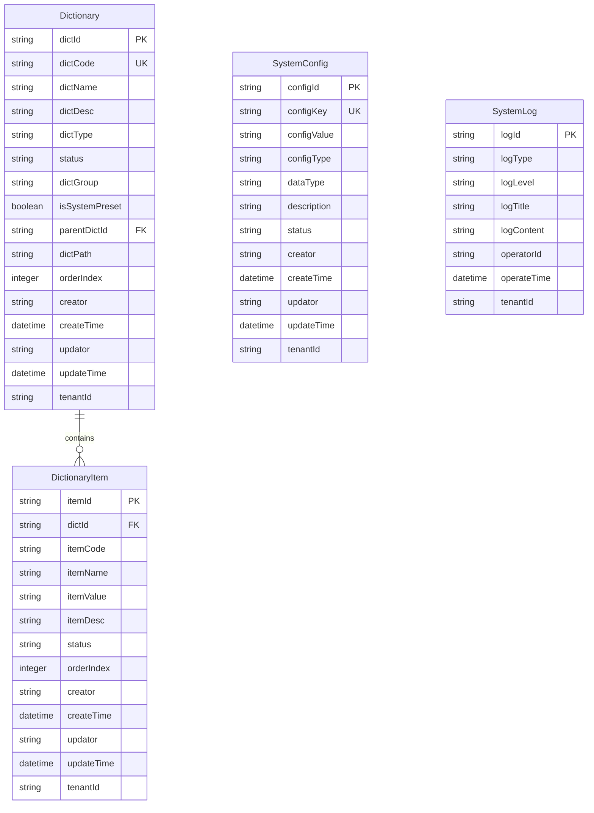

# sys模块数据模型分析报告

> **生成时间**：2025-09-18  
> **模块名称**：sys（系统管理模块）  
> **分析版本**：v1.0

## 1. 分析概述

本文档对sys模块的数据模型进行全面分析，包括实体关系、PO对象映射、数据访问模式，并识别数据设计中的问题和优化机会。

## 2. 核心实体模型分析

### 2.1 实体概览

sys模块包含以下核心实体：



### 2.2 实体详细分析

#### 2.2.1 Dictionary（字典实体）

**业务职责**：管理系统数据字典，支持层级结构和多租户

**关键字段分析**：
```java
// 主键和唯一标识
private String dictId;           // 主键
private String dictCode;         // 业务唯一键
private ConfigKey dictCodeObj;   // DDD值对象版本

// 基本信息
private String dictName;         // 字典名称
private String dictDesc;         // 字典描述

// 分类和状态
private ConfigType dictTypeEnum;     // DDD枚举版本
private ConfigStatus dictStatusEnum; // DDD枚举版本
private String dictType;            // 兼容性字段
private String status;              // 兼容性字段

// 层级和分组
private String dictGroup;        // 字典分组
private String parentDictId;     // 父字典ID（支持树形结构）
private String dictPath;         // 层级路径
private Integer orderIndex;      // 排序序号

// 系统字段
private Boolean isSystemPreset;  // 是否系统预置
private String tenantId;         // 多租户支持

// 审计字段
private String creator;          // 创建人
private LocalDateTime createTime; // 创建时间
private String updator;          // 更新人
private LocalDateTime updateTime; // 更新时间
```

**设计特点**：
- ✅ 支持层级结构（parentDictId + dictPath）
- ✅ 多租户设计（tenantId）
- ✅ DDD设计（值对象、枚举）
- ❌ 兼容性字段冗余（dictType/dictTypeEnum同时存在）
- ❌ 缺少版本控制字段

#### 2.2.2 DictionaryItem（字典项实体）

**业务职责**：字典的具体项目，属于字典的子实体

**关键字段分析**：
```java
// 主键和关联
private String itemId;           // 主键
private String dictId;           // 外键关联Dictionary

// 基本信息
private String itemCode;         // 项目编码
private String itemName;         // 项目名称
private String itemValue;        // 项目值
private String itemDesc;         // 项目描述

// 状态和排序
private String status;           // 状态
private Integer orderIndex;      // 排序序号

// 多租户和审计
private String tenantId;         // 租户ID
private String creator;          // 创建人
private LocalDateTime createTime; // 创建时间
private String updator;          // 更新人
private LocalDateTime updateTime; // 更新时间
```

**设计特点**：
- ✅ 清晰的主从关系设计
- ✅ 多租户支持
- ❌ 缺少DDD枚举设计
- ❌ 缺少业务规则验证

#### 2.2.3 SystemConfig（系统配置实体）

**业务职责**：管理系统运行时配置参数

**关键字段分析**：
```java
// 主键和唯一标识
private String configId;         // 主键
private ConfigKey configKeyObj;  // DDD值对象
private String configKey;        // 兼容性字段

// 配置值和类型
private ConfigValue configValueObj; // DDD值对象
private String configValue;         // 兼容性字段
private ConfigDataType dataTypeEnum; // 数据类型枚举
private ConfigType configTypeEnum;   // 配置类型枚举

// 描述和状态
private String description;      // 配置描述
private ConfigStatus statusEnum; // 状态枚举

// 多租户和审计
private String tenantId;         // 租户ID
private String creator;          // 创建人
private LocalDateTime createTime; // 创建时间
private String updator;          // 更新人
private LocalDateTime updateTime; // 更新时间
```

**设计特点**：
- ✅ 强类型的配置值设计
- ✅ DDD值对象和枚举设计
- ✅ 多租户支持
- ❌ 兼容性字段冗余
- ❌ 缺少配置版本历史

#### 2.2.4 SystemLog（系统日志实体）

**业务职责**：记录系统操作日志

**关键字段分析**：
```java
// 主键
private String logId;            // 主键

// 日志分类
private LogType logTypeEnum;     // 日志类型枚举
private LogLevel logLevelEnum;   // 日志级别枚举
private LogStatus logStatusEnum; // 日志状态枚举

// 日志内容
private String logTitle;         // 日志标题
private String logContent;       // 日志内容

// 操作信息
private String operatorId;       // 操作人ID
private LocalDateTime operateTime; // 操作时间

// 多租户
private String tenantId;         // 租户ID
```

**设计特点**：
- ✅ 完善的DDD枚举设计
- ✅ 操作审计支持
- ❌ 缺少日志分级存储设计
- ❌ 缺少日志归档机制

## 3. 持久化对象（PO）映射分析

### 3.1 PO对象概览

```java
// 持久化对象列表
infra.persistence.entity/
├── DictionaryPO.java           // 字典持久化对象
├── DictionaryItemPO.java       // 字典项持久化对象
└── SystemConfigPO.java         // 系统配置持久化对象
```

### 3.2 DO-PO映射关系分析

#### 3.2.1 Dictionary ↔ DictionaryPO映射

**映射复杂度**：中等

**关键映射问题**：
```java
// DO中的复杂字段
Dictionary.dictCodeObj (ConfigKey) → DictionaryPO.dictCode (String)
Dictionary.dictTypeEnum (ConfigType) → DictionaryPO.dictType (String)
Dictionary.dictStatusEnum (ConfigStatus) → DictionaryPO.status (String)

// 映射转换逻辑
DictionaryPOAssembler {
    // DO → PO：值对象序列化为字符串
    // PO → DO：字符串反序列化为值对象
}
```

**映射挑战**：
- 值对象与基本类型的转换
- 枚举与字符串的双向映射
- 兼容性字段的同步维护

#### 3.2.2 SystemConfig ↔ SystemConfigPO映射

**映射复杂度**：高

**关键映射问题**：
```java
// 多个值对象的映射
SystemConfig.configKeyObj → SystemConfigPO.configKey
SystemConfig.configValueObj → SystemConfigPO.configValue
SystemConfig.dataTypeEnum → SystemConfigPO.dataType
SystemConfig.configTypeEnum → SystemConfigPO.configType
```

**性能考虑**：
- 频繁的对象转换开销
- 复杂的验证逻辑
- 缓存同步问题

### 3.3 数据库表结构分析

#### 3.3.1 字典表（Dictionary）

```sql
-- 推测的表结构
CREATE TABLE sys_dictionary (
    dict_id VARCHAR(50) PRIMARY KEY,
    dict_code VARCHAR(100) NOT NULL,
    dict_name VARCHAR(200) NOT NULL,
    dict_desc VARCHAR(500),
    dict_type VARCHAR(50),
    status VARCHAR(20),
    dict_group VARCHAR(100),
    is_system_preset BOOLEAN DEFAULT FALSE,
    parent_dict_id VARCHAR(50),
    dict_path VARCHAR(1000),
    order_index INT DEFAULT 0,
    creator VARCHAR(50),
    create_time TIMESTAMP,
    updator VARCHAR(50),
    update_time TIMESTAMP,
    tenant_id VARCHAR(50) DEFAULT 'default',
    
    -- 索引设计
    UNIQUE KEY uk_dict_code_tenant (dict_code, tenant_id),
    KEY idx_dict_type_tenant (dict_type, tenant_id),
    KEY idx_parent_dict_tenant (parent_dict_id, tenant_id),
    KEY idx_status_tenant (status, tenant_id)
);
```

**索引优化建议**：
- ✅ 业务唯一键索引（dict_code + tenant_id）
- ✅ 查询场景索引（type, parent, status）
- ❌ 缺少复合查询索引
- ❌ 缺少分区设计（大数据量场景）

#### 3.3.2 系统配置表（SystemConfig）

```sql
-- 推测的表结构
CREATE TABLE sys_config (
    config_id VARCHAR(50) PRIMARY KEY,
    config_key VARCHAR(200) NOT NULL,
    config_value TEXT,
    config_type VARCHAR(50),
    data_type VARCHAR(20),
    description VARCHAR(500),
    status VARCHAR(20),
    creator VARCHAR(50),
    create_time TIMESTAMP,
    updator VARCHAR(50),
    update_time TIMESTAMP,
    tenant_id VARCHAR(50) DEFAULT 'default',
    
    -- 索引设计
    UNIQUE KEY uk_config_key_tenant (config_key, tenant_id),
    KEY idx_config_type_tenant (config_type, tenant_id),
    KEY idx_status_tenant (status, tenant_id)
);
```

**性能特征**：
- 高频读取，低频写入
- 需要缓存支持
- 支持热重载

## 4. 数据访问模式分析

### 4.1 查询模式分析

#### 4.1.1 字典查询模式

**高频查询**：
```java
// 1. 按编码查询（缓存友好）
findByDictCode(String dictCode, String tenantId)

// 2. 按类型查询（需要索引优化）
findByDictType(ConfigType dictType, String tenantId)

// 3. 层级查询（复杂查询）
findByParentDictId(String parentDictId, String tenantId)
findRootDictionaries(String tenantId)
```

**复杂查询**：
```java
// 4. 前缀匹配查询（性能挑战）
findByCodePrefix(String codePrefix, String tenantId)

// 5. 状态统计查询（聚合操作）
countByTypeAndStatus(ConfigType dictType, ConfigStatus dictStatus, String tenantId)
```

#### 4.1.2 配置查询模式

**核心查询**：
```java
// 1. 单点查询（最高频）
getConfigValue(String configKey)
getByConfigKey(String configKey)

// 2. 批量查询（缓存优化）
getAllConfigsAsMap()

// 3. 分页查询（管理界面）
queryPage(TpSystemConfigQuery query)
```

### 4.2 写入模式分析

#### 4.2.1 字典写入模式

**单个操作**：
- 创建：低频，需要验证唯一性
- 更新：中频，需要缓存失效
- 删除：低频，需要级联检查

**批量操作**：
```java
// 批量创建（事务支持）
batchSave(List<Dictionary> dictionaries)
```

#### 4.2.2 配置写入模式

**核心操作**：
- 单个更新：中频，触发缓存更新
- 批量更新：低频，需要事务支持
- 删除操作：低频，影响缓存

## 5. 数据一致性分析

### 5.1 事务边界分析

#### 5.1.1 字典聚合事务
```java
// 聚合内一致性
Dictionary + DictionaryItems 
- 主从数据同步更新
- 状态变更一致性
- 排序更新原子性
```

#### 5.1.2 配置聚合事务
```java
// 配置更新事务
SystemConfig 更新
- 配置值变更
- 缓存失效
- 热重载触发
```

### 5.2 数据完整性约束

#### 5.2.1 业务约束
```java
// 字典约束
- dictCode在租户内唯一
- parentDictId必须存在（如果不为空）
- 系统预置字典不可删除

// 配置约束  
- configKey在租户内唯一
- configValue必须符合dataType定义
- 关键配置不可删除
```

#### 5.2.2 引用完整性
```java
// 外键约束
DictionaryItem.dictId → Dictionary.dictId
Dictionary.parentDictId → Dictionary.dictId

// 软删除处理
- 逻辑删除vs物理删除
- 级联删除策略
```

## 6. 缓存设计分析

### 6.1 缓存层次结构

```java
// 缓存策略分析
L1 Cache: 应用内存缓存
├── SystemConfig: 全量缓存（热重载）
└── Dictionary: 按类型缓存

L2 Cache: 分布式缓存（Redis）
├── 配置缓存: Key-Value模式
└── 字典缓存: Hash模式

L3 Cache: 数据库查询缓存
└── MyBatis二级缓存
```

### 6.2 缓存一致性策略

```java
// 写入时失效策略
配置更新 → 清除L1缓存 → 清除L2缓存 → 通知其他节点

// 延迟加载策略  
Cache Miss → 查询数据库 → 更新缓存 → 返回数据

// 缓存预热策略
应用启动 → 加载系统配置 → 加载常用字典 → 完成预热
```

## 7. 性能优化建议

### 7.1 查询优化

#### 7.1.1 索引优化
```sql
-- 复合索引设计
CREATE INDEX idx_dict_type_status_tenant ON sys_dictionary(dict_type, status, tenant_id);
CREATE INDEX idx_dict_group_order ON sys_dictionary(dict_group, order_index);
CREATE INDEX idx_config_type_key ON sys_config(config_type, config_key);
```

#### 7.1.2 查询优化
```java
// 分页查询优化
- 使用覆盖索引避免回表
- 限制查询结果数量
- 使用游标分页替代偏移分页

// 层级查询优化
- 使用递归CTE查询树形结构
- 预计算层级路径
- 缓存常用层级数据
```

### 7.2 写入优化

#### 7.2.1 批量操作优化
```java
// 批量插入优化
- 使用MyBatis批量插入
- 减少事务提交次数
- 异步处理非关键更新

// 缓存更新优化
- 延迟缓存更新
- 批量缓存失效
- 异步缓存重建
```

## 8. 数据迁移和版本控制

### 8.1 数据迁移策略

#### 8.1.1 结构迁移
```sql
-- 版本升级脚本
V1.0 → V1.1: 添加字典分组字段
V1.1 → V1.2: 配置值类型增强
V1.2 → V1.3: 多租户支持
```

#### 8.1.2 数据迁移
```java
// 数据转换策略
- 兼容性字段保留
- 渐进式迁移
- 回滚方案准备
```

### 8.2 版本兼容性

```java
// API版本控制
v1: 使用兼容性字段（String类型）
v2: 使用DDD设计（枚举和值对象）
v3: 完全移除兼容性字段
```

## 9. 监控和运维

### 9.1 数据质量监控

```java
// 监控指标
- 字典编码唯一性检查
- 配置值格式验证
- 数据完整性检查
- 缓存命中率监控
```

### 9.2 性能监控

```java
// 性能指标
- 查询响应时间
- 缓存命中率
- 数据库连接池状态
- 批量操作耗时
```

## 10. 结论和改进建议

### 10.1 当前状态评估

**优势**：
- ✅ 完善的DDD实体设计
- ✅ 多租户支持
- ✅ 审计字段完整
- ✅ 支持层级结构

**问题**：
- ❌ 兼容性字段冗余
- ❌ 缓存设计不够完善
- ❌ 缺少数据版本控制
- ❌ 某些查询性能待优化

### 10.2 改进优先级

**高优先级**：
1. 清理兼容性字段冗余
2. 完善缓存一致性策略
3. 优化复杂查询性能

**中优先级**：
1. 增加数据版本控制
2. 完善监控机制
3. 优化批量操作性能

**低优先级**：
1. 实现数据分区
2. 增加归档机制
3. 完善自动化测试