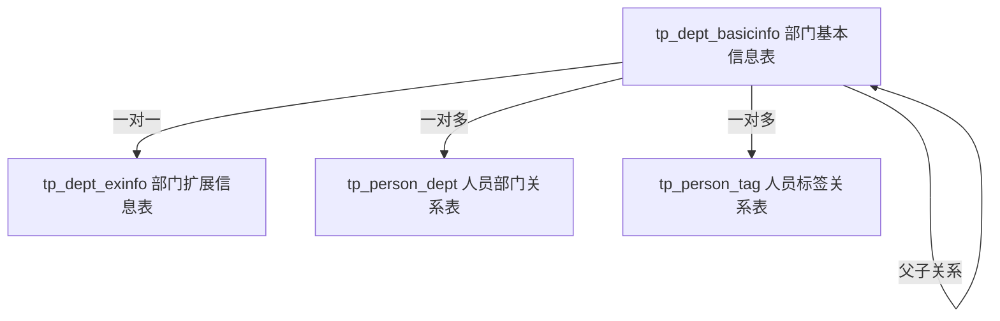

# 清理逻辑删除部门数据说明文档

## 📋 概述

本文档说明如何安全地清理 `tp_dept_basicinfo` 表中逻辑删除（`ACTIVED=0`）但无实际引用的部门数据。

## 🎯 目标

- 分析逻辑删除的部门数据
- 识别可以安全物理删除的记录
- 清理无引用的逻辑删除数据
- 释放数据库存储空间

## 📊 数据关系分析

### 部门表相关关系



### 删除条件

一个逻辑删除的部门可以被物理删除，需要满足以下**所有**条件：

1. ✅ `ACTIVED = 0`（已逻辑删除）
2. ✅ 没有激活的子部门引用（`tp_dept_basicinfo.PDEPT_ID`）
3. ✅ 没有人员部门关系引用（`tp_person_dept.DEPT_ID`）
4. ✅ 没有人员标签关系引用（`tp_person_tag.DEPT_ID`）

## 🔍 使用步骤

### 步骤1: 数据分析

执行脚本的**步骤1**和**步骤2**部分，分析逻辑删除数据的情况：

```sql
-- 1. 查看逻辑删除部门总数
SELECT COUNT(*) FROM tp_dept_basicinfo WHERE ACTIVED = 0;

-- 2. 检查各种引用关系
-- 详见脚本中的具体查询
```

**预期输出示例：**
```
逻辑删除的部门总数: 45
有子部门引用: 5
被人员部门表引用: 12
被人员标签表引用: 3
可以安全删除: 25
```

### 步骤2: 识别可删除数据

执行脚本的**步骤3**部分，列出所有可以安全删除的部门：

```sql
-- 列出可以安全物理删除的部门
SELECT 
    dept.DEPT_ID as 部门ID,
    dept.DEPT_FULL_NAME as 部门名称,
    dept.UPDATE_TIME as 删除时间
FROM tp_dept_basicinfo dept
WHERE dept.ACTIVED = 0
AND NOT EXISTS (子部门检查)
AND NOT EXISTS (人员关系检查)
AND NOT EXISTS (标签关系检查)
ORDER BY dept.UPDATE_TIME DESC;
```

**审核清单：**
- [ ] 确认列出的部门确实应该被删除
- [ ] 检查删除时间，确认是否为历史遗留数据
- [ ] 与业务部门确认是否有业务影响

### 步骤3: 备份数据（重要！）

在执行删除前，**必须**先备份要删除的数据：

```sql
-- 创建备份表
CREATE TABLE tp_dept_basicinfo_deleted_backup_20250127 AS
SELECT * FROM tp_dept_basicinfo
WHERE ACTIVED = 0
AND [可删除条件];

-- 验证备份
SELECT COUNT(*) FROM tp_dept_basicinfo_deleted_backup_20250127;
```

### 步骤4: 执行物理删除

⚠️ **警告：此操作不可逆！**

1. 在测试环境先执行并验证
2. 选择业务低峰期执行
3. 取消脚本中步骤4.2的注释
4. 执行删除语句

```sql
-- 物理删除（谨慎操作）
DELETE FROM tp_dept_basicinfo
WHERE ACTIVED = 0
AND [所有安全条件];
```

### 步骤5: 验证结果

```sql
-- 1. 检查剩余的逻辑删除部门
SELECT COUNT(*) FROM tp_dept_basicinfo WHERE ACTIVED = 0;

-- 2. 查看剩余部门的引用情况
-- 使用步骤2的查询验证

-- 3. 确认业务功能正常
-- 登录系统测试部门树、人员管理等功能
```

### 步骤6: 清理孤立数据（可选）

如果存在 `tp_dept_exinfo` 表，清理孤立的扩展信息：

```sql
-- 删除孤立的部门扩展信息
DELETE FROM tp_dept_exinfo
WHERE NOT EXISTS (
    SELECT 1 FROM tp_dept_basicinfo dept
    WHERE dept.DEPT_ID = tp_dept_exinfo.DEPT_ID
);
```

## 📝 执行记录模板

```
执行时间：2025-01-27 15:30:00
执行人：XXX
环境：生产环境

执行前统计：
- 逻辑删除部门总数：45
- 可安全删除数量：25

备份信息：
- 备份表名：tp_dept_basicinfo_deleted_backup_20250127
- 备份记录数：25

执行结果：
- 删除记录数：25
- 剩余逻辑删除部门：20（有引用关系）

验证结果：
✅ 部门树加载正常
✅ 人员管理功能正常
✅ 数据一致性检查通过

备注：
无异常情况
```

## ⚠️ 注意事项

### 安全提示

1. **数据备份**
   - 执行前必须完整备份数据库
   - 保留备份表至少30天
   - 记录备份文件位置

2. **权限控制**
   - 仅数据库管理员执行
   - 需要业务负责人审批
   - 保留操作审计日志

3. **执行时机**
   - 选择业务低峰期
   - 避免在工作时间执行
   - 建议在凌晨或周末执行

4. **回滚准备**
   - 准备回滚脚本
   - 测试回滚流程
   - 确保能快速恢复

### 常见问题

**Q1: 为什么有些逻辑删除的部门不能物理删除？**

A: 因为这些部门仍然被其他表引用，例如：
- 有激活的子部门
- 有人员关联关系
- 有标签关联关系

物理删除这些记录会导致数据完整性问题。

**Q2: 如果误删了数据怎么办？**

A: 从备份表恢复：
```sql
INSERT INTO tp_dept_basicinfo 
SELECT * FROM tp_dept_basicinfo_deleted_backup_20250127
WHERE DEPT_ID = '误删的部门ID';
```

**Q3: 多久执行一次清理？**

A: 建议每季度或半年执行一次，具体根据数据增长情况决定。

**Q4: 清理后会影响系统性能吗？**

A: 清理无用数据通常会提升查询性能，但建议执行后重建索引：
```sql
ANALYZE TABLE tp_dept_basicinfo;
```

## 📞 联系方式

如有疑问或遇到问题，请联系：
- 数据库管理员：XXX
- 系统负责人：XXX
- 技术支持：XXX

## 📚 相关文档

- [数据库维护规范](../docs/数据库维护规范.md)
- [数据备份恢复流程](../docs/数据备份恢复流程.md)
- [部门数据模型说明](../../refactor/5-analysis/2025-09-17/org/org-数据模型分析.md)

