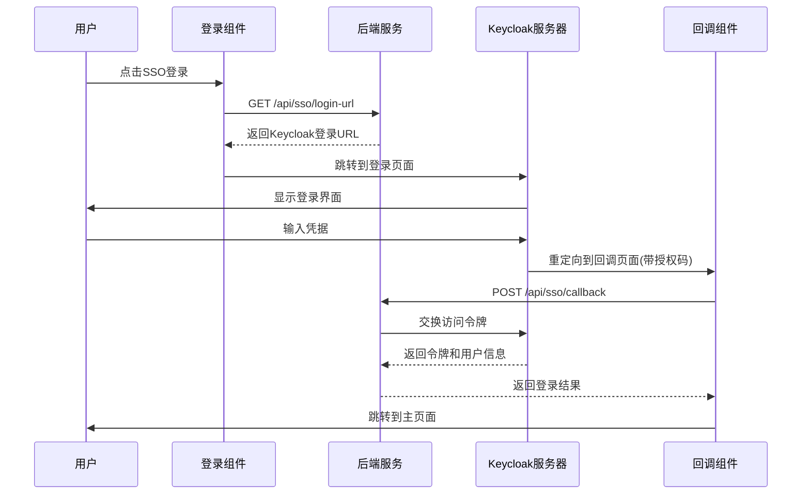
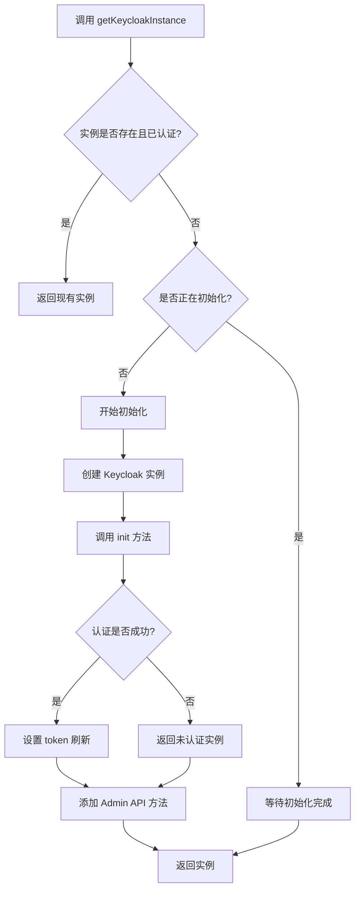
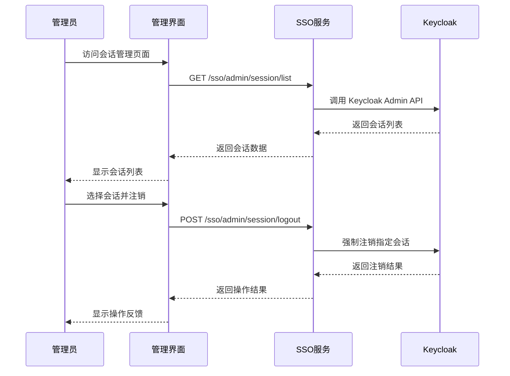
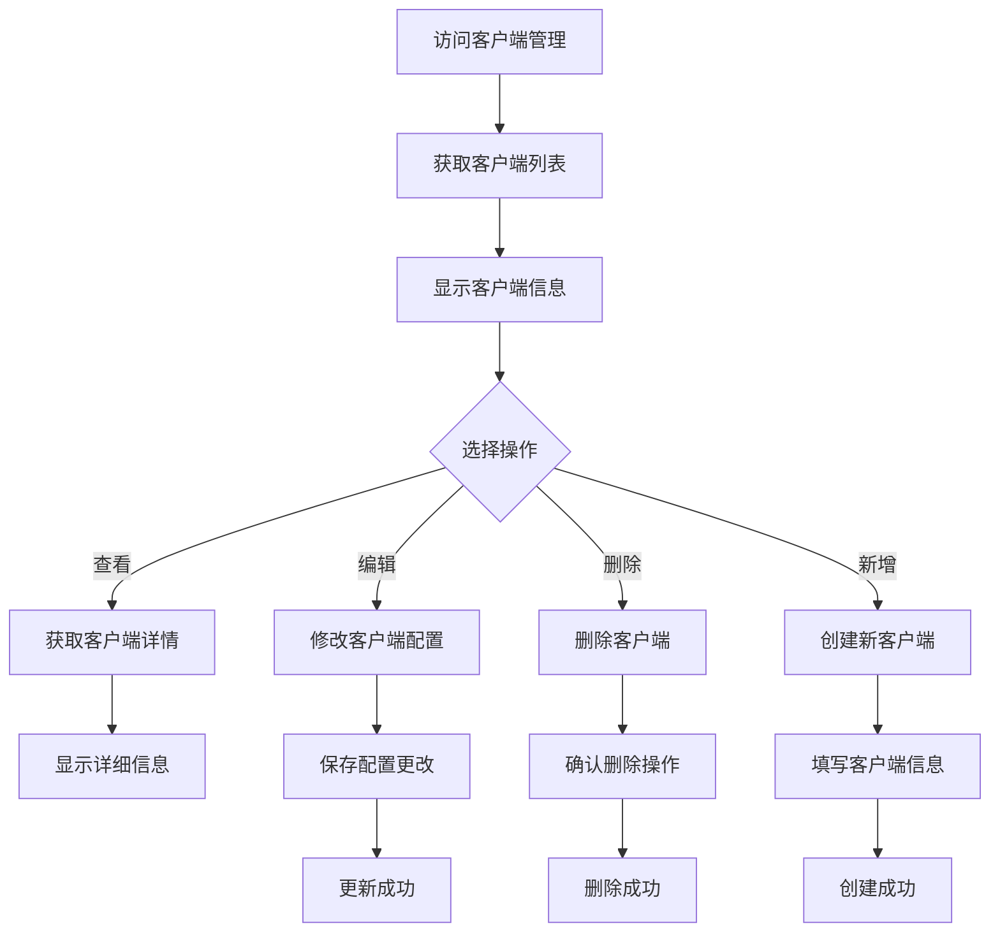

# PS-FE SSO & Keycloak 接口清单

## 概述
本文档整理了 `ps-fe` 项目中与 SSO（单点登录）和 Keycloak 相关的所有接口，包括前端组件、工具模块、服务接口和调用流程图。

## 目录
1. [核心工具模块](#核心工具模块)
2. [前端组件](#前端组件)
3. [服务接口](#服务接口)
4. [路由配置](#路由配置)
5. [调用流程图](#调用流程图)

---

## 核心工具模块

### 1. Keycloak 工具模块
**文件路径**: `@fb/fb-core/src/util/keycloak.js`

#### 主要功能
- 提供统一的 Keycloak 认证管理功能
- 单例模式管理 Keycloak 实例
- 自动 token 刷新机制
- Admin API 集成

#### 核心接口

| 接口名称 | 功能描述 | 参数 | 返回值 |
|---------|---------|------|--------|
| `getKeycloakInstance()` | 获取 Keycloak 实例（单例） | 无 | Promise&lt;Keycloak&gt; |
| `login(options)` | 用户登录 | options: 登录选项 | Promise |
| `logout(options)` | 用户登出 | options: 登出选项 | Promise |
| `isAuthenticated()` | 检查认证状态 | 无 | Promise&lt;boolean&gt; |
| `getUserInfo()` | 获取用户信息 | 无 | Promise&lt;Object&gt; |
| `getToken()` | 获取访问令牌 | 无 | Promise&lt;string&gt; |
| `refreshToken()` | 刷新令牌 | 无 | Promise&lt;boolean&gt; |
| `setKeycloakConfig(config)` | 设置 Keycloak 配置 | config: 配置对象 | void |
| `setKeycloakInitConfig(config)` | 设置初始化配置 | config: 初始化配置 | void |
| `resetKeycloakInstance()` | 重置实例 | 无 | void |

#### Admin API 接口

| 接口名称 | 功能描述 | 参数 | 返回值 |
|---------|---------|------|--------|
| `getUsers(realm, params)` | 获取用户列表 | realm: 域名, params: 查询参数 | Promise |
| `getUser(realm, userId)` | 获取单个用户 | realm: 域名, userId: 用户ID | Promise |
| `createUser(realm, userData)` | 创建用户 | realm: 域名, userData: 用户数据 | Promise |
| `updateUser(realm, userId, userData)` | 更新用户 | realm: 域名, userId: 用户ID, userData: 用户数据 | Promise |
| `deleteUser(realm, userId)` | 删除用户 | realm: 域名, userId: 用户ID | Promise |

---

## 前端组件

### 1. FbKeycloak 组件
**文件路径**: `@fb/admin-base/components/FbKeycloak.vue`

#### 功能描述
- 提供 Keycloak 认证状态管理的 Vue 组件
- 支持自动登录、加载状态显示、错误处理
- 提供插槽用于自定义认证成功后的内容

#### 组件属性

| 属性名 | 类型 | 默认值 | 描述 |
|-------|------|--------|------|
| `autoLogin` | Boolean | true | 是否自动登录 |
| `keycloakConfig` | Object | {} | Keycloak 配置参数 |
| `initConfig` | Object | {} | 初始化配置参数 |
| `showLoading` | Boolean | true | 是否显示加载状态 |
| `maxRetries` | Number | 3 | 错误重试次数 |

#### 组件事件

| 事件名 | 参数 | 描述 |
|-------|------|------|
| `authenticated` | user, token, keycloak | 认证成功事件 |
| `unauthenticated` | - | 未认证事件 |
| `error` | error | 认证错误事件 |

### 2. 登录扫码验证组件
**文件路径**: `@fb/admin-base/components/login/LoginCardScanCodeVerify.vue`

#### 功能描述
- 处理 SSO 登录流程
- 获取 Keycloak 登录 URL
- 跳转到 Keycloak 认证页面

---

## 服务接口

### 1. SSO 用户接口
**文件路径**: `@fb/admin-base/service/sys/sso/index.js`

#### 用户相关接口

| 接口路径 | 方法 | 功能描述 | 参数 |
|---------|------|---------|------|
| `/sso/user/status` | GET | 获取用户SSO状态 | 无 |
| `/sso/user/clients` | GET | 获取用户客户端列表 | 无 |
| `/sso/user/roles` | GET | 获取用户角色 | 无 |
| `/sso/user/resources` | GET | 获取用户资源 | 无 |
| `/sso/user/logout` | POST | 用户登出 | 无 |

### 2. SSO 管理员接口

#### 会话管理接口

| 接口路径 | 方法 | 功能描述 | 参数 |
|---------|------|---------|------|
| `/sso/admin/session/list` | GET | 获取全局会话列表 | params: 查询参数 |
| `/sso/admin/session/logout` | POST | 强制注销会话 | sessionId: 会话ID |
| `/sso/admin/session/batch-logout` | POST | 批量注销会话 | sessionIds: 会话ID数组 |

#### 客户端管理接口

| 接口路径 | 方法 | 功能描述 | 参数 |
|---------|------|---------|------|
| `/sso/admin/client/list` | GET | 获取客户端列表 | params: 查询参数 |
| `/sso/admin/client/get` | GET | 获取单个客户端 | clientId: 客户端ID |
| `/sso/admin/client/save` | POST | 保存客户端信息 | params: 客户端数据 |
| `/sso/admin/client/delete` | DELETE | 删除客户端 | clientId: 客户端ID |

#### 事件日志接口

| 接口路径 | 方法 | 功能描述 | 参数 |
|---------|------|---------|------|
| `/sso/admin/user-event/list` | GET | 获取用户事件列表 | params: 查询参数 |
| `/sso/admin/admin-event/list` | GET | 获取管理员事件列表 | params: 查询参数 |

### 3. SSO 登录接口

| 接口路径 | 方法 | 功能描述 | 参数 |
|---------|------|---------|------|
| `/api/sso/login-url` | GET | 获取 Keycloak 登录 URL | redirect_uri: 回调地址 |
| `/api/sso/callback` | POST | SSO 回调处理 | code: 授权码, state: 状态参数 |

---

## 路由配置

### SSO 管理路由
**文件路径**: `@fb/admin-base/router/sys/sso/index.js`

| 路由路径 | 组件 | 功能描述 |
|---------|------|---------|
| `/sys/sso/session/list` | session/list.vue | 全局会话管理 |
| `/sys/sso/client/list` | client/list.vue | 客户端管理 |
| `/sys/sso/log/list` | log/index.vue | 应用日志管理 |

### SSO 回调路由

| 路由路径 | 组件 | 功能描述 |
|---------|------|---------|
| `/sso/callback` | callback.vue | SSO 登录回调处理 |

---

## 调用流程图

### 1. SSO 登录流程



### 2. Keycloak 实例获取流程



### 3. 会话管理流程



### 4. 客户端管理流程



---

## 使用示例

### 1. 基本 Keycloak 使用

```javascript
// 在 Vue 组件中使用
export default {
  async mounted() {
    try {
      const kc = await this.$kc();
      
      if (kc.authenticated) {
        console.log('用户已认证');
        console.log('用户信息:', kc.tokenParsed);
      } else {
        console.log('用户未认证');
        await kc.login();
      }
    } catch (error) {
      console.error('Keycloak 初始化失败:', error);
    }
  }
}
```

### 2. FbKeycloak 组件使用

```vue
<template>
  <FbKeycloak 
    :auto-login="true"
    :show-loading="true"
    @authenticated="onAuthenticated"
    @error="onError">
    <template #authenticated="{ user, token }">
      <div>
        <h3>欢迎，{{ user.name }}！</h3>
        <p>令牌: {{ token }}</p>
      </div>
    </template>
  </FbKeycloak>
</template>

<script>
import FbKeycloak from '@fb/admin-base/components/FbKeycloak.vue'

export default {
  components: { FbKeycloak },
  methods: {
    onAuthenticated(user, token, keycloak) {
      console.log('认证成功:', user);
    },
    onError(error) {
      console.error('认证错误:', error);
    }
  }
}
</script>
```

### 3. SSO 服务调用

```javascript
// 获取用户状态
const status = await this.$svc.sys.sso.user.status();

// 获取会话列表
const sessions = await this.$svc.sys.sso.admin.session.list({
  page: 1,
  size: 10
});

// 注销会话
await this.$svc.sys.sso.admin.session.logout('session-id');
```

---

## 注意事项

1. **配置管理**: 确保在应用启动前正确设置 Keycloak 配置
2. **错误处理**: 所有 Keycloak 相关操作都应包含适当的错误处理
3. **令牌刷新**: 系统会自动处理令牌刷新，无需手动干预
4. **单例模式**: Keycloak 实例使用单例模式，避免重复初始化
5. **权限检查**: 管理员接口需要相应的权限才能调用
6. **网络异常**: 处理网络异常和服务不可用的情况

---

## 更新日志

- **2024-01-XX**: 初始版本创建
- **2024-01-XX**: 添加 FbKeycloak 组件文档
- **2024-01-XX**: 完善流程图和使用示例